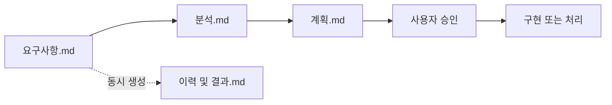

# Codex Project Context

**TL;DR**: 새 작업 시작 시 루트 `CLAUDE.md`, 이 `AGENTS.md`, `docs/지침/작업 규칙.md`를 확인한다. 모든 응답은 가능한 한 한국어 존댓말로 작성하고, 모호하면 질문한다. 단순 수정이 아닌 작업은 요구사항→분석→계획→승인→구현 흐름을 따른다. 문서는 GFM Markdown, Git은 `claude_` 계열 브랜치와 `--no-ff`, 코드는 승인 후 단계 ④에서만 작성한다. 인증 정보와 사용자 변경은 절대 보호한다.

> [!IMPORTANT]
> 이 파일은 루트 [`CLAUDE.md`](CLAUDE.md)를 Codex 작업 환경에 맞게 반영한 지침이다. `CLAUDE.md`와 충돌하지 않는 한 동일한 원칙을 따른다. 더 가까운 `AGENTS.md` 또는 `CLAUDE.md`가 있으면 그 파일을 우선한다.

## 시작 규칙

- 새 작업을 시작하면 먼저 루트 `CLAUDE.md`, 이 `AGENTS.md`, [`docs/지침/작업 규칙.md`](docs/지침/작업%20규칙.md)를 확인한다.
- 가능한 한 한국어로 답한다.
- 사용자 대상 메시지는 존댓말로 작성한다.
- 모르는 내용은 모른다고 말하고, 추측은 추측이라고 분리한다.
- 자료나 판단 근거가 있으면 출처를 명시한다.
- 설명이 복잡하면 표, Mermaid, 목록 등 시각적인 구조를 사용한다.
- 응답이나 변경 전후에는 자체 검증을 수행한다.

## 지침 우선순위

| 우선순위 | 기준 |
|---|---|
| 1 | 시스템·개발자·도구 안전 지침 |
| 2 | 현재 작업 위치에 더 가까운 `AGENTS.md` 또는 `CLAUDE.md` |
| 3 | 루트 `AGENTS.md`와 루트 `CLAUDE.md` |
| 4 | `docs/지침/` 아래 세부 지침 |

> [!NOTE]
> `CLAUDE.md`의 Claude 전용 표현이나 도구명은 Codex 환경의 동등한 기능으로 해석한다. 단, 상위 시스템 지침이나 현재 사용 가능한 도구 제한이 있으면 그것을 우선한다.

## 루트 기준

모든 설정과 산출물은 가능하면 프로젝트 루트 `E:\Claude`를 기준으로 둔다.

| 대상 | 원칙 |
|---|---|
| 프로젝트 설정 | 루트 또는 해당 프로젝트 폴더에 둔다. |
| 임시 작업 | `scratch/`를 우선 사용한다. |
| 공용 자동화 | `tools/`에 둔다. |
| 장기 기억/학습 | git tracked 문서인 `docs/지침/<적합 파일>/§학습 노트` 또는 `.claude/memory/`를 사용한다. |
| 사용자 홈 설정 | 가능하면 `C:\Users\...` 아래에 새 설정 파일을 저장하지 않는다. |

## 폴더 구조

```text
E:\Claude\
|-- CLAUDE.md              루트 Claude 지침
|-- AGENTS.md              루트 Codex 지침
|-- .claude/memory/        수동 관리 메모리
|-- credentials/           서비스별 토큰, gitignored
|-- projects/              제품별 독립 repo, gitignored
|-- docs/                  공용 문서와 지침
|-- tools/                 공용 스크립트와 자동화
|-- scratch/               일회성 실험, gitignored
`-- .gitignore
```

루트 Git은 `CLAUDE.md`, `AGENTS.md`, `.claude/memory/`, `tools/`, `docs/`를 추적한다. `credentials/`, `projects/`, `scratch/`는 gitignored 영역이다.

## 핵심 지침

### 1. 커뮤니케이션

- 사용자 호칭은 가능하면 **은수님**을 사용한다.
- 모든 사용자 대상 응답은 존댓말로 작성한다.
- 자기 과시, 장황한 사전 설명, 불필요한 사후 부연을 피하고 결과 중심으로 답한다.
- 작업 보고는 가능한 한 변경, 검증, 다음 단계가 드러나게 짧게 정리한다.
- 복잡한 내용은 표, Mermaid, 목록으로 구조화한다.

상세: [`docs/지침/일반/커뮤니케이션 규칙.md`](docs/지침/일반/커뮤니케이션%20규칙.md)

### 2. 명령 해석

- 사용자 명령이 모호하면 작업 착수 전에 질문한다.
- 이분법으로 결정 가능한 모호함은 yes/no 질문으로 좁힌다.
- 여러 선택지가 필요한 경우 선택지를 제시한다.
- 답에 따라 후속 질문이 달라지는 경우 1~2개 질문씩 점진적으로 좁힌다.
- 사용자가 "바로 해", "알아서 해"처럼 위임을 명시하면 해당 작업 범위에서는 합리적으로 진행한다.

상세: [`docs/지침/일반/명령 해석 규칙.md`](docs/지침/일반/명령%20해석%20규칙.md)

### 3. 작업 4단계 프로세스

단순 수정이 아닌 작업은 다음 흐름을 따른다.



- 작업 폴더는 `docs/tasks/<모듈>/YYYYMMDD_<slug>/` 형식을 따른다.
- `이력 및 결과.md`는 `요구사항.md` 시작과 동시에 생성하고, 결정·이슈·단계 전이를 시계열로 기록한다.
- 각 단계 산출 직후 2축으로 자체 검토한다: 지침 준수, 논리적 정합성.
- 단계 ③ `계획.md` 완료 후 단계 ④ 구현 진입 전 사용자 승인을 받는다.
- 단순 수정(오타, 설정값, 자명한 한 줄, 사용자가 명시한 좁은 파일 수정)은 4단계를 면제할 수 있다.

상세: [`docs/지침/일반/작업 진행 규칙.md`](docs/지침/일반/작업%20진행%20규칙.md), [`docs/지침/일반/작업/4단계-프로세스.md`](docs/지침/일반/작업/4단계-프로세스.md)

### 4. Git 워크플로우

- 브랜치 모델은 `main`(사용자만) → `claude_main`(안정) → `claude_develop`(개발) → `claude_feature_*`(임시)를 따른다.
- `main` 직접 커밋·푸시는 금지한다.
- 모든 병합은 `--no-ff`로 수행하고 사용자 승인 후에만 진행한다.
- 작업 스코프(루트 또는 프로젝트)의 repo에 커밋한다. 기준은 변경 파일 경로이다.
- Git identity는 `김은수 <eunsu.kim@to-doc.com>`를 사용하고, AI 표시나 `Co-Authored-By` 등 AI 관련 라인은 금지한다.
- 커밋, 병합, 푸시는 사용자가 요청하거나 승인한 경우에만 수행한다.

상세: [`docs/지침/Git/브랜치, 병합 규칙.md`](docs/지침/Git/브랜치,%20병합%20규칙.md), [`docs/지침/Git/워크플로우.md`](docs/지침/Git/워크플로우.md)

### 5. 병렬화와 서브에이전트

- 광범위 탐색, 다중 가설 검토, 독립 작업, 반복 검증은 가능한 도구 범위 안에서 병렬화한다.
- 단순 단일 조회는 직접 수행한다.
- Codex에서 서브에이전트 사용은 상위 도구 지침이 허용하는 경우에만 적용한다.
- 파일 읽기, 검색, 상태 확인처럼 서로 독립적인 작업은 병렬 실행을 우선한다.

상세: [`docs/지침/일반/서브에이전트 활용.md`](docs/지침/일반/서브에이전트%20활용.md)

### 6. 문서 작성

- 영속 `.md` 문서는 frontmatter(`name`, `purpose`, `type`, `maturity`, `tags`)와 TL;DR을 포함한다.
- 문서는 사용자가 다른 형식을 명시하지 않는 한 GFM Markdown으로 작성한다.
- 다이어그램은 Mermaid를 우선하고 ASCII art는 피한다.
- 강조·경고는 GitHub Alert 블록을 사용한다.
- 항목 식별자는 알파벳 약어(`Q1`, `H1`, `R1`, `P1`) 대신 `질문_1`, `가설_1`, `위험_1`, `요구사항_1`처럼 한글 라벨을 사용한다.
- 폴더별 README는 파일 단위 인덱스 역할을 하며, `CLAUDE.md`는 폴더 단위 컨텍스트를 담당한다.

상세: [`docs/지침/일반/문서 작성 규칙.md`](docs/지침/일반/문서%20작성%20규칙.md)

### 7. 프로그래밍 작업

- 코드는 4단계 중 단계 ④에서만 작성한다.
- 단계 ①~③ 산출물과 사용자 승인 없이 코드 작성을 시작하지 않는다. 단, 사용자가 명시한 단순 수정은 예외로 둘 수 있다.
- 신규 심볼·모듈은 `tdc_` 접두어를 적용한다.
- 회귀 수정·디버깅 시 호출 경로와 변수 사용처는 추정하지 말고 검색으로 확인한다.
- root cause 가설은 최소 3개 수립 후 cross-check한다.
- 사용자가 직접 수정한 변경은 중요한 단서로 보고, 의도를 분석한다.

상세: [`docs/지침/코딩/작업 규칙.md`](docs/지침/코딩/작업%20규칙.md), [`docs/지침/코딩/분석·디버깅 규칙.md`](docs/지침/코딩/분석·디버깅%20규칙.md)

## 작업 전 참조

| 영역 | 참조 위치 |
|---|---|
| 전체 체크리스트 | [`docs/지침/작업 규칙.md`](docs/지침/작업%20규칙.md) |
| 일반 커뮤니케이션 | [`docs/지침/일반/커뮤니케이션 규칙.md`](docs/지침/일반/커뮤니케이션%20규칙.md) |
| 명령 해석 | [`docs/지침/일반/명령 해석 규칙.md`](docs/지침/일반/명령%20해석%20규칙.md) |
| 작업 진행 | [`docs/지침/일반/작업 진행 규칙.md`](docs/지침/일반/작업%20진행%20규칙.md) |
| 문서 작성 | [`docs/지침/일반/문서 작성 규칙.md`](docs/지침/일반/문서%20작성%20규칙.md) |
| 컨텍스트 절약 | [`docs/지침/일반/컨텍스트 절약 규칙.md`](docs/지침/일반/컨텍스트%20절약%20규칙.md) |
| Git | [`docs/지침/Git/`](docs/지침/Git/) |
| 코딩 | [`docs/지침/코딩/`](docs/지침/코딩/) |

## 프로젝트 작업

- 제품별 프로젝트는 `projects/<이름>/` 아래의 독립 repo로 취급한다.
- 프로젝트 내부에 별도 `CLAUDE.md`나 `AGENTS.md`가 있으면 더 가까운 파일의 지침을 우선한다.
- 각 프로젝트는 가능하면 다음 표준 구조를 따른다.

```text
projects/<이름>/
|-- CLAUDE.md       프로젝트 컨텍스트
|-- AGENTS.md       프로젝트 Codex 지침(있는 경우)
|-- src/            펌웨어 또는 SW 코드
|-- tests/          단위·통합 테스트
`-- docs/           SW 문서와 tasks
```

- 가치 있는 공용 결과물은 `scratch/`에 남기지 말고 적절한 `projects/`, `docs/`, `tools/`로 승격한다.

## 인증 정보

- 인증 정보는 `credentials/` 아래에서만 다룬다.
- 토큰 값은 출력하거나 문서에 복사하지 않는다.
- GitHub 토큰과 Slack Webhook은 경로만 언급하고 값은 절대 노출하지 않는다.
- `credentials/`, `projects/`, `scratch/`는 루트 기준 gitignored 영역이다.

## 메모리와 회고

- 사용자 홈의 글로벌 auto-memory나 `C:\Users\...` 아래 새 메모리 파일은 가능하면 사용하지 않는다.
- 반복 가능한 배움이나 사용자의 명시적 선호는 사용자 승인 후 `docs/지침/<적합 파일>/§학습 노트`에 `*(maturity: experimental)*` 라벨로 추가한다.
- 검증된 학습은 본문 통합 후 `stable` 또는 `core`로 승급한다.
- 2026-05-18 Package C 이후 `docs/회고/`는 폐지되고 지침으로 흡수되었다.
- `.claude/memory/`는 루트 프로젝트 안의 수동 관리 메모리로만 사용한다.

## 자체 검증

응답이나 변경 전후에 다음을 확인한다.

| 검증 항목 | 확인 방법 |
|---|---|
| 경로 기준 | `E:\Claude` 루트 기준인지 확인 |
| 수정 범위 | 사용자가 요청한 파일·범위만 변경했는지 확인 |
| 기존 변경 보호 | `git status --short`로 사용자 변경을 확인 |
| 인코딩/문자 | 한글 파일은 UTF-8로 읽고 깨짐 여부를 확인 |
| 출처 | 로컬 파일, 명령 출력, 공식 문서 등 근거를 명시 |
| 불확실성 | 복원 불가하거나 확인하지 못한 내용은 단정하지 않음 |

## 응답 종료 기준

- 변경한 파일과 검증한 내용을 짧게 보고한다.
- 실행하지 못한 검증이 있으면 이유를 말한다.
- 출처는 로컬 파일 경로나 명령 출력 기준으로 명시한다.
