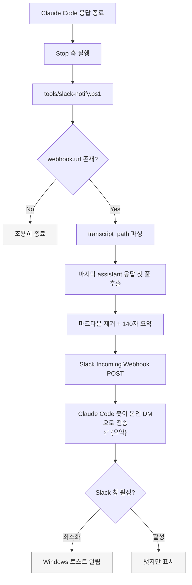

# Slack 작업 완료 알림

Claude Code가 응답을 마칠 때(`Stop` 훅 발생 시) Slack Incoming Webhook으로 DM 알림을 전송하는 세팅.

## 동작 흐름



## 파일 구성

| 파일 | 용도 | Git 추적 |
|---|---|---|
| `.claude/settings.json` | Stop 훅 등록 (Project scope) | ✅ |
| `tools/slack-notify.ps1` | 전송 스크립트 (PowerShell, UTF-8 BOM) | ✅ |
| `credentials/slack/webhook.url` | Webhook URL (한 줄) | ❌ (gitignored) |

## 새 환경으로 이식

`E:/Claude`를 복제하면 `.claude/settings.json`, `tools/slack-notify.ps1`는 함께 따라오지만 `credentials/`는 gitignore되어 있어 별도 설정이 필요하다.

1. Slack 워크스페이스에서 <https://api.slack.com/apps> → **Create New App** → "From scratch"
2. 앱 이름 지정(예: `Claude Code`), 아이콘 설정
3. 좌측 메뉴 **Incoming Webhooks** 활성화 → **Add New Webhook to Workspace**
4. 알림 대상 선택 (본인 DM 또는 원하는 채널)
5. 발급된 URL을 다음 경로에 저장:

```bash
mkdir -p E:/Claude/credentials/slack
echo "https://hooks.slack.com/services/..." > E:/Claude/credentials/slack/webhook.url
```

## 메시지 포맷 변경

`tools/slack-notify.ps1`의 마지막 부분:

```powershell
$payload = @{ text = "✅ $message" } | ConvertTo-Json -Compress
```

이모지, prefix 문구, Slack Block Kit JSON 등으로 확장 가능.

## 훅 비활성화

- **일시 중지**: `.claude/settings.json`에서 `Stop` 배열 제거 또는 설정 파일 삭제
- **Webhook만 제거**: `credentials/slack/webhook.url` 삭제 → 스크립트가 URL 없음 감지하고 조용히 종료

## 주의사항

> [!IMPORTANT]
> **Self-DM 제약**: MCP Slack 커넥터는 user OAuth 토큰이라 본인 → 본인 메시지에 알림이 뜨지 않는다. Incoming Webhook은 **봇 앱이 sender**가 되므로 알림이 정상 발생한다. 이 세팅이 Incoming Webhook을 쓰는 이유.

> [!NOTE]
> **Slack 창 활성 상태**: 해당 DM 창이 이미 열려 있으면 Slack은 알림을 생략(본인이 보고 있으니 방해 안 하려는 OS·Slack의 정상 동작). 최소화된 상태나 다른 앱 포커스 중에만 토스트가 뜬다.

> [!NOTE]
> **알림 지속시간**: Windows 토스트는 기본 5초. `설정 → 접근성 → 시각 → 알림`에서 최대 5분까지 연장 가능. 그 이상 persistent 하게 하려면 OS 기본 토스트로는 불가능하고 별도 WPF 창 같은 커스텀 UI 필요.

> [!CAUTION]
> **Webhook URL 보안**: 노출되면 누구나 해당 봇으로 메시지를 보낼 수 있다. `credentials/` 밖으로 복사·커밋 금지.
