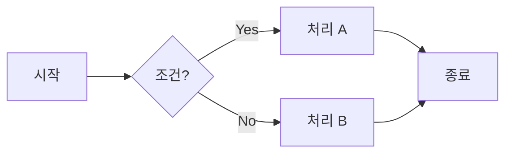
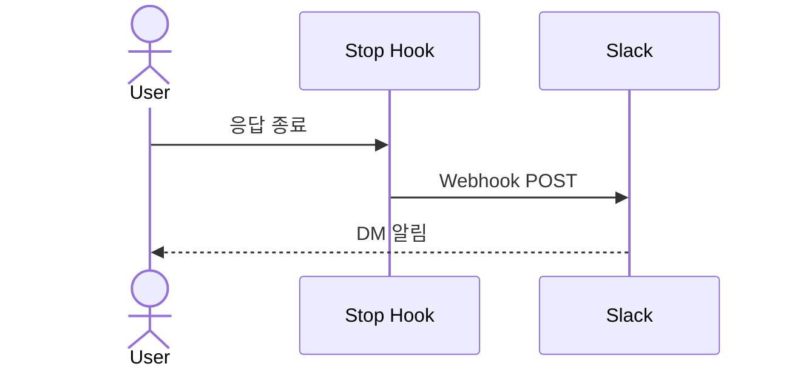
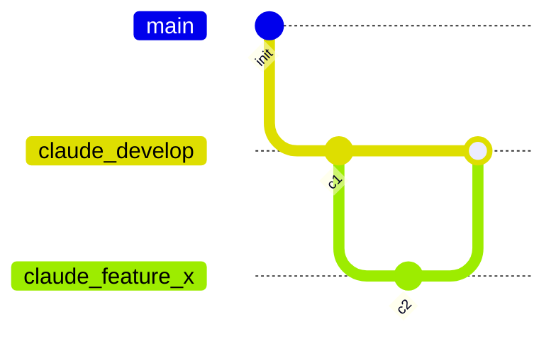

# 문서 작성 규칙

## 기본 포멧

- 사용자가 명시적으로 다른 포멧(`.docx` / `.xlsx` / `.pdf` / `.pptx` / `.html`)을 지정하지 않는 한, **모든 문서는 GFM(GitHub Flavored Markdown, `.md`)으로 작성**한다.
- 예외 없음. 사용자가 특정 포멧을 요청한 경우에만 해당 포멧으로 작성.
- GitHub.com 또는 VSCode의 **GitHub Markdown Preview** 확장(`bierner.markdown-preview-github-styles`)에서 렌더링된 결과를 기준으로 삼는다.

## 문서 위치

- 루트 작업 → `E:\Claude\docs/`
- 프로젝트 작업 → `projects/<이름>/docs/`

## 파일명 prefix 컨벤션

`docs/` 안의 문서 파일명은 `[카테고리] 문서명.md` 형태로 작성.
`[지침]` 계열은 세부 접두어(`[일반]`, `[Git]`, `[코딩]`)로 분류한다.

### 기본 prefix

| Prefix | 용도 | 작성 시점 |
|---|---|---|
| `[요구사항]` | 무엇을 만들어야 하는지 (기능·조건·제약) | 코드 작성 전 |
| `[현상분석]` | 현행 구조·원인·영향 범위 분석 | 코드 작성 전 |
| `[구현계획]` | 어떻게 구현할지 (설계·단계·파일 변경 계획) | 코드 작성 전 |
| `[시험방법]` | 어떻게 테스트할지 (시험 절차·기준·예상 결과) | 구현 전 또는 구현 후 |
| `[사용방법]` | 사용법 안내 (CLI 명령, 조작 방법 등) | 필요한 경우에만 |
| `[참고]` | 데이터시트 번역·외부 기술 문서 정리 | 수시 |
| `[메모]` | 작업 노트·초안·비공식 기록 | 수시 |

### 지침 prefix (세부 접두어)

| Prefix | 대상 | 예시 |
|---|---|---|
| `[지침]` | 마스터 체크리스트 (최상위) | `[지침] 작업 규칙.md` |
| `[지침] [일반]` | 커뮤니케이션, 문서 작성 등 공통 규칙 | `[지침] [일반] 커뮤니케이션 규칙.md` |
| `[지침] [Git]` | Git 브랜치, 병합, 워크플로우 | `[지침] [Git] 브랜치, 병합 규칙.md` |
| `[지침] [코딩]` | 코딩 규칙, 네이밍, 작업 흐름 | `[지침] [코딩] 네이밍 컨벤션.md` |

> [!NOTE]
> 컨벤션은 강제 규칙이 아니라 가이드. 다른 prefix(`[리뷰]`, `[이력]` 등)도 자유롭게 사용 가능.

## 작성 스타일

### 기본 GFM 문법 활용

- **표** (pipe table) — 구조화된 정보는 표로. 정렬 필요 시 `:---`, `:---:`, `---:`
- **체크리스트** — `- [ ]` / `- [x]` 형식. 절차·할 일 목록에 사용
- **코드 블록** — 언어 명시 필수 (` ```bash `, ` ```powershell `, ` ```c `, ` ```json ` 등)
- **취소선** — `~~deleted~~`로 변경 이력 표시
- **링크** — 파일 간 링크는 상대경로. 공백은 `%20`으로 인코딩

### GitHub Alert Blocks

강조·경고·주의사항은 **GitHub Alert 구문**을 사용한다. (일반 인용(`>`)보다 시각적으로 구분됨)

```markdown
> [!NOTE]
> 알아두면 좋은 일반 정보.

> [!TIP]
> 더 나은 방법에 대한 조언.

> [!IMPORTANT]
> 반드시 알아야 할 중요 정보.

> [!WARNING]
> 즉시 주의가 필요한 긴급 정보.

> [!CAUTION]
> 위험·부정적 결과에 대한 경고.
```

| 유형 | 용도 |
|---|---|
| `[!NOTE]` | 참고 정보, 부가 설명 |
| `[!TIP]` | 권장 방법, 팁 |
| `[!IMPORTANT]` | 반드시 인지할 핵심 사항 |
| `[!WARNING]` | 실행 전 주의할 점 (되돌리기 어려운 작업 등) |
| `[!CAUTION]` | 실수 시 데이터 손실·보안 위험 등 치명적 경고 |

### 다이어그램은 Mermaid

ASCII art 다이어그램 대신 **Mermaid**를 사용한다. GitHub과 GitHub Markdown Preview 모두 네이티브 렌더링 지원.

#### 자주 쓰는 Mermaid 유형

| 유형 | 용도 | 코드 블록 헤더 |
|---|---|---|
| `flowchart` | 절차·의사결정 흐름 | ```` ```mermaid ```` + `flowchart LR` (또는 TD) |
| `sequenceDiagram` | 시스템·서비스 간 상호작용 순서 | `sequenceDiagram` |
| `gitGraph` | Git 브랜치·병합 흐름 | `gitGraph` |
| `stateDiagram-v2` | 상태 머신 | `stateDiagram-v2` |
| `classDiagram` | 클래스·타입 구조 | `classDiagram` |
| `erDiagram` | 엔티티 관계 | `erDiagram` |
| `pie` | 비율 차트 | `pie` |
| `gantt` | 일정·타임라인 | `gantt` |

#### 기본 예시







> [!TIP]
> Mermaid 다이어그램은 화살표 방향(`LR`/`TD`)과 스타일 클래스를 활용하면 가독성이 더 올라간다. 불필요한 분기는 과감히 생략하고 핵심 흐름만 남길 것.

### 문서 구조

- 최상위 제목은 `#` 하나. 파일당 하나.
- 섹션 구분은 `##`, `###` 순서대로. 건너뛰지 말 것.
- 긴 문서는 맨 위에 간단한 목차 또는 개요 섹션을 둘 것.
- 긴 섹션 사이 구분이 필요하면 `---` 수평선 사용.

## '정리해' 요청 시

- 사용자가 '~하고 정리해', '~하고 정리해봐' 등으로 정리를 요청하면, **작업이 수행된 위치의 `docs/` 폴더**에 `.md` 문서로 정리한다.
- 파일명은 prefix 컨벤션을 따른다.
- 다이어그램·절차 흐름이 포함되면 Mermaid로 작성한다.
