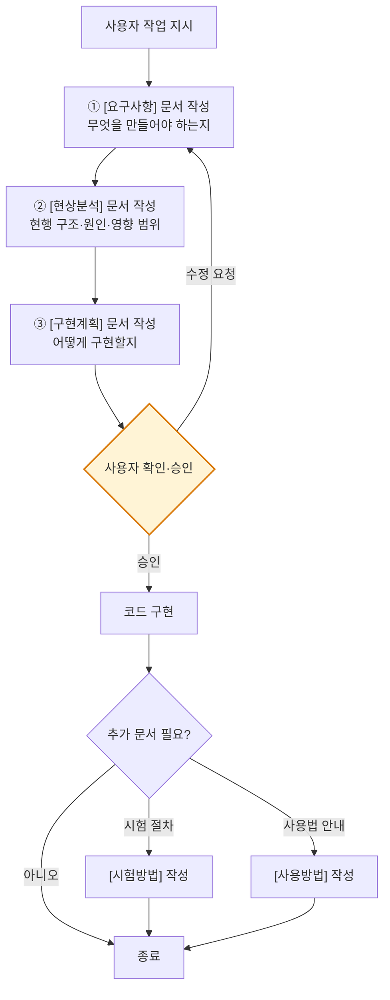

# 프로그래밍 작업 규칙

## 핵심 원칙

프로그래밍 관련 작업 지시를 받으면, **코드를 바로 작성하지 않는다.** 먼저 문서를 작성하고 사용자 승인을 받은 후 구현한다.

## 작업 흐름

## 문서 작성 위치

- 해당 프로젝트의 `docs/` 폴더에 `.md`로 작성.
- 파일명: `[카테고리] <기능명>.md` 형태.

## 선택적 문서

| 문서 | 조건 |
|---|---|
| `[시험방법]` | 시험 절차·기준 정의가 필요한 경우 |
| `[사용방법]` | 사용자 명령 입력 등 사용법 안내가 필요한 경우 |

## 예외

> [!NOTE]
> 단순 수정(오타, 설정값 변경 등)은 문서 없이 바로 진행 가능. 사용자 판단에 맡긴다.
