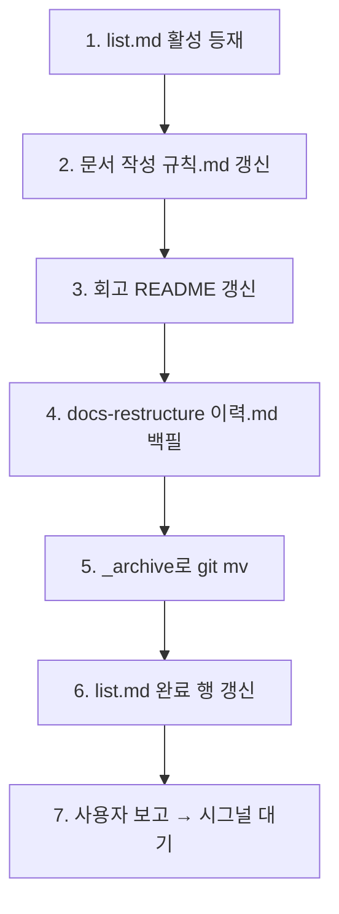

# 구현계획: 정책 정련

## 실행 순서



## 단계별 작업

### 1. `list.md` 활성 등재

- 활성 섹션에 `meta/policy-refinement` 행 추가
- 모듈: `meta`, 태그: `docs, convention, lifecycle`
- 연계: `← [_archive/meta/docs-restructure](_archive/meta/docs-restructure/)` (이 작업 archive 적용 후 경로 갱신)

### 2. `docs/지침/일반/문서 작성 규칙.md` 갱신

| 섹션 | 변경 |
|---|---|
| 2 (문서 위치) | "충돌 시 프로젝트 우선" 명시 추가 |
| 3.1 (레이아웃) | `_archive/<모듈>/<작업>/` 추가 |
| 3.3 (작업 문서) | `이력.md` 항목 명시 (필수 — 완료 시) |
| 신규 3.4 | "완료 작업 archive" 서브섹션 (이동 규칙 + `이력.md` 형식 템플릿) |
| 4.4 (갱신 이벤트) | 완료 시그널 동작에 `_archive 이동 + 이력.md 작성 + list.md 행 갱신` 추가 |

### 3. `docs/회고/README.md` 갱신

| 섹션 | 변경 |
|---|---|
| 회고와 지침의 차이 표 | "효력 발생 시점: 즉시 (회고와 지침 동일)" 행 추가 |
| 트리거 섹션 직후 | "효력" 서브섹션 신규 — 즉시 효력 + 승격 = 통합/정리 차원 |
| 항목 형식 | 변경 없음 |
| 신규: 승격 이력 | 하단에 표 추가 (회고 → 지침 매핑) |

### 4. `meta/docs-restructure/이력.md` 백필

- 형식: 새 컨벤션 (작업 작성 규칙.md의 신규 3.4)
- 내용: 2026-04-24 완료 사실, 결과물(폴더 구조·list 도입), 핵심 결정(2레벨 고정 등), 후속(Sound1 migration·본 작업)

### 5. `_archive`로 이동

```bash
git mv docs/tasks/meta/docs-restructure docs/tasks/_archive/meta/docs-restructure
```

### 6. `list.md` 완료 섹션 갱신

- `meta/docs-restructure` 행의 폴더 링크 → `_archive/meta/docs-restructure/`
- 갱신 이력에 본 작업 사실 추가

### 7. 본 작업도 완료 섹션으로

사용자 *"작업 끝났어. 마무리해"* 시그널 수신 시:
- `policy-refinement/이력.md` 작성
- `_archive/meta/policy-refinement/`로 `git mv`
- `list.md` 활성 → 완료, `_archive/` 경로
- 커밋 → 사용자 승인 → `--no-ff` 병합 (`claude_develop`)

## 위험 요소

| 위험 | 완화 |
|---|---|
| `이력.md` 형식이 지나치게 무거워져 작성 부담 증가 | 1페이지 cap, 4섹션만 (무엇/핵심결정/후속/메타) |
| 회고 즉시효력 명시가 검증 부재로 오해될 수 있음 | "안정화 후 지침 통합"으로 사후 정돈 가능함을 함께 명시 |
| `_archive/` 도입 후 Glob 결과 오염 | 활성 작업만 검색 시 `tasks/[!_]*/` 패턴 사용 권장 (필요 시 추후 명시) |

## 롤백 방안

- 모든 변경은 단일 브랜치 `claude_docs_policy-refinement`에서 진행
- 병합 전이면 브랜치 폐기로 롤백
- 병합 후 문제 발견 시 reverse commit
