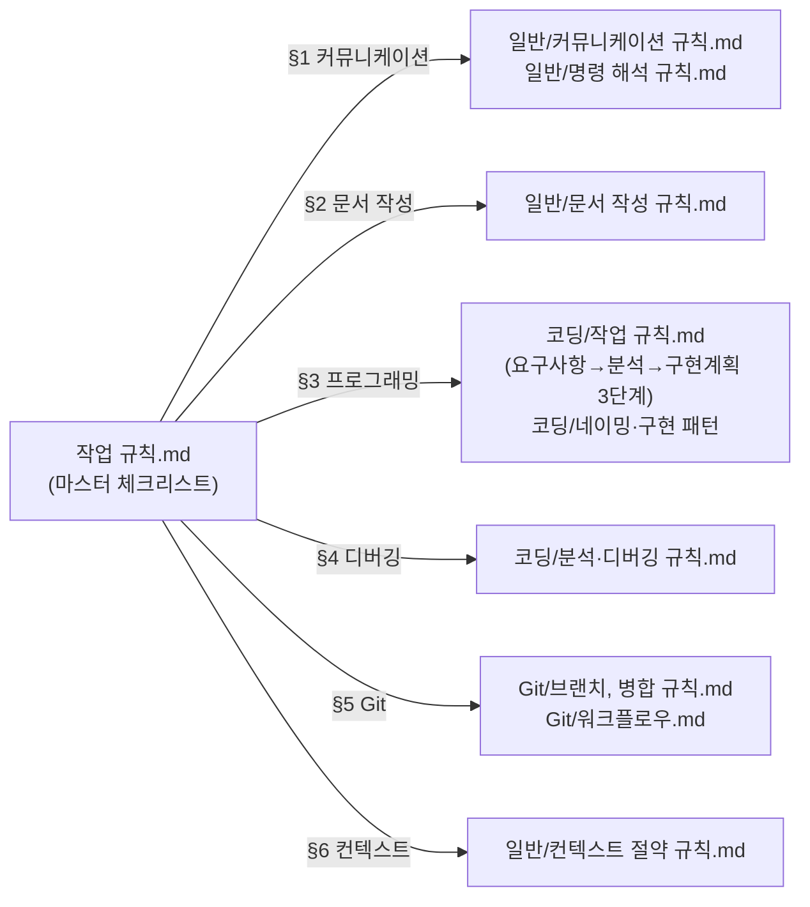
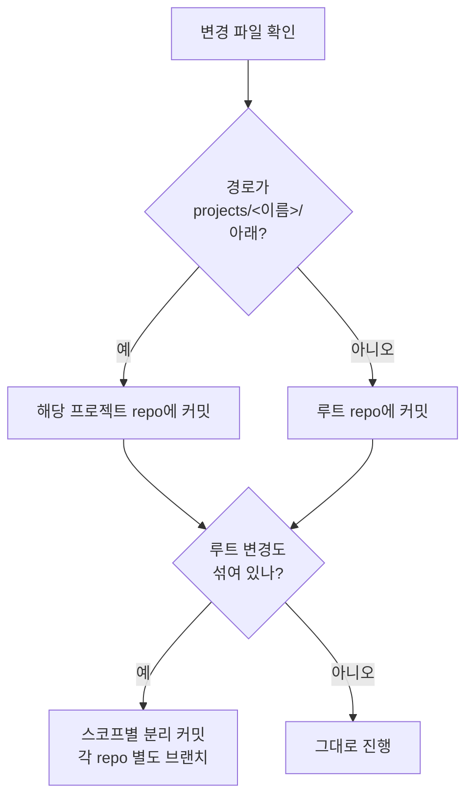

# 분석: 작업 진행 4단계 프로세스 일반화 + Git 범주 처리

**TL;DR**: 현 지침은 4단계 프로세스 ⚠️**코딩 한정**으로만 정의됨(`코딩/작업 규칙.md` 3단계). 일반화 위해 신규 `일반/작업 진행 규칙.md`를 만들고 코딩 규칙·마스터 체크리스트·CLAUDE.md를 갱신한다. Git 스코프 분리는 `Git/브랜치, 병합 규칙.md`·`워크플로우.md`에 §스코프 추가로 처리.

## 1. 현 지침 구조 매핑



> [!NOTE]
> **공백**: "작업 진행 일반론"이 별도 문서로 존재하지 않음. §3가 코딩에 한정되어 있어 문서 작성·메타·조사 등에는 적용 근거 부재.

## 2. 영향 받는 파일

### 분석_1 — 신규 작성

| 경로 | 내용 |
|---|---|
| `docs/지침/일반/작업 진행 규칙.md` | 4단계 프로세스 일반 규칙(요구사항→현황→계획→구현), 산출물·자체검토·진행상황·이력 |
| `docs/지침/일반/서브에이전트 활용.md` | 모든 작업에서 병렬·효율 위해 서브에이전트 적극 활용. 활용 패턴·종류별 매핑·병렬 호출 방법·안티패턴 |

### 분석_2 — 수정

| 경로 | 변경 사항 |
|---|---|
| `docs/지침/작업 규칙.md` | 신규 §3 "작업 진행" 추가(또는 기존 §3 일반화), §3.1 코딩 특화 분리, 체크리스트 추가. **§3에 서브에이전트 활용 한 줄** |
| `docs/지침/코딩/작업 규칙.md` | 일반 규칙 상속 명시, 코딩 특화 사항(`tdc_` 접두어·단순 수정 예외)만 남기도록 슬림화. 산출물 파일명을 `구현계획.md` → `계획.md`(범용)로 정렬하되 alias 호환 명시 |
| `docs/지침/Git/브랜치, 병합 규칙.md` | §스코프 분리 추가 — 작업 범주 ⇒ 해당 repo |
| `docs/지침/Git/워크플로우.md` | 작업 시작 시 스코프 판단 분기(루트 vs 프로젝트) mermaid·체크리스트 추가 |
| `docs/지침/일반/문서 작성 규칙.md` | 산출물 파일명에 `계획.md` 추가 — `구현계획.md`는 코딩 작업의 alias로 호환 명시 |
| `docs/지침/일반/작업 진행 규칙.md` | §서브에이전트 활용 한 줄 + 상세 링크 |
| `docs/지침/일반/컨텍스트 절약 규칙.md` | §3.D에 신규 `서브에이전트 활용.md` cross-ref |
| `docs/지침/README.md` | 일반 카테고리에 신규 `서브에이전트 활용.md` 등재 |
| `CLAUDE.md`(루트) | 지침 인덱스 표에 신규 `일반/작업 진행 규칙.md`, `일반/서브에이전트 활용.md` 등재 |

### 분석_3 — 영향 없음 (확인 완료)

| 경로 | 사유 |
|---|---|
| `docs/지침/일반/명령 해석 규칙.md` | 모호함 → 질문 강제는 본 변경과 직교 |
| `docs/지침/일반/커뮤니케이션 규칙.md` | 말투·태도와 직교 |
| `docs/지침/코딩/네이밍·구현 패턴·분석·디버깅` | 코드 작성 디테일과 직교 |
| `docs/회고/*` | 개별 회고 누적, 정책 변경 별도 |

### 분석_4 — 프로젝트 측 정합

| 위치 | 점검 |
|---|---|
| `projects/Sound1/CLAUDE.md` | 루트 지침 자동 적용. 본 변경 별도 동기화 불필요 |
| `projects/Sound1/docs/지침/` | 미존재(특화 지침 없음). 충돌 없음 |
| `projects/Sound1/docs/tasks/` | 기존 작업은 점진적 이행 — 새 작업부터 적용, 진행 중 작업은 필요 시 `계획.md`로 별칭 사용 |

## 3. 결정 사항

### 결정_1 — 산출물 파일명 통일

| 항목 | 결정 |
|---|---|
| 일반 작업 | `요구사항.md` → `분석.md` → `계획.md` → 구현 산출물 + `이력.md`(완료 시) |
| 코딩 작업 | 동일. 단, 기존 `구현계획.md` 명칭도 호환 유지(점진 이행) |
| 진행상황 | `진행상황.md` (옵션 → **의무**, 단 단순 수정 예외는 4단계 면제이므로 자동 제외) |
| 이력 | `이력.md` (완료 시 의무 — `문서 작성 규칙.md` §3.4와 일치) |

> [!IMPORTANT]
> `구현계획.md` → `계획.md`로 일반화한 이유: 사용자 지시 원문이 "구현/처리 계획"으로 코딩 외 작업 포함. 일반화된 단어 `계획`이 문서 변경·메타·조사 작업에도 자연스럽다.

### 결정_2 — 자체 검토 2축 형식

각 단계 산출물 말미에 다음 섹션을 둔다(또는 별도 `검토.md`로 분리하지 않고 본문 내 명시):

```markdown
## 자체 검토

### 지침 준수 여부
| 지침 | 준수 |
|---|---|
| ... | ✅/⚠️/❌ |

### 논리적 정합성
| 점검 | 결과 |
|---|---|
| ... | ✅/⚠️ |

### 미해결 이슈 (있을 경우)
| 이슈 | 처리 |
|---|---|
```

> [!NOTE]
> 본문 내 포함을 기본으로 두는 이유: 검토는 산출물과 분리되면 따로 읽지 않게 됨. 검토 결과가 산출물 자체의 신뢰도 보조 자료로 함께 보여야 의미가 있다.

### 결정_3 — `진행상황.md` 의무 범위

| 작업 유형 | 진행상황 |
|---|---|
| 4단계 적용 작업 | **의무** (단계 진행 중·단계 간 전이 시점에 갱신) |
| 단순 수정 예외 작업 | 면제(4단계 자체 면제) |
| 단일 세션·단일 turn 작업이라도 4단계 적용 시 | 의무. 단 본문이 짧을 수 있음(현재 단계·다음 동작 1줄씩) |

### 결정_5 — 서브에이전트 활용은 별도 지침 파일

| 옵션 | 평가 |
|---|---|
| A. 신규 `일반/서브에이전트 활용.md` | ✅ 채택. 적용 범위·활용 패턴·종류별 매핑·병렬 호출·안티패턴 등 콘텐츠 분량이 별도 파일 가치 |
| B. `컨텍스트 절약 규칙.md` 통합 | ❌ 컨텍스트 절약은 **격리** 관점, 본 규칙은 **병렬·효율** 관점. 의도 희석 위험 |
| C. `작업 진행 규칙.md` 섹션 | ❌ 작업 진행은 4단계 프로세스 본문이 핵심. §부록처럼 들어가면 발견성 저하 |

> [!IMPORTANT]
> 결정 근거: 사용자 강조점 "병렬 처리 및 효율적인 처리"는 컨텍스트 절약과 직교. 별도 지침으로 두고 두 파일 간 cross-ref로 연결.

### 결정_4 — Git 스코프 판단·복구 절차

#### 4.1 스코프 판단 절차 (커밋 직전 체크리스트)



#### 4.2 위반 시 복구

| 시나리오 | 복구 |
|---|---|
| 잘못된 repo에 staging | `git reset HEAD <파일>` 후 올바른 repo에서 다시 staging |
| 잘못된 repo에 커밋 (push 전) | `git reset --soft HEAD~1` → 올바른 repo에서 재커밋. 원 repo는 변경 폐기 |
| push 후 발견 | 사용자에게 보고. revert 또는 cherry-pick 필요 — 사용자 판단 |

#### 4.3 혼합 변경 처리 원칙

루트 변경과 프로젝트 변경이 한 작업에서 동시에 발생하면:

1. 루트 측 변경은 루트 `claude_*` 브랜치에서 별도 커밋·병합
2. 프로젝트 측 변경은 프로젝트 `claude_*` 브랜치에서 별도 커밋·병합
3. 두 PR/병합 간 의존이 있으면 작업 폴더(`tasks/<모듈>/<작업>/`)에서 `연계` 컬럼·peer link로 표현

## 4. 자체 검토 (단계 2)

### 4.1 지침 준수 여부

| 지침 | 준수 |
|---|---|
| `문서 작성 규칙.md` §9 frontmatter+TL;DR | ✅ |
| `문서 작성 규칙.md` §6.5 의미 한글 라벨 | ✅ `분석_1`~`분석_4`, `결정_1`~`결정_4` |
| `문서 작성 규칙.md` §6.3 Mermaid 사용 | ✅ |
| `요구사항.md` §4 검증 항목과 정렬 | ✅ 검증_1(신규 일반 규칙)·검증_2(코딩 슬림화)·검증_3(마스터)·검증_4·5(Git)·검증_6(CLAUDE.md)·검증_7(frontmatter) 모두 반영 |

### 4.2 논리적 정합성

| 점검 | 결과 |
|---|---|
| 신규 작성 vs 수정 분류가 명확한가 | ✅ 분석_1·2·3 분리 |
| 결정 사항이 미해결 이슈를 모두 닫는가 | ✅ 요구사항.md §5.3의 3개 미해결 이슈(파일명·진행상황·Git 복구)에 대응 결정 1·3·4 |
| 코딩 규칙 슬림화 시 정보 누락 위험 | ⚠️ `tdc_` 접두어·단순 수정 예외는 코딩에 남기고, 4단계는 일반에 위임. 다이어그램은 일반 규칙에 두고 코딩에서 링크. 누락 없음 |
| 프로젝트 docs 영향 | ✅ 분석_4에서 검토 — 별도 동기화 불필요 |
| Git 스코프 시나리오 누락 | ✅ 단일·혼합·위반·복구 4종 모두 |

### 4.3 미해결 이슈 → 단계 3 계획에서 처리

| 이슈 | 단계 3 처리 |
|---|---|
| 마스터 체크리스트 §3 재배치 — 신규 §3 "작업 진행"을 §3로 두고 기존 §3 프로그래밍을 §3.1 또는 §4로 이동? | 계획에서 **§3 작업 진행(일반)** + **§4 프로그래밍 작업(특화)** 로 결정 |
| `구현계획.md` → `계획.md` 마이그레이션 정책 | 점진 이행. 신규 작업부터 `계획.md`. 기존 활성 작업은 그대로 두되 작업 마무리 시 alias 인정 |
| `진행상황.md` 강제 시점 — 작업 시작 즉시? 첫 단계 완료 후? | 계획에서 **단계 1(요구사항.md) 작성과 동시에 생성** 으로 명시 |
