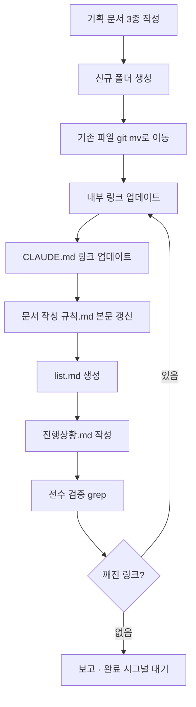

# 구현계획: docs 폴더 구조 세분화

**TL;DR**: ① 신규 폴더(지침/일반·Git·코딩, 사용방법, tasks) 생성 → ② `git mv`로 9개 파일 이동(rename 추적 보장) → ③ 내부 링크 9건·CLAUDE.md 11건 갱신 → ④ `문서 작성 규칙.md` 본문 재작성 → ⑤ `list.md` 생성·전수 grep 검증 후 시그널 대기.

## 1. 전체 흐름



## 2. 단계별 계획

### Step 0: 준비 (완료)
- [x] `[요구사항].md` 작성
- [x] `[분석].md` 작성 (파일·링크 인벤토리 포함)
- [x] `[구현계획].md` 작성 (본 문서)

### Step 1: 신규 폴더 구조 생성

```
docs/
├── 지침/
│   ├── 일반/
│   ├── Git/
│   └── 코딩/
├── 사용방법/
└── tasks/
    ├── list.md
    └── meta/
        └── docs-restructure/      (이미 생성됨)
```

- **방법**: 파일 이동 시 Write가 부모 폴더 자동 생성 → 별도 mkdir 불필요
- **검증**: `ls docs/` 로 새 폴더 존재 확인

### Step 2: 기존 파일 이동 (9건)

**방식:** Bash `git mv "<기존>" "<신규>"` 사용 — rename 추적 보장

| # | 명령 |
|---|---|
| 1 | `git mv "docs/[사용방법] Slack 작업 완료 알림.md" "docs/사용방법/Slack 작업 완료 알림.md"` |
| 2 | `git mv "docs/[지침] 작업 규칙.md" "docs/지침/작업 규칙.md"` |
| 3 | `git mv "docs/[지침] [일반] 커뮤니케이션 규칙.md" "docs/지침/일반/커뮤니케이션 규칙.md"` |
| 4 | `git mv "docs/[지침] [일반] 문서 작성 규칙.md" "docs/지침/일반/문서 작성 규칙.md"` |
| 5 | `git mv "docs/[지침] [Git] 브랜치, 병합 규칙.md" "docs/지침/Git/브랜치, 병합 규칙.md"` |
| 6 | `git mv "docs/[지침] [Git] 워크플로우.md" "docs/지침/Git/워크플로우.md"` |
| 7 | `git mv "docs/[지침] [코딩] 작업 규칙.md" "docs/지침/코딩/작업 규칙.md"` |
| 8 | `git mv "docs/[지침] [코딩] 네이밍 컨벤션.md" "docs/지침/코딩/네이밍 컨벤션.md"` |
| 9 | `git mv "docs/[지침] [코딩] 분석·디버깅 규칙.md" "docs/지침/코딩/분석·디버깅 규칙.md"` |

주의:
- `git mv`가 목적지 폴더를 자동 생성함 (없으면 실패하므로 필요 시 `mkdir -p` 선행)
- Windows bash 환경에서 한글 경로·공백 `"` 감싸기 필수
- `git status`로 staged rename 확인

- **검증**: `ls docs/` 에 구 파일 0건, 새 폴더 구조만 존재

### Step 3: 내부 링크 업데이트

**대상 파일:**

1. `docs/지침/작업 규칙.md` — 링크 5건 (6개 URL 인스턴스)
   - 13: `[일반]%20커뮤니케이션%20규칙.md` → `일반/커뮤니케이션%20규칙.md`
   - 26: `[일반]%20문서%20작성%20규칙.md` → `일반/문서%20작성%20규칙.md`
   - 37: `[코딩]%20작업%20규칙.md` → `코딩/작업%20규칙.md`
   - 51: `[코딩]%20분석·디버깅%20규칙.md` → `코딩/분석·디버깅%20규칙.md`
   - 68: `[Git]%20브랜치,%20병합%20규칙.md` + `[Git]%20워크플로우.md` → `Git/...` 2건

2. `docs/지침/Git/브랜치, 병합 규칙.md` — 링크 1건
   - 63: `[지침]%20[Git]%20워크플로우.md` → `워크플로우.md` (같은 폴더)

3. `docs/지침/일반/문서 작성 규칙.md` — 링크 없음, 본문 전면 갱신 필요 (Step 5에서 처리)

4. `docs/지침/코딩/작업 규칙.md` — 링크 없음, 본문 일부 갱신 필요 (Step 5에서 처리)

- **방법**: Edit 툴로 정확한 old_string → new_string 치환
- **검증**: 각 치환 후 `grep`으로 구 패턴 잔존 여부 확인

### Step 4: CLAUDE.md 링크 업데이트

`CLAUDE.md` 10개 링크 일괄 갱신:

| 라인 | 기존 | 신규 |
|---|---|---|
| 3 | `docs/[지침]%20작업%20규칙.md` | `docs/지침/작업%20규칙.md` |
| 28 | `docs/[사용방법]%20Slack%20작업%20완료%20알림.md` | `docs/사용방법/Slack%20작업%20완료%20알림.md` |
| 51 | 동 3 | 동 3 |
| 53 | `docs/[지침] [일반]%20커뮤니케이션%20규칙.md` | `docs/지침/일반/커뮤니케이션%20규칙.md` |
| 54 | `docs/[지침] [일반]%20문서%20작성%20규칙.md` | `docs/지침/일반/문서%20작성%20규칙.md` |
| 56 | `docs/[지침] [Git]%20브랜치, 병합%20규칙.md` | `docs/지침/Git/브랜치,%20병합%20규칙.md` |
| 57 | `docs/[지침] [Git]%20워크플로우.md` | `docs/지침/Git/워크플로우.md` |
| 59 | `docs/[지침] [코딩]%20작업%20규칙.md` | `docs/지침/코딩/작업%20규칙.md` |
| 60 | `docs/[지침] [코딩]%20네이밍%20컨벤션.md` | `docs/지침/코딩/네이밍%20컨벤션.md` |
| 61 | `docs/[지침] [코딩]%20분석·디버깅%20규칙.md` | `docs/지침/코딩/분석·디버깅%20규칙.md` |
| 66 | 동 28 | 동 28 |

또한 테이블 라벨 셀(예: `` `[지침] 작업 규칙.md` ``)도 새 이름으로 갱신.

- **방법**: Edit 툴 다회 적용
- **검증**: `grep "docs/\[" CLAUDE.md` 결과 0건

### Step 5: 본문 갱신 — `지침/일반/문서 작성 규칙.md`

**필요 갱신 범위:**
- 프리픽스 기반 분류 → 폴더 기반 + list.md 컨벤션으로 교체
- 신규 섹션 추가:
  - 4.1 영속 문서 구조 (`지침/`, `사용방법/`, `기준/`, `참고/` 등)
  - 4.2 작업 문서 구조 (`tasks/<모듈>/<작업슬러그>/`)
  - 4.3 list.md 레지스트리 규칙
  - 4.4 연계 작업 표현 (peer 링크 + feature 태그)
  - 4.5 작업 라우팅 (신규 작업 시 list 조회 → 기존 폴더 이어가기 vs 신규 분리)
- 기존 프리픽스 표는 **영속 문서 카테고리 표**로 재작성

### Step 6: 보조 본문 갱신 — `지침/코딩/작업 규칙.md`

- Mermaid 다이어그램의 "[사용방법] 작성" → 새 컨벤션 표현으로 수정
- 문서 유형 테이블(라인 38 부근)의 `[사용방법]` 참조를 새 규칙에 맞춤

### Step 7: `tasks/list.md` 생성

활성 섹션에 2건 등재:

1. **docs 폴더 구조 세분화** (본 작업)
   - 모듈: `meta`
   - 태그: `docs, convention`
   - 폴더: `meta/20260424_docs-restructure/`
   - 상태: `진행` (세션 진행 중)
   - 시작일: `2026-04-24`

2. **Sound1 docs 폴더 구조 migration** (후속)
   - 모듈: `meta`
   - 태그: `docs, Sound1, migration`
   - 폴더: `meta/sound1-docs-migration/` (생성 예정)
   - 상태: `대기` (사용자 후속 지시 대기)
   - 시작일: `-`
   - 연계: `→ meta/docs-restructure` (이 작업이 선행조건)

완료 섹션은 빈 테이블로 초기화.

### Step 8: `진행상황.md` 작성

- 지금까지의 실행 로그
- 남은 작업 (본 세션 범위 내: Sound1 등재만; 실행은 후속)
- 다음 세션 진입점: 본 폴더 + `list.md` 참조만으로 복원 가능하도록

### Step 9: 전수 검증

**자동 검증 커맨드:**

```bash
# 1. 구 파일 잔존 확인 (0건 기대)
ls docs/ | grep "^\["

# 2. 링크 인코딩 잔존 확인 (0건 기대, 본 작업 문서는 제외)
grep -rn "\[지침\]%20\|\[사용방법\]%20" CLAUDE.md docs/ \
  | grep -v "docs/tasks/meta/20260424_docs-restructure/"

# 3. 새 폴더 구조 확인
ls -R docs/

# 4. 각 이동 파일 존재 확인
for f in \
  "docs/사용방법/Slack 작업 완료 알림.md" \
  "docs/지침/작업 규칙.md" \
  "docs/지침/일반/커뮤니케이션 규칙.md" \
  "docs/지침/일반/문서 작성 규칙.md" \
  "docs/지침/Git/브랜치, 병합 규칙.md" \
  "docs/지침/Git/워크플로우.md" \
  "docs/지침/코딩/작업 규칙.md" \
  "docs/지침/코딩/네이밍 컨벤션.md" \
  "docs/지침/코딩/분석·디버깅 규칙.md" \
  "docs/tasks/list.md"; do
  [ -f "$f" ] && echo "OK: $f" || echo "MISSING: $f"
done

# 5. git status로 staged rename 수 확인 (9건 기대)
git status --short | grep -c "^R"
```

**수동 검증:**
- CLAUDE.md 테이블 링크 랜덤 샘플 3~5개 클릭 (IDE 또는 preview)
- `지침/작업 규칙.md` 내 링크 랜덤 샘플 2~3개 클릭

### Step 10: 보고 · 완료 시그널 대기

- 사용자에게 작업 완료 보고 + 검증 결과 요약
- **커밋·병합 없음** — `feedback_work_completion_signal.md`에 따라 `"작업 끝났어. 마무리해"` 대기
- 대기 중 사용자 피드백 반영 가능

## 3. 롤백 방안

### 3.1 Step 3 이전
- `git reset --hard HEAD` 로 워크트리 원상 복구 (Step 2 이전엔 변경사항 없으므로 문제 없음)

### 3.2 Step 2 이후 ~ Step 9 이전 (커밋 전)
- `git mv` 결과는 staged 상태 → `git restore --staged . && git checkout .` 로 rollback
- Write 한 새 파일은 `rm -rf docs/tasks/`로 제거

### 3.3 Step 10 이후 (커밋·병합 후)
- `git revert <commit>` 로 역커밋
- 본 작업에서는 **커밋 자체가 완료 시그널 이후이므로**, 시그널 전까지는 3.2 방식으로 언제든 롤백 가능

## 4. 실행 순서 요약 (체크리스트)

- [ ] Step 1: 신규 폴더 생성 (파일 쓰기 시 자동 생성)
- [ ] Step 2: 9건 `git mv` 실행
- [ ] Step 3: 내부 링크 2개 파일, 7개 인스턴스 수정
- [ ] Step 4: CLAUDE.md 링크 10건 수정
- [ ] Step 5: `지침/일반/문서 작성 규칙.md` 본문 갱신
- [ ] Step 6: `지침/코딩/작업 규칙.md` 본문 부분 갱신
- [ ] Step 7: `tasks/list.md` 생성 (활성 2건, 완료 0건)
- [ ] Step 8: `진행상황.md` 작성
- [ ] Step 9: 전수 검증 — 깨진 링크 0건 확인
- [ ] Step 10: 사용자 보고 + 완료 시그널 대기

## 5. 예상 소요

- Step 1~2: 5분 (폴더 생성 + 9건 이동)
- Step 3~4: 10분 (링크 수정 17건 + 검증)
- Step 5: 15분 (문서 작성 규칙 본문 재작성)
- Step 6: 5분 (코딩 작업 규칙 부분 수정)
- Step 7~8: 10분 (list + 진행상황)
- Step 9: 5분 (검증)
- **총 ≈ 50분**

---

**작성일:** 2026-04-24
