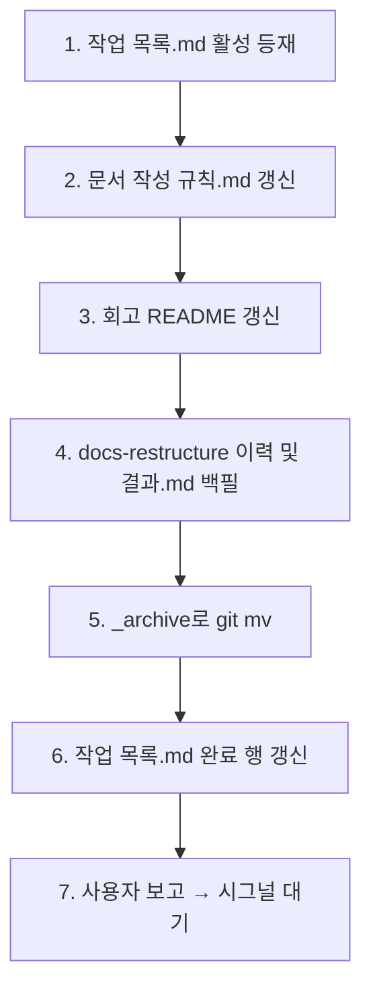

# 구현계획: 정책 정련

**TL;DR**: list 활성 등재 → `문서 작성 규칙.md` §2/§3.1/§3.4/§4.4 갱신 → `회고/README.md`에 즉시 효력·승격 표 추가 → `docs-restructure` 이력 백필 → `_archive/`로 `git mv` → list 완료 행 갱신 → 보고. 새 형식의 첫 백필+첫 archive 적용 사례.

## 1. 전체 시퀀스

```
[Step 1] 작업 목록.md 활성 등재
   ↓
[Step 2] 문서 작성 규칙.md 갱신
   ↓
[Step 3] 회고 README 갱신
   ↓
[Step 4] docs-restructure 이력 및 결과.md 백필
   ↓
[Step 5] _archive로 git mv
   ↓
[Step 6] 작업 목록.md 완료 행 갱신
   ↓
[Step 7] 사용자 보고 → 시그널 대기
```

(Mermaid)



## 2. 단계별 상세

### Step 1: `작업 목록.md` 활성 등재

**작업**:
- 활성 섹션에 `meta/policy-refinement` 행 추가
- 모듈: `meta`, 태그: `docs, convention, lifecycle`
- 연계: `← [meta/docs-restructure](meta/20260424_docs-restructure/)` (이 작업 archive 적용 후 경로 갱신)

**영향 파일**: `docs/tasks/작업 목록.md`
**검증**: 활성 섹션 1행 추가 확인
**commit 메시지**: `docs(tasks): 정책 정련 활성 등재`

### Step 2: `docs/지침/일반/문서 작성 규칙.md` 갱신

**작업**:

| 섹션 | 변경 |
|---|---|
| 2 (문서 위치) | "충돌 시 프로젝트 우선" 명시 추가 |
| 3.1 (레이아웃) | `_archive/<모듈>/<작업>/` 추가 |
| 3.3 (작업 문서) | `이력 및 결과.md` 항목 명시 (필수 — 완료 시) |
| 신규 3.4 | "완료 작업 archive" 서브섹션 (이동 규칙 + `이력 및 결과.md` 형식 템플릿) |
| 4.4 (갱신 이벤트) | 완료 시그널 동작에 `_archive 이동 + 이력 및 결과.md 작성 + 작업 목록.md 행 갱신` 추가 |

**영향 파일**: `docs/지침/일반/문서 작성 규칙.md`
**검증**: 5개 변경 항목 모두 반영
**commit 메시지**: `docs(rule): 작업 lifecycle·우선순위·archive 정책 명문화`

### Step 3: `docs/회고/README.md` 갱신

**작업**:

| 섹션 | 변경 |
|---|---|
| 회고와 지침의 차이 표 | "효력 발생 시점: 즉시 (회고와 지침 동일)" 행 추가 |
| 트리거 섹션 직후 | "효력" 서브섹션 신규 — 즉시 효력 + 승격 = 통합/정리 차원 |
| 항목 형식 | 변경 없음 |
| 신규: 승격 이력 | 하단에 표 추가 (회고 → 지침 매핑) |

**영향 파일**: `docs/회고/README.md`
**검증**: 즉시 효력 명시 + 승격 표 존재
**commit 메시지**: `docs(retro): 회고 즉시 효력 + 승격 이력 표 신규`

### Step 4: `meta/20260424_docs-restructure/이력 및 결과.md` 백필

**작업**:
- 형식: 새 컨벤션 (작업 작성 규칙.md의 신규 3.4)
- 내용: 2026-04-24 완료 사실, 결과물(폴더 구조·list 도입), 핵심 결정(2레벨 고정 등), 후속(Sound1 migration·본 작업)

**영향 파일**: `docs/tasks/meta/20260424_docs-restructure/이력 및 결과.md` (신규)
**검증**: 파일 존재
**commit 메시지**: `docs(tasks): docs-restructure 이력 및 결과 백필`

### Step 5: `_archive`로 이동

**작업**:

```bash
git mv docs/tasks/meta/docs-restructure docs/tasks/_archive/meta/docs-restructure
```

**영향 파일**: 폴더 이동 (5 파일 rename)
**검증**: `git status`에 rename 확인
**commit 메시지**: `docs(tasks): docs-restructure → _archive`

### Step 6: `작업 목록.md` 완료 섹션 갱신

**작업**:
- `meta/docs-restructure` 행의 폴더 링크 → `_archive/meta/20260424_docs-restructure/`
- 갱신 이력에 본 작업 사실 추가

**영향 파일**: `docs/tasks/작업 목록.md`
**검증**: 링크 경로 `_archive/...` 포함
**commit 메시지**: `docs(tasks): 작업 목록 완료 링크 _archive로 갱신`

### Step 7: 본 작업도 완료 섹션으로

**작업**:
사용자 *"작업 끝났어. 마무리해"* 시그널 수신 시:
- `policy-refinement/이력 및 결과.md` 작성
- `_archive/meta/20260427_policy-refinement/`로 `git mv`
- `작업 목록.md` 활성 → 완료, `_archive/` 경로
- 커밋 → 사용자 승인 → `--no-ff` 병합 (`claude_develop`)

**영향 파일**: 본 작업 폴더 자체
**검증**: 본 폴더가 `_archive/` 하위로 이동
**commit 메시지**: `docs(tasks): policy-refinement 완료 → _archive`

## 3. 검증 절차

### 3.1 단계별
- 각 commit 직전 `git status` + `git diff --stat`
- `_archive/` 경로 일관성

### 3.2 최종
- 수용 기준 9개 모두 통과
- 첫 archive 사례의 형식이 신규 §3.4와 일치

## 4. 위험 관리

### 위험 요소

| 위험 | 가능성 | 영향 | 완화 |
|---|---|---|---|
| `이력 및 결과.md` 형식이 지나치게 무거워져 작성 부담 증가 | 중 | 중 | 1페이지 cap, 4섹션만 (무엇/핵심결정/후속/메타) |
| 회고 즉시효력 명시가 검증 부재로 오해될 수 있음 | 낮음 | 중 | "안정화 후 지침 통합"으로 사후 정돈 가능함을 함께 명시 |
| `_archive/` 도입 후 Glob 결과 오염 | 중 | 낮음 | 활성 작업만 검색 시 `tasks/[!_]*/` 패턴 사용 권장 (필요 시 추후 명시) |

### 롤백 방안

- 모든 변경은 단일 브랜치 `claude_docs_policy-refinement`에서 진행
- 병합 전이면 브랜치 폐기로 롤백
- 병합 후 문제 발견 시 reverse commit

## 5. 작업 분담 (서브에이전트 활용)

- **메인 agent**: 모든 Step (1~7) — 단일 작업자 직접 진행
- **서브에이전트**: 본 작업은 정책 정돈 + 자기 적용이라 서브에이전트 위임 없음
- **병렬 호출**: Step 2·3은 독립이므로 병렬 가능

## 6. 진행 추적

- [x] Step 1: `작업 목록.md` 활성 등재
- [x] Step 2: `문서 작성 규칙.md` §2/§3.1/§3.4/§4.4 갱신
- [x] Step 3: 회고 README 갱신
- [x] Step 4: docs-restructure 이력 백필
- [x] Step 5: `_archive`로 git mv
- [x] Step 6: `작업 목록.md` 완료 행 갱신
- [x] Step 7: 본 작업 완료·`_archive` 이동

## 7. 관련 산출물

- [요구사항.md](요구사항.md) — 무엇을·왜
- [분석.md](분석.md) — 분석 본문은 본 계획에 통합
- [이력 및 결과.md](이력%20및%20결과.md) — 시계열·완료
- 첨부: 해당 없음

## 자체 검토

### 지침 준수 여부
| 지침 | 준수 |
|---|---|
| [`작업 진행 규칙.md`](../../../지침/일반/작업%20진행%20규칙.md) | 완료 |
| [`Git/브랜치, 병합 규칙.md`](../../../지침/Git/브랜치,%20병합%20규칙.md) | 완료 |
| [`문서 작성 규칙.md`](../../../지침/일반/문서%20작성%20규칙.md) | 완료 |

### 논리적 정합성
| 점검 | 결과 |
|---|---|
| 단계 시퀀스 의존성 명확 | 완료 |
| 위험·롤백 식별 | 완료 |
| 자기 적용 흐름(첫 archive 사례) 명시 | 완료 |

### 미해결 이슈
| 이슈 | 처리 |
|---|---|
| 해당 없음 | — |
