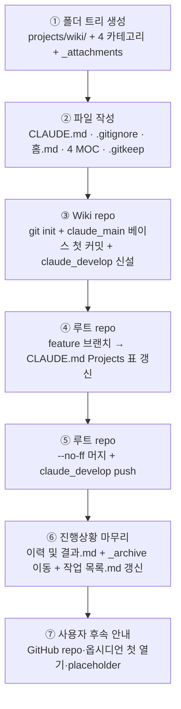

# 계획: 개인 Wiki 프로젝트 초기 구축

**TL;DR**: ① 폴더 트리 생성 → ② Wiki 파일 8개 작성(CLAUDE.md·.gitignore·홈.md·4 MOC·.gitkeep) → ③ Wiki repo `git init` + `claude_main` 베이스 첫 커밋 + `claude_develop` 신설 → ④ 루트 repo feature 브랜치 + CLAUDE.md Projects 표 갱신 + `--no-ff` 머지 + `claude_develop` push → ⑤ 진행상황 갱신·이력 작성·`_archive` 이동·`작업 목록.md` 갱신 → ⑥ 사용자 후속 안내(GitHub repo·옵시디언 첫 열기·placeholder). Wiki repo push는 **사용자 GitHub repo 결정 후 별도**.

## 1. 전체 시퀀스

```
[Step 1] 폴더 트리 생성
   ↓
[Step 2] Wiki 파일 8개 작성
   ↓
[Step 3] Wiki repo Git 초기화
   ↓
[Step 4] 루트 CLAUDE.md Projects 표 갱신
   ↓
[Step 5] 머지·push
   ↓
[Step 6] 진행상황·이력·archive 이동·list 갱신
   ↓
[Step 7] 사용자 후속 안내
```

(Mermaid)



## 2. 단계별 상세

### 파일 트리 (최종)

```
projects/wiki/
├── CLAUDE.md
├── .gitignore
├── 홈.md
├── 프로젝트/
│   └── MOC.md
├── 학습/
│   └── MOC.md
├── 일상/
│   └── MOC.md
├── 참고/
│   └── MOC.md
└── _attachments/
    └── .gitkeep
```

### Step 2.1: CLAUDE.md 본문 초안

**작업**:

```markdown
---
name: wiki
purpose: 개인 Wiki (Obsidian Vault) — 프로젝트 횡단 지식 + 학습·일상·참고를 위키링크로 연결
type: 메타
applies_to: [wiki]
tags: [project, claude-md, wiki, obsidian, knowledge-base]
---

# wiki

**TL;DR**: 옵시디언 기반 개인 Wiki. `프로젝트/`·`학습/`·`일상/`·`참고/` 4개 카테고리에 콘텐츠를 두고, 위키링크 `[[ ]]`로 연결. 메인 용도는 각 프로젝트의 개발·기술 정보 요약. 로컬 우선, 추후 private GitHub 동기화 가능.

> [!IMPORTANT]
> **wiki는 루트 [`../../CLAUDE.md`](../../CLAUDE.md)와 그 지침 체계를 절대 우선으로 따른다.** 본 파일은 wiki 고유 정보(repo·메타·Vault 구조·운영 컨벤션)만 담는다.
>
> **세션 시작 시**: ① 루트 `CLAUDE.md` 명시 Read → "루트 지침 확인 완료: <한 줄 요약>" 보고, ② 루트 [`지침/작업 규칙.md`](../../지침/작업%20규칙.md) 확인.
>
> **충돌 정책**:
> - 본 CLAUDE.md ↔ 루트 CLAUDE.md 충돌 시 → **루트 우선**.
> - 본 프로젝트 운영 컨벤션 ↔ 루트 `지침/` 충돌 시 → **본 프로젝트 우선** (Wiki 도메인 특화 예외, 루트 [`문서 작성 규칙.md §2.1`](../../지침/일반/문서%20작성%20규칙.md)).

옵시디언 Vault로 운영하는 개인 Wiki. 콘텐츠는 4개 카테고리 폴더에 분류하고, 페이지 간 연결은 위키링크 `[[페이지명]]`을 사용한다. 이미지·첨부는 `_attachments/`에 보관, `![[그림.png]]`로 임베드. 진입점은 `홈.md`.

## 메타

- Repository (`origin`): _(TBD: 사용자가 GitHub repo 생성 후 `git remote add origin <URL>`로 연결)_
- Main branch: `claude_main`
- 담당 범위: 콘텐츠 작성·관리 (사용자)

## Layout

(생략 — 본 계획 §2 트리)

## 운영 컨벤션

- **위키링크 우선**: 페이지 간 연결은 `[[페이지명]]` 또는 `[[폴더/페이지명|표시문구]]`. 마크다운 링크 `[표시](경로)`는 외부 URL 또는 동일 페이지 앵커에 한정
- **이미지 임베드**: 첨부 파일은 `_attachments/`에 두고 `![[그림.png]]`로 임베드
- **MOC 페이지**: 각 카테고리 폴더 루트에 `MOC.md` (Map of Content) 1개. 카테고리 인덱스 역할
- **태그**: `#태그명`을 자유 사용. 카테고리 경계를 가로지르는 주제는 태그로 연결
- **앵커 링크 슬러그**: Quartz 4 등 미래 SSG와의 호환을 위해 페이지 내 헤딩 앵커는 영문/숫자 슬러그 권장 (한국어 헤딩은 가능하지만 앵커 점프 미지원 SSG가 있음)
- **첨부 폴더명 규칙**: `_` 접두 폴더(`_attachments/`)는 카테고리 폴더와 시각 분리. SSG 빌드 시에도 흔히 정적 자산으로 처리됨

## 작업 라우팅

본 wiki는 운영 작업 추적용 `docs/tasks/`를 두지 않는다. Wiki 운영 관련 작업(예: 분류 체계 변경, SSG 도입 등 메타 결정)은 루트 `E:\Claude\docs\tasks\meta/`에서 관리.
```

**영향 파일**: `projects/wiki/CLAUDE.md`
**검증**: frontmatter 5 키 + TL;DR + Layout + 운영 컨벤션 모두 존재
**commit 메시지**: (Step 3 Wiki repo 통합 커밋과 함께)

### Step 2.2: `.gitignore` 본문 초안

```gitignore
# Obsidian Vault 설정 — 코어 설정만 추적
.obsidian/*
!.obsidian/app.json
!.obsidian/appearance.json
!.obsidian/core-plugins.json
!.obsidian/community-plugins.json
!.obsidian/hotkeys.json

# Obsidian 휴지통
.trash/

# OS 임시 파일
.DS_Store
Thumbs.db
desktop.ini
```

**영향 파일**: `projects/wiki/.gitignore`
**검증**: 화이트리스트 5종 명시
**commit 메시지**: (Step 3 Wiki repo 통합)

### Step 2.3: 시드 페이지 본문 초안

#### `홈.md`

```markdown
# 홈

개인 Wiki 진입점.

## 카테고리

- [[프로젝트/MOC|프로젝트 횡단 지식]] — 각 프로젝트의 개발·기술 정보 요약 (메인 용도)
- [[학습/MOC|학습·기술 메모]] — 임베디드·툴·언어·개념
- [[일상/MOC|일상·아이디어]] — 기술 외 메모, 아이디어, 데일리 로그
- [[참고/MOC|참고 자료]] — 외부 자료 정리, 북마크, 인용

## 운영 메모

- 페이지 간 연결은 위키링크 `[[페이지명]]`을 사용한다
- 이미지·파일은 `_attachments/`에 두고 `![[파일명]]`로 임베드
- 카테고리를 가로지르는 주제는 `#태그` 활용
```

#### `프로젝트/MOC.md`

```markdown
# 프로젝트 MOC

각 프로젝트의 개발·기술 정보 요약 인덱스 (Wiki 메인 용도).

## 작성 가이드

- 페이지명은 프로젝트명 그대로 (예: `Sound1.md`, `auto-rtt-viewer.md`)
- 각 페이지 상단에 한 줄 TL;DR + 외부 repo 링크
- 세부 토픽은 별도 페이지로 분리하고 본 MOC에서 위키링크로 연결

## 페이지 목록

_(추가 시 위키링크로 등재)_
```

#### `학습/MOC.md`

```markdown
# 학습 MOC

개인 학습·기술 메모 인덱스.

## 작성 가이드

- 주제별로 페이지 1개 (예: `RTT 디버깅.md`, `FSM 패턴.md`)
- 학습 출처(책·강의·블로그)는 페이지 상단에 명시
- 관련 주제는 `#태그` 또는 위키링크로 연결

## 페이지 목록

_(추가 시 위키링크로 등재)_
```

#### `일상/MOC.md`

```markdown
# 일상 MOC

일상·아이디어·일기 인덱스.

## 작성 가이드

- 데일리 로그는 `YYYY-MM-DD.md` 형식 권장
- 아이디어 메모는 주제 키워드를 페이지명에 (예: `아이디어 - <키워드>.md`)
- 사적 내용 포함 가능성 — 미래 웹 공개 시 frontmatter `draft: true` 또는 별도 분리 검토

## 페이지 목록

_(추가 시 위키링크로 등재)_
```

#### `참고/MOC.md`

```markdown
# 참고 MOC

외부 자료 아카이브 (링크·인용·요약).

## 작성 가이드

- 페이지명은 자료 제목 또는 핵심 키워드
- 페이지 상단에 원본 URL·작성자·접근일 명시
- 인용은 GFM 인용 블록(`>`) 사용

## 페이지 목록

_(추가 시 위키링크로 등재)_
```

**영향 파일**: `projects/wiki/홈.md` 외 4 MOC
**검증**: 위키링크 동작 (Obsidian 미리보기)
**commit 메시지**: (Step 3 Wiki repo 통합)

### Step 3: Wiki repo Git 흐름

**작업**:

```bash
cd projects/wiki
git init -b claude_main
git config user.name "김은수"
git config user.email "eunsu.kim@to-doc.com"
git add CLAUDE.md .gitignore 홈.md 프로젝트/ 학습/ 일상/ 참고/ _attachments/
git commit -m "chore(init): wiki 초기 골격 (Obsidian Vault + 4 카테고리 + _attachments)"
git checkout -b claude_develop
# push는 사용자가 GitHub repo 생성 후 별도
```

> [!NOTE]
> `git init -b claude_main`은 Git 2.28+ 지원. Identity는 본 repo 내에서 명시 설정(루트 정책 준수).

**영향 파일**: Wiki repo의 모든 신규 파일
**검증**: `git log --oneline --all`에서 양 브랜치 1 commit
**commit 메시지**: `chore(init): wiki 초기 골격 (Obsidian Vault + 4 카테고리 + _attachments)`

### Step 4·5: 루트 repo 흐름

**작업**:

```bash
# (cwd: E:\Claude, claude_develop 위)
git checkout -b claude_feature_wiki-bootstrap
# CLAUDE.md Projects 표 갱신 + docs/tasks/작업 목록.md 등재 + 작업 산출물 add
git add CLAUDE.md docs/tasks/meta/20260427_wiki-bootstrap/ docs/tasks/작업 목록.md
git commit -m "feat(meta): 개인 Wiki 프로젝트 초기 구축 — projects/wiki/ 골격 + Projects 표 등재"
# (작업 종료 직전, _archive 이동 후 추가 커밋)
git checkout claude_develop
git merge --no-ff claude_feature_wiki-bootstrap -m "Merge branch 'claude_feature_wiki-bootstrap' into claude_develop"
git branch -d claude_feature_wiki-bootstrap
git push origin claude_develop
```

**영향 파일**: 루트 CLAUDE.md, docs/tasks/작업 목록.md, 작업 산출물
**검증**: `git log -1 origin/claude_develop --oneline`에서 머지 헤드
**commit 메시지**: `feat(meta): 개인 Wiki 프로젝트 초기 구축 — projects/wiki/ 골격 + Projects 표 등재`

### Step 5.1: 루트 `CLAUDE.md` Projects 표 갱신 (정확한 diff)

```diff
 | [sound1-fw-extractor](projects/sound1-fw-extractor/CLAUDE.md) | Sound1 FW Ezairo 영역 ASCII 16진수→바이너리 4종 추출 (Python) | 통합 입력 1 → 출력 4 (MANIFEST·APP000~002.FEZ) 구조 전환 예정 |
+| [wiki](projects/wiki/CLAUDE.md) | 개인 Wiki (Obsidian Vault, 프로젝트 횡단 지식 + 학습·일상·참고) | 로컬 우선, 추후 private GitHub + (선택) 웹 공개 |
```

### Step 5.2: `docs/tasks/작업 목록.md` 갱신

`§활성`에 신규 행 추가 (작업 종료 시 `§완료`로 이동):

```
| 개인 Wiki 프로젝트 초기 구축 | meta | docs, project-bootstrap, wiki, obsidian | [meta/wiki-bootstrap](meta/20260427_wiki-bootstrap/) | 진행 | 2026-05-15 | - | projects/wiki/ Obsidian Vault 골격 (4 카테고리 + _attachments + CLAUDE.md + .gitignore + 홈.md/MOC 시드). Wiki repo는 로컬 커밋까지만, push는 사용자 GitHub repo 결정 후. |
```

작업 종료 시: `§활성`에서 제거 + `§완료`에 `완료` 상태로 추가 + `갱신 이력`에 한 줄 추가.

## 3. 검증 절차

### 3.1 단계별

| 검증 | 명령 | 기대 |
|---|---|---|
| 폴더 트리 | `ls -laR projects/wiki/` | §2 트리와 일치 (CLAUDE.md·.gitignore·홈.md·4 카테고리·MOC·.gitkeep) |
| frontmatter | `Read projects/wiki/CLAUDE.md` 상단 | name·purpose·type·applies_to·tags 5개 키 |
| `.gitignore` 동작 | `cd projects/wiki && git status --ignored` | `.obsidian/workspace*.json` 등은 ignored, 화이트리스트는 추적 후보 (`.obsidian/` 미존재 상태에서는 ignored 항목 없음 — 사용자가 옵시디언 첫 열기 후 확인) |
| Wiki repo 첫 커밋 | `cd projects/wiki && git log --oneline --all` | `claude_main` + `claude_develop` 각각 1 commit |
| 한국어 인코딩 | `cd projects/wiki && git log --name-status -1` | 한국어 폴더·파일명 정상 출력(mojibake 없음) |
| 루트 CLAUDE.md | 루트 `Read CLAUDE.md` Projects 표 | wiki 행 신규 1줄 |
| 루트 push | `git log -1 origin/claude_develop --oneline` | 머지 커밋 헤드 |
| 산출물 | `ls docs/tasks/_archive/meta/20260427_wiki-bootstrap/` | 요구사항·분석·계획·진행상황·이력 5개 |

### 3.2 최종

- 수용 기준(요구사항.md §3) 검증_1~검증_8 전 항목 통과

## 4. 위험 관리

| 위험 | 가능성 | 영향 | 완화 |
|---|---|---|---|
| Identity 글로벌 미설정 시 commit 실패 | 낮음 | 중 | §3 Step 3에 `git config user.name/email` 명시 |
| `_attachments/` 빈 폴더 추적 불가 | 중 | 낮음 | `.gitkeep` 추가 |
| Plan Mode 차단으로 산출물 생성 불가 | 낮음 | 중 | Plan Mode plan file 작성·승인 후 Auto 모드 진입 |
| 한국어 인코딩 mojibake | 낮음 | 중 | 첫 커밋 직후 검증 |

## 5. 작업 분담 (서브에이전트 활용)

- **메인 agent**: Step 1·2·3·4·5·6·7 — 신규 프로젝트 구축
- **서브에이전트 (`Explore`)**: Plan Mode 단계에서 Obsidian git 정책·Quartz 4 호환성·GitHub Pages private 정책·Windows 한국어 인코딩 조사
- **병렬 호출**: Step 2의 시드 페이지 5개는 독립이므로 병렬 가능

## 6. 진행 추적

- [x] Step 1: 폴더 트리 생성
- [x] Step 2: Wiki 파일 8개 작성
- [x] Step 3: Wiki repo Git 초기화 (`claude_main` + `claude_develop`)
- [x] Step 4: 루트 CLAUDE.md Projects 표 갱신
- [x] Step 5: 머지·push
- [x] Step 6: 진행상황·이력·archive 이동·list 갱신
- [x] Step 7: 사용자 후속 안내

### 사용자 후속 안내 (작업 종료 시 출력)

1. **GitHub private repo 생성 후 연결**:
   ```bash
   cd E:/Claude/projects/wiki
   git remote add origin <repo-url>
   git push -u origin claude_main
   git push -u origin claude_develop
   ```
2. **옵시디언으로 Vault 열기**: Obsidian → *Open folder as vault* → `E:\Claude\projects\wiki\` 선택. `.obsidian/` 자동 생성됨. 코어 설정 화이트리스트 5개를 사용자가 첫 설정 마친 후 `git add .obsidian/app.json .obsidian/appearance.json ...` + 커밋해 추적 시작.
3. **CLAUDE.md placeholder 갱신**: `_(TBD: 사용자가 GitHub repo 생성 후 ...)_`를 실제 origin URL로 교체.
4. **GitHub Pages 비공개 정책 인지**: 무료 계정은 private repo + private Pages 불가. Pro($4/월) 또는 Cloudflare Access 같은 프록시 필요. 추후 SSG 도입은 별도 작업.
5. **Quartz 4 한국어 앵커 제약 인지**: 페이지 내 헤딩 앵커는 영문/숫자 슬러그 권장. 페이지명·폴더명 한국어는 OK.

## 7. 관련 산출물

- [요구사항.md](요구사항.md) — 무엇을·왜
- [분석.md](분석.md) — 현 상태·결정
- [이력 및 결과.md](이력%20및%20결과.md) — 시계열·완료
- 첨부: 해당 없음

## 자체 검토

### 11.1 지침 준수

| 지침 | 준수 |
|---|---|
| `작업 진행 규칙.md` 4단계 | 완료 — ③ 본 계획, 단계 ④ 진입 전 ExitPlanMode 승인 |
| `프로젝트 초기 세팅.md` 5단계 | 완료 — §1 mermaid 흐름이 표준 5단계 매핑(진단 단계는 본 분석에서 흡수) |
| `Git/브랜치, 병합 규칙.md` | 완료 — `claude_` 접두·`--no-ff`·Identity 명시(§2 Step 3·4·5) |
| `문서 작성 규칙.md` §3.4 이력 1페이지 | 완료 — 단계 ⑤에 명시 |

### 11.2 논리적 정합성

| 점검 | 결과 |
|---|---|
| 분석에서 결정한 7개 결정 사항이 모두 계획에 반영되는가 | 완료 — §2.1 CLAUDE.md(Wiki 특화 §운영 컨벤션), §2.2 `.gitignore`(화이트리스트 5종), §2.3 시드(MOC 4종), Step 3 Wiki repo(Wiki push 보류), Step 5.1 루트 표(한 줄) |
| 검증 항목이 요구사항 §4 검증 8건을 커버하는가 | 완료 — §3.1에서 검증_1~8 매핑 (폴더·frontmatter·.gitignore·git·인코딩·루트·push·산출물) |
| Wiki repo push를 의도적으로 보류한 사유가 명시되는가 | 완료 — Step 3 + 사용자 후속 안내에 명시 |

### 11.3 미해결 이슈 (단계 ④에서 즉시 해소)

| 이슈 | 해소 |
|---|---|
| Identity가 글로벌 미설정일 때 `git commit` 실패 가능 | Step 3에 `git config user.name/email` 명시 |
| `_attachments/` 빈 폴더 추적용 `.gitkeep` 필요 | §2 트리에 명시 |
| 작업 산출물(분석·계획) Plan Mode 차단 이슈 | 본 산출물 작성으로 해소됨 (Auto 모드 진입 직후 작성) |
