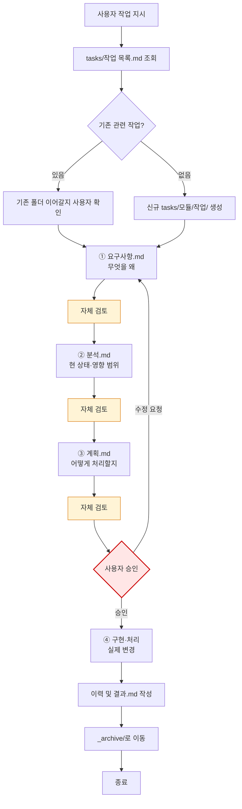

# 계획: 작업 진행 4단계 프로세스 일반화 + Git 범주 처리

**TL;DR**: ① `일반/작업 진행 규칙.md` 신설(4단계+자체검토+산출물+이력) → ② `코딩/작업 규칙.md` 슬림화 → ③ 마스터 체크리스트 §3 일반·§4 코딩 재배치 → ④ Git 규칙·워크플로우에 §스코프 분리 추가 → ⑤ `문서 작성 규칙.md`·`CLAUDE.md` 인덱스 갱신.

## 1. 전체 시퀀스


## 2. 단계별 상세

### 계획_1 — `docs/지침/일반/작업 진행 규칙.md` (신규)

**작업**:

구성:
```
1. 적용 범위 — 모든 작업(코딩·문서·메타·조사 등). 단순 수정 예외
2. 4단계 프로세스 — 요구사항/분석/계획/구현, 산출물 매핑
3. 진행상황 문서 — 의무·갱신 시점·형식
4. 자체 검토 2축 — 지침 준수 + 논리 정합성
5. 완료 처리 — 이력 및 결과.md 작성·_archive 이동
6. 단순 수정 예외 — 4단계 면제 기준
7. 작업 흐름 — mermaid (코딩 규칙에서 이전·일반화)
```

핵심 결정 반영:
- 산출물 파일명: `요구사항.md` / `분석.md` / `계획.md` / `이력 및 결과.md` / `진행상황.md`
- 자체 검토 형식: 본문 내 §자체 검토 섹션(별도 파일 분리 금지)
- 진행상황 갱신 시점: 단계 시작·종료, 결정 추가, 이슈 발생, 다음 동작 변경

**영향 파일**: 신규 `docs/지침/일반/작업 진행 규칙.md`
**검증**: 7 섹션 모두 존재
**commit 메시지**: `docs(rule): 작업 진행 4단계 일반 규칙 신설`

### 계획_2 — `docs/지침/코딩/작업 규칙.md` (슬림화)

**작업**:

보존:
- 핵심 원칙(코드 작성 전 문서 선행)
- 단순 수정 예외(현행 §예외)
- 코딩 특화 작업 흐름 — 단, 일반 4단계 위에 코딩 단계가 매핑됨을 명시

변경:
- TL;DR 갱신: "4단계 프로세스 일반 규칙 상속. 코드 작성 전 `요구사항.md`→`분석.md`→`계획.md` 선행."
- 작업 흐름 mermaid 단순화 또는 일반 규칙으로 위임 링크
- `구현계획.md` → `계획.md` (코딩 alias 호환 한 줄 명시)
- 상속 명시: "`일반/작업 진행 규칙.md`에 정의된 4단계 프로세스를 따른다. 본 문서는 코딩 작업 특화 사항만 다룬다."

**영향 파일**: `docs/지침/코딩/작업 규칙.md`
**검증**: 일반 규칙 상속 명시, alias 명시
**commit 메시지**: `docs(rule): 코딩 작업 규칙 슬림화 (일반 규칙 상속)`

### 계획_3 — `docs/지침/작업 규칙.md` (마스터 체크리스트)

**작업**:

섹션 재배치:
```
1. 커뮤니케이션 (현행 유지)
2. 문서 작성 (현행 유지)
3. 작업 진행 — 4단계 (신규) ← 일반화
4. 프로그래밍 작업 (현 §3 슬림화 — 코딩 특화만)
5. 코드 분석·디버깅 (현 §4)
6. Git (현 §5 + §스코프 한 줄 추가)
7. 응답·컨텍스트 효율 (현 §6)
```

신규 §3 체크리스트 항목:
- 작업 지시 수신 → `tasks/작업 목록.md` 조회 → 신규 폴더 생성 또는 기존 이어가기
- 4단계 산출물(`요구사항.md`/`분석.md`/`계획.md`) 작성 + 각 단계 자체 검토
- `진행상황.md` 단계 1과 동시 생성·지속 갱신
- 완료 시 `이력 및 결과.md` 작성 + `_archive/`로 이동
- 단순 수정 예외 면제 (오타·설정값)

§4 프로그래밍 항목 갱신:
- 신규 심볼·모듈 시 `tdc_` 접두어 무조건 적용 (현행 유지)
- 기존 "문서 선행" 항목 제거(§3로 일반화)

§6 Git 항목 갱신:
- 한 줄 추가: "작업이 속한 스코프(루트/프로젝트)의 repo에 커밋 — 작업 위치 기준이 아닌 변경 파일 경로 기준"

**영향 파일**: `docs/지침/작업 규칙.md`
**검증**: §1~§7 재배치 + 신규 §3 본문 + 서브에이전트 한 줄
**commit 메시지**: `docs(rule): 마스터 체크리스트 §3 작업 진행 신설·§4 프로그래밍 슬림화`

### 계획_4 — `docs/지침/Git/브랜치, 병합 규칙.md`

**작업**:

추가 섹션 — `## 작업 스코프 (Repo 분리)`

내용:
- 핵심 규칙: 변경 파일 경로 기준으로 repo 결정
- 시나리오 예시 (루트 세션에서 프로젝트 작업)
- 혼합 변경 처리(분리 커밋, peer 링크)
- 위반 복구 절차 표

위치: 현 `## 프로젝트별 적용` 직전 또는 직후. 시나리오 흐름상 Git Identity 다음, 프로젝트별 적용 직전이 자연스러움.

**영향 파일**: `docs/지침/Git/브랜치, 병합 규칙.md`
**검증**: §스코프 본문 + 복구 표 존재
**commit 메시지**: `docs(git): 작업 스코프(Repo 분리) §추가`

### 계획_5 — `docs/지침/Git/워크플로우.md`

**작업**:

추가 섹션 — `## 0. 작업 스코프 판단 (선행 단계)`
- mermaid: 변경 파일 경로 → 어느 repo
- 체크리스트: 커밋 직전 staged 파일 경로 확인
- 위반 시 복구 절차

위치: §1 브랜치 모델 직전. 모든 후속 절차의 선행 조건이므로 §0으로.

**영향 파일**: `docs/지침/Git/워크플로우.md`
**검증**: §0 신설
**commit 메시지**: `docs(git): 워크플로우 §0 작업 스코프 판단 신설`

### 계획_6 — `docs/지침/일반/문서 작성 규칙.md`

**작업**:
- §3.3 작업 문서 — 필수 파일 목록에 `계획.md` 추가, `구현계획.md`는 코딩 alias로 한 줄 명시
- §3.1 전체 레이아웃 다이어그램 — `구현계획.md` → `계획.md` (또는 둘 다 표기)

**영향 파일**: `docs/지침/일반/문서 작성 규칙.md`
**검증**: `계획.md` 명시
**commit 메시지**: `docs(rule): 문서 작성 규칙 계획.md alias 명시`

### 계획_7 — `CLAUDE.md` (루트)

**작업**:
지침 인덱스 표 §일반에 한 줄 추가:
- `[`지침/일반/작업 진행 규칙.md`](...) | 모든 작업 4단계(요구사항→분석→계획→구현), 산출물·자체검토·이력 의무`

위치: §일반 영역, `명령 해석 규칙` 다음.

**영향 파일**: `CLAUDE.md`
**검증**: 표에 신규 행 추가
**commit 메시지**: `docs(CLAUDE): 지침 인덱스 등재`

### 계획_8 — `docs/tasks/작업 목록.md` 마감 처리

**작업**:
- 현재 활성 섹션 행을 완료로 이동(작업 archive 시점)
- 폴더 링크를 `_archive/meta/20260507_work-process-git-scope/`로 갱신

**영향 파일**: `docs/tasks/작업 목록.md`
**검증**: 활성 0행, 완료 1행 추가
**commit 메시지**: (마지막 마감 처리)

### 계획_9 — `docs/지침/일반/서브에이전트 활용.md` (신규)

**작업**:

구성:
```
1. 적용 범위 — 모든 작업. 가능하면 적극 활용
2. 활용 가치 — 병렬 처리(주), 컨텍스트 격리(부)
3. 작업별 활용 패턴 매핑 — 검색·분석·구현·디버깅
4. 서브에이전트 종류별 매핑 — Explore / general-purpose / Plan
5. 병렬 호출 방법 — 한 응답에 multiple Agent 호출
6. 좋은 프롬프트 작성 — 자기완결, 사전 지식 담기, 출력 형식 지정
7. 안티패턴 — 단일 lookup·중복 검증·결과 무시
8. 관련 지침 — 컨텍스트 절약·작업 진행
```

마스터 §3 추가 한 줄:
`- [ ] 서브에이전트로 병렬·효율 가능한 부분은 적극 활용 (광범위 탐색·다중 가설·독립 작업 동시 실행)`

`작업 진행 규칙.md` 추가 §서브에이전트 활용:
각 단계 산출 시 광범위 검색·독립 작업이 있으면 서브에이전트 위임. 상세는 `서브에이전트 활용.md` 링크.

`컨텍스트 절약 규칙.md` §3.D cross-ref:
`§3.D 서브에이전트로 격리`에 한 줄 추가: "병렬·효율 활용 가이드는 [`서브에이전트 활용.md`](서브에이전트%20활용.md) 참조."

**영향 파일**: 신규 1, 수정 3
**검증**: 신규 파일·cross-ref 명시
**commit 메시지**: `docs(rule): 서브에이전트 활용 지침 신설`

### 신규 `일반/작업 진행 규칙.md` 핵심 내용 초안

#### 4단계 프로세스 (mermaid)



#### 산출물 파일명 매핑

| 단계 | 산출물 |
|---|---|
| 요구사항 분석 | `요구사항.md` |
| 현상태 분석 | `분석.md` |
| 구현·처리 계획 | `계획.md` |
| 구현·처리 | 실제 변경(코드·문서·설정 등) |
| 진행상황 | `진행상황.md` (단계 1과 동시 생성, 지속 갱신) |
| 완료 | `이력 및 결과.md` |

#### 자체 검토 2축

각 산출물 말미 §자체 검토 섹션:

```markdown
## 자체 검토

### 지침 준수 여부
| 지침 | 준수 |
|---|---|
| `<지침명>` | 완료/주의/실패 |

### 논리적 정합성
| 점검 | 결과 |
|---|---|
| ... | 완료 |

### 미해결 이슈 (있을 경우)
| 이슈 | 처리(다음 단계로 이전) |
|---|---|
```

#### 단순 수정 예외

- 오타·설정값 변경, 한 단어 수정 등 **명백한 단순 작업**은 4단계 면제
- 단 작업 내용이 모호하면 4단계 적용

## 3. 검증 절차

### 3.1 단계별
- 각 commit 직전 `git status` + `git diff --stat`
- 영향 파일이 계획 범위 내인지 (오버런 방지)

### 3.2 최종
- 수용 기준(요구사항.md §3) 검증_1~검증_8 전 항목 통과
- 인덱스 일관성 (CLAUDE.md, README, 마스터)

## 4. 위험 관리

| 위험 | 가능성 | 영향 | 완화 |
|---|---|---|---|
| 코딩 규칙 슬림화 시 정보 누락 | 낮음 | 중 | 점진 이행·alias 명시 |
| §3 재배치 시 기존 정보 손실 | 낮음 | 낮음 | 항목 이동만, 삭제 없음 |
| Git 스코프 §0이 §1과 충돌 | 낮음 | 낮음 | 직교(§0=어느 repo, §1=어느 브랜치) |
| 서브에이전트 활용 → 컨텍스트 절약 의도 희석 | 낮음 | 낮음 | 별도 파일 + cross-ref |

## 5. 작업 분담 (서브에이전트 활용)

- **메인 agent**: 계획_1~9 모든 신설·수정
- **서브에이전트 (`Explore`)**: 분석 단계의 현 지침 매핑·영향 파일 탐색
- **병렬 호출**: 계획_1과 계획_9 독립 (신설 파일이므로 충돌 없음)

## 6. 진행 추적

- [x] 계획_1: `작업 진행 규칙.md` 신규
- [x] 계획_2: `코딩/작업 규칙.md` 슬림화
- [x] 계획_3: 마스터 체크리스트 재배치
- [x] 계획_4: `브랜치, 병합 규칙.md` §스코프 추가
- [x] 계획_5: `워크플로우.md` §0 추가
- [x] 계획_6: `문서 작성 규칙.md` `계획.md` 명시
- [x] 계획_7: CLAUDE.md 인덱스 등재
- [x] 계획_8: `작업 목록.md` 마감
- [x] 계획_9: `서브에이전트 활용.md` 신규 + cross-ref

## 7. 관련 산출물

- [요구사항.md](요구사항.md) — 무엇을·왜
- [분석.md](분석.md) — 현 상태·결정
- [이력 및 결과.md](이력%20및%20결과.md) — 시계열·완료
- 첨부: 해당 없음

## 자체 검토

### 4.1 지침 준수 여부

| 지침 | 준수 |
|---|---|
| `문서 작성 규칙.md` §9 frontmatter+TL;DR | 완료 |
| `문서 작성 규칙.md` §6.5 의미 한글 라벨 | 완료 — `계획_1`~`계획_9` |
| `문서 작성 규칙.md` §6.3 Mermaid | 완료 — 적용 순서·작업 흐름 |
| `요구사항.md` §4 검증 항목 매핑 | 완료 — 모든 검증 항목이 계획_1~계획_9로 분배 |
| `분석.md` §3 결정 사항 반영 | 완료 — 결정_1·2·3·4·5 모두 계획에 반영 |

### 4.2 논리적 정합성

| 점검 | 결과 |
|---|---|
| 적용 순서가 의존성을 따르는가 | 완료 — 일반 규칙 신설(①) → 코딩 슬림화(②, ① 의존) → 마스터 갱신(③, ①·② 의존) → Git(④, 독립) → 인덱스(⑤) |
| 누락된 파일 없는가 | 완료 — 분석_2의 모든 파일이 계획_1~계획_9로 매핑 + 작업 목록.md(계획_8) |
| 마스터 체크리스트 재배치가 기존 정보 손실 유발하나 | 완료 — 항목 이동만, 삭제 없음. §3 코딩 → §4로 이동, 기존 §3 "문서 선행" 일반 규칙으로 흡수 |
| 코딩 규칙 슬림화 시 호환성 | 완료 — `구현계획.md` alias 명시, 점진 이행 |
| Git 스코프 §0 도입이 기존 §1 브랜치 모델과 충돌하나 | 완료 — 충돌 없음 — §0은 "어느 repo에 커밋?" 결정, §1은 "그 repo 안 어느 브랜치?" 결정. 직교 |

### 4.3 미해결 이슈

| 이슈 | 처리 |
|---|---|
| 없음 | 단계 ④ 진입 가능 |
