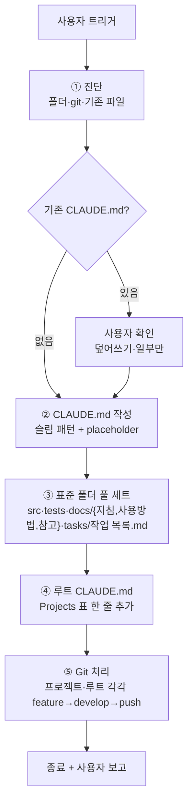

# 계획: 새 프로젝트 초기 세팅 절차 신설

**TL;DR**: ① 신규 `docs/지침/일반/프로젝트 초기 세팅.md` Write → ② 마스터 §3에 트리거 한 줄 + §3 NOTE 링크 추가 → ③ `docs/지침/README.md` 일반 카테고리 등재 → ④ 루트 `CLAUDE.md` 지침 인덱스 등재 → ⑤ 이력·진행상황 마무리 → ⑥ 커밋·머지·archive·push.

## 1. 적용 순서


## 2. 신규 지침 본문 초안

(Write 시 그대로 적용)

```markdown
---
name: 프로젝트 초기 세팅
purpose: 신규 프로젝트 폴더의 CLAUDE.md·표준 폴더·루트 인덱스를 자동 세팅하는 정형 절차
type: 지침
applies_to: [root]
tags: [project, bootstrap, automation, claude-md, scaffold]
---

# 프로젝트 초기 세팅

**TL;DR**: 사용자가 `projects/<이름>/`을 git clone한 뒤 자유 표현 트리거("새 프로젝트 생성", "기본 세팅" 등)를 쓰면 ① 진단 → ② CLAUDE.md(슬림 패턴) → ③ 표준 폴더 풀 세트 → ④ 루트 CLAUDE.md Projects 표 갱신 → ⑤ Git 처리(자동 push)의 5단계로 처리한다. **본 절차는 4단계 작업 진행 면제** (정형 반복).

## 1. 트리거 (자유 표현)

다음 키워드가 사용자 메시지에 포함되면 본 절차 적용:

| 키워드 패턴 | 예 |
|---|---|
| "새 프로젝트 생성" / "신규 프로젝트" | "프로젝트 폴더에 새 프로젝트 생성했어, 기본 세팅 해줘" |
| "초기 세팅" / "기본 세팅" / "초기화" | "projects/X 초기 세팅 부탁" |
| "표준 구조 적용" | "지금 클론한 프로젝트에 표준 구조 적용" |
| 명시 경로 | "projects/<이름> 세팅" |

> [!NOTE]
> 모호하면 [`명령 해석 규칙.md`](명령%20해석%20규칙.md)에 따라 어느 프로젝트인지·CLAUDE.md 덮어쓸지 등을 사용자에게 묻는다.

## 2. 5단계 절차



### 2.1 단계 ① 진단

확인 항목:

- [ ] `projects/<이름>/` 폴더 존재
- [ ] `.git/` 존재 (git repo 여부) — 없으면 사용자 확인
- [ ] `git remote -v`로 origin URL 추출 (없으면 placeholder)
- [ ] 기본 브랜치 (`git branch --show-current`)
- [ ] `CLAUDE.md` 존재 여부 — 있으면 §결정 트리에 따라 사용자 확인
- [ ] `src/`·`tests/`·`docs/` 존재 여부 — 있는 폴더는 보존

### 2.2 단계 ② CLAUDE.md 작성

다음 템플릿(아래 §3) 그대로 적용. 자동 추출 가능 항목은 채우고, 나머지는 `_(TBD)_` placeholder.

자동 추출:

- 프로젝트명 (폴더명)
- `origin` URL (`git remote -v`)
- 메인 브랜치 (`git branch --show-current` 또는 `git symbolic-ref refs/remotes/origin/HEAD`)

placeholder:

- TL;DR (`_(TBD: 프로젝트 1줄 설명 — 사용자가 채움)_`)
- 담당 범위 (`_(TBD)_`)
- 한 단락 소개 (`_(TBD: 프로젝트 한 단락 소개)_`)

### 2.3 단계 ③ 표준 폴더 풀 세트

다음 폴더를 모두 생성(이미 있으면 보존):

\```
<프로젝트명>/
├── CLAUDE.md           단계 ②에서 생성
├── src/                빈 폴더 — `.gitkeep` 추가
├── tests/              빈 폴더 — `.gitkeep` 추가
└── docs/
    ├── 지침/           빈 폴더 — `.gitkeep` 추가 (프로젝트 특화 지침 시)
    ├── 사용방법/       빈 폴더 — `.gitkeep` 추가
    ├── 참고/           빈 폴더 — `.gitkeep` 추가
    └── tasks/
        └── 작업 목록.md     아래 §4 표준 본문
\```

> [!TIP]
> 빈 폴더는 git이 추적하지 않으므로 `.gitkeep` 빈 파일을 둔다.

### 2.4 단계 ④ 루트 CLAUDE.md Projects 표 갱신

루트 `CLAUDE.md`의 §Projects 표에 한 줄 추가:

\```markdown
| [<프로젝트명>](projects/<프로젝트명>/CLAUDE.md) | _(TBD: 성격)_ | _(TBD: 비고)_ |
\```

> [!NOTE]
> 성격·비고는 placeholder. 사용자가 나중에 정확한 한 줄로 갱신.

### 2.5 단계 ⑤ Git 처리 (Q4=A 자동 push)

#### 프로젝트 repo

\```bash
# (작업 디렉토리: projects/<이름>/)
git checkout -b claude_feature_init   # 또는 동등
git add CLAUDE.md src/.gitkeep tests/.gitkeep docs/
git commit -m "chore(init): <프로젝트명> 표준 세팅 (CLAUDE.md + 표준 폴더)"

# develop 있으면
git checkout claude_develop
git merge --no-ff claude_feature_init -m "Merge ... 표준 세팅"
git branch -d claude_feature_init
git push origin claude_develop

# develop 없으면 (claude_main 베이스로 신설)
git checkout -b claude_develop claude_main
git merge --no-ff claude_feature_init -m "Merge ... 표준 세팅 (claude_develop 신설)"
git branch -d claude_feature_init
git push -u origin claude_develop
\```

#### 루트 repo (별도 브랜치)

\```bash
# (작업 디렉토리: E:\Claude)
git checkout -b claude_feature_<프로젝트명>-init
# CLAUDE.md Projects 표 갱신
git add CLAUDE.md
git commit -m "docs(meta): <프로젝트명> Projects 표에 추가"
git checkout claude_develop
git merge --no-ff claude_feature_<프로젝트명>-init
git branch -d claude_feature_<프로젝트명>-init
git push origin claude_develop
\```

#### default branch 보호 차단 시

sullivan 사례처럼 push가 차단되면 사용자에게 옵션 제시:

- A. PR 흐름 (feature 브랜치 origin 푸시 + GitHub PR)
- B. claude_develop 신설 후 그쪽으로 push (위 분기와 동일)
- C. settings.json 권한 추가

## 3. CLAUDE.md 템플릿 (단계 ②)

\`\`\`markdown
---
name: <프로젝트명>
purpose: <자동 또는 _(TBD)_>
type: 메타
applies_to: [<프로젝트명>]
tags: [project, claude-md]
---

# <프로젝트명>

**TL;DR**: _(TBD: 프로젝트 1줄 설명 — 사용자가 채움)_

> [!IMPORTANT]
> **<프로젝트명>은 루트 [\`../../CLAUDE.md\`](../../CLAUDE.md)와 그 지침 체계를 절대 우선으로 따른다.** 본 파일은 프로젝트 고유 정보(repo·메타·폴더 구조·작업 라우팅)만 담고, 일반 규칙은 모두 루트에서 상속한다.
>
> **세션 시작 시**: ① 루트 \`CLAUDE.md\` 명시 Read → "루트 지침 확인 완료: <한 줄 요약>" 보고, ② 루트 [\`docs/지침/작업 규칙.md\`](../../docs/지침/작업%20규칙.md) 확인.
>
> **충돌 정책**:
> - 본 CLAUDE.md ↔ 루트 CLAUDE.md 충돌 시 → **루트 우선**. 본 파일이 잘못된 것으로 간주, 사용자에게 즉시 보고.
> - 본 프로젝트 \`docs/지침/\` ↔ 루트 \`docs/지침/\` 충돌 시 → 루트 [\`문서 작성 규칙.md §2.1\`](../../docs/지침/일반/문서%20작성%20규칙.md)에 따라 **프로젝트 우선** (의도적 도메인 특화 예외).

_(TBD: 프로젝트 한 단락 소개)_

## 메타

- Repository (\`origin\`): \`<자동 또는 _(TBD)_>\`
- Main branch: \`<자동 또는 claude_main>\`
- 담당 범위: _(TBD)_

## Layout

\\\`\\\`\\\`
<프로젝트명>/
├── CLAUDE.md       이 파일 (프로젝트 진입점)
├── src/            구현 소스 (초기: 빈 폴더)
├── tests/          단위·통합 테스트 (초기: 빈 폴더)
└── docs/           SW 문서 — 루트 컨벤션 적용 (지침/·사용방법/·참고/·tasks/<모듈>/<작업>/)
\\\`\\\`\\\`

## 작업 라우팅

활성·완료 작업 목록은 [\`docs/tasks/작업 목록.md\`](docs/tasks/작업 목록.md) 참조. 신규 작업 시 먼저 조회해 기존 폴더 이어가기 또는 신규 분리 결정.
\`\`\`

## 4. `docs/tasks/작업 목록.md` 템플릿 (단계 ③)

\`\`\`markdown
# 작업 목록 (<프로젝트명> tasks index)

<프로젝트명> 프로젝트 작업 레지스트리.

- 신규 작업 시 먼저 이 목록을 조회 → 기존 폴더에서 이어갈지 신규 분리할지 사용자 확인
- 컨벤션 상세: 루트 [\`지침/일반/문서 작성 규칙.md\`](../../../../docs/지침/일반/문서%20작성%20규칙.md) (섹션 3·4·5)

---

## 활성

| 작업명 | 모듈 | 태그 | 폴더 | 상태 | 시작일 | 연계 | 요약 |
|---|---|---|---|---|---|---|---|
| _(없음)_ | | | | | | | |

## 완료

| 작업명 | 모듈 | 태그 | 폴더 | 상태 | 시작·완료 | 연계 | 요약 |
|---|---|---|---|---|---|---|---|

---

## 상태 정의

| 상태 | 의미 |
|---|---|
| \`진행\` | 작업 진행 중 |
| \`대기\` | 선행 조건 충족 대기 |
| \`차단\` | 외부 요인으로 진행 불가 |
| \`완료\` | 병합·릴리즈 완료 |
| \`취소\` | 작업 취소 |

## 갱신 이력

| 날짜 | 이벤트 |
|---|---|
| YYYY-MM-DD | 레지스트리 생성 (`프로젝트 초기 세팅.md` 절차로). |
\`\`\`

## 5. 4단계 면제 근거

> [!IMPORTANT]
> 본 절차 적용은 [\`작업 진행 규칙.md\`](작업%20진행%20규칙.md)의 4단계 프로세스 **면제** 사례다.
> - 사유: 정형 반복 작업이라 매번 요구사항·분석·계획 산출이 비효율
> - 단순 수정 예외(§7)와 동급 — 명확한 표준 절차에 따라 정해진 변경만 수행
> - 단, 본 절차 자체를 *변경*할 때는 4단계 적용 (정책 변경)

## 6. 자동화 한계 (사용자 후속 입력)

세팅 완료 후 사용자가 채워야 하는 placeholder를 마지막 보고에 명시:

- CLAUDE.md TL;DR
- CLAUDE.md 한 단락 소개
- CLAUDE.md 메타 §담당 범위
- 루트 CLAUDE.md Projects 표의 성격·비고

## 7. 관련 지침

- [\`작업 진행 규칙.md\`](작업%20진행%20규칙.md) — 4단계 (본 절차는 면제)
- [\`문서 작성 규칙.md\`](문서%20작성%20규칙.md) §3.1·§9 — 폴더 구조·frontmatter
- [\`명령 해석 규칙.md\`](명령%20해석%20규칙.md) — 트리거 모호 시 질문
- [\`../Git/브랜치, 병합 규칙.md\`](../Git/브랜치,%20병합%20규칙.md) — 작업 스코프·브랜치 모델
\`\`\`

(템플릿 안의 코드 블록은 \` 이스케이프로 표기. 실제 Write 시 일반 백틱으로.)

## 3. 마스터 §3 추가 한 줄

`docs/지침/작업 규칙.md` §3 작업 진행 — 단순 수정 예외 항목 다음에 한 줄 추가:

```markdown
- [ ] 신규 프로젝트 폴더 트리거(예: "기본 세팅 해줘") 수신 시 [`일반/프로젝트 초기 세팅.md`](일반/프로젝트%20초기%20세팅.md) 정형 절차 적용 (4단계 면제)
```

NOTE 링크에도 신규 지침 추가.

## 4. README + CLAUDE.md 인덱스 추가

### 4.1 `docs/지침/README.md`

`일반` 카테고리에 한 줄 추가:

```markdown
|  | [`일반/프로젝트 초기 세팅.md`](일반/프로젝트%20초기%20세팅.md) | 신규 프로젝트 자동 세팅 정형 절차 (CLAUDE.md·표준 폴더·루트 인덱스 + Git 자동) | 새 프로젝트 클론 직후 |
```

### 4.2 루트 `CLAUDE.md` 지침 인덱스

§일반 표 안에 한 줄 추가:

```markdown
| [`지침/일반/프로젝트 초기 세팅.md`](docs/지침/일반/프로젝트%20초기%20세팅.md) | **신규 프로젝트 자동 세팅** — 트리거 → CLAUDE.md·표준 폴더·루트 인덱스 + Git push 자동 (4단계 면제) |
```

## 5. 자체 검토 (단계 3)

### 5.1 지침 준수

| 지침 | 준수 |
|---|---|
| `문서 작성 규칙.md` §9 frontmatter+TL;DR | ✅ 본 계획·신규 지침 모두 |
| §6.5 의미 한글 라벨 | ✅ |
| 분석.md 결정 사항 반영 | ✅ 결정_1(인라인)·결정_2(기존 충돌)·결정_3(작업 목록.md 본문)·결정_4(Git 분기)·결정_5(루트 처리) 모두 반영 |
| 요구사항.md §4 검증 매핑 | ✅ 검증_1(신규 지침 본문)·검증_2(마스터)·검증_3(README)·검증_4(CLAUDE.md)·검증_5(면제 근거)·검증_6(본 작업 4단계 적용) |

### 5.2 논리적 정합성

| 점검 | 결과 |
|---|---|
| 신규 지침이 자기완결적인가 | ✅ 트리거·5단계·템플릿·면제 근거·자동화 한계 모두 |
| 4단계 면제와 본 작업 4단계 적용 모순 없는가 | ✅ 본 작업 = 정책 도입(4단계 적용), 절차 적용 = 정형 반복(면제) |
| 마스터·README·CLAUDE.md 인덱스 누락 없는가 | ✅ 셋 다 |

### 5.3 미해결 이슈

| 이슈 | 처리 |
|---|---|
| 없음 | 단계 4 진입 |
