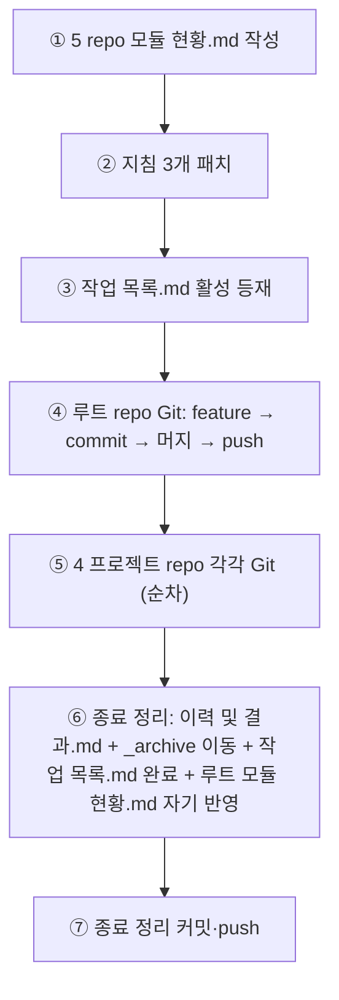

# 계획: Archive 모듈 인덱스 신설

**TL;DR**: ① 5 repo `모듈 현황.md` 작성(초기 채움 분석 데이터 그대로) → ② 지침 3개 패치(`작업 진행 규칙.md §6.1`·`문서 작성 규칙.md §3.4`·`프로젝트 초기 세팅.md §2.3`) → ③ 루트 `작업 목록.md` 활성 등재 → ④ 루트 repo feature·머지·push → ⑤ 4 프로젝트 repo 각각 feature·머지·push → ⑥ 종료 정리(이력 및 결과.md + `_archive` 이동 + `작업 목록.md` 완료 + 루트 `모듈 현황.md` 자기 반영) → ⑦ 종료 정리 커밋·push.

## 1. 전체 시퀀스



### 파일 트리 (최종)

```
E:/Claude/
├── docs/
│   ├── tasks/
│   │   ├── _archive/
│   │   │   └── 모듈 현황.md            (신규, 루트)
│   │   └── 작업 목록.md                    (활성→완료)
│   └── 지침/일반/
│       ├── 작업 진행 규칙.md           (§6.1 패치)
│       ├── 문서 작성 규칙.md           (§3.4 패치)
│       └── 프로젝트 초기 세팅.md       (§2.3 패치)
└── projects/
    ├── Sound1/docs/tasks/_archive/모듈 현황.md             (신규)
    ├── auto-rtt-viewer/docs/tasks/_archive/모듈 현황.md    (신규)
    ├── ez8300-study/docs/tasks/_archive/모듈 현황.md       (신규)
    └── sound1-fw-extractor/docs/tasks/_archive/모듈 현황.md (신규)
```

## 2. 단계별 상세

### Step 3: `모듈 현황.md` 본문 초안 (각 repo)

표준 형식. 본 형식은 향후 archive 처리에서 동일 적용 (지침 §6.1 5번 단계).

#### 3.1 루트

```markdown
---
name: Archive 모듈 인덱스
purpose: 루트 archive 모듈별 최종 업데이트 인덱스 (Wiki sync 진입판단용)
type: tasks/메타
applies_to: [root]
tags: [meta, archive, index, wiki-sync]
---

# Archive 모듈 인덱스 — 루트

**TL;DR**: 루트(`E:\Claude`)의 `_archive/` 하위 모듈별 최종 업데이트 인덱스. Wiki 등 외부 소비자는 본 파일만 읽어 마지막 sync 이후 변경된 모듈만 식별 가능. 갱신은 archive 처리 흐름에서 자동.

## 운영 메모

- 정렬: 최종 업데이트 내림차순 → 작업 수 내림차순 → 모듈명 사전순
- 갱신 트리거: 작업 archive 처리 시
- 추적 범위: archive 신규/갱신. 기존 archive 파일 수정은 추적 안 함

## 모듈 인덱스

| 모듈 | 최종 업데이트 | 최근 작업 | 작업 수 |
|---|---|---|---|
| meta | 2026-05-15 | [wiki-bootstrap](meta/20260427_wiki-bootstrap/) | 8 |
```

#### 3.2 Sound1

```markdown
---
name: Archive 모듈 인덱스
purpose: Sound1 archive 모듈별 최종 업데이트 인덱스 (Wiki sync 진입판단용)
type: tasks/메타
applies_to: [Sound1]
tags: [meta, archive, index, wiki-sync]
---

# Archive 모듈 인덱스 — Sound1

(생략 — 9 모듈 표)
```

#### 3.3 auto-rtt-viewer

(생략 — 2 모듈 표)

#### 3.4 ez8300-study

(생략 — 1 모듈 표)

#### 3.5 sound1-fw-extractor

(생략 — 1 모듈 표)

### Step 4: 지침 패치 본문

#### 4.1 `작업 진행 규칙.md §6.1` 패치

기존 6.1 절차 5단계 → 6단계:

```markdown
### 6.1 절차

1. `이력 및 결과.md` 작성
2. `진행상황.md` 마지막 갱신 (완료 표기) — 또는 `이력 및 결과.md`로 흡수
3. `git mv tasks/<모듈>/<작업>/ tasks/_archive/<모듈>/<작업>/`
4. `tasks/작업 목록.md` 활성 → 완료 섹션 이동
5. **`tasks/_archive/모듈 현황.md` 갱신** — 해당 모듈 행의 `최종 업데이트`·`최근 작업`·`작업 수` 갱신
6. 커밋 → 사용자 승인 → `--no-ff` 병합
```

#### 4.2 `문서 작성 규칙.md §3.4.1` 패치

기존 4단계 → 5단계 (동기):

```markdown
1. 이력 및 결과.md 작성
2. git mv로 이동 (_archive/...)
3. 작업 목록.md 갱신
4. 모듈 현황.md 갱신 (작업 진행 규칙 §6.1)
5. 커밋 → 사용자 승인 → --no-ff 병합
```

#### 4.3 `프로젝트 초기 세팅.md §2.3` 패치

§2.3 표준 폴더 트리에 `_archive/` 주석 한 줄 추가:

```
└── tasks/
    ├── 작업 목록.md
    └── _archive/   (첫 archive 처리 시 자동 생성. `모듈 현황.md`도 그 시점에 생성됨 — 빈 인덱스 미리 만들지 않음)
```

§2.3 본문에 NOTE 한 줄 추가:
```markdown
> [!NOTE]
> `_archive/` 폴더와 `_archive/모듈 현황.md`는 첫 archive 처리 시점에 자동 생성.
```

### Step 5: 루트 `작업 목록.md` 활성 등재

§활성 표 `_(없음)_` 라인 교체:

```markdown
| Archive 모듈 인덱스 신설 | meta | docs, archive, index, wiki-sync, automation | [meta/archive-modules-index](meta/20260515_archive-modules-index/) | 진행 | 2026-05-15 | ← [meta/wiki-bootstrap](meta/20260427_wiki-bootstrap/) (Wiki sync 기반) | 5 repo `_archive/모듈 현황.md` 단일 인덱스 신설 + 지침 3개 패치 |
```

### Step 6: Git 흐름

#### 6.1 루트 repo

```bash
cd E:/Claude
git checkout -b claude_feature_archive-modules-index
git add docs/tasks/_archive/모듈 현황.md \
        docs/지침/일반/작업\ 진행\ 규칙.md \
        docs/지침/일반/문서\ 작성\ 규칙.md \
        docs/지침/일반/프로젝트\ 초기\ 세팅.md \
        docs/tasks/작업 목록.md \
        docs/tasks/meta/20260515_archive-modules-index/
git commit -m "feat(meta): archive 모듈 인덱스 신설 (Wiki sync 기반)"
git checkout claude_develop
git merge --no-ff claude_feature_archive-modules-index
git branch -d claude_feature_archive-modules-index
git push origin claude_develop
```

#### 6.2 각 프로젝트 repo

```bash
cd projects/<프로젝트>
git checkout -b claude_feature_archive-modules-index
git add docs/tasks/_archive/모듈 현황.md
git commit -m "feat(meta): archive 모듈 인덱스 신설 (모듈 현황.md)"
git checkout claude_develop
git merge --no-ff claude_feature_archive-modules-index
git branch -d claude_feature_archive-modules-index
git push origin claude_develop
```

> [!IMPORTANT]
> [`Git/브랜치, 병합 규칙.md`](../../../../지침/Git/브랜치,%20병합%20규칙.md) **작업 스코프 분리** 정책 준수.

#### 6.3 종료 정리 — 자기 반영

본 작업이 새로 정의한 §6.1 5단계의 **첫 사용 사례**가 됨:

1. `이력 및 결과.md` 작성 (작업 폴더에)
2. `git mv docs/tasks/meta/20260515_archive-modules-index/ docs/tasks/_archive/meta/20260515_archive-modules-index/`
3. `docs/tasks/작업 목록.md` 활성 → 완료 이동
4. **루트 `모듈 현황.md`의 `meta` 행 갱신**: 작업 수 8 → 9, 최근 작업 = `archive-modules-index`
5. `claude_develop` 직접 커밋: "chore(meta): archive-modules-index 작업 종료 정리"
6. push

## 3. 검증 절차

### 3.1 단계별

| 검증 | 명령 | 기대 |
|---|---|---|
| 인덱스 생성 | `ls 각 repo/docs/tasks/_archive/모듈 현황.md` | 5개 모두 존재 |
| frontmatter | `Read 각 모듈 현황.md` 상단 | name·purpose·type=`tasks/메타`·applies_to·tags |
| 데이터 정확성 | Sound1 `모듈 현황.md` 표 행 9개 vs `_archive/<모듈>/` 폴더 9개·각 작업 수 | 일치 |
| 정렬 | 표 최종 업데이트 컬럼 | 내림차순, 동률 작업 수 내림차순 |
| 지침 패치 | `Read 작업 진행 규칙.md §6.1` | 6단계 (5번 `모듈 현황.md` 갱신) |
| 자기 반영 | 종료 후 루트 `모듈 현황.md` `meta` 행 | 작업 수 9, 최근 작업 archive-modules-index |
| Git | 5 repo 각각 `git log -1 --oneline origin/claude_develop` | 각 머지 커밋 |
| 산출물 | `ls docs/tasks/_archive/meta/20260515_archive-modules-index/` | 요구사항·분석·계획·진행상황·이력 5개 |

### 3.2 최종

- 수용 기준(요구사항.md §3) 검증_1~검증_9 전 항목 통과

## 4. 위험 관리

| 위험 | 가능성 | 영향 | 완화 |
|---|---|---|---|
| 5 repo git 스코프 위반 | 낮음 | 중 | 각 repo별 별도 브랜치·커밋 |
| 정렬 일관성 결여 | 중 | 낮음 | 3단계 기준 명시 + Claude 일관 적용 |
| 자기 반영 누락 | 낮음 | 중 | §6.3 명시적 단계 |
| 5 repo 동시 처리 시 컨텍스트 오버플로우 | 낮음 | 중 | repo별 순차 처리, 5개 파일 작성은 병렬 |

## 5. 작업 분담 (서브에이전트 활용)

- **메인 agent**: Step 3~6 모든 신설·수정·Git
- **서브에이전트 (`Explore`)**: Plan Mode 단계의 4 프로젝트 archive 현황 조사 (수행됨)
- **병렬 호출**: Step 3의 5 `모듈 현황.md` 작성은 독립 가능

## 6. 진행 추적

- [x] Step 3: 5 repo `모듈 현황.md` 본문 작성
- [x] Step 4: 지침 3개 패치
- [x] Step 5: 루트 작업 목록.md 활성 등재
- [x] Step 6.1: 루트 repo Git 흐름
- [x] Step 6.2: 4 프로젝트 repo Git 흐름
- [x] Step 6.3: 종료 정리·자기 반영

## 7. 관련 산출물

- [요구사항.md](요구사항.md) — 무엇을·왜
- [분석.md](분석.md) — 현 상태·결정
- [이력 및 결과.md](이력%20및%20결과.md) — 시계열·완료
- 첨부: 해당 없음

## 자체 검토

### 8.1 지침 준수

| 지침 | 준수 |
|---|---|
| `작업 진행 규칙.md` 4단계 | 완료 — ③ 본 계획, Plan Mode ExitPlanMode 승인 완료 |
| `Git/브랜치, 병합 규칙.md` 작업 스코프 분리 | 완료 — §2 Step 6.1 루트 + 6.2 각 프로젝트 분리 |
| `Git/브랜치, 병합 규칙.md` `--no-ff` + Identity | 완료 — 명시 |
| `문서 작성 규칙.md` §3.4 archive 절차 | 완료 — §2 Step 4.2 패치 본문 자체가 정합 |

### 8.2 논리적 정합성

| 점검 | 결과 |
|---|---|
| 분석에서 결정한 9건이 모두 계획에 반영 | 완료 — §2 본문(분석_1~5 데이터), §2 Step 4 지침 패치(분석_7), §2 Step 6 Git(분석_9 frontmatter 정책 적용) |
| 검증 항목이 요구사항 §4 검증 9건을 커버 | 완료 — §3 8개 항목 매핑 |
| 자기 반영 흐름이 모순 없는가 | 완료 — 종료 정리에서 5번 단계가 자기 반영 |

### 8.3 미해결 이슈 (단계 ④ 즉시 해소)

| 이슈 | 해소 |
|---|---|
| Wiki repo는 `모듈 현황.md` 대상 아닌데 wiki repo `_archive/` 없음 확인 | wiki repo는 `docs/tasks/` 미사용이라 자명 — 본 작업 범위 외 |
| 작업 종료 정리에서 자기 반영을 별도 커밋으로 분리 | §2 Step 6.3에 명시, claude_develop 직접 커밋 |
