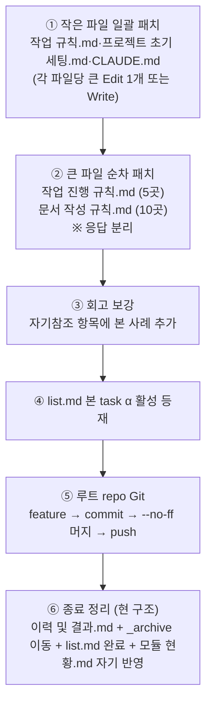

# 계획: docs 구조 근본 재설계 (Task α)

**TL;DR**: ① 25곳 패치 (변화 4종 A·B·C·D × 6 파일) → ② 회고 자기참조 항목에 본 사례 추가 → ③ list.md 단일표로 본 task 등재 → ④ 루트 repo feature·머지·push → ⑤ 종료 정리(현 구조로). 큰 파일(`문서 작성 규칙.md` 10곳·`작업 진행 규칙.md` 5곳)은 응답 분리로 다중 Edit 충돌 회피, 작은 파일은 한 응답에 큰 Edit 또는 Write 통째.

## 1. 적용 순서



## 2. 패치 본문 (변화별)

### 2.1 A. Archive 폐지 — 핵심 패치

#### `작업 진행 규칙.md §6.1` (5단계 → 4단계, archive 이동 제거)

```markdown
### 6.1 절차

1. `이력 및 결과.md` final 요약 섹션 작성 (시계열 로그는 진행 중 누적됨)
2. `tasks/list.md` 해당 행의 `상태` 컬럼을 `완료`로 변경 + `완료일` 기록
3. `tasks/모듈 현황.md` 갱신 — 해당 모듈 행의 `최종 업데이트`(완료일)·`최근 작업`(본 작업 폴더 링크)·`작업 수`(+1) 갱신. 신규 모듈이면 행 추가. 정렬 재조정. 본 인덱스는 Wiki 등 외부 sync 진입판단용
4. 커밋 → 사용자 승인 → `--no-ff` 병합
```

#### `작업 진행 규칙.md §2 mermaid` (archive 노드 제거)

```mermaid
J --> K["이력 및 결과.md 완료 요약 추가"]
K --> L["list.md 상태 변경(완료)<br/>모듈 현황.md 갱신"]
L --> M[종료]
```

#### `문서 작성 규칙.md §3.4.1` (5단계 → 4단계)

```markdown
#### 3.4.1 절차

1. **`이력 및 결과.md` final 요약 섹션 작성** — 시계열 로그는 진행 중 누적됨
2. **`list.md` 갱신** — 단일 표의 해당 행 `상태` 컬럼을 `완료`로 변경 + `완료일` 기록
3. **`모듈 현황.md` 갱신** — 모듈 인덱스에 작업 반영 ([`작업 진행 규칙.md §6.1`](작업%20진행%20규칙.md))
4. **커밋 → 사용자 승인 → `--no-ff` 병합**
```

#### `문서 작성 규칙.md §3.1` 폴더 트리에서 `_archive/` 제거

```
└── tasks/                          작업 스코프
    ├── list.md                     작업 레지스트리 (단일 표, status 컬럼)
    ├── 모듈 현황.md                 모듈 인덱스 (모든 작업 누적)
    └── <모듈>/                      작업 폴더 (활성·완료 무관 영구 위치)
        └── <작업슬러그>/
            ├── 요구사항.md
            ├── 분석.md
            ├── 계획.md
            └── 이력 및 결과.md             (시계열 로그 + 완료 시 요약 추가)
```

#### `문서 작성 규칙.md §3.4.3` (archive 검색 절 폐지)

§3.4.3 "archive 검색 시 유의" 절 전체 삭제 — 활성 작업만 검색하려면 `list.md`의 `상태` 컬럼 필터로 충분.

#### `작업 규칙.md` 마스터 L49

```markdown
- [ ] 작업 종료 시 `이력 및 결과.md` 완료 요약 추가 + `list.md` 상태 변경(완료) + `모듈 현황.md` 갱신
```

#### `프로젝트 초기 세팅.md §2.3` NOTE 갱신

```markdown
> [!NOTE]
> `모듈 현황.md`는 첫 작업 종료 시점에 [`작업 진행 규칙.md §6.1`](작업%20진행%20규칙.md) 3번 단계가 자동 생성. 신규 프로젝트 초기에 미리 만들지 않음.
```

(기존 "_archive/ 폴더와 _archive/모듈 현황.md" 표현 → "모듈 현황.md"로 단순화)

### 2.2 B. 진행상황·이력 통합 — 핵심 패치

#### `작업 진행 규칙.md §2.2` 산출물 표

```markdown
### 2.2 산출물 파일명

| 산출물 | 파일명 | 비고 |
|---|---|---|
| 요구사항 | `요구사항.md` | 의무 |
| 분석 | `분석.md` | 의무 |
| 계획 | `계획.md` | 의무. 코딩 작업의 `구현계획.md`는 alias로 호환 |
| 이력 | `이력 및 결과.md` | 의무. **단계 ① 시작과 동시에 생성** — 시계열 로그(진행 중 누적) + 완료 요약(종료 시 추가) |
```

(기존 `진행상황.md` 행 삭제, 이력 및 결과.md 비고에 "단계 ① 시작과 동시에 생성" 추가)

#### `작업 진행 규칙.md §3` 진행상황 문서 절 폐지

§3 전체 → `이력 및 결과.md`에 흡수. 새 §3 본문:

```markdown
## 3. 이력 문서 (시계열 로그 + 완료 요약)

### 3.1 의무·생성 시점

- 4단계 작업에 **의무**. 단계 ① 작성과 **동시에** 생성한다 (구 진행상황.md 역할 흡수)
- 단순 수정 면제 작업은 자동 면제

### 3.2 갱신 시점

- 단계 진입·종료 (예: 단계 ② → ③ 전이) — `## 단계 진척` 표 갱신
- 결정 사항 추가·이슈·차단 발생·해소 — `## 시계열 로그` 표에 한 줄
- 완료 시 — `## 완료 요약` 섹션 추가 (기간·병합 SHA·무엇을·왜·후속)

### 3.3 형식 (최소 골격)

\`\`\`markdown
---
name: 이력 — <작업명>
purpose: <작업 1줄 요약>
type: tasks/이력
applies_to: [...]
tags: [..., 상태:진행|완료]
---

# 이력: <작업명>

**TL;DR**: 현재 단계 + 다음 동작 한 줄. (완료 후: 최종 결과 한 줄로 교체)

## 단계 진척

| 단계 | 산출물 | 상태 | 일시 |
|---|---|---|---|

## 시계열 로그

| 시각 | 이벤트 |
|---|---|

## 완료 요약 (종료 시 추가)

**기간:** ... ~ ...
**병합:** `<대상>` ← `<feature>` (`<SHA>`)

### 무엇을 했는가
### 핵심 결정
### 후속 영향
\`\`\`
```

#### `문서 작성 규칙.md §3.3` (진행상황 의무 제거)

```markdown
- 필수 파일: `요구사항.md`, `분석.md`, `계획.md`, `이력 및 결과.md` (단계 ① 시작과 동시에 생성, 시계열 로그 + 완료 요약 통합 — [`작업 진행 규칙.md §3`](작업%20진행%20규칙.md))
```

(기존 `진행상황.md` 행 삭제)

#### `문서 작성 규칙.md §3.1` 트리 (위 §2.1에서 이미 반영 — 이력 및 결과.md 통합)

#### `작업 규칙.md` 마스터 L47

```markdown
- [ ] `이력 및 결과.md`를 단계 ① 시작과 동시에 생성하고 단계 전이·결정·이슈마다 시계열 로그 갱신, 완료 시 요약 추가
```

### 2.3 C. list.md 단일표 — 핵심 패치

#### `문서 작성 규칙.md §4` list.md 형식

```markdown
### 4.2 파일 구조

\`\`\`markdown
# 작업 목록 (tasks index)

## 작업 목록

| 작업명 | 모듈 | 태그 | 상태 | 시작·완료 | 폴더 | 요약 |
|---|---|---|---|---|---|---|

## 상태 정의

| 상태 | 의미 |
|---|---|
| `진행` | 작업 진행 중 |
| `대기` | 선행 조건 충족 대기 |
| `차단` | 외부 요인으로 진행 불가 |
| `완료` | 병합·릴리즈 완료 |
| `취소` | 작업 취소 |

## 갱신 이력

| 날짜 | 이벤트 |
|---|---|
\`\`\`

§활성·§완료 분리 폐지. 활성만 보려면 `상태` 컬럼 grep/필터.
```

#### `문서 작성 규칙.md §4.4` 갱신 이벤트 표

```markdown
| 이벤트 | 동작 |
|---|---|
| 작업 시작 (폴더 생성 시) | `list.md` 작업 목록에 행 추가 (상태=`진행`) |
| `이력 및 결과.md` 갱신 | 해당 행의 `상태`·`요약` 업데이트 |
| 사용자 `작업 끝났어. 마무리해` 시그널 | (1) `이력 및 결과.md` 완료 요약 추가 → (2) `list.md` 행의 `상태`를 `완료`로 변경·`완료일` 기록 → (3) `모듈 현황.md` 모듈 행 갱신 ([`작업 진행 규칙.md §6.1`](작업%20진행%20규칙.md)) |
```

#### `작업 진행 규칙.md §6.1` (위 2.1에서 이미 반영)

### 2.4 D. 영속 콘텐츠 Wiki 통합 — 핵심 패치

#### `프로젝트 초기 세팅.md §2.3` 표준 폴더 트리

```
<프로젝트명>/
├── CLAUDE.md           단계 ②에서 생성
├── src/                빈 폴더 — `.gitkeep` 추가
├── tests/              빈 폴더 — `.gitkeep` 추가
└── docs/
    ├── 지침/           빈 폴더 — `.gitkeep` (프로젝트 특화 지침 시)
    └── tasks/
        └── list.md     §4 표준 본문
```

> [!NOTE]
> `사용방법/`·`참고/` 폴더는 표준에서 **제외**. 도구·CLI 매뉴얼·외부 스펙·도메인 지식은 Wiki Vault(`projects/wiki/사용방법/`·`projects/wiki/참고/`)에 직접 작성. 기존 프로젝트의 `사용방법/`·`참고/`는 Task γ에서 Wiki로 이전 + 폐지 (전환기).

#### `프로젝트 초기 세팅.md §2.3` mermaid·§2.4 본문

표준 폴더 풀 세트에서 `사용방법/`·`참고/` 제거 (해당 라인 삭제 또는 NOTE로 대체).

#### `프로젝트 초기 세팅.md §3` CLAUDE.md 템플릿 §Layout

```
<프로젝트명>/
├── CLAUDE.md       이 파일 (프로젝트 진입점)
├── src/            구현 소스 (초기: 빈 폴더)
├── tests/          단위·통합 테스트 (초기: 빈 폴더)
└── docs/           SW 문서 — 루트 컨벤션 적용 (지침/·tasks/<모듈>/<작업>/)
```

(기존 `사용방법/`·`참고/` 언급 제거)

#### `문서 작성 규칙.md §3.1` 폴더 트리

```
docs/
├── 지침/                           영속 — 작업 규칙·컨벤션·검증 체크리스트
└── tasks/                          작업 스코프
    ├── list.md
    ├── 모듈 현황.md
    └── <모듈>/<작업슬러그>/
```

(기존 `사용방법/`·`참고/` 항목 삭제 또는 "Wiki Vault로 이전 — 전환기" 표기)

#### `문서 작성 규칙.md §3.2` 영속 문서 절

"`사용방법/`·`참고/`는 본 컨벤션에서 폐지됨 — Wiki Vault로 이전 (Task γ)"로 단순화.

#### `작업 규칙.md` L63

기존 "필요 시 `시험방법/`, `사용방법/` 폴더에 영속 문서 추가 작성"에서 "필요 시 `시험방법/` 폴더에 영속 문서. 사용방법·참고는 Wiki Vault로"

#### `CLAUDE.md` (루트) Layout

L19의 docs 폴더 layout 메모를 "(지침/, tasks/, 회고/)"로 축약 (사용방법 제거). 또는 NOTE로 "사용방법·참고는 Wiki Vault로 이전 (Task γ)" 안내.

## 3. 구현 시퀀스 — 다중 Edit 충돌 회피

### 3.1 같은 파일 다중 Edit 회피 전략

회고 "같은 파일 다중 Edit은 순차 호출" 적용:
- **`문서 작성 규칙.md` (10곳)** — 동일 응답 다중 Edit 위험 ↑. **Read → 한 번의 큰 Edit (블록 통째 교체)** 또는 **응답 분리 (한 응답에 단일 파일당 1 Edit)**
- **`작업 진행 규칙.md` (5곳)** — 동일. §2 mermaid + §2.2 산출물 + §3 진행상황절 + §6.1 절차. 각 섹션 독립 Edit (서로 겹침 없음)
- 작은 파일 (`작업 규칙.md` 3곳·`프로젝트 초기 세팅.md` 4곳·`CLAUDE.md` 1곳·`회고/작업 진행.md` 2곳) — 한 응답에 여러 Edit 가능 (각 위치 독립)

### 3.2 실제 진행 순서

| 응답 | 처리 |
|---|---|
| 응답 1 | 작은 파일 4개 일괄 Edit (`작업 규칙.md` + `프로젝트 초기 세팅.md` + `CLAUDE.md` + `회고/작업 진행.md` — 각 파일당 Edit 묶음) |
| 응답 2 | `작업 진행 규칙.md` 5곳 일괄 Edit (섹션 독립이라 가능) |
| 응답 3 | `문서 작성 규칙.md` 10곳 — 더 작은 단위로 분할 또는 큰 블록 교체 |
| 응답 4 | `list.md` 단일표 변환 + 본 task 활성 등재 + Git |
| 응답 5 | 종료 정리 (현 구조) + Git |

## 4. 회고 보강 본문

[`docs/회고/작업 진행.md`](../../../회고/작업%20진행.md)의 "정책 신설 자기 참조" 항목의 *마지막 `How to apply` 글머리* 다음에 한 항목 추가:

```markdown
- **자기 적용 면제 사례** (2026-05-15 Task α `docs-structure-redesign`): 정책 신설 시점과 정책 발효 시점이 *시간 순서상* 어긋나는 경우 (예: 본 task가 정책을 정의하지만 적용은 후속 Task β에서 일괄 변환되는 흐름)는 자기 적용 면제. 면제 사유를 분석.md에 명시 + 후속 task에 자기 적용 의무 명시 (Task β 요구사항 §)
```

## 5. list.md 본 task α 활성 등재

§활성 표 `_(없음)_` 라인을 본 task 행으로 교체 (단일표 변환은 Task β에서, 본 task α는 현 활성/완료 분리 표 그대로 사용):

```markdown
| docs 구조 근본 재설계 | meta | docs, policy-redesign, archive, wiki-integration, simplification | [meta/docs-structure-redesign](meta/20260515_docs-structure-redesign/) | 진행 | 2026-05-15 | ← [meta/archive-modules-index](meta/20260515_archive-modules-index/) (사용자 본질 재검토) | 4가지 변화(A 어카이브 폐지·B 진행상황/이력 통합·C list 단일표·D 영속 콘텐츠 Wiki 통합) 정책 + 지침 5개 갱신 (25곳). Task β·γ 후속 |
```

## 6. Git 흐름 — 루트 repo

```bash
cd E:/Claude
git checkout -b claude_feature_docs-structure-redesign
git add docs/지침/*.md docs/지침/일반/*.md CLAUDE.md "docs/회고/작업 진행.md" docs/tasks/list.md docs/tasks/meta/20260515_docs-structure-redesign/
git status -s   # 변경 확인
git commit -m "feat(meta): docs 구조 근본 재설계 — archive 폐지·진행상황/이력 통합·list 단일표·영속 콘텐츠 Wiki 통합 (Task α 정책)"
git checkout claude_develop
git merge --no-ff claude_feature_docs-structure-redesign -m "Merge branch 'claude_feature_docs-structure-redesign' into claude_develop"
git branch -d claude_feature_docs-structure-redesign
git push origin claude_develop
```

## 7. 종료 정리 (현 구조)

본 Task α는 현 정책(archive 이동 + 진행상황 별도 파일)으로 종료. Task β에서 일괄 변환:

1. `이력 및 결과.md` 작성 (작업 폴더에) — 현 형식 (기간·병합·요약)
2. `진행상황.md` 마지막 갱신 (완료 표기)
3. `git mv docs/tasks/meta/20260515_docs-structure-redesign/ docs/tasks/_archive/meta/20260515_docs-structure-redesign/`
4. `docs/tasks/list.md` 활성 → 완료 이동 + 갱신 이력 한 줄
5. 루트 `모듈 현황.md` `meta` 행 자기 반영 (작업 수 9 → 10, 최근 작업 `docs-structure-redesign`, 최종 업데이트 2026-05-15)
6. `claude_develop` 직접 종료 정리 커밋
7. push

## 8. 후속 Task β·γ 진입 조건

| Task | 진입 조건 | 범위 |
|---|---|---|
| Task β | Task α 머지 완료 후 별도 작업으로 시작. 신규 작업 폴더 `meta/tasks-structure-migration` 또는 동등 | 5 repo 25 작업 `_archive/` → 활성 폴더 복귀 + 진행상황·이력 통합 + list.md 단일표 재작성 + `모듈 현황.md` 위치 이전 |
| Task γ | Task α 머지 완료 후 별도 작업. 신규 폴더 `meta/permanent-docs-to-wiki` 또는 동등 | 5 repo `사용방법/`·`참고/` → Wiki Vault 이전 + 폐지 + 위키링크 재배선 |

본 task α 종료 보고 시 두 후속 작업 안내 (`이력 및 결과.md` §후속 영향에 명시).

## 9. 자체 검토 (단계 ③)

### 9.1 지침 준수

| 지침 | 준수 |
|---|---|
| `작업 진행 규칙.md` 4단계 | ✅ 본 계획 — ExitPlanMode 승인 완료 |
| `Git/브랜치, 병합 규칙.md` | ✅ feature → claude_develop --no-ff + Identity (김은수) |
| `문서 작성 규칙.md` §3.4 archive 절차 | ✅ 본 계획에서 패치 본문 자체가 새 정책 정합 |
| 회고 "같은 파일 다중 Edit은 순차 호출" | ✅ §3.2에 명시 — 큰 파일은 응답 분리 |
| 회고 "정책 신설 자기 참조 + 다중 위치 grep 점검" | ✅ 자기 적용 면제 사유 분석.md§3에 명시, grep 25곳 Phase 1 Explore 결과 활용 |

### 9.2 논리적 정합성

| 점검 | 결과 |
|---|---|
| 분석 9건이 계획에 모두 반영 | ✅ §2 본문(분석_2·_3 패치 위치·방향), §3 충돌 회피(분석_2 큰 파일 처리), §4 회고 보강(분석_6), §7 종료 정리(분석_4 자기 적용 면제) |
| 검증 항목(요구사항 §4 검증_1~_6)이 본 계획에서 커버 | ✅ §2 정책 명문화(검증_1)·§3 일관 점검(검증_2)·§8 후속 분기(검증_3)·§7 현 구조 종료(검증_5·_6)·신규 작업 시작 가능(검증_4 — 25곳 패치 후 새 정책 명확) |
| 본 task 진입 시점부터 정책 발효 — Task β까지 전환기 충돌 없는가 | ✅ 본 task 패치 직후 신규 작업은 새 정책으로 진행, 기존 25 작업은 현 구조 유지(Task β에서 일괄). 충돌 없음 |

### 9.3 미해결 이슈 (단계 ④ 구현에서 즉시 해소)

| 이슈 | 해소 |
|---|---|
| 25곳 정확한 old_string·new_string 매칭 | 구현 시 각 Edit에 정확한 텍스트 사용. `문서 작성 규칙.md` 등 큰 파일은 Read로 현재 상태 확인 후 Edit |
| 응답 분리 횟수 | 큰 파일 2개 분리 + 작은 파일들 일괄 = 최소 3 응답 |
