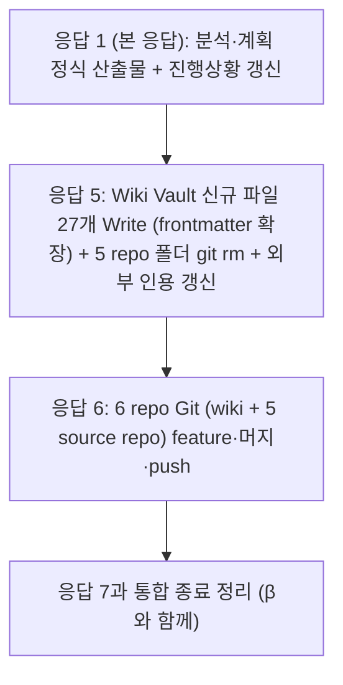

# 계획: 영속 콘텐츠 Wiki Vault 통합 (Task γ)

**TL;DR**: ① Wiki Vault `사용방법/` 폴더 신규 + `참고/<도메인>/` 신규 폴더들 + 27 콘텐츠 파일 Write (frontmatter `source_repo`·`source_path` 확장) → ② 각 repo `사용방법/`·`참고/` 폴더 `git rm` → ③ 외부 인용 5곳(루트 CLAUDE.md 2, ez8300-study CLAUDE.md 3) 갱신 → ④ 6 repo Git (wiki + 5 source) → ⑤ 종료 정리. 응답 2~3개로 분할.

## 1. 구현 시퀀스



## 2. Wiki Vault 새 파일 작성 (27 콘텐츠)

### 2.1 `사용방법/` 폴더 (8 파일 + MOC)

| 파일 | 원본 | source_repo |
|---|---|---|
| `Claude Code 단축키 (Windows Terminal · PowerShell).md` | 루트 `docs/사용방법/` | root |
| `Slack 작업 완료 알림.md` | 루트 `docs/사용방법/` | root |
| `UI 명령어 사용법.md` | Sound1 `docs/사용방법/` | Sound1 |
| `디버깅 가이드.md` | auto-rtt-viewer `docs/사용방법/` | auto-rtt-viewer |
| `사용법.md` | auto-rtt-viewer `docs/사용방법/` | auto-rtt-viewer |
| `시험 절차.md` | auto-rtt-viewer `docs/사용방법/` | auto-rtt-viewer |
| `Sound1 fw.txt 출력 명세.md` | sound1-fw-extractor `docs/사용방법/` | sound1-fw-extractor |
| `fw.txt 형식.md` | sound1-fw-extractor `docs/사용방법/` | sound1-fw-extractor |

추가: `MOC.md` (사용방법 카테고리 인덱스)

### 2.2 `참고/<도메인>/` 폴더 (19 파일)

| 도메인 폴더 | 파일 (콘텐츠) | source_repo |
|---|---|---|
| `LED/` (Sound1→) | Dimming · 인지 곡선 · LUT · [Sound1] Ezairo LED 패턴 사양 Rev.0 · 색감 관리 · 회로 보정 · 아키텍처 · 운용 (4) | Sound1 |
| `칩/` (Sound1→) | Ezairo 8300 클럭·타이머·I2C 스펙 · IQS323 터치센서 레지스터 레퍼런스 (2) | Sound1 |
| `터치/` (Sound1→) | 터치센서 운용 방식 (1) | Sound1 |
| `CFX/` (ez8300-study→) | README + [CFX-01]~[CFX-10] (11) | ez8300-study |
| `RTT/` (auto-rtt-viewer→) | J-Link RTT 연결 메커니즘 (1) | auto-rtt-viewer |

### 2.3 frontmatter 확장 표준

각 이전 파일에 다음 frontmatter 추가:

```yaml
---
# 기존 frontmatter 유지
name: <기존>
purpose: <기존>
type: <기존: 참고 또는 사용방법>
applies_to: [<기존>]
tags: [<기존>]

# Task γ에서 추가:
source_repo: <원본 repo>
source_path: <원본 경로 from repo root>
migrated_at: 2026-05-15
migrated_task: meta/permanent-docs-to-wiki
---
```

본문은 원본 그대로 유지. frontmatter만 확장.

## 3. 각 repo 폴더 폐지

### 3.1 절차

각 repo:
```bash
cd <repo>
git checkout -b claude_feature_permanent-docs-to-wiki

# 사용방법·참고 폴더 통째 제거
[ -d docs/사용방법 ] && git rm -r docs/사용방법
[ -d docs/참고 ] && git rm -r docs/참고

# 외부 인용 갱신 (해당 시)
# 루트: CLAUDE.md L41-42
# ez8300-study: CLAUDE.md 3곳

git commit -m "feat(meta): Task γ — 영속 콘텐츠 Wiki Vault 이전 + 사용방법·참고 폴더 폐지"
git checkout claude_develop
git merge --no-ff claude_feature_permanent-docs-to-wiki -m "..."
git branch -d claude_feature_permanent-docs-to-wiki
git push origin claude_develop
```

5 repo 모두 동일 패턴.

## 4. 외부 인용 갱신

### 4.1 루트 CLAUDE.md L41-42

```markdown
# 변경 전
- Slack Webhook: `credentials/slack/webhook.url` — 작업 완료 알림 전송용 ([사용방법](docs/사용방법/Slack%20작업%20완료%20알림.md))
...
- `slack-notify.ps1` — Stop 훅에서 호출되어 Slack DM으로 작업 완료 알림 전송. 상세: [사용방법 문서](docs/사용방법/Slack%20작업%20완료%20알림.md)

# 변경 후
- Slack Webhook: `credentials/slack/webhook.url` — 작업 완료 알림 전송용 ([사용방법](projects/wiki/사용방법/Slack%20작업%20완료%20알림.md))
...
- `slack-notify.ps1` — ... 상세: [사용방법 문서](projects/wiki/사용방법/Slack%20작업%20완료%20알림.md)
```

### 4.2 ez8300-study CLAUDE.md 3곳

세 곳의 `docs/참고/CFX/` 인용을 Wiki Vault 경로로 갱신. 상세 텍스트는 응답 5에서 Read 후 정확 매칭.

## 5. Git 흐름 — 6 repo

### 5.1 wiki repo

```bash
cd projects/wiki
git checkout -b claude_feature_permanent-docs-to-wiki
# 27 콘텐츠 + MOC + 신규 폴더들 Write 결과 staging
git add -A
git commit -m "feat(content): Task γ — 5 source repo로부터 사용방법·참고 27 파일 이전 (frontmatter 출처 표시)"
git checkout claude_develop
git merge --no-ff ... -m "..."
git branch -d claude_feature_permanent-docs-to-wiki
git push origin claude_develop
```

### 5.2 5 source repo

각 repo (위 §3.1).

5 source repo 순차 처리(한 응답에 묶을 수 있음).

## 6. 종료 정리 (Task β와 통합)

응답 7에서 β·γ 동시:
1. 본 Task γ `진행상황.md` → `이력 및 결과.md` 시계열 흡수 + `git rm`
2. 본 task 폴더 위치 영구 (archive 안 함)
3. 루트 `작업 목록.md` 단일표(Task β 변환 후)에 본 task 행 추가 + `상태 완료`
4. 루트 `모듈 현황.md` `meta` 모듈 작업 수 +1·작업 상세 표 추가
5. `claude_develop` 직접 종료 정리 커밋 + push (β와 묶음)

## 7. 검증

| 검증 | 명령 | 기대 |
|---|---|---|
| γ-1 Wiki 신규 파일 | `ls projects/wiki/사용방법/` `ls projects/wiki/참고/<도메인>/` | 8 + 19 = 27 콘텐츠 + MOC들 |
| γ-2 source_repo frontmatter | `grep -r "source_repo:" projects/wiki/사용방법/ projects/wiki/참고/<도메인>/` | 27 모두 frontmatter에 |
| γ-3 각 repo 폴더 폐지 | `ls 5 repo/docs/사용방법/ 2>&1\|grep "No such"` 각 repo | 폴더 미존재 |
| γ-4 외부 인용 갱신 | `grep "docs/사용방법\|docs/참고" 루트/CLAUDE.md ez8300-study/CLAUDE.md` | 결과 0 |
| γ-5 Git push | `git log -1 origin/claude_develop` 6 repo | 각 머지 commit |

## 8. 자체 검토 (단계 ③)

### 8.1 지침 준수

| 지침 | 준수 |
|---|---|
| Task α 정책 D | ✅ 본 task 마이그레이션 |
| Git scope 분리 | ✅ 6 repo 각각 feature·머지·push |
| Wiki bootstrap 호환 | ✅ |

### 8.2 논리적 정합성

| 점검 | 결과 |
|---|---|
| Task β 영역 충돌 없음 | ✅ |
| 도메인 분류 + 출처 frontmatter | ✅ |
| 본 task 자기 적용 | ✅ §6 종료 정리 |

### 8.3 미해결 이슈 (단계 ④ 즉시 해소)

| 이슈 | 해소 |
|---|---|
| 각 파일 정확한 본문(원본 Read) | 응답 5 구현 시 Read·Write |
| 외부 인용 정확한 텍스트 매칭 | 응답 5 구현 시 |
| Sound1 LED 4 파일 정확한 파일명 | 응답 5 구현 시 (원본 폴더 ls 후) |
