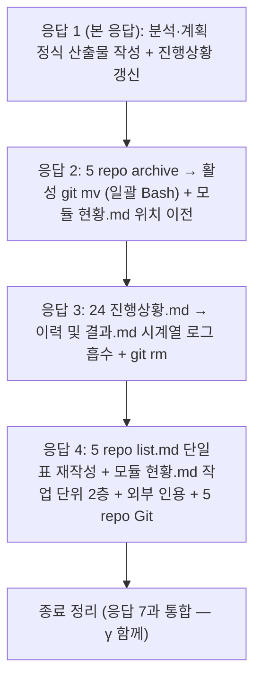

# 계획: tasks 구조 마이그레이션 (Task β)

**TL;DR**: 5 repo 각각 동일 패턴 — ① archive 폴더들 활성 위치로 `git mv` ② `_archive/모듈 현황.md` → `tasks/모듈 현황.md` ③ 24 진행상황.md → 이력 및 결과.md 시계열 로그 흡수 + 진행상황 `git rm` ④ list.md 단일표 재작성 + 모듈 현황.md 작업 단위 2층 확장 ⑤ 외부 archive 인용 2곳 갱신 ⑥ feature·머지·push. 응답 5개로 분할 진행.

## 1. 구현 시퀀스



## 2. repo별 git mv 일괄 처리

### 2.1 Bash 스크립트 (5 repo 적용)

각 repo:

```bash
cd <repo>
git checkout -b claude_feature_tasks-structure-migration

# 1. archive 작업 폴더들을 활성 위치로 일괄 이동
# Note: $dir는 _archive/meta/20260427_wiki-bootstrap/ 같은 형태
for dir in docs/tasks/_archive/*/*/; do
  [ -d "$dir" ] || continue
  # 대상 경로: _archive/ 부분 제거
  dest="${dir/_archive\//}"
  git mv "$dir" "$dest"
done

# 2. _archive/모듈 현황.md → tasks/모듈 현황.md
[ -f docs/tasks/_archive/모듈 현황.md ] && git mv docs/tasks/_archive/모듈 현황.md docs/tasks/모듈 현황.md

# 3. 빈 _archive/ 폴더 자동 정리 (git이 빈 폴더 추적 안 함)

git status -s | head
```

5 repo 동일 처리. 한 Bash 명령에 묶어 일괄.

## 3. 진행상황 흡수 절차

### 3.1 각 진행상황.md → 이력 및 결과.md 시계열 로그 섹션 흡수

각 작업 폴더(24 곳):

```bash
cd <repo>
# 각 작업 폴더에서:
# - 진행상황.md 본문 읽기
# - 이력 및 결과.md에 ## 단계 진척 + ## 시계열 로그 섹션 append (기존 본문 위에)
# - 진행상황.md 삭제

# 자동화 어려우면 Edit 도구로 작업 폴더별 처리
```

### 3.2 흡수 후 이력 및 결과.md 구조

```markdown
---
name: 이력 — <작업명>
purpose: <기존 purpose>
type: tasks/이력
applies_to: [...]
tags: [<기존>, 상태:완료]
---

# 이력: <작업명>

**TL;DR**: <기존 1줄 요약>

## 단계 진척
(구 진행상황.md의 단계 표 — 모두 완료 상태)

## 시계열 로그
(구 진행상황.md의 결정·이슈·다음 동작 누적)

## 완료 요약
(기존 이력 및 결과.md 본문 — 기간·병합·무엇을·왜·후속)
```

### 3.3 진행상황 없는 9 작업 — 흡수 없이 이력 및 결과.md만 유지

- 루트: `wiki-bootstrap` (이미 통합되어 있을 수도)
- Sound1: 8 작업 (Task α 이전 archive 작업 일부)

해당 작업은 시계열 로그·단계 진척 섹션 추가 없이 이력 및 결과.md 그대로. frontmatter `tags`에 `상태:완료` 만 추가.

## 4. list.md 단일표 재작성

### 4.1 새 형식

```markdown
# 작업 목록 (<repo> tasks index)

## 작업 목록

| 작업명 | 모듈 | 태그 | 상태 | 시작·완료 | 폴더 | 연계 | 요약 |
|---|---|---|---|---|---|---|---|
| ... | ... | ... | 완료 | 2026-04-24 ~ 2026-04-24 | [meta/docs-restructure](meta/20260424_docs-restructure/) | ... | ... |
| ... | ... | ... | 진행 | 2026-05-15 | [meta/tasks-structure-migration](meta/20260515_tasks-structure-migration/) | ← Task α | ... |

## 상태 정의

(기존 그대로)

## 갱신 이력

(기존 그대로 — 본 task 행 추가)
```

기존 행 모두 단일 표로 합치고 폴더 링크에서 `_archive/` 제거.

### 4.2 5 repo list.md 행 수

| repo | 행 수 |
|---|---|
| 루트 | 10 (Task α 포함, 본 Task β 진행 1 추가) |
| Sound1 | 20 |
| auto-rtt-viewer | 3 (활성 1 + 완료 2) |
| ez8300-study | 1 |
| sound1-fw-extractor | 1 |

## 5. 모듈 현황.md 작업 단위 2층 확장

### 5.1 새 형식

```markdown
---
name: Archive 모듈 인덱스 → 작업 모듈 인덱스
purpose: <repo> archive 폴더 폐지 후 모듈별 최종 업데이트 + 작업 누적 인덱스 (Wiki sync용)
type: tasks/메타
applies_to: [<repo>]
tags: [meta, archive, index, wiki-sync]
---

# 모듈 인덱스 — <repo>

**TL;DR**: <repo>의 `tasks/` 하위 모듈별 최종 업데이트 + 작업 누적 인덱스. Wiki 등 외부 소비자는 본 파일만 읽어 마지막 sync 이후 변경된 모듈·작업 식별.

## 모듈 요약

| 모듈 | 최종 업데이트 | 최근 작업 | 작업 수 |
|---|---|---|---|
| <모듈> | YYYY-MM-DD | [<모듈>/<작업명>](<모듈>/<작업명>/) | N |

## 작업 상세 (Task α 이후 신규)

### <모듈>

| 작업 | 완료일 | 폴더 |
|---|---|---|
| <작업명> | YYYY-MM-DD | [<모듈>/<작업명>](<모듈>/<작업명>/) |
```

### 5.2 5 repo 작업 단위 데이터

루트(10), Sound1(20), auto-rtt-viewer(2), ez8300-study(1), sound1-fw-extractor(1) 모두 채워야 함. 각 repo의 archive 작업 list (분석 §1 데이터 활용).

## 6. 외부 archive 인용 갱신

### 6.1 Sound1 산출물 2곳

- `_archive/signalProcessing/nofm-tuning/요구사항.md:15` → 활성 위치 복귀 후 상대 경로 변경
- `_archive/signalProcessing/nofm-tuning/분석.md:119` → 동일

복귀된 위치: `signalProcessing/nofm-tuning/`. 형제 모듈 인용:
- 같은 모듈 형제: `[nofm-merge](../nofm-merge/)`
- 다른 모듈: `[../ui/program-change-command](../ui/program-change-command/)`

### 6.2 auto-rtt-viewer 사용방법 archive 인용

`docs/사용방법/디버깅 가이드.md:16`의 archive 인용은 Task γ에서 Wiki 이전 시 자동 갱신.

## 7. Git 흐름 — 5 repo

각 repo:

```bash
cd <repo>
git checkout -b claude_feature_tasks-structure-migration
# 위 §2 git mv, §3 진행상황 흡수, §4 list.md, §5 모듈 현황.md, §6 외부 인용
git add -A
git commit -m "feat(meta): Task β — tasks 구조 마이그레이션 (archive 폐지·진행상황→이력 통합·list 단일표·_modules 작업 단위)"
git checkout claude_develop
git merge --no-ff claude_feature_tasks-structure-migration -m "..."
git branch -d claude_feature_tasks-structure-migration
git push origin claude_develop
```

5 repo 순차 처리(한 응답에 묶어 큰 Bash 명령).

## 8. 종료 정리 (새 구조 첫 적용)

본 Task β 종료 — Task γ와 동시에 처리 (응답 7):

1. 본 task `진행상황.md`를 `이력 및 결과.md`의 `## 시계열 로그` 섹션에 흡수 + `git rm 진행상황.md`
2. 본 task `이력 및 결과.md`에 `## 완료 요약` 섹션 추가 (기간·병합·무엇을·왜·후속)
3. 루트 `list.md` (Task β 변환 후 단일표)에서 본 task 행 `상태` 컬럼을 `완료`로 변경 + `완료일` 기록
4. 루트 `모듈 현황.md`의 `meta` 모듈 작업 수 갱신 + 작업 상세 표에 본 task 추가
5. `claude_develop` 직접 종료 정리 커밋 + push

**archive 안 함** — `git mv` 없음. 폴더 위치 영구.

## 9. 검증

| 검증 | 명령 | 기대 |
|---|---|---|
| β-1 archive 폐지 | `ls 5 repo/docs/tasks/_archive/` | 폴더 미존재 |
| β-2 작업 활성 위치 | `ls 5 repo/docs/tasks/<모듈>/<작업>/` | 33 작업 모두 존재 |
| β-3 진행상황 흡수 | `find 5 repo/docs/tasks -name "진행상황.md"` | 결과 0 (모두 삭제) |
| β-4 list.md 단일표 | `Read 5 repo/docs/tasks/list.md` | 단일 표, status 컬럼 |
| β-5 모듈 현황.md 위치 | `ls 5 repo/docs/tasks/모듈 현황.md` | 모두 존재 |
| β-6 외부 인용 | `grep "_archive/" 5 repo/docs/` | 정책 설명용 잔존만 (Task α 갱신 부분) |
| β-7 Git push | `git log -1 origin/claude_develop` | 5 repo 각각 머지 commit |

## 10. 자체 검토 (단계 ③)

### 10.1 지침 준수

| 지침 | 준수 |
|---|---|
| Task α 갱신본 신 구조 | ✅ 본 task가 신 구조 첫 사용 사례 |
| Git scope 분리 | ✅ 5 repo 각각 feature·머지·push |
| `모듈 현황.md` 작업 단위 2층 (직전 합의 옵션 A) | ✅ §5에서 적용 |

### 10.2 논리적 정합성

| 점검 | 결과 |
|---|---|
| Task α의 정책이 본 task에 정확 반영 | ✅ A·B·C 모두 본 task 구현. D는 Task γ |
| 본 task 자기 적용 — 새 구조 첫 사용 사례 | ✅ 종료 시점 처리 §8에 명시 |
| Task γ 영역 충돌 없음 | ✅ |

### 10.3 미해결 이슈 (단계 ④ 즉시 해소)

| 이슈 | 해소 |
|---|---|
| 각 작업 진행상황.md 본문 정확한 흡수 형식 | 응답 3에서 각 파일 처리 |
| 5 repo list.md 정확한 본문 (각 작업 행) | 응답 4에서 정확 변환 |
| 모듈 현황.md 작업 단위 2층 본문 (5 repo 데이터) | 응답 4에서 정확 작성 |
