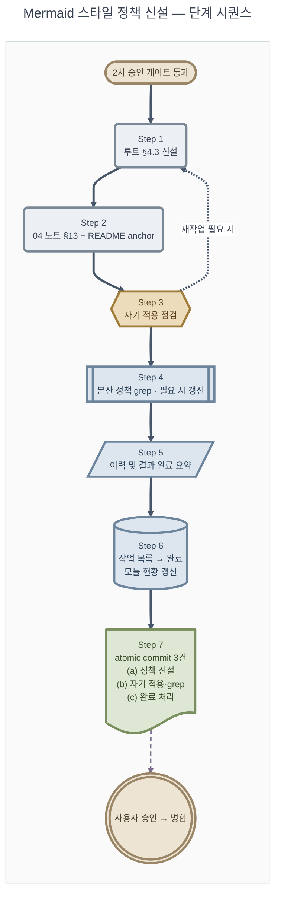

# 계획: Mermaid 스타일 정책 신설

**TL;DR**: 7 Step + 사용자 승인 게이트 + 병합. (Step 1) 루트 작성-스타일.md §4.3 정책 신설 → (Step 2) mermaid-study 04 노트 §13 + README anchor → (Step 3) 자기 적용 점검 (본 task 산출물) → (Step 4) 분산 정책 grep·갱신 → (Step 5) 이력 및 결과 완료 요약 → (Step 6) 작업 목록·모듈 현황 갱신 → (Step 7) atomic commit 3건. 본 계획.md에 정책 풀스타일 mermaid 1개 포함 (자기 적용 2번째 사례).

## 1. 전체 시퀀스

## 2. 단계별 상세

### Step 1: 루트 작성-스타일.md §4.3 정책 신설

**작업**:
- [`작성-스타일.md`](../../../../지침/일반/문서/작성-스타일.md) §4 끝에 §4.3 "표준 스타일 정책 (flowchart)" 신설
- 정책 8요소 한 줄 명세 표
- 풀스타일 예시 mermaid 1개 (시안 Rev.3 다이어그램과 동등한 정책 형태)
- 옵시디언 다크 한계 NOTE
- v11 `doc` 노드 fallback NOTE
- 적용 범위 명시 (`flowchart` 한정, 비-flowchart는 향후 확장)

**영향 파일**: 1개 — [`docs/지침/일반/문서/작성-스타일.md`](../../../../지침/일반/문서/작성-스타일.md)
**검증**:
- §4.3 안의 mermaid 코드 블록을 GitHub.com·VSCode GitHub Markdown Preview에서 렌더 확인 (사용자 직접)
- frontmatter+TL;DR 변경 없음 (기존 유지)
- 정책 8요소 모두 명세에 포함됐는지 §4.3 안의 표로 셀프 체크

**commit 메시지**: `docs(지침): 마크다운 스타일 §4.3 Mermaid 표준 정책 신설 (8요소)`

### Step 2: mermaid-study 04 노트 §13 + README anchor

**작업**:
- [`04-스타일과 테마.md`](../../../../projects/mermaid-study/docs/노트/04-스타일과%20테마.md) §13 "프로젝트 표준 정책 스타일" 신설
- 정책 8요소 한 줄 명세 표 (루트 §4.3과 동일)
- 정책 표준 풀 예시 mermaid 1개 (시안 Rev.3 동등)
- "정책 본문은 루트 [§4.3](../../../../docs/지침/일반/문서/작성-스타일.md) 참조" 명시 → 단일 진실 원본 유지
- [`README.md`](../../../../projects/mermaid-study/docs/노트/README.md) §13 anchor 추가
- (선택) [`01-Mermaid 개요.md`](../../../../projects/mermaid-study/docs/노트/01-Mermaid%20개요.md) 끝에 "본 프로젝트는 §13 정책 사용" 한 줄 (검토 후 결정)

**영향 파일**: 2~3개 — 04 노트, README, (01 개요 검토)
**검증**:
- 04 노트 §1~§12 (옵션 카탈로그) 보존 확인
- §13 mermaid 블록 GitHub.com 렌더 확인
- README anchor 살아있음 (broken link 0)

**commit 메시지**: `docs(mermaid-study): 04 노트 §13 표준 정책 스타일 + README anchor 등재`

### Step 3: 자기 적용 점검 ([4단계-프로세스 §5.10](../../../../지침/일반/작업/4단계-프로세스.md))

**작업**:
- 본 task 산출물(요구사항·분석·계획·이력 및 결과) 모두 점검
- 사용된 mermaid 다이어그램이 신 정책 풀스타일 적용 여부 확인:
  - 분석.md 부록 — 정책 적용 시연 다이어그램 (8요소 검증 표 포함)
  - 본 계획.md §1 — 단계 시퀀스 다이어그램
- 누락 발견 시 즉시 보강
- 시안 파일 Rev.3 = 정책 형태 일치 (이미 검증 완료)

**영향 파일**: 0 (기 적용 확인만) 또는 보강 시 본 분석·계획 추가 변경
**검증**:
- 두 다이어그램이 정책 8요소 모두 적용 (표로 확인 가능)
- v11 `doc` 노드 사용 시 fallback NOTE 정책 참조 일치

**commit 메시지**: (Step 4와 묶음, 별도 commit 없음)

### Step 4: 분산 정책 위치 grep · 필요 시 갱신

**작업**:
- `Grep` 도구로 mermaid 정책 관련 표현 전수 점검:
  - 루트 [`CLAUDE.md`](../../../../CLAUDE.md) §6 "Mermaid (ASCII 다이어그램 금지)" — 변경 불요 가능성 큼
  - [`projects/mermaid-study/CLAUDE.md`](../../../../projects/mermaid-study/CLAUDE.md) 활용처
  - [`projects/mermaid-study/docs/노트/01-Mermaid 개요.md`](../../../../projects/mermaid-study/docs/노트/01-Mermaid%20개요.md)
  - 기타 mermaid 언급 .md 파일
- 정책 본 신설 위임 한 줄 anchor가 필요한 위치에 추가

**영향 파일**: 0~3개 (grep 결과에 따라)
**검증**:
- grep 결과 표로 정리 후 갱신 여부 명시
- 누락 위치 없음 (전수 확인)

**commit 메시지**: `docs: mermaid 정책 자기 적용 점검 + 분산 정책 위치 anchor 보강` (Step 3·4 묶음)

### Step 5: 이력 및 결과.md 완료 요약

**작업**:
- [`이력 및 결과.md`](이력%20및%20결과.md) 시계열 로그에 Step 1~4 누적
- 단계 진척 표 ②③④ 모두 `완료` 변경
- "## 완료 요약" 섹션 추가 (양식 §양식 본문):
  - 기간, 모듈/태그, 브랜치, 병합 SHA (병합 후 기입)
  - 무엇을 했는가 / 핵심 결정 / 후속 영향
- TL;DR을 "단계 ① 진행 중" → "최종 결과 1줄"로 교체

**영향 파일**: 1개
**검증**:
- 시계열 로그 누적 8건 이상 (시안 라운드 3 + Plan + 단계 ①②③ + Step 1~7)
- 완료 요약 4개 항목 모두 채움

### Step 6: 작업 목록.md → 완료 + 모듈 현황.md 갱신

**작업**:
- [`작업 목록.md`](../../작업%20목록.md) 본 task 행 `상태: 진행 → 완료`, 시작·완료 = `2026-05-19 ~ 2026-05-19`
- 갱신 이력 행 추가 (완료)
- [`모듈 현황.md`](../../모듈%20현황.md) `meta` 행 갱신 — 작업 수 +1, 최근 작업 갱신 ([`완료처리.md`](../../../../지침/일반/작업/완료처리.md))

**영향 파일**: 2개
**검증**:
- 작업 목록.md `상태: 완료`
- 모듈 현황.md 카운트 일치

### Step 7: atomic commit + 사용자 승인 → 병합

**작업**:
- atomic commit 3건 분할:
  - (a) Step 1·2 — 정책 신설 (작성-스타일.md §4.3 + 04 노트 §13 + README anchor)
  - (b) Step 3·4 — 자기 적용 점검 + 분산 정책 grep·갱신
  - (c) Step 5·6 — 완료 처리 (이력 및 결과 완료 요약 + 작업 목록·모듈 현황 갱신)
- 사용자 검토 → `claude_main` 또는 `claude_develop` `--no-ff` 병합 (사용자 결정 (B))

**영향 파일**: git 메타만
**검증**:
- 각 commit이 atomic — 단계별 revert 가능
- `git log --oneline` 3건 표시
- 사용자 명시 승인 후 병합

**commit 메시지** (atomic 3건):
- `docs(지침·mermaid-study): Mermaid 표준 정책 §4.3 + 04 노트 §13 신설 (8요소)`
- `docs(meta): mermaid 정책 자기 적용 + 분산 위치 점검 (4단계 §5.10 첫 사용)`
- `docs(meta): 20260519_mermaid-스타일-정책-신설 완료 처리`

## 3. 검증 절차

### 3.1 단계별
- 각 commit 직전 `git status` + `git diff --stat`
- 영향 파일이 계획 범위 내인지 (오버런 방지). Step 1: 1파일 · Step 2: 2~3파일 · Step 3·4: 0~3파일 · Step 5·6: 3파일
- mermaid 코드 변경 후 GitHub.com·VSCode GitHub Markdown Preview에서 시각 렌더 확인 (사용자 직접)

### 3.2 최종
- 수용 기준 ([요구사항.md §3](요구사항.md)) 5건 전 항목 통과 확인
- `Grep` broken link 검사: `grep -r "20260519_mermaid"` 잔존 확인
- 시안 파일 [`mermaid-study/tests/스타일정책-시안_부트로더-기동순서.md`](../../../../projects/mermaid-study/tests/스타일정책-시안_부트로더-기동순서.md) 위치·내용 보존 확인 (사용자 결정 (C) 따라 이전 옵션)
- 자기 적용 검토 — 본 task 산출물의 mermaid 다이어그램 2개 모두 정책 8요소 적용 확인

## 4. 위험 관리

| 위험 | 가능성 | 영향 | 완화 |
|---|---|---|---|
| v11 `doc` 노드 미지원 환경 렌더 실패 | 낮음 | 중 | 정책 본문 NOTE에 "v11+ 필요, 미만은 `[/.../]` 평행사변형 fallback" 명시 |
| 옵시디언 다크 배경 사용자 불만 | 낮음 | 낮음 | 정책 NOTE 명시 + 사용자 결정 (A)에서 CSS snippet 가이드 옵션 (mermaid 외부) |
| 분산 정책 위치 갱신 누락 | 중 | 중 | Step 4 grep 전수 점검 + 표로 정리 |
| 정책 명세가 04 노트와 분기 (향후 갱신 시) | 낮음 | 중 | 04 노트 §13 첫줄에 "정책 본문은 루트 §4.3 참조" 명시. 향후 정책 갱신 시 양쪽 동시 검토 의무 |
| Step 1·2 commit이 너무 크면 revert 단위가 거침 | 낮음 | 낮음 | Step 1·2를 (a) commit으로 묶되, diff stat에서 영향 파일 3~4개 이내면 OK |
| 사각형 노드 0개 정책 위반 다이어그램 미발견 | 낮음 | 낮음 | Step 3 자기 적용 점검 시 `\[[^/\(\[]` grep으로 사각형 노드 잔존 확인 (검증 보조) |

## 5. 작업 분담 (서브에이전트 활용)

[`서브에이전트 활용.md`](../../../../지침/일반/서브에이전트%20활용.md) 활용 검토 — 본 task는 변경 파일 명확하고 범위 한정적이라 서브에이전트 활용 빈도 낮음:

- **메인 agent**: Step 1·2·3·5·6·7 (지침·노트 작성·완료 처리·commit)
- **서브에이전트 — Plan Mode Phase 1**: 이미 단계 ③ 진입 전 [`Explore`](../../../../지침/일반/서브에이전트%20활용.md) 1개 발사 (양식·이전 정책 신설 패턴)
- **Step 4 분산 정책 grep**: 메인 agent `Grep` 도구 직접 (범위 4개 후보, 광범위 탐색 아님 → 서브에이전트 불요)
- **병렬 호출**: Step 5·6 (이력 및 결과 + 작업 목록 + 모듈 현황) 한 응답 묶기

> [!TIP]
> 시각 검증은 GitHub.com·VSCode mermaid 렌더 확인이 필요해서 사용자 직접 수행 영역. 서브에이전트로는 검증 불가.

## 6. 진행 추적

각 Step 완료 시 본 계획에 `완료` 표기 + [`이력 및 결과.md`](이력%20및%20결과.md) 시계열 로그 동시 기록:

- [ ] Step 1: 루트 §4.3 신설
- [ ] Step 2: mermaid-study 04 노트 §13 + README anchor
- [ ] Step 3: 자기 적용 점검
- [ ] Step 4: 분산 정책 grep + 갱신 (필요 시)
- [ ] Step 5: 이력 및 결과 완료 요약
- [ ] Step 6: 작업 목록 → 완료 + 모듈 현황 갱신
- [ ] Step 7: atomic commit 3건 + 사용자 승인 → 병합

## 7. 관련 산출물

- [요구사항.md](요구사항.md) — 사용자 요청·8요소
- [분석.md](분석.md) — 영향 범위·결정·자기 적용 시연 mermaid 1개
- [이력 및 결과.md](이력%20및%20결과.md) — 시계열 누적·완료 요약
- 첨부: 해당 없음

## 사용자 결정 대기 항목 (2차 게이트 시 결정)

| 옵션 | 항목 | 후보 |
|---|---|---|
| (A) | 옵시디언 CSS snippet 가이드 wiki 신설 | (a) `projects/wiki/사용방법/Mermaid 옵시디언 다크 배경 흰색 강제.md` 신설 + 정책 NOTE에서 링크 / (b) 시안 파일에 가이드만 남기고 wiki 신설 보류 / (c) 가이드 미작성 |
| (B) | Git 병합 대상 | (a) `claude_main` 직병합 / (b) `claude_develop` 거쳐서 |
| (C) | 시안 파일 위치 | (a) `mermaid-study/tests/`에 그대로 보존 / (b) `mermaid-study/docs/노트/예시/`로 이전 |

## 자체 검토

### 지침 준수 여부
| 지침 | 준수 |
|---|---|
| [`작업 진행 규칙.md`](../../../../지침/일반/작업%20진행%20규칙.md) | 준수 |
| [`서브에이전트 활용.md`](../../../../지침/일반/서브에이전트%20활용.md) | §5에서 활용 빈도 낮음 사유 명시. Plan Mode Phase 1에서 1개 활용 |
| [`Git/브랜치, 병합 규칙.md`](../../../../지침/Git/브랜치,%20병합%20규칙.md) | Step 7에 atomic commit 분할·--no-ff 명시. 병합 대상은 사용자 결정 (B) |
| [`4단계-프로세스.md §5.10`](../../../../지침/일반/작업/4단계-프로세스.md) 자기 참조 | Step 3에 자기 적용 점검 의무 + 분석.md·본 계획.md에 정책 풀스타일 mermaid 2개 포함 |

### 논리적 정합성
| 점검 | 결과 |
|---|---|
| 분석.md 결정이 계획에 반영 | 결정_1~5 모두 Step 1~4에 매핑 |
| 단계 시퀀스 의존성 명확 | Step 1 → 2 → (3+4) → 5 → 6 → 7 순차, Step 3에서 1·2 재작업 가능 점선 |
| 위험·완화 식별 | 6건 위험·완화 표 |
| 서브에이전트 분담 명시 | §5에서 활용 빈도·이유 명시 |

### 미해결 이슈
| 이슈 | 처리 |
|---|---|
| 옵시디언 CSS snippet 가이드 신설 여부 | 사용자 결정 (A) — 2차 게이트 |
| Git 병합 대상 | 사용자 결정 (B) — 완료 시그널 시 |
| 시안 파일 최종 위치 | 사용자 결정 (C) — 완료 처리 시 |
| 01-Mermaid 개요.md 정책 anchor 추가 여부 | Step 2 중 결정 (없어도 무방, 있으면 더 친절) |
