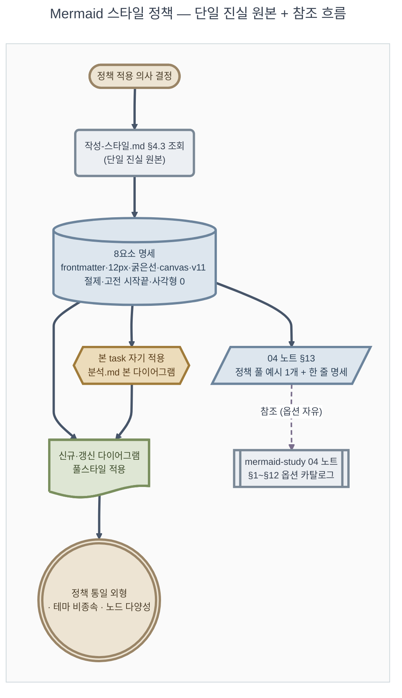

# 분석: Mermaid 스타일 정책 신설

**TL;DR**: 정책 단일 진실 원본은 루트 [`작성-스타일.md §4.3`](../../../지침/일반/문서/작성-스타일.md), mermaid-study 04 노트는 옵션 카탈로그(§1~§12) 위에 §13 정책 표준 예시 추가. 시안 Rev.3 다이어그램 = 최종 정책 풀스타일 (3라운드 검증). v11 `doc` 노드는 fallback NOTE 필요, 옵시디언 다크는 mermaid 측 한계 명시. 자기 적용 — 본 분석.md에 정책 풀스타일 mermaid 1개 포함(첫 사용 사례).

## 1. 현 상태 (Current State)

### 1.1 루트 지침의 Mermaid 명세 (현황)

[`docs/지침/일반/문서/작성-스타일.md §4`](../../../지침/일반/문서/작성-스타일.md)는 다음 구조:

- §4.1 자주 쓰는 Mermaid 유형 표 (`flowchart`·`sequenceDiagram`·`gitGraph` 등 8종)
- §4.2 기본 예시 3개 (flowchart·sequenceDiagram·gitGraph)
- 정책 명세는 **없음** — TIP 한 줄("방향·스타일 클래스 활용")만

→ **정책 §4.3 추가 위치 확보**. 기존 §4.1·§4.2 보존.

### 1.2 mermaid-study 04 노트 현황

[`projects/mermaid-study/docs/노트/04-스타일과 테마.md`](../../../../projects/mermaid-study/docs/노트/04-스타일과%20테마.md):

- §1~§12: 스타일 옵션 일반 카탈로그 — 4계층·색·선·곡선·테마·`themeVariables`·`themeCSS`·다이어그램 타입별 차이·함정·참고
- §6.2 `themeVariables` 커스터마이즈 + §9 종합 예제는 신 정책과 **80% 일치하는 풀스타일** 예시 (단 색은 vivid pastel · 폰트 14px · 사각형 다수)
- 정책 표준 적용 섹션은 **없음**

→ **§13 신설 위치 확보**. §1~§12는 옵션 카탈로그로 유지 (정책에 안 묶인 자유 사용 시 참조).

### 1.3 시안 Rev.3 검증 상태

[`projects/mermaid-study/tests/스타일정책-시안_부트로더-기동순서.md`](../../../../projects/mermaid-study/tests/스타일정책-시안_부트로더-기동순서.md):

- 3라운드 시안 (Rev.1 → Rev.2 → Rev.3) 거쳐 정책 8요소 합의 완료
- 다이어그램 = Sound1 첨부_분석 Rev.1 §2.1 (sequenceDiagram) → flowchart 재구성. 11 노드·8 외형·5 클래스·muted 톤
- 은수님 답변 `A` = 채택 (2026-05-19)
- 사용자가 옵시디언에서 다크 배경 여전 보고 + "GFM 호환 깨지면 곤란, 안 되면 그대로 둬도 OK" → mermaid 측 한계 명시로 정리

### 1.4 분산 정책 위치 후보 (점검 대상)

| 후보 위치 | 현재 표현 | 갱신 필요? |
|---|---|---|
| 루트 [`CLAUDE.md`](../../../../CLAUDE.md) §6 (문서 메타) | "마크다운 스타일: GFM + GitHub Alert(`[!NOTE]` 등) + Mermaid (ASCII 다이어그램 금지)" | 정책 본 신설 위임 → 변경 불요 가능성 큼. grep 후 확정 |
| [`projects/mermaid-study/CLAUDE.md`](../../../../projects/mermaid-study/CLAUDE.md) | 노트 라우팅 표 + 활용처 | 04 노트 §13 신설 시 추가 anchor 등재 검토 |
| [`projects/mermaid-study/docs/노트/README.md`](../../../../projects/mermaid-study/docs/노트/README.md) | 04 노트 §6.2·§9 가리킴 | §13 anchor 추가 필요 |
| [`projects/mermaid-study/docs/노트/01-Mermaid 개요.md`](../../../../projects/mermaid-study/docs/노트/01-Mermaid%20개요.md) | Mermaid 일반 소개 | 정책 anchor "본 프로젝트는 §13 정책 사용" 한 줄 추가 검토 |

→ **단계 ④에서 grep 전수 확인 후 갱신**.

> [!TIP]
> §1·§2 광범위 점검은 [`Explore` 서브에이전트](../../../지침/일반/서브에이전트%20활용.md) 위임 가능. 본 분석은 알려진 4개 후보에 한정.

## 2. 영향 범위

| 영역 | 영향 | 비고 |
|---|---|---|
| 루트 [`작성-스타일.md §4`](../../../지침/일반/문서/작성-스타일.md) | 변경 — §4.3 신설 | 정책 단일 진실 원본 |
| [`mermaid-study/docs/노트/04-스타일과 테마.md`](../../../../projects/mermaid-study/docs/노트/04-스타일과%20테마.md) | 변경 — §13 신설 | 옵션 카탈로그 + 정책 표준 예시 1개 |
| [`mermaid-study/docs/노트/README.md`](../../../../projects/mermaid-study/docs/노트/README.md) | 변경 — anchor 등재 | §13 가리킴 |
| [`mermaid-study/docs/노트/01-Mermaid 개요.md`](../../../../projects/mermaid-study/docs/노트/01-Mermaid%20개요.md) | 참조 (변경 가능성 낮음) | 정책 anchor 한 줄 추가 검토 |
| 본 task 산출물 4종 (요구사항·분석·계획·이력 및 결과) | 자기 적용 — mermaid 사용 시 신 정책 풀스타일 | 본 분석.md §3에 1개 포함 |
| [`docs/tasks/작업 목록.md`](../../작업%20목록.md) | 변경 — 신규 행 등재 + 갱신 이력 (단계 ① 완료) | |
| [`docs/tasks/모듈 현황.md`](../../모듈%20현황.md) | 변경 — `meta` 행 갱신 | 작업 수 +1, 최근 작업 갱신 |
| 시안 파일 [`mermaid-study/tests/스타일정책-시안_부트로더-기동순서.md`](../../../../projects/mermaid-study/tests/스타일정책-시안_부트로더-기동순서.md) | 변경 없음 (보존) — 정책 채택 검증 증거 | 단 사용자 결정 (C) 시 위치 이전 가능 |
| 루트 [`CLAUDE.md`](../../../../CLAUDE.md) | 참조만 (변경 불요 가능성 큼) | grep 후 확정 |
| [`projects/mermaid-study/CLAUDE.md`](../../../../projects/mermaid-study/CLAUDE.md) | 참조 (변경 가능성 낮음) | grep 후 확정 |

## 3. 가설·선택지

### 3.1 가설 (root cause·디버깅)

해당 없음 — 본 작업은 디버깅·root cause 작업이 아닌 정책 신설.

### 3.2 선택지 (정책 위치·범위 결정)

| 선택지 | 장점 | 단점 | 채택 |
|---|---|---|---|
| (가) 정책 풀 명세를 루트 §4.3에 두고 04 노트 §13은 한 줄 명세+예시 1개 | 단일 진실 원본 명확, 04 노트는 카탈로그 역할 유지 | 04 노트에서 정책 확인 시 루트로 jump 필요 | **채택** |
| (나) 정책 풀 명세를 04 노트에 두고 루트 §4.3은 anchor만 | mermaid-study가 1차 레퍼런스라는 본 프로젝트 위상 살림 | 루트 지침이 자기 완결성 잃음, 다른 프로젝트에서 mermaid-study 의존 | 미채택 |
| (다) 양쪽에 풀 명세 중복 | 어디서든 self-contained | 향후 정책 변경 시 동기화 부담, 분기 위험 | 미채택 |

| 선택지 | 장점 | 단점 | 채택 |
|---|---|---|---|
| (라) 정책에 v11 `doc` 노드 권장 | 정책 의도(노드 다양성·실행 산출 의미) 명확 | v10 이하 mermaid 환경에서 렌더 실패 가능 | **채택 + fallback NOTE** |
| (마) 정책에 전통 노드만 사용 | 모든 mermaid 버전 호환 | 노드 외형 다양성 떨어짐, 사용자 의도 "v11 신 문법까지 활용" 미충족 | 미채택 |

## 4. 핵심 결정

- 결정_1: **정책 단일 진실 원본 = 루트 [`작성-스타일.md §4.3`](../../../지침/일반/문서/작성-스타일.md)**. mermaid-study 04 노트 §13은 정책 한 줄 명세 표 + 풀 예시 1개 (정책 본문은 루트에 jump). 선택지 (가) 채택 — 단일 진실 원본 명확성 우선
- 결정_2: **v11 `doc` 노드 권장 + fallback NOTE** — "v11 미만 환경에서는 `[/.../]` 평행사변형으로 대체 가능" 명시. 선택지 (라) 채택
- 결정_3: **옵시디언 다크 한계는 정책 본문 NOTE 한 줄 명시**. 옵시디언 CSS snippet 가이드는 wiki 분리 (사용자 결정 (A))
- 결정_4: **자기 적용 — 본 분석.md에 정책 풀스타일 mermaid 1개 포함**. 본 task가 정책 신설 첫 사용 사례 ([4단계-프로세스 §5.10](../../../지침/일반/작업/4단계-프로세스.md))
- 결정_5: **시안 파일 Rev.3 보존** — 정책 채택 검증 증거. 최종 위치는 사용자 결정 (C)

## 5. 위험·제약

| 위험 | 가능성 | 영향 | 완화 |
|---|---|---|---|
| v11 신 노드(`doc`)가 일부 mermaid 버전·환경에서 렌더 실패 | 낮음 (GitHub·VSCode·mermaid.live는 모두 v11 지원) | 중 | 정책 NOTE에 "v11+ 필요, 미만은 `[/.../]` 평행사변형 fallback" 명시 |
| 옵시디언 다크 배경 미해결 사용자 불만 | 낮음 (시각만 문제, 렌더 정상) | 낮음 | 정책 NOTE 명시 + 사용자 결정 (A)에서 CSS snippet wiki 가이드 옵션 |
| 분산 정책 위치 갱신 누락 | 중 | 중 | 단계 ④에서 grep 전수 점검 (CLAUDE.md·노트·README) |
| 정책 명세가 04 노트와 분기되어 시간 흐름에 따라 불일치 | 낮음 | 중 | 04 노트 §13에서 "정책 본문은 루트 §4.3 참조" 명시 + 향후 정책 갱신 시 양쪽 동시 검토 (분산 정책 grep 절차 의무화) |

## 6. 관련 산출물

- [요구사항.md](요구사항.md) — 사용자 요청·8요소·수용 기준
- [계획.md](계획.md) — 실행 단계 (작성 예정)
- [이력 및 결과.md](이력%20및%20결과.md) — 시계열 로그
- 첨부: 해당 없음

## 자체 검토

### 지침 준수 여부
| 지침 | 준수 |
|---|---|
| [`작업 진행 규칙.md`](../../../지침/일반/작업%20진행%20규칙.md) | 준수 |
| [`서브에이전트 활용.md`](../../../지침/일반/서브에이전트%20활용.md) | 단계 ②는 plan 단계에서 Explore 1개 발사함 (양식·이전 정책 신설 패턴). 본 분석은 알려진 4개 후보 검토로 한정 |
| [`4단계-프로세스.md §5.10`](../../../지침/일반/작업/4단계-프로세스.md) 자기 참조 | 결정_4에서 자기 적용 의무 명시 |

### 논리적 정합성
| 점검 | 결과 |
|---|---|
| 요구사항.md 항목 모두 분석에 반영 | 5 수용기준 모두 §2 영향 범위 매핑 |
| 가설·선택지 비교 충분 | §3.2에 2개 선택지 비교 (정책 위치·노드 호환성) |
| 핵심 결정의 근거 명시 | 결정_1~5 각각 선택지·NOTE 근거 |

### 미해결 이슈
| 이슈 | 처리 |
|---|---|
| 옵시디언 CSS snippet wiki 신설 여부 | 사용자 결정 (A) — 2차 게이트에서 결정 |
| Git 병합 대상 | 사용자 결정 (B) — 완료 시그널 시 결정 |
| 시안 파일 최종 위치 | 사용자 결정 (C) — 완료 처리 시 결정 |

---

## 부록: 자기 적용 시연 (정책 풀스타일 mermaid)

본 task가 신설 정책의 첫 사용 사례이므로 정책 풀스타일 mermaid 1개 포함. 본 다이어그램은 신설 정책 8요소 모두 적용. 정책 단일 진실 원본(`루트 작성-스타일.md §4.3`)과 mermaid-study 04 노트 §13의 관계를 시각화.

**적용된 정책 8요소 검증**:

| # | 요소 | 본 다이어그램 적용 |
|---|---|---|
| 1 | YAML frontmatter `config` | `title`·`theme:base`·`themeVariables`·`flowchart` 블록 |
| 2 | 폰트 12px | `fontSize: "12px"` |
| 3 | 굵은 선 기본 | `classDef ... stroke-width:3px` 5종 + `linkStyle default stroke-width:3px` + `==>` |
| 4 | 점선 한정 사용 | `ExLink -. "참조 (옵션 자유)" .-> Cat` 1곳 (옵션 카탈로그는 보조 참조) |
| 5 | `canvas` 서브그래프 배경 고정 | `subgraph canvas [" "]` + `darkMode:false` + `themeVariables.background` + `style canvas fill:#fafafa` |
| 6 | v11 `doc` 절제 사용 | `Apply@{ shape: doc }` 1개 (실행 산출 의미) |
| 7 | 시작·끝 고전 외형 | Start = `stadium` ([...]), Done = `double-circle` ((( ))) |
| 8 | 사각형 0개 + 외형 다양성 | stadium·rounded·cylinder·subroutine·평행사변형·hexagon·doc·double-circle 8종 |
