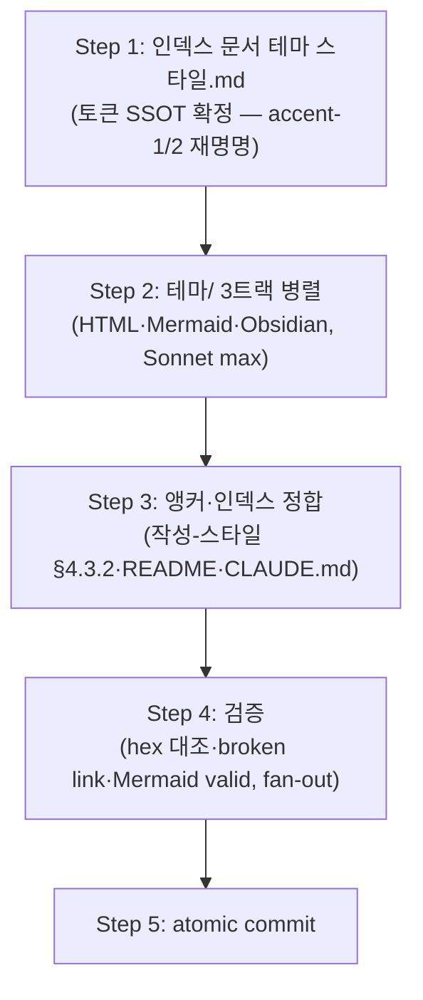

# 계획: 문서 테마 스타일 지침

**TL;DR**: 인덱스 `문서 테마 스타일.md`(개요+토큰 SSOT+GitHub 렌더+유지보수) + `테마/{HTML-아티팩트, Mermaid, Obsidian}.md` 3파일 신설. 토큰은 인덱스가 먼저 확정(액센트 역할 재명명 accent-1/2, 자체완결 hex)되어야 3트랙이 참조하므로 **인덱스 먼저 → 3트랙 병렬**. 이후 작성-스타일 §4.3.2 앵커·README·CLAUDE.md 정합. 저술은 Sonnet max 위임, 토큰 확정·검증·커밋은 오케스트레이터.

## 1. 전체 시퀀스

## 2. 단계별 상세

### Step 1: 인덱스 `docs/지침/일반/문서 테마 스타일.md` (Sonnet max 위임)

토큰 SSOT라 3트랙보다 먼저 확정. 서브에이전트가 `분석.md` §1·§4 + 에이전트-로그 01·02를 읽고 저술. 구성:
1. frontmatter(maturity: experimental) + TL;DR
2. **§1 개요·철학** — 웜 페이퍼(크림 배경·다크 브라운·따뜻한 뉴트럴) 라이트 테마, 도메인 무관 재사용
3. **§2 색 토큰 (SSOT)** — 25색 인라인 hex 표. 액센트는 **역할 기반 재명명**: `--accent-1`(테라코타 `#C15F3C`, 주 강조)·`--accent-2`(틸 `#3E6E64`, 보조) + tint 3단, 원본(cis/nofm) 매핑 주석 열. 범주·역할·사용상태(활성/브릿지/미사용). hex는 백틱 인라인 코드(GitHub 스와치)
4. **§3 타이포·간격·컴포넌트 토큰** — font 스택·size 9단·weight 4단·radius 4단·border 의미(solid=구조/dashed=주석)
5. **§4 적용 트랙** — 3개 하위 파일 링크 + 각 트랙 1줄 요약 + "어떤 매체에 무엇" 표
6. **§5 GitHub 렌더 현실** (결정_6) — 4항목(.md는 CSS 불가·백틱 hex 스와치 예외·Mermaid 네이티브 렌더·HTML/CSS는 소스로만·오인 방지)
7. **§6 라이트 전용 정책** (결정_5) — 트랙별 표(Mermaid 고정/Artifact 단일톤 명시/정적 HTML/Obsidian 전환)
8. **§7 유지보수·드리프트** (결정_7) — 문서 SSOT(코드 SSOT 아님), 팔레트 변경 시 SSOT 먼저 → grep 3곳 동기화 절차
9. **§8 출처·관련** — 원본 HTML 각주 링크(gitignored 주의) + 작성-스타일 §4.3.2·README

**검증**: hex 25종 원본 일치, 백틱 hex, frontmatter+TL;DR
**commit**: (Step 5 일괄)

### Step 2: `테마/` 3트랙 병렬 (Workflow parallel, Sonnet max×3)

Step 1 인덱스 확정 후, 3파일이 인덱스 토큰명(accent-1/2)을 참조해 병렬 저술. 각 서브에이전트는 인덱스 + 해당 에이전트-로그 노드를 읽음.

- **노드 A `테마/HTML-아티팩트.md`** (로그 01·02 기반): 복붙 `:root{}` CSS 변수 블록(accent-1/2 재명명 반영) + 컴포넌트 CSS(카드·컨트롤·stats·badge·note·tooltip). Artifact 도구 사용 시 "의도적 단일톤 committing" 명시(결정_5). 정적 HTML vs Artifact 구분
- **노드 B `테마/Mermaid.md`** (로그 03 기반): themeVariables init 블록 + classDef 세트(stroke=잉크·액센트, 대비 안전 — 결정_4) + flowchart 예시. **선택 기준 기계화**: frontmatter `theme: warm-paper`일 때만 적용(§7.2 if-then). 작성-스타일 §4.3.1(무충돌)·§4.3.2(대체 팔레트)·§4.5(보완) 관계 명시. 노드 라벨 특수문자 큰따옴표(§4.5)
- **노드 C `테마/Obsidian.md`** (로그 04 기반): `.theme-light` CSS 스니펫(표준+콜아웃+Things 보강 3계층, accent-1/2 반영) + 활성화 안내(**베이스 스킴 라이트 전환 선행**·snippets 배치·wiki-site.css 혼재 주의)

**검증**: 각 파일 인덱스 토큰명 정합, Mermaid valid, 코드 복붙 가능
**commit**: (Step 5 일괄)

### Step 3: 앵커·인덱스 정합 (Workflow parallel, Sonnet max×3)

- **노드 D** `작성-스타일.md §4.3.2`: 짧은 앵커 섹션 삽입 — nofm 대체 팔레트 classDef 표 + 선택 기준 요약 + `테마/Mermaid.md` 링크. **§4.3.1 8요소 전문 복제 금지**. 추가로 기존 §4.3.2 팔레트 WCAG 미달 결함 주석 1줄 + 후속 작업 권고(결정_8)
- **노드 E** `README.md`: 신규 인덱스 + 하위 3파일 행 등재(↳ 서브 패턴, experimental)
- **노드 F** 루트 `CLAUDE.md` 지침 표: 신규 인덱스 행(↳ 하위 anchor)

**검증**: broken link 0
**commit**: (Step 5 일괄)

### Step 4: 검증 (Workflow fan-out, Explore/판정)

- 검증자 1: hex 대조(신규 4파일의 색값이 원본 25종과 일치), 백틱 hex 컨벤션
- 검증자 2: broken link(4신규+3정합 파일 상호·외부 링크), Mermaid 예시 렌더 valid
- 검증자 3(adversarial): 액센트 역할이 3트랙에서 SSOT와 일치(재명명 정합), 라이트 전용 명시 일관, §4.3.1 전문 복제 없음

**검증 루프**: 실패 시 Step 1~3 재진입(최대 3회)

### Step 5: atomic commit (오케스트레이터 직접)

diff 전수 검토 후 커밋 — 신규 4파일 / 정합 3파일 논리 분리 또는 단일 정책 커밋.

## 3. 검증 절차
### 3.1 단계별
- 각 서브에이전트 후 `git diff --stat`, 인덱스 토큰명이 3트랙에 정확히 전파됐는지
### 3.2 최종
- 수용 기준(요구사항 §3) 전 항목, hex 대조, Mermaid valid, broken link 0

## 4. 위험 관리
| 위험 | 완화 |
|---|---|
| accent 재명명이 3트랙에 불일치 전파 | Step 1 인덱스 확정 후 Step 2, 검증자 3 정합 확인 |
| Mermaid stroke 대비 미반영 | 노드 B에 "잉크·액센트 stroke" 명시, 검증 |
| 원본 링크 깨짐 | 토큰 자체완결(각주만) |

## 5. 작업 분담 (서브에이전트 활용)
- **오케스트레이터 직접**: 요구·분석·계획, 토큰 SSOT 최종 확정 판단, Step 4 fan-in, Step 5 커밋
- **Workflow Sonnet max**: Step 1 인덱스 저술 → Step 2 3트랙 병렬 → Step 3 정합 3 병렬 → Step 4 검증 fan-out
- 의존: Step 1(SSOT) → Step 2·3(참조). Step 2·3은 서로 독립이나 안전하게 Step 2 후 Step 3

## 6. 진행 추적
- [ ] Step 1: 인덱스(토큰 SSOT)
- [ ] Step 2: 테마/ 3트랙
- [ ] Step 3: 앵커·인덱스 정합
- [ ] Step 4: 검증
- [ ] Step 5: 커밋

## 7. 관련 산출물
- [요구사항.md](요구사항.md) · [분석.md](분석.md) · [이력 및 결과.md](이력%20및%20결과.md)

## 자체 검토
### 지침 준수 여부
| 지침 | 준수 |
|---|---|
| [`작업 진행 규칙.md`](../../../../지침/일반/작업%20진행%20규칙.md) | ✅ |
| [`문서 작성 규칙.md`](../../../../지침/일반/문서%20작성%20규칙.md) | ✅ 인덱스+하위 3레벨 |
| [`Git/브랜치, 병합 규칙.md`](../../../../지침/Git/브랜치,%20병합%20규칙.md) | ✅ `claude_feature_doc-theme-style` |

### 논리적 정합성
| 점검 | 결과 |
|---|---|
| 분석 결정 8건 반영 | ✅ |
| 사용자 결정 2건 반영 | ✅ WCAG 별도·라이트 전용 |
| 의존 순서 명확 | ✅ SSOT 먼저 |

### 미해결 이슈
| 이슈 | 처리 |
|---|---|
| 없음 | — |

---

> [!IMPORTANT]
> **사용자 승인 대기** — 단계 ④ 구현 진입 전 은수님 승인 필요.
