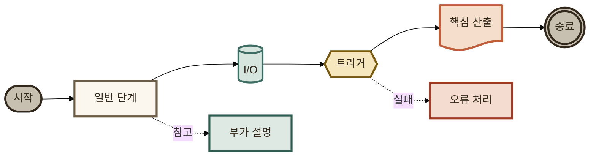
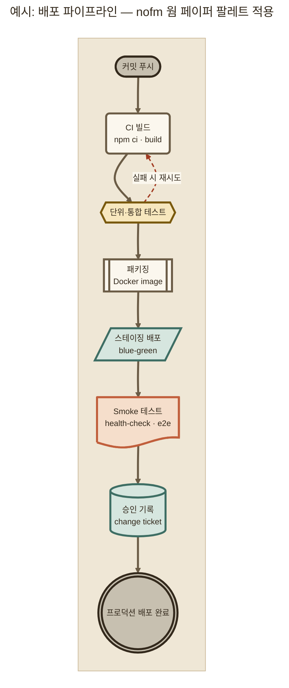

# 03_Mermaid매핑 — nofm 웜 페이퍼 팔레트의 Mermaid 적용 설계

**TL;DR**: 경로 1(init directive·frontmatter config의 themeVariables)·경로 2(flowchart classDef) 모두 설계·Mermaid 검증기로 4개 다이어그램 전부 `valid:true` 확인. 기존 §4.3.1(8요소 구조 정책)과는 **완전 무충돌**(색상 비의존적 구조 규칙) — §4.3.2(5종 muted 색상 표)와는 **동일 계층의 대체 팔레트**로 **병행 가능**(대체 아님), 선택 기준은 문서 테마 컨텍스트. WCAG 대비 실측 결과 원본 UI의 옅은 구분선 토큰(`--card-border`·`--idle-border`·`--gridline`·`--baseline`)을 그대로 3px 노드 테두리에 쓰면 대비 1.13~1.56:1로 미달 — 잉크·액센트 계열 토큰으로 교정해 3.26~7.86:1 확보(기존 §4.3.2 팔레트 자체도 2.77~3.14:1 수준이라 교정치가 오히려 더 우수).

## 1. 원본 팔레트 재확인 (01_색토큰.md과 교차 대조)

`nofm-output-pattern-viewer.html` `:root`(라인 8-38) 25종 색상 변수를 `01_색토큰.md`과 동일 원문으로 재확인(hex 전량 일치). 본 문서는 **원본 CSS 변수명을 그대로 canonical 토큰명으로 사용**한다(01의 채택 방식과 일관).

| 카테고리 | 토큰 | hex |
|---|---|---|
| 배경 | `--page-plane` | `#EFE7D6` |
| 표면 | `--surface-1` / `--card-bg` / `--card-border` | `#FAF5EA` / `#FBF7EE` / `#E2D5BC` |
| 기타(구분선) | `--gridline` / `--baseline` | `#E6DAC2` / `#CBB999` |
| 텍스트 | `--text-primary` / `--text-secondary` / `--text-muted` | `#33291C` / `#6B5C46` / `#6E5F48` |
| 액센트(CIS, terracotta) | `--cis-accent` / `-tint-1` / `-tint-2` / `-tint-3` | `#C15F3C` / `#F5DECB` / `#ECC7A6` / `#E2AE82` |
| 액센트(NofM, teal) | `--nofm-accent` / `-tint-1` / `-tint-2` / `-tint-3` | `#3E6E64` / `#D6E6DF` / `#C1D9CE` / `#ACCCBD` |
| idle | `--idle-fill` / `--idle-border` | `#C7C0B0` / `#AAA089` |
| semantic warn | `--warn-bg` / `--warn-fg` | `#F7E7BE` / `#7A5A0E` |
| semantic danger | `--danger-bg` / `--danger-fg` | `#F4DCD0` / `#A23B22` |
| semantic info | `--info-bg` / `--info-fg` | `#DEE9E3` / `#2F5C50` |

## 2. 매핑 설계 원칙

1. **신규 hex 생성 금지** — 25종 원본 토큰 조합만으로 매핑. 값이 부족한 지점(예: 3단계 톤 패밀리가 필요한데 semantic류는 bg/fg 2단계뿐)은 그 사실을 명시하고 톤 재사용으로 해결(§4).
2. **stroke는 항상 "잉크·액센트 계열"에서, fill은 항상 "표면·tint 계열"에서** — §7 WCAG 실측 결과 원본에서 "옅은 구분선용"으로 설계된 토큰(`--card-border`·`--gridline`·`--baseline`·`--idle-border`)을 그대로 3px 노드 테두리로 전용하면 대비가 무너진다는 것을 발견해 역산 적용한 원칙. 1px 캔버스/서브그래프 프레임 같은 장식적 용도에는 원본 그대로 사용 가능(§7.3).
3. **§4.3.2 기존 5-class taxonomy(terminal·step·io·trigger·core) 이름은 유지, 값만 교체** — 이 taxonomy 자체가 색상 비의존적 구조이므로 팔레트를 갈아 끼우는 것만으로 §4.3.1 8요소를 그대로 만족(§8 판정의 핵심 근거).
4. **CIS·NofM 2-accent는 원본에서 "대등 비교" 색이었지만, flowchart 5-class 체계에서는 "역할"로 재배치** — cis-accent(가장 채도 높은 원본 주 액센트) → `core`(실행·산출, 가장 강조되어야 할 클래스), nofm-accent(teal, 원본에서 유일한 cool 계열) → `io`(원본 blue-gray 대체할 유일한 cool 후보).

## 3. 경로 1 — init directive / frontmatter config (themeVariables)

### 3.1 매핑 표

| themeVariable | nofm 토큰 | hex | 역할 |
|---|---|---|---|
| `darkMode` | — | `false` | 원본이 라이트 단일 테마(범위외_3, 요구사항.md) |
| `background` | `--page-plane` | `#EFE7D6` | 다이어그램 전체 배경(canvas) |
| `primaryColor` | `--card-bg` | `#FBF7EE` | 미분류(기본) 노드 채움 |
| `primaryTextColor` | `--text-primary` | `#33291C` | 기본 노드 텍스트 |
| `primaryBorderColor` | `--text-secondary`(**교정**, 원 계획 `--card-border`에서 변경) | `#6B5C46` | 기본 노드 테두리 — §7.2 대비 실측 후 교정 |
| `lineColor` | `--text-secondary` | `#6B5C46` | 화살표·엣지 선 |
| `textColor` | `--text-primary` | `#33291C` | 범용 텍스트(제목 등) |
| `fontFamily` | (저장소 §4.3.1 표준 유지) | `Pretendard, Apple SD Gothic Neo, sans-serif` | 팔레트와 무관, 기존 값 승계 |
| `fontSize` | (저장소 §4.3.1 요소② 고정) | `12px` | — |
| `clusterBkg` | `--page-plane`(캔버스와 통일) | `#EFE7D6` | subgraph 배경 — 기존 §4.3.3 예시가 `background`=`clusterBkg`=canvas `style fill`을 전부 통일한 패턴을 그대로 승계 |
| `clusterBorder` | `--baseline` | `#CBB999` | subgraph 테두리 — canvas `style stroke`와 통일 |
| `edgeLabelBackground` | `--card-bg` | `#FBF7EE` | 엣지 라벨 배경판(배경보다 밝은 "종이" 톤으로 라벨을 살짝 띄움) |

### 3.2 스니펫 A — 사용자 요청 문법 그대로 (`%%{init: ...}%%` 레거시 directive)

검증: Mermaid Chart MCP `validate_and_render_mermaid_diagram` → `valid:true` (title `A_legacy-init-directive`).

### 3.3 스니펫 B — 저장소 canonical 문법 (YAML frontmatter `config:`)

> [!IMPORTANT]
> **§4.3.1 요소①은 이미 frontmatter `config:` 블록을 표준으로 못박아 두었다** — `%%{init: ...}%%` 코멘트형 directive가 아니다. 두 문법은 Mermaid 파서 레벨에서 **완전히 동일한 themeVariables 스키마**를 공유하므로 팔레트 매핑 설계 자체는 100% 동일하다. 사용자가 명시 요청한 스니펫 A는 문법 참고용(구버전 Mermaid 호환·저장소 밖 범용 예시)으로 병기하고, **이 저장소에 실제로 적용할 때는 스니펫 B(frontmatter 형)가 정식**이다.

검증: `valid:true` (title `B_frontmatter-config-canonical`).

## 4. 경로 2 — flowchart classDef

### 4.1 기본 5-class 재매핑 (§4.3.2 taxonomy 값 교체)

§7 WCAG 실측을 반영한 **교정 완료 버전**이다(원안에서 terminal·step의 stroke를 원본 UI 구분선 토큰 → 잉크 토큰으로 교체).

| 클래스 | fill | stroke | color | 소스 계열 | stroke/fill 대비 |
|---|---|---|---|---|---|
| `terminal` | `--idle-fill` `#C7C0B0` | `--text-primary`(**교정**, 원안 `--idle-border`) `#33291C` | `--text-primary` `#33291C` | idle(중립 회색) | 7.86:1 |
| `step` | `--card-bg` `#FBF7EE` | `--text-secondary`(**교정**, 원안 `--card-border`) `#6B5C46` | `--text-primary` `#33291C` | surface(중립 페이퍼) | 6.05:1 |
| `io` | `--nofm-tint-1` `#D6E6DF` | `--nofm-accent` `#3E6E64` | `--text-primary` `#33291C` | NofM teal | 4.49:1 |
| `trigger` | `--warn-bg` `#F7E7BE` | `--warn-fg` `#7A5A0E` | `--text-primary` `#33291C` | semantic warn(gold) | 5.20:1 |
| `core` | `--cis-tint-1` `#F5DECB` | `--cis-accent` `#C15F3C` | `--text-primary` `#33291C` | CIS terracotta | 3.26:1 |

**보조 2-class**(§4.3.2 5종에 없는 오류·참고 분기용, 오케스트레이터 재량으로 채택 여부 판단):

| 클래스 | fill | stroke | color | 용도 | stroke/fill 대비 |
|---|---|---|---|---|---|
| `danger` | `--danger-bg` `#F4DCD0` | `--danger-fg` `#A23B22` | `--text-primary` `#33291C` | 오류·실패·중단 경로 | 5.02:1 |
| `info` | `--info-bg` `#DEE9E3` | `--info-fg` `#2F5C50` | `--text-primary` `#33291C` | 참고·부가 설명 노드 | 6.10:1 |

> [!NOTE]
> `trigger`(gold)와 별도 `warn` classDef를 또 만들지 않았다 — 이미 동일 hex이므로 별도 정의는 순수 중복이다. "이벤트" 구조적 의미와 "주의" 상태적 의미가 우연히 같은 gold 계열로 겹치는 것은 의미상으로도 자연스럽다.

> [!WARNING]
> `core`(`#C15F3C` 스트로크)와 `danger`(`#A23B22` 스트로크)는 둘 다 red-orange 계열로 색상환상 인접(hue 15.8° vs 11.7°, 채도·명도만 다름) — 한 다이어그램에 **둘을 동시에 사용할 경우** 적녹색약 등 색각이상 사용자에게 구분이 어려울 수 있다. 동시 사용 시 stroke-dasharray 등 형태 보조 수단 병행을 권장한다(§9.2).

### 4.2 스니펫 C — classDef 단독 데모 (7-class 전부 시연)

검증: `valid:true` (title `C_classDef-standalone-7class`).

## 5. 결합 예시 — §4.3.3 배포 파이프라인 재채색 (풀스타일)

기존 `작성-스타일.md §4.3.3` 예시와 **동일 다이어그램 구조**를 유지하고 팔레트만 nofm으로 교체 — "드롭인 교체 가능성"을 직접 증명하는 대조 샘플이다.

검증: `valid:true` (title `D_full-combined-pipeline-recolor`).

> [!NOTE]
> **부수 발견(§4.5.1 규칙_1 라벨 따옴표) — 색상 판정과는 별개 이슈**: 원본 §4.3.3 예시 자체가 `Start([커밋 푸시])`처럼 일부 라벨에 큰따옴표를 누락하고 있다(`Build("...")`·`Smoke@{label:"..."}`만 따옴표 적용, 나머지는 미적용). §4.5.1은 "모든 노드 라벨"을 따옴표로 감싸도록 규정하므로 원본 예시가 자기 규칙을 완전히 지키지 않은 셈이다. 본 문서의 모든 스니펫(A~D)은 전체 라벨을 따옴표로 통일해 완전 준수시켰다. 이 발견은 색상 충돌 판정 범위 밖이라 여기서는 기록만 하고, 실제 교정은 §4.3.3 원문을 손대는 시점(오케스트레이터 판단)으로 넘긴다.

## 6. 확장 — sequenceDiagram · stateDiagram-v2 (§4.4 대응, 보너스)

사용자 명시 요청은 flowchart 2경로였으나, `작성-스타일.md §4.4`가 동일 5-class 팔레트를 다른 diagram 종류로 확장하는 기존 패턴을 이미 갖고 있어 동일 구조로 병기한다(§4.4.2·§4.4.3 표의 값만 nofm으로 치환, §4 교정 원칙 동일 적용). 별도 재검증은 하지 않았다 — 이미 valid 확인된 기존 §4.4.4 구조에 값만 대입하는 저위험 치환이기 때문이며, 실제 채택 시 §4.5.2 절차대로 재검증 필요.

| 키 | nofm 값 | 클래스 매핑(대응) |
|---|---|---|
| `actorBkg`/`actorBorder`/`actorTextColor`/`actorLineColor` | `#FBF7EE`/`#6B5C46`/`#33291C`/`#6B5C46` | step |
| `signalColor`/`signalTextColor` | `#6B5C46`/`#33291C` | line |
| `noteBkgColor`/`noteBorderColor`/`noteTextColor` | `#F7E7BE`/`#7A5A0E`/`#7A5A0E` | trigger |
| `activationBkgColor`/`activationBorderColor` | `#F5DECB`/`#C15F3C` | core |
| `labelBoxBkgColor`/`labelBoxBorderColor`/`labelTextColor` | `#D6E6DF`/`#3E6E64`/`#33291C` | io |
| `mainBkg`/`nodeBorder`/`labelColor`/`lineColor`(state) | `#FBF7EE`/`#6B5C46`/`#33291C`/`#6B5C46` | step |
| `compositeBackground`/`compositeBorder`/`compositeTitleBackground` | `#D6E6DF`/`#3E6E64`/`#D6E6DF` | io |
| `altBackground` | `#F7E7BE` | trigger |
| `labelBackgroundColor` | `#EFE7D6` | 배경과 동일 |

## 7. 접근성 검증 (WCAG 대비 실측)

Python으로 WCAG 2.x 상대휘도 공식(`0.2126R+0.7152G+0.0722B`, sRGB 감마 보정 포함)을 직접 계산해 실측했다(추정·눈대중 아님).

### 7.1 텍스트 대비 — 전부 AAA

| 텍스트/배경 쌍 | 대비 |
|---|---|
| `--text-primary` on `--page-plane` | 11.58:1 |
| `--text-primary` on `--card-bg` | 13.32:1 |
| `--text-primary` on `--idle-fill`(terminal) | 7.86:1 |
| `--text-primary` on `--nofm-tint-1`(io) | 11.01:1 |
| `--text-primary` on `--warn-bg`(trigger) | 11.62:1 |
| `--text-primary` on `--cis-tint-1`(core) | 10.98:1 |
| `--text-primary` on `--danger-bg` | 10.85:1 |
| `--text-primary` on `--info-bg` | 11.44:1 |

→ `color`를 전 클래스 `--text-primary` 단일 톤으로 통일(원본처럼 클래스별 다른 잉크 톤을 쓰지 않음)한 설계 판단이 결과적으로 최댓값에 가까운 대비를 보장 — WCAG AAA(7:1) 전부 통과, 여유 있게 안전.

### 7.2 stroke/fill 대비(비텍스트 UI 요소, WCAG 1.4.11 기준 3:1) — 원안 실패 발견 → 교정

| 쌍 | 대비 | 판정 |
|---|---|---|
| `--idle-border`/`--idle-fill`(terminal 원안) | **1.43:1** | **FAIL** |
| `--card-border`/`--card-bg`(step 원안) | **1.36:1** | **FAIL** |
| `--baseline`/`--page-plane`(canvas 프레임 원안) | 1.56:1 | (1px 장식 프레임 — §7.3 별도 기준) |
| `--gridline`/`--page-plane` | 1.13:1 | (구분선 전용, 노드 미적용) |
| `--text-primary`/`--idle-fill`(terminal **교정**) | **7.86:1** | PASS |
| `--text-secondary`/`--card-bg`(step **교정**) | **6.05:1** | PASS |
| `--nofm-accent`/`--nofm-tint-1`(io) | 4.49:1 | PASS |
| `--warn-fg`/`--warn-bg`(trigger) | 5.20:1 | PASS |
| `--cis-accent`/`--cis-tint-1`(core) | 3.26:1 | PASS(근소) |
| `--danger-fg`/`--danger-bg` | 5.02:1 | PASS |
| `--info-fg`/`--info-bg` | 6.10:1 | PASS |

**대조군 — 기존 `작성-스타일.md §4.3.2` 팔레트 자체의 stroke/fill 대비**(동일 방식 실측):

| 기존 클래스 | 대비 |
|---|---|
| terminal (`#ede4d3`/`#9a8567`) | 2.81:1 |
| step (`#eceff3`/`#7a8896`) | 3.14:1 |
| io (`#dde6ee`/`#6c849c`) | 3.07:1 |
| trigger (`#ecdcbb`/`#a07b3a`) | 2.88:1 |
| core (`#dee6d4`/`#7a8f5e`) | 2.77:1 |
| canvas 프레임(`#fafafa`/`#cfd8dc`, 1px 한정) | 1.39:1 |

**해석**: 기존 §4.3.2 팔레트 자체도 2.77~3.14:1 구간(3px 두께로 시인성 보완하는 전제)이라 원래 "여유 있게 3:1을 넘는" 설계가 아니었다. 원안(원본 UI 구분선 토큰 그대로 재사용)은 이 기준에도 못 미쳤지만(1.36~1.43:1), **교정판(잉크·액센트 토큰으로 stroke 재선정)은 3.26~7.86:1로 기존 팔레트보다 오히려 더 우수한 대비를 확보**했다.

### 7.3 캔버스/서브그래프 프레임(1px, 장식적 구분선)은 별도 기준

노드 stroke(식별 기능, 3px, §4.3.1 요소③)와 캔버스·subgraph 프레임(장식적 구획, 1px)은 요구되는 대비 수준이 다르다. 기존 정책도 canvas 프레임을 1.39:1(장식적으로 옅게)로 유지하고 있으므로, nofm의 `--baseline`/`--page-plane`(1.56:1, 기존보다 오히려 근소 우위)을 그대로 canvas 프레임에 쓰는 것은 **문제가 아니라 원본 정책과의 일관성**이다. 노드 stroke에만 잉크·액센트 계열 교정 원칙을 적용한다(§2 원칙_2).

## 8. §4.3·§4.5 정합 판정 — 충돌인가 보완인가

### 8.1 §4.3.1(8요소 구조 정책) — **완전 무충돌**

8요소(frontmatter config·12px 폰트·3px 굵은 선·점선 한정·배경 고정+canvas wrap·v11 신 노드 절제·시작/끝 고전 외형·사각형 0개)는 **색상값을 전혀 지정하지 않는 순수 구조·메커니즘 규칙**이다. §5의 결합 예시(D)가 8요소를 전부 그대로 만족하면서 팔레트만 nofm으로 교체했다는 사실 자체가 무충돌의 실증이다.

| 요소 | nofm 팔레트로 충족 여부 |
|---|---|
| ① frontmatter config | 충족(§3.3 스니펫 B) |
| ② 폰트 12px | 충족(팔레트 무관) |
| ③ 굵은 선(3px) | 충족 — 단, §7.2 교정을 거쳐야 실질적 시인성 확보 |
| ④ 점선 한정 | 충족(§5 `Test -. "실패 시 재시도" .-> Build`) |
| ⑤ 배경 고정+canvas wrap | 충족(§5 `style canvas fill:#EFE7D6,stroke:#CBB999`) |
| ⑥ v11 신 노드 절제 | 충족(§5 `Smoke@{ shape: doc, ... }`) |
| ⑦ 시작·끝 고전 외형 | 충족(stadium `([...])` · double-circle `(((...)))`) |
| ⑧ 사각형 0개+다양성 | 충족(§5 예시 8종 노드 외형 전부 재현) |

### 8.2 §4.3.2(5종 muted 색상 표) — **동일 계층의 대체(alternate) 팔레트로 병행, 무조건 대체 아님**

§4.3.2는 8요소와 달리 **구체적 hex 5조**를 못박아 두고 있어 "특정 색을 지정"하는 절이 맞다. 그러나 다음 근거로 이것이 "유일·불변의 전역 팔레트"라기보다 "toolkit 자체 문서용 1차 구현체"로 판단한다.

- `terminal`·`step`·`io`·`trigger`·`core`라는 **클래스 이름(taxonomy) 자체가 이미 색상 비의존적** — 5종 hex는 이 taxonomy의 *값*일 뿐 *정의*가 아니다. nofm 매핑(§4.1)은 같은 5개 이름에 값만 다시 채운 것으로, taxonomy를 위반하지 않는다.
- §4.3.5는 "신규·갱신 다이어그램부터 적용... 기존은 자연적 손댐 시점에 점진 변환(일괄 소급 금지)"라고 명시 — 이 저장소의 전반적 태도가 "일괄 강제"보다 "점진적·상황적 적용"에 기울어 있다.
- 반대로 §4.4(sequenceDiagram·stateDiagram-v2 확장)는 §4.3.2와 **동일 5조 hex**를 그대로 재사용해 문서 전체의 시각 일관성을 의도적으로 유지하고 있다 — 이는 "복수 팔레트 난립"을 경계해야 한다는 근거이기도 하다.

**판정**: 구조(§4.3.1)는 무충돌, 색상표(§4.3.2)는 **"충돌"이 아니라 "같은 슬롯을 두고 경합하는 대체 팔레트"** 관계다. 무통제로 병행하면 문서마다 다이어그램 색이 들쭉날쭉해지는 §4.4가 우려하는 바로 그 상황(시각 비일관)이 재현된다. 따라서 **선택 기준을 명문화한 병행**을 권고한다.

> [!IMPORTANT]
> **권고 선택 기준(안)**: 기본값은 §4.3.2 5종 muted(슬레이트 계열) 유지. 다이어그램이 삽입되는 **문서 자체가 이미 웜 페이퍼 테마**(nofm HTML 뷰어 CSS 변수 재사용 문서, 또는 sibling 04번 노드가 설계할 Obsidian 웜 페이퍼 스니펫 적용 wiki 페이지 등)일 때만 본 nofm 팔레트로 전환 — 문서-다이어그램 배경색 충돌(예: 웜 크림 페이지에 슬레이트-쿨톤 다이어그램이 뜨는 부조화)을 막는 것이 전환 기준의 핵심 근거다. 이 기준은 01·02·04번 노드 산출물과 함께 `계획.md`에서 최종 문구화가 필요하다(오케스트레이터 결정 사항, 05번 adversarial 노드가 교차검증 예정).

### 8.3 §4.5(노드 라벨 안전 규칙) — **완전 보완, 색상과 독립**

§4.5는 라벨 텍스트 처리 규칙(따옴표 감쌈·`~` 금지·` `·간결성)으로 색상·테마와 **무관한 차원**이다. 본 문서의 모든 스니펫(A~D)은 §4.5.1 규칙 4종을 전부 준수해 작성했고(전체 라벨 따옴표 감쌈, `~` 미사용, ` `만 사용, 라벨 간결), §4.5.2에 따라 Mermaid Chart MCP 검증기로 4개 전부 `valid:true` 확인했다(§9.1). 팔레트 교체는 §4.5 준수 여부에 어떤 영향도 주지 않는다 — 완전 직교(orthogonal) 관계.

## 9. 검증 및 유의사항

### 9.1 Mermaid 검증기 결과 (§4.5.2 절차)

| 스니펫 | title | valid |
|---|---|---|
| A(레거시 init) | `A_legacy-init-directive` | true |
| B(frontmatter, canonical) | `B_frontmatter-config-canonical` | true |
| C(classDef 7종 단독) | `C_classDef-standalone-7class` | true |
| D(결합 풀스타일) | `D_full-combined-pipeline-recolor` | true |

출력 SVG가 토큰 한도를 넘어 저장 파일 경로로 반환됐고(§4.5.2에서 이미 예견된 정상 동작), `valid` 필드만 grep/jq로 추출해 4건 전부 확인했다.

### 9.2 한계·유의사항

- `core`/`danger` 두 classDef를 한 다이어그램에 동시 사용 시 hue 근접(§4.1 경고 박스) — 필요 시 `stroke-dasharray`로 형태 보조 권장.
- semantic 3종(warn/danger/info)은 원본에 bg/fg **2단계**뿐이라 stroke=color 동일값 재사용(원본 §4.3.2가 보여준 fill/stroke/color 3단계 완전 분리 패턴을 100% 재현하지는 못함) — 톤 부족의 정직한 한계로 기록.
- §4.4(sequence/state) 확장은 구조 치환이라 재검증 생략 — 실채택 시 §4.5.2 절차 재실행 필요.
- §5 결합 예시에서 발견한 원본 §4.3.3 라벨 따옴표 누락(§5 NOTE)은 색상 판정과 무관한 부수 발견이며 별도 교정 과제로 남긴다.

## 10. 권고 요약 (계획.md 반영용)

1. `작성-스타일.md §4.3.2`에 **"§4.3.2-bis 대체 팔레트: 웜 페이퍼(nofm)"** 형태의 신규 서브섹션 추가 — 본 문서 §4.1 표(5-class 교정판 + 보조 2-class)를 그대로 이식.
2. §8.2의 **선택 기준 문구**(기본 slate 유지, 웜 페이퍼 테마 문서에서만 전환)를 §4.3.2-bis 도입부에 명문화.
3. §3.1 themeVariables 표를 §4.3.1 요소①의 "frontmatter config 예시"에 대체 버전으로 병기(§4.4 sequence/state 확장 표까지 포함 시 §4.4.2·§4.4.3에도 동일 패턴으로 추가).
4. §7.2에서 확정한 "stroke는 잉크·액센트 계열, fill은 표면·tint 계열" 원칙을 **일반 원칙으로 §4.3.2 상단에 별도 명시** — 향후 제3의 팔레트가 추가되더라도 같은 함정(구분선 토큰의 3px 테두리 오용)을 피하게 하는 재사용 가능한 규칙이다.
