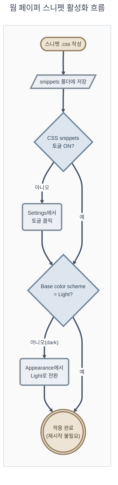

# 04_obsidian-매핑 — 웜 페이퍼 팔레트 → Obsidian CSS 변수 매핑

**TL;DR**: nofm HTML의 25개 웜 페이퍼 팔레트 토큰을 Obsidian 표준 CSS 변수(46개)·GitHub Alert 콜아웃(15개)·Things 테마 전용 변수(17개)로 매핑해 `.theme-light` 스코프 완성 스니펫을 산출했다. wiki Vault는 `wiki vault/.obsidian/snippets/`에 파일을 두고 Settings → Appearance에서 토글해 켜며, **현재 vault 베이스 스킴이 dark(`"theme": "obsidian"`)라 라이트 전환이 선행되지 않으면 스니펫을 켜도 아무 변화가 없다.**

## 1. 개요

구성: §2 wiki Vault 현황(`ls` 근거) · §3 팔레트 인벤토리 · §4 매핑 설계 원칙 · §5 매핑 샘플표(감사용) · §6 완성 CSS 스니펫(복사-붙여넣기) · §7 배치·활성화 방법 · §8 파생값 투명성 · §9 대비(Contrast) 검증 · §10 알려진 갭.

## 2. wiki Vault 현황 확인 (`ls` 근거)

```text
projects/wiki/wiki vault/.obsidian/
├── appearance.json
│     { "theme": "obsidian",        ← 베이스 스킴 = DARK (light 아님! "obsidian"=dark, "moonstone"=light)
│       "cssTheme": "Things",       ← 커뮤니티 테마(2.2.3, 1933줄)
│       "enabledCssSnippets": ["wiki-site"] }
├── snippets/
│   └── wiki-site.css   기존 스니펫 — `.markdown-preview-view` 직접 스코프,
│                        하드코딩 cool blue/teal(`--wiki-ink #172033` 등 별도 커스텀 변수)
├── themes/
│   ├── Things/theme.css     활성 테마. 표준 배경/텍스트 변수(--background-primary 등)는
│   │                        재정의하지 않음 — Obsidian 코어 기본값을 그대로 상속
│   ├── Minimal/, Dracula for Obsidian/   설치돼 있으나 비활성
└── community-plugins.json   []  (플러그인 없음 — 순수 코어+테마+스니펫 조합)
```

핵심 발견 3가지:

1. **베이스 스킴이 현재 dark다.** `.theme-light` 스코프 오버라이드는 라이트 베이스에서만 활성화되므로, 본 스니펫을 켜기 전에 **Base color scheme을 Light로 전환**해야 한다(§7).
2. **Things 테마는 `--background-primary`·`--text-normal`·`--interactive-accent` 등 표준 변수를 재정의하지 않는다**(코드 확인: `grep`으로 전량 부재 확인, `--text-normal`은 184행에 주석 처리된 흔적만 있음). 즉 스니펫이 테마와 특이도 경쟁 없이 안전하게 값을 주입할 수 있다.
3. **Things는 H3~H5·태그·코드블록을 `--blue`/`--yellow`/`--red` 같은 자체 커스텀 변수로 참조**한다(예: `--h3-color: var(--blue)`). 표준 변수만 오버라이드하면 헤더 색이 그대로 남아 룩이 불완전해진다 — Tier 2b로 별도 보강 필요(§5).

## 3. 팔레트 인벤토리 (원본 25개 토큰)

출처: `projects/Sound1/docs/참고/nofm/정리/nofm-output-pattern-viewer.html` L8~38 `:root` 블록.

| 카테고리 | 변수 | HEX |
|---|---|---|
| 배경(중립, 밝은순) | `--card-bg` | `#FBF7EE` |
| | `--surface-1` | `#FAF5EA` |
| | `--page-plane` | `#EFE7D6` |
| | `--gridline` | `#E6DAC2` |
| | `--card-border` | `#E2D5BC` |
| | `--baseline` | `#CBB999` |
| 텍스트 | `--text-primary` | `#33291C` |
| | `--text-muted` | `#6E5F48` |
| | `--text-secondary` | `#6B5C46` |
| 액센트1 · CIS(테라코타) | `--cis-accent` | `#C15F3C` |
| | `--cis-tint-1/2/3` | `#F5DECB` / `#ECC7A6` / `#E2AE82` |
| 액센트2 · NofM(틸) | `--nofm-accent` | `#3E6E64` |
| | `--nofm-tint-1/2/3` | `#D6E6DF` / `#C1D9CE` / `#ACCCBD` |
| 상태(idle) | `--idle-fill` / `--idle-border` | `#C7C0B0` / `#AAA089` |
| Semantic | `--warn-bg` / `--warn-fg` | `#F7E7BE` / `#7A5A0E` |
| | `--danger-bg` / `--danger-fg` | `#F4DCD0` / `#A23B22` |
| | `--info-bg` / `--info-fg` | `#DEE9E3` / `#2F5C50` |

## 4. 매핑 설계 원칙

1. **밝기 위계 보존** — Obsidian 라이트 테마 관례상 `--background-primary`(본문)가 `--background-secondary`(사이드바/크롬)보다 밝거나 같다(Obsidian 기본 moonstone: primary `#fff` ≥ secondary `#f2f3f5`). 원본 3개 중립 표면의 밝기 순서 card-bg(`#FBF7EE`, 최명) > surface-1(`#FAF5EA`) > page-plane(`#EFE7D6`, 최암)를 그대로 유지해 `card-bg→primary`, `page-plane→secondary`로 배정했다. 방향을 뒤집으면(=흔한 실수) 본문이 사이드바보다 어두워져 위계가 역전된다.
2. **파생값 최소화** — 원본에 없는 값(hover 다크닝 등)은 딱 1개만 계산해 3곳에 재사용한다(§8). 나머지는 25개 원본 hex 재사용, 또는 동일 hex의 **표현 형식 변환**(hex→rgb 트리플릿, hex→hsl)에 그친다 — "새 색"이 아니라 "같은 색의 다른 표기"임을 §8에서 구분한다.
3. **2-액센트를 1차/2차로 재해석** — 원본의 CIS(테라코타)·NofM(틸)은 "두 비교 계열"이지만, 문서 UI에서는 "1차 액센트(링크·강조·interactive-accent) = 테라코타" / "2차 액센트(외부링크·success·H3) = 틸"로 역할을 고정했다. 기존 `wiki-site.css`가 이미 `--wiki-teal`을 H2 강조선에 쓰던 관행과도 색상군이 겹쳐 구조적 연속성이 있다(색값 자체는 다름).
4. **선택자 안전성** — Things 테마도 `.theme-light` 단일 클래스로 규칙을 건다(동일 특이도 0,1,0). Obsidian은 스니펫을 테마 CSS보다 **항상 나중에** 로드하므로 동일 특이도에서도 스니펫이 캐스케이드상 우선한다 — `!important` 불필요. 요청대로 `.theme-light` 스코프를 그대로 사용한다.
5. **표준 변수 우선, 테마 전용은 분리** — Tier 1(표준)만으로 핵심 룩(배경·텍스트·링크·인터랙티브)이 완성되도록 하고, Things 전용 변수(Tier 2b)는 별도 블록으로 분리해 테마 교체 시에도 Tier 1이 계속 동작하게 했다.

## 5. 매핑 샘플표 (감사용 — 전체는 §6 코드 인라인 주석)

78개 선언 전체를 표로 나열하면 가독성이 떨어져, 사용자가 명시한 6종 + 대표 사례만 샘플로 제시한다. 전체 목록은 §6 CSS의 줄별 주석이 1차 소스다(수용기준_2: hex 대조 가능).

| Tier | Obsidian 변수 | 값 | 출처 토큰 | 비고 |
|---|---|---|---|---|
| 1 | `--background-primary` | `#FBF7EE` | `card-bg` | 밝기 위계 최상단(§4-1) |
| 1 | `--background-secondary` | `#EFE7D6` | `page-plane` | 사이드바/탭바/상태바 |
| 1 | `--text-normal` | `#33291C` | `text-primary` | 본문 텍스트 |
| 1 | `--text-muted` | `#6E5F48` | `text-muted` | `text-secondary`(`#6B5C46`)와 사실상 동일색이라 통합(Δ<3) |
| 1 | `--text-accent` | `#C15F3C` | `cis-accent` | 1차 액센트 |
| 1 | `--interactive-accent` | `#C15F3C` | `cis-accent` | 버튼·체크박스·토글 |
| 1 | `--text-faint` | `#AAA089` | `idle-border` | "비활성" 의미 재사용 |
| 1 | `--scrollbar-thumb-bg` | `#C7C0B0` | `idle-fill` | "idle" 원의미와 부합 |
| 2a | `--callout-warning` | `122, 90, 14` | `warn-fg` | GitHub `[!WARNING]` |
| 2a | `--callout-danger`/`caution` | `162, 59, 34` | `danger-fg` | GitHub `[!CAUTION]` |
| 2a | `--callout-tip` | `62, 110, 100` | `nofm-accent` | GitHub `[!TIP]` |
| 2b | `--h3-color` | `#3E6E64` | `nofm-accent` | Things `--blue` 간접참조 우회, 직접 재정의 |
| 2b | `--tag-background-color-l` | `#D6E6DF` | `nofm-tint-1` | 태그 칩 배경 |

## 6. 완성 CSS 스니펫

```css
/* ============================================================================
 * 웜 페이퍼 테마 — Obsidian CSS 스니펫
 * 출처: projects/Sound1/docs/참고/nofm/정리/nofm-output-pattern-viewer.html
 *       (:root 25개 CSS 변수, L8~38)
 * 스코프: .theme-light 전용 — 라이트 베이스 스킴에서만 활성화된다.
 * 전제: Settings → Appearance → Base color scheme = Light
 *       (wiki vault 현재값은 dark("obsidian") — 전환 필요, §7 참조)
 * 적용 범위: 스니펫은 앱 전역(에디터·사이드바·탭바·설정 모달 등)에 적용된다.
 *           문서 본문만 한정하려면 `.markdown-preview-view` 등으로 별도 스코프할 것.
 * ============================================================================ */

.theme-light {
  /* ---------------------------------------------------------------------
   * Tier 1 — 표준 Obsidian 변수 (테마 무관, 요청 6종 전부 포함)
   * --------------------------------------------------------------------- */

  /* 배경 계층: card-bg(밝음) > surface-1 > page-plane > gridline(어두움) */
  --background-primary: #FBF7EE;              /* card-bg   — 본문 읽기/편집 뷰 */
  --background-primary-alt: #FAF5EA;          /* surface-1 — 대체 표면(빈 상태 등) */
  --background-secondary: #EFE7D6;            /* page-plane — 사이드바·탭바·상태바 */
  --background-secondary-alt: #E6DAC2;        /* gridline  — 사이드바 항목 hover */

  --background-modifier-border: #E2D5BC;             /* card-border */
  --background-modifier-border-hover: #CBB999;       /* baseline */
  --background-modifier-border-focus: #C15F3C;       /* cis-accent */
  --background-modifier-hover: #E6DAC2;              /* gridline */
  --background-modifier-active-hover: #ECC7A6;       /* cis-tint-2 */
  --background-modifier-form-field: #FAF5EA;         /* surface-1(원본 input/select bg 재사용) */
  --background-modifier-form-field-highlighted: #FBF7EE; /* card-bg */
  --background-modifier-error: #F4DCD0;              /* danger-bg */
  --background-modifier-error-rgb: 244, 220, 208;    /* danger-bg → rgb 변환(색 동일) */
  --background-modifier-error-hover: #ECC7A6;        /* cis-tint-2 */
  --background-modifier-success: #D6E6DF;            /* nofm-tint-1(그린 부재 → 틸로 대체) */
  --background-modifier-success-rgb: 214, 230, 223;
  --background-modifier-cover: rgba(51, 41, 28, 0.4); /* text-primary — 원본 rgba(51,41,28,*) 패턴 재사용 */

  --text-normal: #33291C;        /* text-primary */
  --text-muted: #6E5F48;         /* text-muted(text-secondary #6B5C46과 사실상 동일색 — 통합) */
  --text-faint: #AAA089;         /* idle-border — "비활성" 의미 재사용 */
  --text-error: #A23B22;         /* danger-fg */
  --text-error-hover: #C15F3C;   /* cis-accent */
  --text-success: #2F5C50;       /* info-fg(그린 부재 → info로 대체) */
  --text-warning: #7A5A0E;       /* warn-fg */
  --text-accent: #C15F3C;        /* cis-accent — 1차 액센트(링크·강조) */
  --text-accent-hover: #9C4D30;  /* 파생값 — §8 참조 */
  --text-on-accent: #FBF7EE;     /* card-bg — accent 배경 위 텍스트 */
  --text-on-accent-inverted: #33291C; /* text-primary */
  --text-selection: rgba(193, 95, 60, 0.25);       /* cis-accent 25% */
  --text-highlight-bg: rgba(247, 231, 190, 0.65);  /* warn-bg 65% — 형광펜 */

  --interactive-normal: #FBF7EE;   /* card-bg */
  --interactive-hover: #F5DECB;    /* cis-tint-1 */
  --interactive-accent: #C15F3C;   /* cis-accent */
  --interactive-accent-hsl: 16, 53%, 50%;  /* cis-accent → hsl 변환(색 동일, 표현만 변경) */
  --interactive-accent-hover: #9C4D30;     /* 파생값 — §8 참조 */
  --interactive-success: #3E6E64;  /* nofm-accent */
  --interactive-error: #A23B22;    /* danger-fg */
  --interactive-error-hover: #C15F3C;

  --link-color: #C15F3C;                 /* cis-accent */
  --link-color-hover: #9C4D30;           /* 파생값 */
  --link-external-color: #3E6E64;        /* nofm-accent — 외부 링크는 2차 액센트로 구분 */
  --link-external-color-hover: #2F5C50;  /* info-fg */
  --link-unresolved-color: #A23B22;      /* danger-fg — 깨진 링크 */

  --divider-color: #E2D5BC;              /* card-border */

  --scrollbar-thumb-bg: #C7C0B0;         /* idle-fill */
  --scrollbar-active-thumb-bg: #AAA089;  /* idle-border */

  /* ---------------------------------------------------------------------
   * Tier 2a — 콜아웃 = GitHub Alert 5종 매핑 (RGB 트리플릿, rgb() 래핑 금지)
   * 작성-스타일.md §3 GitHub Alert Blocks와 정합. 변수명은 Obsidian 코어 기준 —
   * 버전별 별칭 차이 가능성이 있어 적용 후 실제 렌더 확인 권장(§10).
   * --------------------------------------------------------------------- */
  --callout-note: 47, 92, 80;         /* info-fg */
  --callout-info: 47, 92, 80;         /* info-fg */
  --callout-default: 47, 92, 80;      /* info-fg */
  --callout-tip: 62, 110, 100;        /* nofm-accent */
  --callout-important: 193, 95, 60;   /* cis-accent */
  --callout-warning: 122, 90, 14;     /* warn-fg */
  --callout-question: 122, 90, 14;    /* warn-fg */
  --callout-caution: 162, 59, 34;     /* danger-fg */
  --callout-danger: 162, 59, 34;      /* danger-fg */
  --callout-error: 162, 59, 34;       /* danger-fg */
  --callout-failure: 162, 59, 34;     /* danger-fg */
  --callout-bug: 162, 59, 34;         /* danger-fg */
  --callout-success: 62, 110, 100;    /* nofm-accent(그린 부재 대체) */
  --callout-example: 107, 92, 70;     /* text-secondary */
  --callout-quote: 110, 95, 72;       /* text-muted */

  /* ---------------------------------------------------------------------
   * Tier 2b — Things 테마(cssTheme) 전용 보강
   * Things는 H3~H5·태그·코드블록 배경을 자체 --blue/--yellow/--red 등 커스텀
   * 변수로 참조 — Tier 1만으로는 반영되지 않아 별도 재정의가 필요하다(§2).
   * 다른 테마에는 존재하지 않는 변수라 안전한 no-op으로 남는다.
   * --------------------------------------------------------------------- */
  --h1-color: #33291C;  /* text-primary */
  --h2-color: #33291C;  /* text-primary */
  --h3-color: #3E6E64;  /* nofm-accent */
  --h4-color: #7A5A0E;  /* warn-fg */
  --h5-color: #A23B22;  /* danger-fg */
  --h6-color: #6E5F48;  /* text-muted */

  --blue: #3E6E64;    /* nofm-accent (Things --h3-color 등이 참조) */
  --yellow: #7A5A0E;  /* warn-fg */
  --red: #A23B22;     /* danger-fg */
  --pink: #C15F3C;    /* cis-accent (strong/em) */
  --green: #3E6E64;   /* nofm-accent (blockquote) */
  --orange: #C15F3C;  /* cis-accent */
  --purple: #6B5C46;  /* text-secondary — 팔레트에 보라 부재, 중립으로 대체 */

  --tag-background-color-l: #D6E6DF;  /* nofm-tint-1 */
  --tag-font-color-l: #2F5C50;        /* info-fg */

  --code-background-l: #FAF5EA;       /* surface-1 (인라인 코드) */
  --code-block-background-l: #EFE7D6; /* page-plane (코드블록, 한 단계 더 리세스) */
}
```

> [!TIP]
> Obsidian Settings → Appearance → **Accent color**에 `#C15F3C`(cis-accent)만 지정해도 코어가 `--interactive-accent`·`--text-accent`·체크박스·토글을 자동 재계산한다. CSS 없이 액센트 색만 급하게 맞추고 싶을 때 쓸 수 있는 보조 수단이지만, 배경·텍스트는 바뀌지 않으므로 본 스니펫의 대체재는 아니다.

## 7. wiki Vault 배치·활성화 방법

1. **파일 배치** — 위 CSS를 `wiki vault/.obsidian/snippets/warm-paper.css`로 저장한다(파일명은 제안 — 기존 `wiki-site.css`와 동일한 영문 kebab-case 관행을 따름, 최종 확정은 계획 단계).
2. **활성화** — Obsidian 앱에서 Settings(⚙) → Appearance → CSS snippets 목록 → (새로고침 아이콘으로 새 파일 인식) → `warm-paper` 토글 ON.
   - 토글 ON 시 `appearance.json`의 `enabledCssSnippets` 배열에 자동 반영된다: `["wiki-site"]` → `["wiki-site", "warm-paper"]`.
3. **필수 선행 조건** — Settings → Appearance → Base color scheme을 **Light**로 전환한다. 현재 `appearance.json`은 `"theme": "obsidian"`(dark)이므로, 이 전환 없이는 스니펫을 켜도 `.theme-light` 규칙이 활성화되지 않아 시각적 변화가 전혀 없다.
4. **핫리로드** — Obsidian은 활성 스니펫 파일의 저장을 감지해 즉시 재적용한다. 앱 재시작 불필요.
5. **적용 범위 인지** — CSS 변수 오버라이드 방식이므로 사이드바·탭바·상태바·설정 모달까지 포함한 **앱 전역**이 바뀐다(문서 읽기 화면만 바뀌는 것이 아님). 이는 사용자가 요청한 "CSS 변수 오버라이드" 접근법의 당연한 귀결이며, 문서 본문만 한정하려면 `wiki-site.css`처럼 `.markdown-preview-view` 스코프의 별도 스니펫이 필요하다(§10 충돌 참조).



검증: MCP `validate_and_render_mermaid_diagram` 실행 결과 `"valid":true` 확인(작성-스타일.md §4.5.2 의무 준수).

## 8. 파생값·변환값 투명성

수용기준_2("추출 색값이 원본과 일치")를 충족하려면 "원본 그대로"·"형식만 변환"·"진짜 새로 계산"을 구분해야 한다.

| 구분 | 값 | 원본 대비 |
|---|---|---|
| 원본 그대로(hex) | Tier 1·2a·2b 대부분 | 25개 토큰 hex를 그대로 재사용 — 색 동일, 변경 없음 |
| 형식 변환(hex→rgb) | `--background-modifier-error-rgb: 244, 220, 208` 등 | `danger-bg` hex를 10진 트리플릿으로 표기만 변환. **색은 100% 동일** |
| 형식 변환(hex→hsl) | `--interactive-accent-hsl: 16, 53%, 50%` | `cis-accent`(`#C15F3C`=RGB 193,95,60)의 HSL 변환. **색은 100% 동일**, 표현 형식만 다름 |
| 알파만 다름 | `--text-selection`(cis-accent 25%) · `--text-highlight-bg`(warn-bg 65%) · `--background-modifier-cover`(text-primary 40%) | base hex는 원본 그대로, 투명도만 신규 지정(색상 자체는 발명 아님) |
| **진짜 파생(원본에 없는 새 값)** | `#9C4D30` | cis-accent HSL(16°, 53%, 50%)의 **L을 50%→40%(-10%p)로만 다크닝**해 하나만 계산. `--text-accent-hover`·`--interactive-accent-hover`·`--link-color-hover` 3곳에 동일 값을 재사용해 파생값 개수를 1개로 최소화(원칙 §4-2) |

파생값 계산 근거(HSL→RGB 역변환):
- `cis-accent` #C15F3C → RGB(193,95,60) → HSL(16°, 52.6%, 49.6%)
- L을 40%로 낮춘 HSL(16°, 53%, 40%) → RGB(156, 77, 48) → `#9C4D30`

## 9. 대비(Contrast) 검증 — 표본 3쌍

WCAG 상대휘도 공식으로 수계산(전량 감사는 범위 밖 — 필요 시 후속 검증).

| 전경 | 배경 | 대비비 | 판정 |
|---|---|---|---|
| `--text-normal` `#33291C` | `--background-primary` `#FBF7EE` | **13.31:1** | AAA 본문(7:1) 충족 |
| `--text-muted` `#6E5F48` | `--background-primary` `#FBF7EE` | **5.79:1** | AA 본문(4.5:1) 충족 |
| `--text-accent` `#C15F3C` | `--background-primary` `#FBF7EE` | **3.95:1** | AA UI/큰텍스트(3:1) 충족, AA 본문(4.5:1) 미달 — 링크·아이콘·테두리 등 원본 사용 맥락(액센트·경계선)에 한정 권장, 긴 본문 텍스트 색으로는 비권장 |

## 10. 알려진 갭·후속 결정 사항

| 항목 | 내용 | 처리 |
|---|---|---|
| 다크모드 미대응 | 원본이 라이트 단일, 본 스니펫도 `.theme-light` 전용. **현재 vault 베이스 스킴이 dark라 이 공백이 당장 체감됨** | 요구사항.md 범위외_3 — 후속 작업에서 `.theme-dark` 대응 팔레트 신설 여부 판단 |
| `wiki-site.css`와 팔레트 불일치 | 기존 스니펫은 `.markdown-preview-view` 직접 스코프 + 하드코딩 cool blue/teal(`--wiki-ink #172033` 등 별도 커스텀 변수, 본 스니펫과 무관한 이름 체계) — 레이어가 달라 동시 활성화 시 `.wiki-hero`/`.wiki-card`/표/H1·H2는 cool blue로 남고, 그 외 앱 전역(사이드바·H3~H6·콜아웃 등)은 warm paper로 바뀌어 **혼재**된다 | 계획 단계에서 (a) 병행 유지(의도적 이원화) (b) `wiki-site.css` 하드코딩값을 신규 변수 참조로 치환 (c) 둘 중 하나 비활성 — 택1 필요. 05 adversarial 노드 교차 확인 권장 |
| 콜아웃 변수명 미검증 | `--callout-*` 변수명은 Obsidian 코어 기준 기억에 의존 — 버전별 별칭 차이 가능성 | 실제 적용 시 GitHub Alert 5종(`[!NOTE]` 등) 렌더를 Obsidian에서 직접 확인 권장 |
| 그린·퍼플 계열 부재 | 원본 팔레트에 순수 그린·퍼플이 없어 success/purple류를 nofm(틸)·text-secondary로 대체 | 의도적 단순화(§4-2), 원본 충실도 우선 판단 |
| `--idle-fill` 등 저활용 토큰 | 25개 중 scrollbar 2곳에만 명시 재사용, 나머지는 Tier 1/2 매핑에 자연 흡수(직접 노출 없음) | 전량을 강제로 노출하는 것이 목표가 아니므로 문제 아님 |
