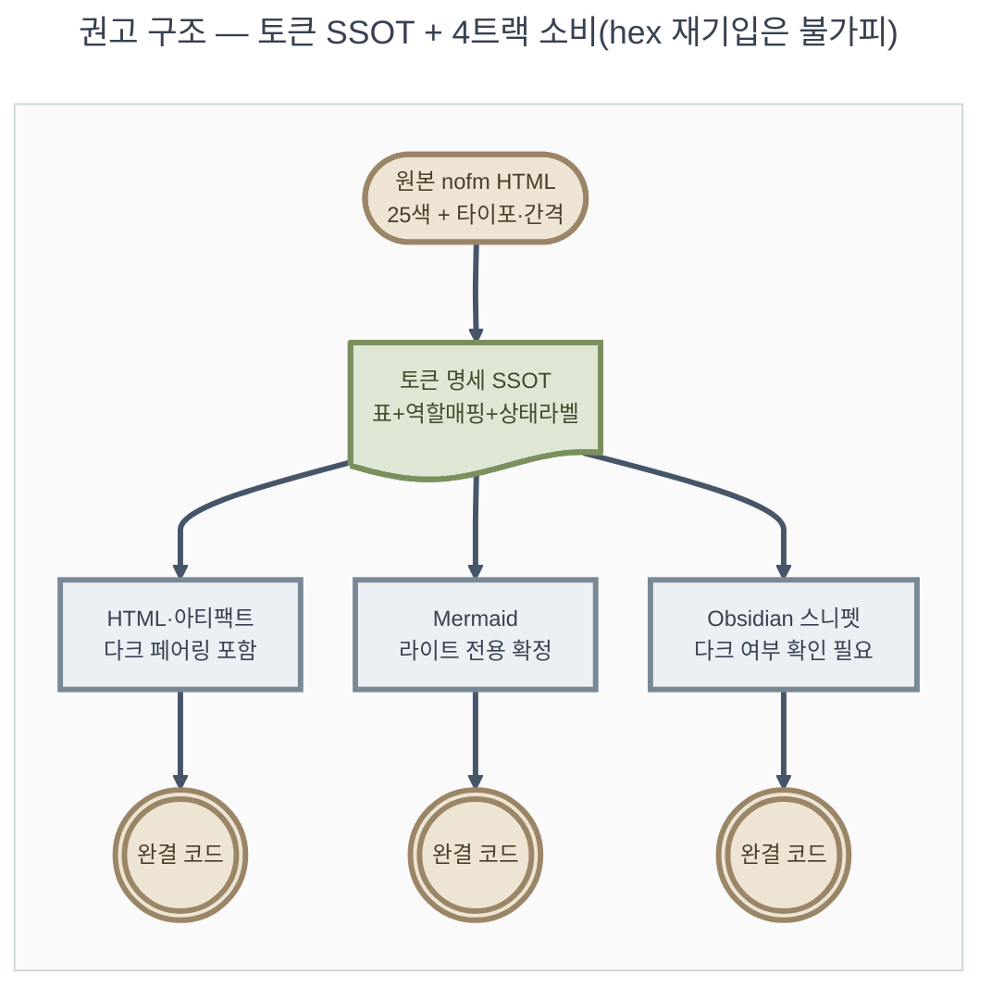

# 05_adversarial-정합 — 웜 페이퍼 테마 지침 신설 정합성 판정

**TL;DR**: 01~04 산출물은 개별적으로 견고하나(hex 실측·WCAG 계산·MCP 검증 등 근거 확실), 서로 **격리된 채 설계**되어 트랙 간 의미 불일치(CIS/NofM 액센트 역할이 Mermaid와 Obsidian에서 서로 다름)와 기존 지침의 선재 결함(§4.3.2 팔레트가 이미 WCAG 1.4.11 미달)을 놓쳤다. 물리적 hex 중복은 매체 특성상 불가피하나 의미·정책 중복은 회피 가능/필요하다. 다크모드는 트랙 균일 처리가 아니라 **트랙별 차등**이 정답(Mermaid=라이트 확정, Artifact=사실상 필수, Obsidian=확인 필요, 정적 HTML=선택). GitHub 렌더 한계는 지침 도입부에 명문화가 필요하며, 유일한 안전한 시각 프리뷰 수단(hex backtick 스와치)을 WebSearch로 실재 확인했다. 파일 구조는 정량 근거(raw 분석만 1,123줄)로 인덱스+`테마/` 서브폴더 분할을 권고한다.

## 0. 검증 방법 — 무비판 수용 방지 조치

`01_색토큰.md`~`04_obsidian-매핑.md` 전문을 Read로 재확인한 데 그치지 않고, 다음을 **독립적으로 재검증**했다.

| # | 검증 대상 | 방법 | 결과 |
|---|---|---|---|
| 1 | 01의 hex 25종 | 원본 `nofm-output-pattern-viewer.html` L8~38 직접 재-Read | 전량 일치, 01 주장 확인 |
| 2 | 04의 wiki 현재 상태(dark, wiki-site.css만 활성) | `.obsidian/appearance.json`·`snippets/` 직접 `cat`/`ls` | 04 주장 정확히 일치("warm-paper" 스니펫 파일 부재도 확인) |
| 3 | 03의 §4.3.2 기존 팔레트 stroke/fill 대비(`core`: 2.77:1) | WCAG 상대휘도 공식 수기 재계산(fill `#dee6d4`/stroke `#7a8f5e`) | 2.767:1 산출 — 03 수치와 일치, **3:1 미달 재확인** |
| 4 | GitHub의 hex 코드 색상 스와치 미리보기 기능 실재 여부 | `WebSearch` | 기능 실재 확인(단 README.md 특수경로 예외 보고 있음, §4 참조) |
| 5 | 현재 작업 git 브랜치 | `git branch` | `claude_feature_doc-theme-style` (요구사항.md §3.3과 일치) |

이 중 3번(기존 §4.3.2 WCAG 미달)과 4번(GitHub 스와치)이 이번 판정의 핵심 신규 발견에 직접 근거로 쓰인다.

---

## 1. 충돌

### 1.1 [발견] CIS/NofM 2-액센트 "역할" 재해석이 Mermaid ↔ Obsidian 트랙 간 상호 불일치

- **Mermaid(03)**: `cis-accent`(테라코타) → `core`(실행·산출 클래스), `nofm-accent`(틸) → `io`(메모리·I/O 클래스). "원본에서 가장 채도 높은 주 액센트 → 가장 강조돼야 할 클래스"라는 강조 강도 기준.
- **Obsidian(04)**: `cis-accent` → **1차 액센트**(`--interactive-accent`/`--link-color`, 링크·버튼 전반), `nofm-accent` → **2차 액센트**(`--link-external-color`/`--interactive-success`, 외부링크·success). "원본에서 두 비교 계열 → 1차/2차 위계"라는 다른 기준.
- 두 매핑 모두 **각자 트랙 안에서는** 합리적이지만, 신규 지침이 "테라코타=?, 틸=?"라는 단일한 의미를 전역적으로 규정하지 않은 채 병존하면, 향후 세 번째 트랙(HTML 컴포넌트 등)을 설계하는 사람이 "이 색이 도메인적으로 뭘 의미하는지" 참조할 **단일 출처가 없다.** 이는 요구사항.md 목표_2("토큰 명세를 SSOT로 두고 3개 적용 방법이 이를 참조")의 취지를 정면으로 벗어난다 — 지금 상태는 SSOT가 아니라 **트랙마다 독자 해석**이다.
- **부수 발견**: 01·03·04 전원이 `--cis-accent`/`--nofm-accent`라는 원본 변수명을 무비판적으로 "canonical 토큰명"으로 채택했다(01: "원본 CSS 변수명을 그대로 canonical 토큰명으로 사용", 03: "01의 채택 방식과 일관"). 그러나 `CIS`/`NofM`은 인공와우 자극전략(CIS: Continuous Interleaved Sampling / NofM: N-of-M)을 가리키는 **Sound1 도메인 특유 약어**다(원본 뷰어 자체가 "CIS vs NofM 자극 출력 패턴" 비교 도구). 요구사항.md TL;DR이 명시한 목표("**도메인 무관** 디자인 시스템으로 추출")와 충돌한다 — 이 무관 팔레트를 가져다 쓰는 미래 문서(예: LED 모듈 문서)의 작성자가 왜 자신의 1차 액센트 변수 이름이 `--cis-accent`인지 알 길이 없다. 요구사항.md §5는 이 명명 결정 자체를 "위임_2"로 이미 Claude 재량에 맡겨뒀는데, 01~04 네 노드 전부가 **검증 없이 기본값(원본 계승)을 택했을 뿐** 실제로 재명명 옵션을 저울질한 기록이 없다.

### 1.2 [발견] 기존 `작성-스타일.md §4.3.2` 팔레트 자체가 이미 WCAG 1.4.11(3:1) 미달 — nofm 작업이 우연히 들춰낸 선재 결함

03이 실측한 대비표(§0-3에서 독립 재계산 완료)에 따르면 **기존** 5-class 팔레트(nofm과 무관, 이미 저장소에 존재)의 stroke/fill 대비는:

| 클래스 | 대비 | WCAG 1.4.11(3:1) |
|---|---|---|
| `core` | 2.77:1 | **FAIL** |
| `terminal` | 2.81:1 | **FAIL** |
| `trigger` | 2.88:1 | **FAIL** |
| `io` | 3.07:1 | PASS(근소) |
| `step` | 3.14:1 | PASS(근소) |

5종 중 3종이 이미 non-text contrast 기준 미달이다. 03은 이를 "여유 있게 3:1을 넘는 설계가 아니었다"로 완곡하게 서술했는데, 실제로는 절반 이상이 **명백한 FAIL**이다. 이건 이번 nofm 작업의 스코프(웜 페이퍼 테마 지침 신설)가 아니지만, 색 접근성을 다루는 김에 발견된 것이므로 방치하면 "새 팔레트는 WCAG 검증까지 했는데 기존 팔레트는 검증 안 된 채 나란히 남는" 기묘한 비대칭이 생긴다. **계획.md에서 반드시 처리 여부를 명문화**해야 하는 항목이지 조용히 넘길 사안이 아니다.

### 1.3 [발견] "같은 슬롯 대체 팔레트" 선택 기준이 `작성-스타일.md §7.2`(모호 표현 금지) 자체를 위반할 소지

03의 §10 권고안: *"기본값은 §4.3.2 5종 muted 유지. 다이어그램이 삽입되는 **문서 자체가 이미 웜 페이퍼 테마**일 때만 본 nofm 팔레트로 전환."*

`작성-스타일.md §7.2`는 지침에 "선택/권장/가능하면" 같은 모호 표현을 금지하고, 조건부 선택은 **if-then으로 기계화**하라고 명시한다(§7.2 "판단을 LLM에 떠넘기지 않는다"). "문서 자체가 웜 페이퍼 테마일 때"는 이 기준 자체가 모호하다 — 다음 중 무엇으로 판별하는가?

- (a) 문서 frontmatter에 특정 필드(`theme: warm-paper`)가 있을 때
- (b) 문서가 신규 테마 지침을 명시적으로 링크하고 있을 때
- (c) 작성자가 "이 문서는 웜 페이퍼다"라고 육안 판단할 때(=모호, 금지 대상)

03도 이 문구화를 "오케스트레이터 계획.md 단계 사항"으로 명시적으로 미뤄뒀으므로 **아직 확정된 위반은 아니지만**, 계획.md 작성 시 (c)로 흘러가지 않도록 반드시 (a) 또는 (b) 수준의 기계적 트리거로 못박아야 한다. 이건 신규 지침이 스스로 §7.2를 어기고 태어나는 것을 막는 게이트다.

### 1.4 [발견] 원본 HTML 참조 링크가 gitignored 별도 repo를 향함 — 루트 단독 클론 시 깨짐 구조

요구사항.md 목표_6은 "원본 파일은 참조 예시로 링크(수정하지 않음)"를 명시한다. 그런데 원본은 `projects/Sound1/docs/참고/nofm/정리/nofm-output-pattern-viewer.html`에 있고, `projects/`는 루트 CLAUDE.md가 명시하듯 **`.gitignore`로 차단된 별도 독립 repo**다(Sound1은 자체 repo). 루트 CLAUDE.md 자신도 "이 폴더(E:\Claude)를 복제하면 다른 환경에서도 컨텍스트 유지 가능"이라는 목적을 표방하는데, **루트 저장소만 단독으로 클론(또는 GitHub.com에서 열람)하면 Sound1은 존재하지 않으므로 신규 지침의 "원본 참고" 링크는 반드시 깨진다.** GitHub은 저장소 경계를 넘는 상대링크를 해석하지 못하므로 이는 로컬 환경 차이 문제가 아니라 **구조적으로 항상 재현되는** 문제다.

이는 수용기준_2("cross-link 살아있음, broken link 0")와 직접 충돌 소지가 있다 — 지금 이 checkout에서는 링크가 "살아있"지만, 그건 이 특정 개발 환경이 Sound1을 옆에 함께 클론해 둔 우연 때문이지 지침 자체의 이식성이 아니다. **결론**: 원본 링크는 "참고용 각주"로만 걸고, §2(중복성 반론)에서 다루듯 **토큰 명세 절은 원본 링크 없이도 자체 완결(hex 전량 인라인)이어야 한다** — 이게 단순한 사용 편의가 아니라 이 링크 취약성에 대한 구조적 방어책이다.

### 1.5 [발견] "HTML 뷰어·아티팩트" 트랙과 `작성-스타일.md §1`(GFM 기본 포맷) 사이 스코프 경계 불명확

§1은 "사용자가 명시적으로 다른 포맷을 지정하지 않는 한 모든 문서는 GFM(.md)"을 원칙으로 못박는다. 신규 지침이 "이제 예쁜 HTML 테마가 생겼다"는 이유로 향후 세션이 문서 작성 시 HTML/Artifact를 더 자주 고르는 쪽으로 판단이 흔들릴 위험이 있다(테마의 매력이 포맷 선택 이유가 되는 역전). 신규 지침에 "본 트랙은 §1의 예외 상황(사용자가 이미 HTML/Artifact를 선택한 경우)에만 적용 — 테마 존재 자체가 포맷 선택 사유가 되지 않는다"는 가드레일 문구가 필요하다.

### 1.6 다크모드 관련 충돌은 §3에서 별도 상술

Artifact 도구 자체의 필수 요구사항("Theme-aware... 단일 룩을 의도적으로 committing하지 않는 한 라이트+다크 둘 다 스타일")과 원본의 라이트 단일 전제가 정면으로 부딪히는 지점은 다크모드 공백(§3)에서 깊게 다룬다 — 성격상 "충돌"이자 동시에 "공백"이라 양쪽에 걸쳐 있다.

### 1.7 검토했으나 기각한 후보 (신뢰성을 위해 명기)

| 후보 | 검토 결과 | 기각 사유 |
|---|---|---|
| §6 라벨링 규칙(한글 라벨, 알파벳 약어 금지)과 `--cis-accent` 등 CSS 변수명 | 충돌 아님 | §6은 "문서 항목 식별자"(질문_1 등) 대상, CSS 커스텀 프로퍼티는 코드 식별자라 스코프 밖(§6.4 예외 취지와도 부합) |
| §4.3.1 요소② 폰트 12px 고정 vs nofm 자체 9~17px 스케일 | 충돌 아님 | nofm의 "12px=보조 텍스트 기준"과 우연히 값이 겹칠 뿐 설계 의도상 연동 아님 — 정보성 각주 수준 |
| §4.3.1 요소⑧ 사각형 0개 vs nofm HTML 카드가 대부분 사각형 | 충돌 아님 | 사각형 금지는 Mermaid flowchart **노드 모양** 다양성 규칙, 일반 HTML 레이아웃 요소와는 스코프가 다름 |
| dataviz 스킬의 브랜드-중립 차트 팔레트 vs CIS/NofM 2-액센트 | 약한 주의 대상(충돌 아님) | dataviz는 통계 마크(3+ 카테고리) 색 규칙이라 관심사가 다름. 단, N>2 계열 차트에 CIS/NofM 2색만 억지로 늘려쓰면 dataviz의 검증된 팔레트를 깨뜨릴 수 있어 "차트 마크 색은 dataviz 우선, 페이지 크롬은 nofm"이라는 경계 한 줄 정도는 신규 지침에 있으면 좋음(엄밀히는 `docs/지침/` 범위 밖이라 필수는 아님) |

---

## 2. 중복성 반론 — "토큰 명세만" 은 나머지 3종과 물리적으로 중복되는가

### 2.1 판정: 리터럴 hex 중복은 불가피하고 문제가 아니다. 의미·정책 중복이 진짜 위험이다.

세 실행 매체(CSS `:root`, Mermaid `themeVariables`/`classDef`, Obsidian CSS)는 전부 **런타임에 다른 파일을 참조할 수 없는 독립 완결 코드**를 요구한다 — Mermaid 코드 블록은 외부 `.md`를 `@import`하지 못하고, Obsidian 스니펫은 markdown 표를 읽어오지 못한다. 즉 세 곳 모두 실제 hex 리터럴을 **각자 다시 써야만 동작한다.** 이건 마치 소설을 세 언어로 번역할 때 원문을 각 번역본에 다시 옮겨 적어야 하는 것과 같은 구조적 필연이며, "중복이니 줄이자"의 대상이 아니다.

진짜 위험한 중복은 §1.1에서 실증한 것 — **의미/역할의 독자적 재정의**(CIS-accent가 트랙마다 다른 뜻)다. 이건 물리적으로 안 겹치지만 개념적으로 어긋나며, 여러 문서를 넘나드는 사람에게 혼란을 준다.

### 2.2 SSOT는 "문서 SSOT"이지 "코드 SSOT"가 아니다 — 드리프트 리스크 명시 필요

4개 산출물(spec + HTML + Mermaid + Obsidian) 사이에는 빌드타임/런타임 참조 메커니즘이 전혀 없다. 원본 nofm 팔레트가 바뀌면(예: 색상 하나 조정) **사람이 4곳을 전부 손으로 찾아 동기화**해야 한다. "SSOT"라는 표현이 "한 곳만 고치면 자동 전파된다"는 오해를 줄 수 있으므로, 신규 지침에는 "이 SSOT는 문서적 SSOT다 — 값 변경 시 본 문서를 먼저 고치고, 나머지 3절에서 동일 hex를 `grep`으로 찾아 수동 동기화할 것"이라는 명시적 유지보수 절차 문구가 필요하다. 이는 은수님이 실제로 다시 겪을 유지보수 비용이라 지침에 없으면 실수로 이어진다.

### 2.3 색 토큰 vs 타이포/간격/컴포넌트 토큰의 재사용 비대칭

| 토큰 유형 | HTML | Mermaid | Obsidian | 재사용 폭 |
|---|---|---|---|---|
| 색(25종) | 전량 소비 | 부분 소비(재매핑) | 전량 소비 | **4트랙 모두 관련** |
| 타이포(font-size 9단계 등) | 전량 소비 | `fontSize`만(기존 §4.3.1 고정값 유지) | `baseFontSize` 등 일부만 | HTML 중심, 나머지는 최소 |
| 간격·radius·컴포넌트(카드/stats그리드 등) | 전량 소비 | 무관(노드 spacing은 mermaid 자체 옵션) | 간접적(일부 변수로만) | **HTML 전용에 가까움** |

"토큰 명세"를 하나의 균질 섹션으로 만들면 이 비대칭이 감춰진다. **색 토큰 절**은 실제로 3트랙(HTML·Mermaid·Obsidian)이 참조하는 진짜 SSOT 역할을 하지만, **타이포/간격/컴포넌트 절**은 사실상 HTML 트랙 전용 명세에 가깝다 — 이 구분을 지침 구조 자체(하위 섹션 분리)에 반영하는 편이 정확하다.

### 2.4 결론

은수님의 "토큰 명세" 선택은 중복 낭비가 아니라 **필요한 4번째 산출물**이다. 단, 그 실질 가치는 (1) 25색 전량의 캐노니컬 표+범주+사용상태(활성/브릿지전용/미사용, 01의 발견 계승), (2) §1.1에서 드러난 액센트 역할을 **하나로 고정**하는 단일 매핑 규칙, (3) §1.4 링크 취약성에 대비한 자체 완결적 인라인 hex 표 — 이 세 가지에서 나온다. "복붙용 요약"이 아니라 "나머지 3트랙이 이탈하지 못하게 붙잡는 앵커" 역할로 설계해야 한다.

---

## 3. 다크모드 공백 — 트랙 균일 처리가 아니라 차등이 정답

원본은 라이트 단일이지만, **4트랙에 다크모드가 필요한 정도는 서로 다르다.** "전부 라이트 전용으로 못박기"는 최소 1개 트랙(Artifact)에서 실질적 리스크가 있다.

| 트랙 | 다크모드 필요성 | 근거 |
|---|---|---|
| **Mermaid** | 불필요(라이트 전용이 오히려 정답) | 기존 `작성-스타일.md §4.3.1` 요소⑤ "배경 환경 무관 고정"은 애초에 뷰어 테마와 무관하게 항상 동일하게 보이길 원하는 정책이다. `darkMode:false` 고정은 이 기존 설계 의도와 **일치**한다 — 다크 변형을 만드는 게 오히려 기존 정책에 반한다 |
| **아티팩트(Artifact 도구)** | **사실상 필수** | 본 세션이 사용하는 Artifact 도구 스펙 원문: *"Pages render in the viewer's light or dark theme. **Unless the design deliberately commits to a single look, style both**: use `@media (prefers-color-scheme: dark)`... the viewer's theme toggle... **must win in both directions**."* 원본은 이 "의도적 단일 룩 committing" 예외를 명시적으로 선언한 적이 없다 — 그냥 라이트뿐이다. 신규 지침이 이 트랙에 그대로 적용하면 도구 계약을 우회 없이 어기게 된다. **최소 다크 페어링 팔레트 골격(예: 크림→차콜/딥브라운 배경 반전, 액센트 hue는 유지하되 명도만 조정)을 지침에 포함하거나, "본 팔레트는 라이트 단일을 의도적으로 commit — 뷰어 다크 테마를 의도적으로 무시" 문구를 명시**해야 한다. 둘 중 하나를 반드시 선택해야지 침묵은 안 된다 |
| **정적 HTML 뷰어(비-Artifact)** | 선택(라이트 전용 허용) | 원본 nofm 뷰어 자체가 이 케이스 — Artifact 도구 계약이 적용되지 않는 독립 파일은 라이트 단일로 남아도 무방(원본 그대로) |
| **Obsidian** | 도구 계약상 의무 아니나 **실사용 갭이 즉시 체감됨** | `.theme-light` 스코프는 기술적으로 정당한 선택이지만, `.obsidian/appearance.json` 직접 확인 결과 **wiki vault 현재 베이스 스킴이 이미 dark**(`"theme":"obsidian"`)다. 스니펫을 켜도 아무 변화가 없는 실패 경험이 예정돼 있다(04가 이미 §10에서 정확히 지적) |

### 3.1 다크모드 관련 프로세스 권고

`요구사항.md` 사용자결정_2("다크 모드 포함 여부(분석 후 옵션 제시 가능)")에 따라 최종 결정은 계획.md 단계에서 사용자 확인 사항이지만, 이 분석이 제공하는 새 정보는 결정적이다 — **"다크 모드는 부가 확장 옵션"이 아니라 "Artifact 트랙은 도구 계약상 사실상 필수, Obsidian은 현재 상태상 방치 시 즉시 실패 경험"** 이라는 사실이다. 단순히 "다크 모드 포함할까요?"로 뭉뚱그려 묻기보다, 트랙별 표(위)를 그대로 계획.md/사용자 확인 질문에 반영해 **트랙 단위로 답을 받는 것**을 권고한다.

---

## 4. GitHub 렌더 현실 — 지침이 명확히 다뤄야 할 것

### 4.1 원칙: 지침 문서(.md) 자체는 nofm 룩을 입지 않는다

`작성-스타일.md §1`이 이미 못박듯 모든 .md는 "GitHub.com 또는 VSCode GitHub Markdown Preview" 기준으로 렌더된다. GitHub의 마크다운 렌더러는 보안상 `<style>` 블록·외부 스타일시트·대다수 인라인 `style=` 속성을 **sanitize(제거)**한다. 즉 **토큰 명세 문서에 아무리 CSS를 붙여넣어도 그 문서 자신은 절대 웜 페이퍼로 보이지 않는다.** 이건 버그가 아니라 매체의 근본 제약이며, 신규 지침 도입부에 이 사실을 명시하지 않으면 향후 누군가(미래 세션 포함)가 "왜 지침 문서 자체는 안 예뻐 보이지?"를 "고쳐야 할 문제"로 오인해 무의미한 시도를 반복할 수 있다.

### 4.2 유일하게 안전한 예외 — hex 코드 backtick 색상 스와치 (WebSearch로 실재 확인)

GitHub은 백틱으로 감싼 6자리 hex 코드(예: `` `#FBF7EE` ``)에 **작은 색상 점(dot)을 자동으로 붙여주는 네이티브 기능**을 갖고 있다(WebSearch로 확인 — dev.to 기술 문서 및 GitHub 커뮤니티 스레드에서 교차 확인).

> [!NOTE]
> 단 커뮤니티 보고(GitHub Discussions #134269)에 따르면 **저장소 홈 화면에 자동 렌더되는 README.md 특수 경로**에서는 이 dot이 빠지는 사례가 보고돼 있어 100% 보장은 아니다. 그러나 신규 지침이 위치할 `docs/지침/` 하위 파일들은 애초에 README.md가 아닌 일반 `.md`(`작성-스타일.md` 류)이고 `작성-스타일.md §1`의 렌더링 기준도 "blob 뷰/VSCode 프리뷰"이지 저장소 홈 자동렌더가 아니므로, 이 제한에 해당할 가능성은 낮다 — 다만 실제 배포 후 GitHub.com에서 육안 스팟체크를 권고한다.

**실용적 결론**: 토큰 표의 hex 열은 일반 텍스트가 아니라 `` `#FBF7EE` `` 형태의 인라인 코드로 작성하면, GitHub이 임의 CSS 없이도 최소한의 시각적 색 힌트를 제공한다 — 이를 신규 지침의 표 작성 컨벤션으로 채택 권고.

### 4.3 Mermaid는 다른 경로다 — "임의 CSS"가 아니라 mermaid.js 자체 테마 DSL

Mermaid `themeVariables`/`classDef`가 실제로 렌더되는 이유는 "GitHub이 CSS를 허용해서"가 아니라, GitHub이 ` ```mermaid ` 펜스 블록을 **자사 파이프라인에서 mermaid.js로 직접 실행해 SVG로 그려주는 별도 네이티브 경로**를 갖고 있기 때문이다. 즉 §4.1의 "임의 CSS 불가" 제약과 Mermaid 테마는 애초에 **다른 층위**다 — 신규 지침이 이 구분을 명확히 설명해야 "왜 Mermaid는 색이 먹히는데 다른 데는 안 되지?"라는 혼란을 막는다.

단, 한 가지 잔여 리스크는 명시해야 한다: 03이 얻은 MCP 검증기의 `valid:true`는 **Mermaid 문법 파서 정합성**을 보장할 뿐, GitHub.com 프로덕션이 실제로 고정해 쓰는 mermaid.js 버전과 100% 동일한 렌더 결과를 보장하지 않는다(기존 `작성-스타일.md §4.3.4`의 v11 신 노드 fallback 노트가 이미 이런 버전차 리스크를 인지하고 있다). **중요 다이어그램은 MCP 검증 통과 후에도 실제 GitHub.com 페이지에서 한 번은 육안 스팟체크할 것**을 신규 지침에 권고 문구로 남길 필요가 있다.

### 4.4 HTML 파일과 Obsidian `.css`는 저장소에서 "텍스트"로만 보인다

`.html`/`.css` 파일을 GitHub 저장소 브라우징 화면에서 열면 **문법강조된 소스코드**로만 표시된다(파일을 실행/렌더하지 않음 — 보안상 당연한 제약). 실제 웜 페이퍼 룩은:

- HTML 뷰어: 로컬에 다운로드해 브라우저로 직접 열어야 확인 가능
- Obsidian 스니펫: Obsidian 앱에서 스니펫을 활성화하고(+ 라이트 베이스 스킴 선행 전환, §3 참조) 앱 안에서만 확인 가능

이 역시 지침에 명시하지 않으면 "GitHub에서 프리뷰가 안 보이는 게 이상하다"는 오인의 소지가 있다.

### 4.5 요약 표 (지침에 그대로 반영 권고)

| 매체 | GitHub에서 보이는 것 | 실제 룩 확인 방법 |
|---|---|---|
| 토큰 명세 `.md` | GitHub 표준 프리뷰(라이트/다크는 GitHub 자체 UI 토글에 종속, nofm과 무관) | hex backtick 스와치 정도가 유일한 시각 힌트 |
| Mermaid 코드 블록 | **실제 렌더된 SVG** (mermaid.js 네이티브 경로) | GitHub.com에서 바로 보임(버전차 리스크만 잔존) |
| HTML 뷰어 `.html` | 문법강조 소스 텍스트만 | 로컬 다운로드 + 브라우저로 열기 |
| Obsidian 스니펫 `.css` | 문법강조 소스 텍스트만 | Obsidian 앱 내 스니펫 활성화 + 라이트 스킴 전환 |

---

## 5. 파일 구조 권고

### 5.1 정량 근거

| 대상 | 줄 수 |
|---|---|
| 01_색토큰.md | 183 |
| 02_타이포-컴포넌트.md | 272 |
| 03_mermaid-매핑.md | 355 |
| 04_obsidian-매핑.md | 313 |
| **fan-out raw 분석 합계** | **1,123** |
| (대조) 기존 `작성-스타일.md` — 이미 3레벨 분할 선례가 된 파일 | 488 |

최종 지침은 raw 분석보다 압축되겠지만, 4트랙 모두 "복붙 가능한 실사용 코드 스니펫"(HTML `:root`+컴포넌트 CSS, Mermaid 예제 4종, Obsidian ~120줄 CSS 전문)을 담아야 하는 실용 문서 특성상 대폭 축약은 어렵다. raw 자료가 이미 488줄 파일의 2.3배라는 사실 자체가 단일 파일 부적합의 강한 정량 신호다.

### 5.2 기존 선례 확인 (직접 `ls` 검증)

`docs/지침/일반/문서/`(폴더-구조·메타-frontmatter·작성-스타일 3파일)와 `일반/작업/`(4단계-프로세스·완료처리 2파일 + `양식/`)이 이미 "인덱스 상위 + 하위 서브폴더" 3레벨 패턴을 쓰고 있다(`폴더-구조.md §2`: "분할된 거대 지침은 `일반/문서`·`일반/작업` 같이 3레벨 OK"). **두 선례 모두 README.md가 없다** — `문서 메타데이터.md §3.2`가 서브폴더 README를 "5+ 파일 시 가치"의 선택 사항으로 규정하는데 두 폴더 다 미달(3파일, 2파일+양식)이기 때문이다. 신규 테마 폴더도 4파일 구성이면 같은 논리로 README 생략이 일관적이다(단, 5번째 파일이 추가되면 재검토 여지).

### 5.3 제안 구조 (예시 — 최종 명명은 요구사항.md 위임_1로 계획.md 단계에서 확정)



검증: MCP `validate_and_render_mermaid_diagram` → 출력이 토큰 한도를 초과해 저장 파일로 반환(§4.5.2 예견된 정상 동작), `grep`으로 `"valid":true` 필드 확인 완료.

```
docs/지침/일반/
├── 문서 테마 스타일.md          (인덱스 — TL;DR·4트랙 개요·다크모드 차등표·GitHub 렌더 한계 요약 + 하위 링크)
└── 테마/
    ├── 토큰.md                  (SSOT — 색 25종 표+역할매핑 + 타이포·간격·컴포넌트, §2.3 비대칭 반영해 하위 구획)
    ├── HTML-아티팩트.md         (Track 1 — :root 스니펫 + 다크 페어링 골격, §3 필수)
    ├── Mermaid.md               (Track 2 — themeVariables/classDef + §4.3.2-bis 선택기준)
    └── Obsidian.md              (Track 3 — CSS 스니펫 + wiki 배치·활성화 + 다크 확인사항)
```

### 5.4 기존 `작성-스타일.md`와의 관계 — 전문 복제 금지, 앵커만

`작성-스타일.md §4.3.2` 바로 아래 짧은 `§4.3.2-bis`(가칭) 서브섹션만 삽입한다 — nofm classDef 표 + §1.3의 if-then 선택 기준 요약 정도로 **짧게**, 상세(WCAG 실측표·예제 4종)는 신규 `테마/Mermaid.md`로 링크 아웃한다. §4.3.1의 8요소 구조 정책 전문을 신규 파일에 다시 베끼지 않는다 — 정책 원문이 두 곳에 존재하면 향후 §4.3.1이 개정될 때 한쪽만 갱신되고 다른 쪽이 조용히 stale해지는, §2에서 구분한 "회피 가능해야 하는 정책 중복"이 실제로 발생한다.

### 5.5 부수 작업

- `CLAUDE.md`의 "지침 문서 (전체)" 표에 신규 인덱스+하위 4파일을 `문서 작성 규칙.md`/`일반/문서/` 행과 동일한 `↳` 서브 행 패턴으로 등재해야 완결된다.
- 신규 파일 전체 `maturity: experimental`로 시작(기존 컨벤션 — 신규·1~2회 적용·검증 부족 단계는 experimental, `메타-frontmatter.md §1.2`).

---

## 6. 총평

01~04는 각자 트랙 안에서 근거가 탄탄하다(hex 실측 이중대조, WCAG 수치 계산, MCP 검증기 valid 확인, wiki 실제 파일 상태 `ls` 근거 등 — 이번 재검증에서 전부 독립 확인됨, §0). 그러나 **네 노드가 서로의 산출물을 보지 못한 채 병렬로 설계**됐기 때문에, 개별 트랙 내부에서는 안 보이는 두 종류의 사각지대가 남았다: (1) 트랙 간 의미 재정의 불일치(§1.1 액센트 역할, 이번 adversarial 노드가 최초 포착), (2) 기존 지침 자체에 이미 있던 결함의 재확인 누락(§1.2 WCAG 미달, 03이 발견은 했으나 심각도를 완곡화). adversarial 검증 노드가 정확히 이 두 지점에서 가치를 냈다 — parallel 노드 각각을 다시 검산하는 게 아니라 **노드 간 경계에서만 나타나는 불일치**를 잡아내는 것이 이 노드의 존재 이유였다.
