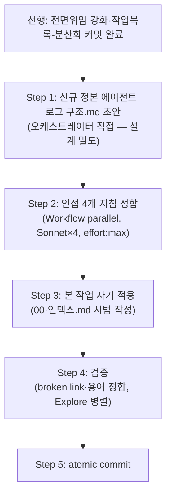

# 계획: 에이전트-로그 상세화

**TL;DR**: 신규 정본 `docs/지침/일반/에이전트 로그 구조.md` 신설(3요구 규약·파일 구조·양식) + 인접 4개 지침(서브에이전트 활용·워크플로우 오케스트레이션·폴더-구조·README) 정합 + 본 작업 폴더 자기 적용. 신규 파일은 오케스트레이터 직접 초안(설계 밀도 높음)하되, 인접 4개 정합 편집은 Workflow Sonnet effort:max 병렬 위임. 3개 자매 작업 중 **마지막 순서**로 커밋(전면위임 → 분산화 → 본 작업).

## 1. 전체 시퀀스



## 2. 단계별 상세

### Step 1: 신규 정본 `docs/지침/일반/에이전트 로그 구조.md` 초안 (오케스트레이터 직접)

> [!NOTE]
> 이 파일은 설계 밀도가 높고(3요구 통합·이원화 원칙·양식) 본 작업의 핵심 산출물이라, "요구 해석→설계"에 준하는 오케스트레이터 직접 작업으로 초안한다. 인접 파일의 기계적 정합 편집(Step 2)만 위임한다.

**문서 골격**(frontmatter: maturity experimental):
1. **TL;DR**
2. **§1 목적·범위** — 에이전트-로그는 오케스트레이션의 git-tracked 감사 기록. 하네스 자동 저널(세션 스코프)과의 역할 분리
3. **§2 폴더·파일 구조**:
   ```
   tasks/<모듈>/<작업>/에이전트-로그/
   ├── 00_오케스트레이터-입력.md      원본 입력 + 요구 해석 + 위임 설계 근거 (통합)
   ├── NN_<역할·페르소나>.md          노드별 결과 전문 (노드가 직접 Write)
   ├── 인덱스.md                       노드 목록·모델·effort·수렴 포인터
   └── (선택) 저널 사본/링크           Workflow journal.jsonl · Agent output_file
   ```
   - 99 수렴 파일은 두지 않음 — 수렴은 작업의 `분석.md`/`계획.md`가 흡수(Sound1 관행 계승)
4. **§3 `00_오케스트레이터-입력.md` 양식** (요구1+요구3 통합, 결정_2):
   - `## 원본 입력` — 은수님 원문 verbatim
   - `## 요구 해석` — 오케스트레이터 1인칭: 무엇을 원하는가·모호점 어떻게 해소
   - `## 위임 설계 근거` (체크리스트, 요구3 흡수):
     - [ ] 왜 이 분해(N개 노드)인가
     - [ ] 어떤 패턴([`워크플로우 오케스트레이션.md §2`] 4대 중 택1)·왜
     - [ ] 모델·effort 배분·왜
   - `## 역할 배분표` — 노드별 역할·모델·effort
5. **§4 노드 로그 `NN_<역할>.md`** — 노드가 결과 전문 직접 Write(현행 관행 추인). 입력 프롬프트 원문은 §5 저널로 대체
6. **§5 입출력 원문 보존 (요구2, 이원 구조 결정_3)**:
   - 출력: 노드 결과 전문 = NN 파일(위)
   - 입력: `Workflow` journal.jsonl / `Agent` output_file가 프롬프트 원문 자동 보존 → 이를 1차 소스로 인정, 작업 폴더에 사본 또는 경로 링크. 저널 부재 세션만 오케스트레이터 선Write
7. **§6 fan-in 이원화 원칙** (결정_4) — "로그 파일=원문 / 메인 반환=3줄"은 층위가 달라 fan-in 예산과 무충돌 명시
8. **§7 인덱스.md 양식** — 노드 목록·모델·effort·토큰·수렴 포인터
9. **§8 rules 하네스 §2와의 관계** — 참조 선례 크레딧 + 차이(99 미사용·저널 재사용)
10. **§9 관련 지침** — 전면위임 §1.1·서브에이전트 활용 §2.3·워크플로우 오케스트레이션 §4

**검증**: frontmatter+TL;DR 셀프체크, 4대 패턴 표 링크 유효
**commit 메시지**: `Policy(지침): 에이전트 로그 구조.md 신설 — 3요구(사고과정·입출력원문·설계근거) 규약`

### Step 2: 인접 4개 지침 정합 (Workflow parallel, Sonnet×4, effort:max)

각 파일 독립이므로 병렬. 서브에이전트는 Step 1에서 확정된 신규 파일 경로·핵심 용어를 프롬프트로 받아 링크·문구만 삽입:

- **노드 A** `서브에이전트 활용.md §2.3` 끝 — fan-in 이원화 1문장 + `[에이전트 로그 구조.md]` 링크
- **노드 B** `워크플로우 오케스트레이션.md §4` 끝 — 이원화 + 하네스 저널이 입력 원문 자동 보존 1문장 + 링크
- **노드 C** `폴더-구조.md §3` "서브폴더 X" — `에이전트-로그/`를 명시적 예외로 등재
- **노드 D** `README.md` 표 — 신규 `에이전트 로그 구조.md` 행 추가(maturity experimental)

**commit 메시지**: `Policy(지침): 에이전트 로그 구조 신설 정합 — 인접 4개 지침 링크·예외`

### Step 3: 본 작업 자기 적용 (오케스트레이터 직접)

신규 규약을 본 작업 폴더 `에이전트-로그/`에 시범 적용(자기 적용 1건):
- `00_오케스트레이터-입력.md` 작성 — 은수님 원문 + 요구 해석 + 위임 설계 근거(왜 3조사+1검증 노드·왜 parallel+adversarial·왜 Sonnet max)
- `인덱스.md` 작성 — 4노드 목록·모델·effort·토큰(358K)·수렴 포인터(본 분석.md §1)
- 기존 `조사_journal.jsonl`을 §5 저널 사본으로 편입

**commit 메시지**: `Docs(meta): 에이전트-로그 상세화 자기 적용 — 00·인덱스 시범 작성`

### Step 4: 검증 (Explore 병렬 fan-out)

- 검증자 A: 신규 파일 + 4개 인접 파일 간 cross-link broken 0, 4대 패턴 표 앵커 유효
- 검증자 B: 3개 자매 작업 용어 정합("전면 위임"·"§1.1"·"이원화") 모순 0

**검증**: 두 서브에이전트 PASS

### Step 5: atomic commit (오케스트레이터 직접)

Step 1~3 diff 전수 검토 후 논리 단위 커밋(신규 규약 / 인접 정합 / 자기 적용 = 3커밋 또는 사용자 선호).

## 3. 검증 절차

### 3.1 단계별
- 각 서브에이전트 완료 후 `git diff --stat`

### 3.2 최종
- broken link 0, 수용 기준(요구사항 §3) 전 항목
- 선행 조건: 전면위임·분산화 2작업 커밋 완료 확인

## 4. 위험 관리

| 위험 | 가능성 | 영향 | 완화 |
|---|---|---|---|
| 신규 규약이 실무에서 축약(rules 전철) | 중 | 중 | 저비용 구조(저널 재사용·선Write 최소) |
| 3작업 동일 브랜치 순차 커밋 순서 혼선 | 낮음 | 중 | 선행 조건 게이트 명시(전면위임→분산화→본작업) |

## 5. 작업 분담 (서브에이전트 활용)

- **오케스트레이터 직접**: Step 1(신규 정본 초안 — 설계 밀도), Step 3(자기 적용), Step 4 fan-in, Step 5 커밋
- **Workflow Sonnet×4 (effort:max)**: Step 2 인접 4개 지침 정합
- **Explore×2**: Step 4 검증

## 6. 진행 추적

- [ ] Step 0: 전면위임·분산화 커밋 완료 (선행)
- [ ] Step 1: 신규 정본 초안
- [ ] Step 2: 인접 4개 정합
- [ ] Step 3: 자기 적용
- [ ] Step 4: 검증
- [ ] Step 5: 커밋

## 7. 관련 산출물

- [요구사항.md](요구사항.md) · [분석.md](분석.md) · [이력 및 결과.md](이력%20및%20결과.md)

## 자체 검토

### 지침 준수 여부
| 지침 | 준수 |
|---|---|
| [`작업 진행 규칙.md`](../../../../지침/일반/작업%20진행%20규칙.md) | ✅ |
| [`서브에이전트 활용.md`](../../../../지침/일반/서브에이전트%20활용.md) | ✅ 정본 초안 직접·정합 위임 |
| [`Git/브랜치, 병합 규칙.md`](../../../../지침/Git/브랜치,%20병합%20규칙.md) | ✅ 동일 브랜치 순차 |

### 논리적 정합성
| 점검 | 결과 |
|---|---|
| 분석 결정 8건 계획 반영 | ✅ |
| adversarial 반론(통합·저비용) 반영 | ✅ Step 1 §3·§5 |
| 서브에이전트 분담 명시 | ✅ |

### 미해결 이슈
| 이슈 | 처리 |
|---|---|
| 목표_5 소급(전면위임·분산화 2작업) | 사용자 결정 — 승인 시 확인 |

---

> [!IMPORTANT]
> **사용자 승인 대기** — 3개 자매 작업(전면위임-강화·작업목록-분산화·본 작업)을 함께 승인받아 순차 구현 착수.
