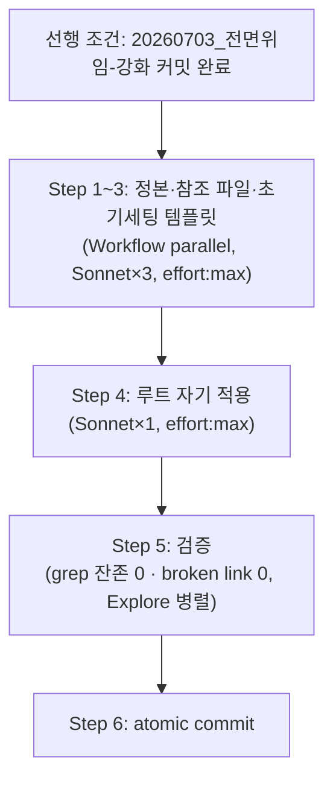

# 계획: 작업 목록 모듈별 분산화

**TL;DR**: `폴더-구조.md`(정본) §5를 3단 구조(모듈 작업 목록·루트 인덱스·모듈 현황)로 재작성하고, 6개 참조 파일을 경미 동기화하고, `프로젝트 초기 세팅.md` §4 템플릿을 전면 재작성한다. 이후 루트 저장소 자신에 자기 적용 — `docs/tasks/meta/작업 목록.md` 신설(기존 16행+갱신이력 29건 이동, `20260609` 상태 정정, 신규 2행 등재) + 루트 `docs/tasks/작업 목록.md` 인덱스 축소. **`20260703_전면위임-강화` 작업의 커밋 완료 후** 착수(공유 파일 `작업 규칙.md` 동시 편집 회피).

## 1. 전체 시퀀스



## 2. 단계별 상세

### Step 1: `폴더-구조.md` 정본 재작성 (Sonnet 서브에이전트 A)

**작업**:

1. **TL;DR** 교체:
   > **TL;DR**: docs/ 폴더는 `지침/`·`tasks/` 2대 카테고리(회고는 지침에 흡수, 사용방법·참고는 Wiki). tasks는 모듈/작업 2레벨 고정, 작업 폴더명은 `YYYYMMDD_<slug>` 날짜 prefix. 표준 산출물 4파일: 요구사항.md·분석.md·계획.md·이력 및 결과.md. 작업 레지스트리는 3축 — **모듈별 `작업 목록.md`**(작업 단위 생애주기, 해당 모듈 한정)·**루트 `작업 목록.md`**(모듈 링크만 거는 인덱스)·`모듈 현황.md`(모듈 단위 헬스). 2026-07-03 분산화(Z-2) — 단일 표 비대화 문제 해소.

2. **§1 전체 레이아웃** 트리 중 `tasks/` 블록을 다음으로 교체:
   ```
   └── tasks/                          작업 스코프
       ├── 작업 목록.md                     루트 인덱스 (모듈별 목록 파일 링크만 — Z-2, 2026-07-03~)
       ├── 모듈 현황.md                모듈 인덱스 (모듈 단위 헬스, Wiki sync 진입판단용)
       └── <모듈>/                      작업 폴더 (활성·완료 무관 영구 위치)
           ├── 작업 목록.md             모듈 작업 레지스트리 (작업 단위 생애주기, 해당 모듈 한정 — Z-2)
           └── YYYYMMDD_<작업슬러그>/  (날짜 prefix — Z-1, 2026-05-18~)
               ├── 요구사항.md
               ├── 분석.md
               ├── 계획.md             (코딩 작업은 구현계획.md alias 호환)
               └── 이력 및 결과.md     (시계열 로그 + 완료 시 요약 추가)
   ```
   그 직후 있는 `> [!NOTE]` (Task α/Package C 설명) 박스 뒤에 신규 NOTE 박스 추가:
   > [!NOTE]
   > **Z-2 (2026-07-03)**: 작업 목록 모듈별 분산화 — 작업 단위 상세 레지스트리를 `tasks/<모듈>/작업 목록.md`로 이관, 루트 `tasks/작업 목록.md`는 모듈 링크만 거는 인덱스로 축소. 근거: 작업 누적 시 단일 표가 기하급수적으로 비대해지는 문제(Sound1 12모듈·47행·88KB 실증 — 타 6개 프로젝트 합계의 6.5배).

3. **§5 전체**(`## 5. 작업 레지스트리 — tasks/작업 목록.md` 헤더부터 `## 6. 모듈 인덱스` 헤더 직전까지)를 다음으로 **전면 교체**:

   ````markdown
   ## 5. 작업 레지스트리 — 3단 구조

   ### 5.1 설계 원칙 (Z-2, 2026-07-03)

   작업이 누적될수록 루트 단일 표가 기하급수적으로 비대해지는 문제(실증: Sound1 12모듈·47행·88KB, 타 6개 프로젝트 합계의 6.5배)를 해소하기 위해 작업 레지스트리를 3단으로 분리한다:

   | 레지스트리 | 위치 | 스코프 | 역할 |
   |---|---|---|---|
   | **모듈 작업 목록** | `tasks/<모듈>/작업 목록.md` | 모듈 1개 | 작업 단위 생애주기 상세 |
   | **루트 작업 목록** | `tasks/작업 목록.md` | 전체 | 모듈 존재·링크만 안내하는 순수 라우터 |
   | **모듈 현황** | `tasks/모듈 현황.md` | 전체 | 모듈 단위 헬스 통계(§6, 변경 없음) |

   > [!IMPORTANT]
   > 루트 작업 목록과 모듈 현황은 **역할이 다르다** — 통합하지 않는다(§6.1 "정렬 모순" 결정 유지). 루트 작업 목록은 통계를 갖지 않는 순수 링크 라우터, 모듈 현황은 통계 스냅샷이다.

   ### 5.2 모듈 작업 목록 — `tasks/<모듈>/작업 목록.md`

   **목적**: 해당 모듈의 모든 작업의 활성/완료 상태·태그·요약·연계 관계를 관리. 새 작업 시 같은 모듈의 기존 작업 맥락을 한눈에 확인(구 루트 단일 표의 역할을 모듈 스코프로 계승).

   **파일 구조**:

   ```markdown
   # 작업 목록 (<모듈> tasks index)

   `<모듈>` 모듈의 작업 레지스트리. 상태 정의는 [루트 인덱스](../작업%20목록.md#상태-정의) 참조.

   ## 작업 목록

   | 작업명 | 태그 | 상태 | 시작·완료 | 폴더 | 연계 | 요약 |
   |---|---|---|---|---|---|---|
   | ... | ... | 진행 | YYYY-MM-DD | [...](...) | → [...](...) | ... |

   ## 갱신 이력

   | 날짜 | 이벤트 |
   |---|---|
   ```

   컬럼 정의는 구 §5.3과 동일(작업명·태그·상태·시작완료·폴더·연계·요약) — **모듈 컬럼만 제거**(파일 스코프 자체가 모듈). 상태 정의 표는 루트에만 두고 참조(중복 방지).

   **갱신 이벤트**:

   | 이벤트 | 동작 |
   |---|---|
   | 작업 시작 (폴더 생성 시) | 해당 모듈 `작업 목록.md`가 없으면 신설(위 파일 구조로) + 행 추가(상태=`진행`). **신규 모듈이면 루트 `작업 목록.md`에도 링크 행 추가** |
   | `이력 및 결과.md` 시계열 로그 갱신 | 해당 행의 `상태`·`요약` 업데이트 (필요 시) |
   | 사용자 `작업 끝났어. 마무리해` 시그널 | (1) `이력 및 결과.md` 완료 요약 추가 → (2) 해당 모듈 `작업 목록.md` 행의 `상태`를 `완료`로 변경·`완료일` 기록 → (3) `모듈 현황.md` 해당 모듈 행 갱신 |

   ### 5.3 루트 작업 목록 — `tasks/작업 목록.md` (인덱스)

   **목적**: **순수 링크 라우터**. 어떤 모듈이 있고 각 모듈의 상세 작업 목록이 어디 있는지만 안내. 통계는 갖지 않는다(모듈 현황.md 역할).

   **파일 구조**:

   ```markdown
   # 작업 목록 (tasks index)

   각 모듈의 상세 작업 레지스트리는 아래 링크 참조. 통계(작업 수·최종 업데이트)는 [`모듈 현황.md`](모듈%20현황.md) 참조.

   ## 모듈

   | 모듈 | 목록 |
   |---|---|
   | `<모듈>` | [tasks/<모듈>/작업 목록.md](<모듈>/작업%20목록.md) |

   ## 상태 정의

   | 상태 | 의미 |
   |---|---|
   | `진행` | 작업 진행 중 |
   | `대기` | 선행 조건 충족 대기 (다른 작업 완료·사용자 지시 등) |
   | `차단` | 외부 요인으로 진행 불가 (이슈 명시 필요) |
   | `완료` | 병합·릴리즈 완료 |
   | `취소` | 작업 취소 (이유 명시) |
   ```

   상태 정의는 여기가 **정본** — 모듈별 작업 목록.md는 링크로만 참조.

   ### 5.4 새 작업 라우팅 절차 (갱신)

   1. 사용자가 새 작업을 지시하면 루트 `tasks/작업 목록.md`에서 관련 모듈 존재 여부 확인
   2. 모듈이 있으면 해당 `tasks/<모듈>/작업 목록.md` 조회 → 같은 모듈·태그의 관련 작업이 있으면 사용자에게 확인:
      > **"기존 `<폴더>`에서 이어가시겠어요, 신규로 분리하시겠어요?"**
   3. 확인 답변대로 기존 폴더 재사용 또는 신규 폴더 생성 (신규는 `YYYYMMDD_<slug>` 날짜 prefix)
   4. 신규 모듈이면 루트 `작업 목록.md`에 모듈 행 추가 + 해당 모듈 `작업 목록.md` 신설·등재. 기존 모듈이면 해당 모듈 `작업 목록.md`에만 등재
   ````

4. **§6.1**("모듈 단위 헬스 스냅샷..." 문단) 끝에 한 문장 추가:
   > 모듈별 작업 상세는 [`tasks/<모듈>/작업 목록.md`](#52-모듈-작업-목록--tasks모듈작업-목록md) 참조 (§5.2).

**영향 파일**: `docs/지침/일반/문서/폴더-구조.md` 1개
**검증**: grep `"단일 표"` 0건, §5 신규 4개 소제목(5.1~5.4) 존재 확인, §6·§7 헤더 번호 불변
**commit 메시지**: `Policy(지침): 폴더-구조 — 작업 목록 3단 구조(모듈별+루트인덱스+모듈현황) 재정의`

### Step 2: 6개 참조 파일 동기화 (Sonnet 서브에이전트 B)

**작업** — 각 파일 지정 지점만 정확히 교체:

1. `docs/지침/일반/작업/완료처리.md`:
   - TL;DR 중 `(2) `작업 목록.md` 상태 컬럼을 완료로 + 완료일 기록` → `(2) 해당 모듈 `작업 목록.md` 상태 컬럼을 완료로 + 완료일 기록`
   - §1 절차 2번 `2. **`tasks/작업 목록.md` 갱신** — 해당 행의 `상태` 컬럼을 `완료`로 변경 + `완료일` 기록` → `2. **`tasks/<모듈>/작업 목록.md` 갱신** — 해당 행의 `상태` 컬럼을 `완료`로 변경 + `완료일` 기록`
   - §1 NOTE 박스 `활성/완료 식별은 `작업 목록.md`의 `상태` 컬럼으로.` → `활성/완료 식별은 각 모듈 `작업 목록.md`의 `상태` 컬럼으로.`

2. `docs/지침/일반/작업/4단계-프로세스.md`:
   - mermaid 노드 `B[tasks/작업 목록.md 조회]` → `B["루트 tasks/작업 목록.md(인덱스) → 모듈 작업 목록.md 조회"]`
   - mermaid 노드 `L["작업 목록.md 상태 변경(완료)<br/>모듈 현황.md 갱신"]` → `L["모듈 작업 목록.md 상태 변경(완료)<br/>모듈 현황.md 갱신"]`

3. `docs/지침/일반/작업 진행 규칙.md`:
   - TL;DR `완료 시 작업 목록.md·모듈 현황.md 갱신.` → `완료 시 모듈별 작업 목록.md·모듈 현황.md 갱신.`

4. `docs/지침/일반/문서 작성 규칙.md`:
   - §1 `각 스코프는 **독립적인** 폴더 구조와 `tasks/작업 목록.md` 레지스트리를 유지한다.` → `각 스코프는 **독립적인** 폴더 구조와 `tasks/작업 목록.md`(모듈별 분산) 레지스트리를 유지한다.`

5. `docs/지침/작업 규칙.md`:
   - §3 `- [ ] 작업 지시 수신 시 tasks/작업 목록.md 조회 → 기존 폴더 이어가기 또는 신규 생성 (사용자 확인)` → `- [ ] 작업 지시 수신 시 tasks/작업 목록.md(루트 인덱스) → 해당 모듈 tasks/<모듈>/작업 목록.md 조회 → 기존 폴더 이어가기 또는 신규 생성 (사용자 확인)`
   - §3 `- [ ] 작업 종료 시 이력 및 결과.md 완료 요약 추가 + 작업 목록.md 상태 변경(완료) + 모듈 현황.md 갱신` → `- [ ] 작업 종료 시 이력 및 결과.md 완료 요약 추가 + 해당 모듈 작업 목록.md 상태 변경(완료) + 모듈 현황.md 갱신`

6. `docs/지침/README.md`:
   - 완료처리.md 행 설명 `완료 시 작업 목록.md·모듈 현황.md 갱신` → `완료 시 모듈별 작업 목록.md·모듈 현황.md 갱신`
   - 폴더-구조.md 행 설명 `docs/ 2레벨·tasks·작업 목록.md·모듈 현황.md` → `docs/ 2레벨·tasks·모듈별 작업 목록.md·루트 인덱스·모듈 현황.md`

**영향 파일**: 6개
**검증**: grep 각 구식 문구 0건
**commit 메시지**: `Policy(지침): 작업 목록 3단 구조 참조 6개 파일 동기화`

### Step 3: `프로젝트 초기 세팅.md` §4 템플릿 재작성 (Sonnet 서브에이전트 C)

**작업**:

1. `## 4. `docs/tasks/작업 목록.md` 템플릿 (단계 ③)` 이하 코드 블록 전체를 다음으로 교체:

   ````markdown
   # 작업 목록 (<프로젝트명> tasks index)

   <프로젝트명> 프로젝트의 모듈별 작업 목록 라우터. 각 모듈의 상세 작업 레지스트리는 `tasks/<모듈>/작업 목록.md`에 있다 — 모듈의 첫 작업 시작 시 자동 생성되며, 그 전까지는 아래 표가 비어 있다.

   - 신규 작업 시 먼저 관련 모듈이 아래 표에 있는지 확인 → 있으면 해당 모듈 작업 목록.md 조회 → 기존 폴더 이어가기 또는 신규 분리 확인
   - 컨벤션 상세: 루트 [`지침/일반/문서/폴더-구조.md`](../../../../지침/일반/문서/폴더-구조.md) §5

   ---

   ## 모듈

   | 모듈 | 목록 |
   |---|---|
   | _(아직 없음 — 첫 작업 시작 시 자동 등재)_ | |

   ---

   ## 상태 정의

   | 상태 | 의미 |
   |---|---|
   | `진행` | 작업 진행 중 |
   | `대기` | 선행 조건 충족 대기 |
   | `차단` | 외부 요인으로 진행 불가 |
   | `완료` | 병합·릴리즈 완료 |
   | `취소` | 작업 취소 |

   ## 갱신 이력

   | 날짜 | 이벤트 |
   |---|---|
   | YYYY-MM-DD | 레지스트리 생성 (`프로젝트 초기 세팅.md` 절차로). |
   ````

2. CLAUDE.md 템플릿(§3) 내 `## 작업 라우팅` 문단을 다음으로 교체:
   > 작업 목록은 [`docs/tasks/작업 목록.md`](docs/tasks/작업 목록.md)(모듈 인덱스)에서 시작 — 관련 모듈의 `tasks/<모듈>/작업 목록.md`를 조회해 기존 폴더 이어가기 또는 신규 분리 결정.

**영향 파일**: `docs/지침/일반/프로젝트 초기 세팅.md` 1개
**검증**: grep 구 템플릿("## 활성"·"## 완료" 2섹션 표) 잔존 0건
**commit 메시지**: `Policy(지침): 프로젝트 초기 세팅 — 작업 목록 템플릿 모듈 인덱스로 전환`

### Step 4: 루트 자기 적용 (Sonnet 서브에이전트 D)

**작업**:

1. **`docs/tasks/meta/작업 목록.md` 신규 생성** — §5.2 파일 구조를 따르되:
   - 현재 루트 `docs/tasks/작업 목록.md`의 "## 작업 목록" 표 16행을 **모듈 컬럼만 제거**하고 그대로 이동
   - `20260609_워크플로우-오케스트레이션-이식` 행의 `상태`를 `진행`→`완료`로, `시작·완료`를 실제 병합일로 정정(커밋 `1fb371c`/`0a9d60e` 기준 날짜 확인 후 기입)
   - 신규 행 2건 추가: `20260703_전면위임-강화`(상태: `20260703_전면위임-강화` 작업의 실제 완료 여부에 따라 `완료` 또는 `진행`), `20260703_작업목록-모듈분산화`(본 작업, `완료`)
   - 현재 루트 `작업 목록.md`의 "## 갱신 이력" 표(29건) 그대로 이동 + 본 작업 관련 신규 이벤트 append
   - 헤더: `# 작업 목록 (meta tasks index)` + 서술 1줄(정본 §5.2 패턴)

2. **`docs/tasks/작업 목록.md`(루트) 전면 축소** — §5.3 파일 구조 그대로 적용, 모듈 표에 `meta` 1행만:
   ```markdown
   | 모듈 | 목록 |
   |---|---|
   | `meta` | [tasks/meta/작업 목록.md](meta/작업%20목록.md) |
   ```
   상태 정의(5개 값) 표 포함, 갱신 이력 섹션은 없음(모듈 파일로 이관됨)

3. **`docs/tasks/모듈 현황.md` 보강** — "## 모듈 인덱스" 표에 `목록` 컬럼 추가:
   ```markdown
   | 모듈 | 목록 | 최종 업데이트 | 최근 작업 | 작업 수 |
   |---|---|---|---|---|
   | meta | [작업 목록.md](meta/작업%20목록.md) | <최신 완료일> | [...](...)  | 16 |
   ```
   (작업 수는 이관된 실제 행수로 정정 — 기존 `15`는 `20260609` 완료 반영 누락으로 미갱신된 값이었음)

**영향 파일**: `docs/tasks/meta/작업 목록.md`(신규) · `docs/tasks/작업 목록.md`(축소) · `docs/tasks/모듈 현황.md`(보강)
**검증**: 16행 + 갱신이력 29건 손실 없이 이동(diff 라인 수 대조), 신규 2행 포함 총 18행
**commit 메시지**: `Migrate(meta): 작업 목록 모듈 분산 자기 적용 — meta/작업 목록.md 신설 + 루트 인덱스 축소`

### Step 5: 검증 (Explore 서브에이전트 병렬 fan-out)

- 검증자 A: 8개 파일에서 구식 문구("단일 표"·"tasks/작업 목록.md 조회"(구 버전)·"## 활성"/"## 완료" 2섹션 템플릿) 잔존 grep, 0건 확인
- 검증자 B: `docs/tasks/meta/작업 목록.md`·루트 `docs/tasks/작업 목록.md` 내부 링크(작업 폴더 상대경로 16+2건) 전수 확인, broken link 0

**영향 파일**: 없음 (읽기 전용)
**검증**: 두 서브에이전트 모두 PASS

### Step 6: atomic commit (오케스트레이터 직접 — §1.1 예외 3)

Step 1~4 diff 전수 검토 후 정책 개정(Step1~3)과 자기 적용 마이그레이션(Step4)을 분리 커밋 (총 2개 atomic commit) 또는 사용자 선호에 따라 조정.

## 3. 검증 절차

### 3.1 단계별
- 각 서브에이전트 완료 직후 `git diff --stat`
- Step 4 완료 후 `docs/tasks/meta/작업 목록.md` 행수 = 16(이동)+2(신규) = 18 확인

### 3.2 최종
- broken link 검사
- 수용 기준(요구사항.md §3) 전 항목 확인
- `20260703_전면위임-강화`가 이미 커밋 완료 상태인지 선행 조건 재확인 후 본 Step 착수

## 4. 위험 관리

| 위험 | 가능성 | 영향 | 완화 |
|---|---|---|---|
| Step 4 마이그레이션 중 16행 일부 누락·순서 뒤바뀜 | 낮음 | 중 | 서브에이전트에게 "전량 그대로 복사 후 모듈 컬럼만 제거" 지시(재작성 금지), Step 5 검증자가 행수 대조 |
| `작업 규칙.md`를 두 작업이 순차 편집 — 순서 미준수 시 충돌 | 낮음(순서 강제 시) | 중 | 선행 조건(Step 0)으로 `20260703_전면위임-강화` 커밋 완료를 명시적 게이트로 둠 |
| §5 앵커(`#5-2-...`) 링크가 Step1 재작성 후 깨짐 | 낮음 | 낮음 | Step 5 검증자 B가 확인 |

## 5. 작업 분담 (서브에이전트 활용)

- **메인 agent(오케스트레이터)**: 요구사항·분석·계획 설계, 위임 프롬프트 작성, Step 5 결과 fan-in, Step 6 커밋
- **서브에이전트 A~D (`Workflow` `agent()`, model: `"sonnet"`, effort: `"max"`)**: Step 1~4 각 파일군 실제 Edit 실행 — Step1~3은 `parallel()`, Step4는 Step1~3 완료 후(내용은 독립적이나 §5 정본 문구를 그대로 인용하므로 순서상 뒤에 배치)
- **서브에이전트 E~F (`Explore`)**: Step 5 검증 fan-out

## 6. 진행 추적

- [ ] Step 0: `20260703_전면위임-강화` 커밋 완료 확인 (선행 조건)
- [ ] Step 1: 폴더-구조.md 정본 재작성
- [ ] Step 2: 6개 참조 파일 동기화
- [ ] Step 3: 프로젝트 초기 세팅.md 템플릿 재작성
- [ ] Step 4: 루트 자기 적용
- [ ] Step 5: 검증 fan-out
- [ ] Step 6: atomic commit

체크 진행 상황은 `이력 및 결과.md` 시계열 로그에 동시 기록.

## 7. 관련 산출물

- [요구사항.md](요구사항.md) — 무엇을·왜
- [분석.md](분석.md) — 현 상태·결정
- [이력 및 결과.md](이력%20및%20결과.md) — 시계열·완료

## 자체 검토

### 지침 준수 여부
| 지침 | 준수 |
|---|---|
| [`작업 진행 규칙.md`](../../../../지침/일반/작업%20진행%20규칙.md) | ✅ |
| [`Git/브랜치, 병합 규칙.md`](../../../../지침/Git/브랜치,%20병합%20규칙.md) | ✅ 같은 브랜치 이어감(요구사항.md §3.3) |

### 논리적 정합성
| 점검 | 결과 |
|---|---|
| 분석.md 결정이 계획에 반영 | ✅ |
| 단계 시퀀스 의존성 명확 | ✅ (Step0 게이트 → Step1~3 병렬 → Step4 → Step5 배리어 → Step6) |
| 위험·완화 식별 | ✅ |
| 서브에이전트 분담 명시 | ✅ |

### 미해결 이슈
| 이슈 | 처리 |
|---|---|
| `20260609` 실제 완료일(병합 커밋 날짜) 미확정 | Step 4 실행 시 `git log`로 정확한 날짜 확인 후 기입 |

---

> [!IMPORTANT]
> **사용자 승인 대기** — 단계 ④ 구현 진입 전 은수님 승인 필요. `20260703_전면위임-강화` 승인·구현이 먼저 끝난 뒤 본 작업 구현에 착수한다.
