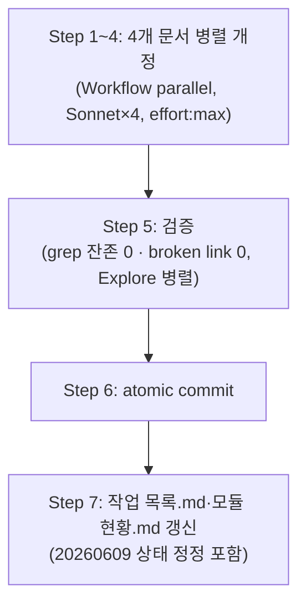

# 계획: 오케스트레이터 전면 위임 정책 강화

**TL;DR**: 4개 지침 문서(`서브에이전트 활용.md`·`워크플로우 오케스트레이션.md`·`CLAUDE.md`·`작업 규칙.md`)를 독립 파일이므로 `Workflow` `parallel()`로 Sonnet 서브에이전트 4개(effort `max`)에 동시 위임한다. 각 서브에이전트에는 정확한 신규 텍스트를 프롬프트에 포함하고, old_string은 서브에이전트가 직접 파일을 읽어 확정한다. 오케스트레이터는 커밋·검증·`작업 목록.md` 갱신 등 관리 행위만 직접 수행한다(§1.1 예외).

## 1. 전체 시퀀스



## 2. 단계별 상세

### Step 1: `서브에이전트 활용.md` 개정 (Sonnet 서브에이전트 A)

**작업** — 아래 6개 지점을 정확히 교체 (서브에이전트가 파일을 직접 Read 후 Edit로 적용):

1. **TL;DR** (frontmatter 직후 첫 문단) 전체를 다음으로 교체:
   > 모든 작업에서 서브에이전트를 전면 활용한다. 오케스트레이터(메인 세션)는 대화 맥락 파악·위임 프롬프트 설계·결과 합성 등 자기 컨텍스트 확보(§1.1)만 직접 수행하고, 사용자에게 전달되는 실제 작업 산출물은 규모·난이도 불문 전량 `Workflow` 도구의 Sonnet 서브에이전트(effort 항상 `max`)에 위임한다. 호출 불가 세션에서만 한 응답에 multiple Agent 호출로 폴백한다(effort 미보장). 명확한 역할별 서브에이전트 종류(`Explore`/`general-purpose`/`Plan`)를 골라 자기완결적 프롬프트로 위임한다. 전면 위임 정책(은수님 2026-07-03 승인).

2. **§1 IMPORTANT box** ("서브에이전트는 비용·지연이 있으므로..."로 시작하는 블록)를 다음으로 교체하고, 그 **바로 뒤에 신규 §1.1 섹션을 추가**:
   > [!IMPORTANT]
   > **전면 위임 정책** (은수님 2026-07-03 승인): 서브에이전트는 비용·지연이 있지만, 이 비용은 의도적으로 감수한다. "쓸지 말지" 판단 자체가 폐지되었다 — §1.1의 예외를 제외한 모든 실제 작업은 규모·난이도 불문 위임이 유일한 경로다.

   신규 §1.1 (§1 표·IMPORTANT box 뒤, §2 앞에 삽입):
   ```markdown
   ## 1.1 오케스트레이터 자기 컨텍스트 확보 (유일한 예외)

   전면 위임의 유일한 예외는 오케스트레이터가 위임을 설계하기 위해 필요한 최소 행위뿐이다. 아래 4가지 외에는 예외가 없다.

   1. **대화 맥락 파악** — 사용자 요청·이전 대화 내용 이해
   2. **위임 설계용 최소 조사** — 어떤 파일·심볼이 관련 있는지 훑어 위임 프롬프트를 자기완결적으로 작성하기 위한 조회
   3. **오케스트레이션 관리 행위** — `git status`/`git log`, 작업 폴더·목록 조회, 커밋 등 작업 진행 관리
   4. **fan-in 결과 합성** — 서브에이전트 결과를 받아 통합·보고

   4단계 프로세스의 ①요구사항·③계획 설계 산출물 작성은 [§6](#6-작업-진행-4단계와의-통합) 표가 이미 "오케스트레이터 직접"로 규정한다 — 본 예외와 별개 근거로 유지된다.

   > [!CAUTION]
   > 위 4가지 외로 예외를 확대 해석하지 않는다. 판단이 애매하면 위임 쪽으로 기운다 (§5 안티패턴 참조).
   ```

3. **§2.1 표**에서 `| 한 키워드·심볼 단일 lookup | 직접 Grep/Glob |` 행을 다음 두 행으로 교체:
   ```
   | 오케스트레이터 자기 컨텍스트 확보용 단일 조회 (§1.1 예외) | 직접 `Grep`/`Glob` |
   | 사용자에게 전달되는 답변을 위한 조회·조사 (단일 lookup 포함) | Sonnet 서브에이전트 위임 (Workflow, effort: max) |
   ```

4. **§3.1 첫 문단** ("서브에이전트는 세션 모델(Opus 등)과 무관하게...")을 다음으로 교체:
   > 서브에이전트는 세션 모델(Opus 등)과 무관하게 `model: "sonnet"`(최신 Sonnet)으로 호출하고, effort는 전면 위임 정책에 따라 **항상 `"max"`** 를 지정한다(도구가 effort 지정을 지원할 때). 지정 가능 여부는 사용하는 도구에 따라 다르다.

5. **§3.1 표**를 다음으로 교체:
   ```
   | 경로 | model | effort | 비고 |
   |---|---|---|---|
   | **Workflow** `agent({...})` (1차) | `"sonnet"` | **`"max"`** (실제 적용, 항상) | extended thinking 최대 보장. 난이도별 차등(low/high/xhigh)은 전면 위임 정책(2026-07-03)으로 폐지 |
   | **Agent 도구** 다중 호출 (폴백) | `"sonnet"` | **지정 불가** (인자 부재) | 세션 기본값 상속 → 로그에 `Agent-폴백(effort 미지원)` 명시 |
   ```
   그 뒤 IMPORTANT box를 다음으로 교체:
   > [!IMPORTANT]
   > **`Agent` 도구 스키마엔 `effort` 인자가 없다.** `effort: "max"`를 *실제로 보장*하려면 `Workflow` 도구의 `agent({model, effort})`를 써야 한다(Workflow opt-in standing 승인: 은수님 2026-06-18 / 전면 위임·effort 항상 max 승인: 은수님 2026-07-03). Workflow 호출이 불가한 세션에서만 `Agent` 다중 호출로 폴백하며, 이때 effort는 세션 기본값을 상속한다(미보장). 적용 모델·effort는 에이전트 로그에 기재한다 — Workflow는 `Sonnet · max`, 폴백은 `Sonnet · Agent-폴백(effort 미지원)`.

6. **§4.3 첫 bullet**을 다음으로 교체:
   > "찾아라"보다 "판단해라" — 위임 프롬프트에 조사뿐 아니라 판단·결론까지 요구한다. 단일 lookup도 예외 없이 위임 대상이므로(§1.1) "직접이 더 빠르다"는 이유로 위임을 회피하지 않는다

7. **§5 안티패턴 표**에서 `| 단일 lookup 위임 | 오버헤드 > 절감 | 직접 Grep/Read |` 행을 **삭제**하고, `| **서브에이전트 사용 회피 (직접 진행)** | ... |` 행을 다음으로 교체:
   ```
   | **실제 작업을 오케스트레이터가 직접 처리 (§1.1 예외 초과)** | 전면 위임 정책 위반 + 메인 컨텍스트 폭발 + 병렬 기회 손실 | 규모·난이도 불문 위임. §1.1 4가지 예외 외에는 예외 없음 |
   ```

**영향 파일**: `docs/지침/일반/서브에이전트 활용.md` 1개
**검증**: grep `"단일 lookup만 예외"` `"effort: \"high\""` 0건, §1.1 신설 확인, 목차상 §2 이하 번호 유지
**commit 메시지**: `Policy(지침): 서브에이전트 활용 — 전면 위임 §1.1 신설 + effort 항상 max`

### Step 2: `워크플로우 오케스트레이션.md` 개정 (Sonnet 서브에이전트 B)

**작업**: §1 본문 중 `(지침이 요구하는 `effort: high` 보장)` 을 `(지침이 요구하는 `effort: max` 보장 — 전면 위임 정책, 은수님 2026-07-03)` 으로 교체.

**영향 파일**: `docs/지침/일반/워크플로우 오케스트레이션.md` 1개
**검증**: grep `"effort: high"` 0건
**commit 메시지**: `Policy(지침): 워크플로우 오케스트레이션 — effort 값 high→max 동기화`

### Step 3: 루트 `CLAUDE.md` §5 개정 (Sonnet 서브에이전트 C)

**작업**:

1. `- **default가 활용** — 단순 단일 lookup만 예외, 의심스러우면 무조건 활용` 줄을 다음으로 교체:
   > - **전면 위임** — 오케스트레이터는 자기 컨텍스트 확보(대화 파악·위임 설계 조사·git 상태 확인·fan-in 합성)만 직접, 사용자에게 전달되는 실제 작업은 규모·난이도 불문 100% 위임 (전면 위임 정책, 은수님 2026-07-03)

2. `- **서브에이전트 기본 모델·Effort**: 항상 `model: "sonnet"` 명시(세션이 Opus여도 동일). **`effort: "high"`는 `Workflow` 도구 `agent({effort})` 경로에서만 실제 적용** — `Agent` 도구엔 effort 인자가 없어 폴백 시 미지원(세션 기본 상속, 로그에 "Agent-폴백(effort 미지원)" 명시). 단순 기계 작업은 `effort: "low"` 예외(Workflow 경로).` 줄을 다음으로 교체:
   > - **서브에이전트 기본 모델·Effort**: 항상 `model: "sonnet"` 명시(세션이 Opus여도 동일), effort는 **항상 `"max"`**(난이도별 차등 폐지). **`Workflow` 도구 `agent({model, effort})` 경로에서만 실제 적용** — `Agent` 도구엔 effort 인자가 없어 폴백 시 미지원(세션 기본 상속, 로그에 "Agent-폴백(effort 미지원)" 명시).

**영향 파일**: 루트 `CLAUDE.md` 1개
**검증**: grep `"단순 단일 lookup만 예외"` `"effort: \"low\" 예외"` 0건
**commit 메시지**: `Policy(지침): CLAUDE.md §5 — 전면 위임·effort max 인라인 동기화`

### Step 4: `작업 규칙.md` 개정 (Sonnet 서브에이전트 D)

**작업**:

1. TL;DR 문장 중 `**서브에이전트 되도록 가능한 최대로 활용 (병렬·효율)**` 을 `**서브에이전트 전면 위임 (오케스트레이터=설계·위임, 실제 작업=Sonnet effort:max)**` 으로 교체.

2. §3 체크리스트 항목 `- [ ] **서브에이전트로 병렬·효율 가능한 부분은 되도록 가능한 최대로 활용** (광범위 탐색·다중 가설·독립 작업 동시 실행 — default가 활용)` 을 다음으로 교체:
   > - [ ] **오케스트레이터 자기 컨텍스트 확보(대화 파악·위임 설계 조사) 외 실제 작업은 전면 Sonnet 서브에이전트(effort 항상 max)에 위임** (전면 위임 정책 — 규모·난이도 불문)

**영향 파일**: `docs/지침/작업 규칙.md` 1개
**검증**: grep `"되도록 가능한 최대로 활용 (병렬·효율)"` 0건
**commit 메시지**: `Policy(지침): 작업 규칙 §3 — 전면 위임 체크리스트 문구 정합`

### Step 5: 검증 (Explore 서브에이전트 병렬 fan-out)

**작업**: Step 1~4 완료 후, 독립 `Explore` 서브에이전트 2개 병렬 기동:
- 검증자 A: 4개 파일에서 구 문구(`단순 단일 lookup만 예외`·`effort: "high"`·`효율 (병렬·효율)`) 잔존 grep, 결과 0건 확인
- 검증자 B: 4개 파일 간 cross-link(`[...](...)`)·상호 참조 anchor(`#1-1-...`) 정상 확인, broken link 0

**영향 파일**: 없음 (읽기 전용)
**검증**: 두 서브에이전트 모두 PASS
**commit 메시지**: 해당 없음(커밋 없음)

### Step 6: atomic commit (오케스트레이터 직접 — §1.1 예외 3)

Step 1~4 서브에이전트가 각각 파일을 수정한 뒤, 오케스트레이터가 diff 전수 검토 후 **문서별 개별 commit 또는 정책 단일 commit**(4파일 동시 변경이 하나의 논리적 정책이므로 단일 atomic commit 권장) 수행.

### Step 7: `작업 목록.md`·`모듈 현황.md` 갱신 — **후속 작업으로 이관**

> [!NOTE]
> 은수님이 작업 도중 "작업 목록 모듈별 분산화"를 추가 요청(별도 작업 [`20260703_작업목록-모듈분산화`](../20260703_작업목록-모듈분산화/) 신설)하여, 루트 `작업 목록.md` 구조 자체가 곧 `docs/tasks/meta/작업 목록.md`로 전면 이관된다. 구 구조에 본 작업 행을 추가했다가 곧바로 다시 옮기는 이중 작업을 피하기 위해, 본 Step 7은 **생략**하고 `20260609_워크플로우-오케스트레이션-이식` 상태 정정 + 본 작업 등재 + `모듈 현황.md` 갱신을 모두 `20260703_작업목록-모듈분산화` 작업의 자기 적용(Step 3)에서 일괄 반영한다.

## 3. 검증 절차

### 3.1 단계별
- 각 서브에이전트 완료 직후 `git diff --stat`으로 영향 파일이 계획 범위(1파일)인지 확인
- Step 1~4 병합 후 Step 5 fan-out 전수 검증

### 3.2 최종
- broken link 검사: 4개 파일 상호 cross-link grep
- 수용 기준(요구사항.md §3) 전 항목 확인
- CLAUDE.md §핵심 지침이 상세 지침 문서와 문구 정합(동일 용어: "전면 위임 정책"·"오케스트레이터 자기 컨텍스트 확보"·"effort 항상 max")

## 4. 위험 관리

| 위험 | 가능성 | 영향 | 완화 |
|---|---|---|---|
| 서브에이전트가 old_string 매칭 실패(공백·개행 차이) | 낮음 | 낮음 | 서브에이전트가 직접 Read 후 Edit — 프롬프트에 원문 재전사 대신 "직접 읽어 확정" 지시로 회피 |
| §1.1 신설로 목차 앵커(`#1-1-...`) 참조가 §서브에이전트 활용.md 내부에서 깨짐 | 낮음 | 낮음 | Step 5 검증자 B가 anchor 확인 |
| 4개 서브에이전트 병렬 실행 중 동일 파일 충돌 | 없음 | - | 파일이 서로 다름(1:1 매핑) — §서브에이전트 활용.md §6 동시성 규칙 충족 |

## 5. 작업 분담 (서브에이전트 활용)

전면 위임 정책을 본 작업 자체에 자기 적용:

- **메인 agent(오케스트레이터)**: 요구사항·분석·계획 설계(본 문서들), 위임 프롬프트 작성, Step 5 결과 fan-in, Step 6 커밋, Step 7 목록 갱신
- **서브에이전트 A~D (`Workflow` `agent()`, model: `"sonnet"`, effort: `"max"`)**: Step 1~4 파일별 실제 Edit 실행 — `parallel()`로 동시 기동
- **서브에이전트 E~F (`Explore`, Workflow 경유)**: Step 5 검증 fan-out
- **병렬 호출**: Step 1~4는 서로 독립(파일 상이) → `parallel()`. Step 5는 Step 1~4 전체 완료 후(배리어) 기동

## 6. 진행 추적

- [ ] Step 1: 서브에이전트 활용.md 개정
- [ ] Step 2: 워크플로우 오케스트레이션.md 개정
- [ ] Step 3: CLAUDE.md §5 개정
- [ ] Step 4: 작업 규칙.md 개정
- [ ] Step 5: 검증 fan-out
- [ ] Step 6: atomic commit
- [ ] Step 7: 작업 목록.md·모듈 현황.md 갱신

체크 진행 상황은 `이력 및 결과.md` 시계열 로그에 동시 기록.

## 7. 관련 산출물

- [요구사항.md](요구사항.md) — 무엇을·왜
- [분석.md](분석.md) — 현 상태·결정
- [이력 및 결과.md](이력%20및%20결과.md) — 시계열·완료

## 자체 검토

### 지침 준수 여부
| 지침 | 준수 |
|---|---|
| [`작업 진행 규칙.md`](../../../../지침/일반/작업%20진행%20규칙.md) | ✅ |
| [`서브에이전트 활용.md`](../../../../지침/일반/서브에이전트%20활용.md) | ✅ (개정 대상이나 계획 단계는 현행 규칙 기준) |
| [`Git/브랜치, 병합 규칙.md`](../../../../지침/Git/브랜치,%20병합%20규칙.md) | ✅ `claude_feature_full-delegation-policy` 격리 |

### 논리적 정합성
| 점검 | 결과 |
|---|---|
| 분석.md 결정이 계획에 반영 | ✅ |
| 단계 시퀀스 의존성 명확 | ✅ (Step1~4 병렬 → Step5 배리어 → Step6~7 순차) |
| 위험·완화 식별 | ✅ |
| 서브에이전트 분담 명시 | ✅ |

### 미해결 이슈
| 이슈 | 처리 |
|---|---|
| 없음 | — |

---

> [!IMPORTANT]
> **사용자 승인 대기** — 단계 ④ 구현(실제 서브에이전트 위임 실행) 진입 전 은수님 승인 필요.
