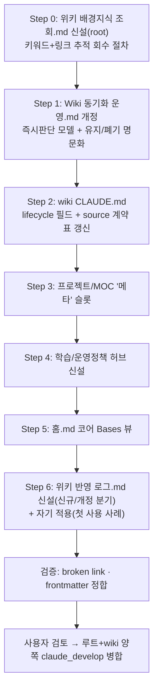

# 계획: 위키 PKM 아키텍처 고도화

**TL;DR**: `분석.md` 결정에 따라 7개 Step으로 실행 — ⓪ root 지침 "위키 배경지식 조회 절차" 신설(키워드+링크 추적 회수), ① 동기화 운영 문서를 "즉시 판단→갱신"으로 개정, ② frontmatter `lifecycle` 필드 도입, ③ 프로젝트/MOC '메타' 슬롯, ④ 학습/운영정책 허브 신설, ⑤ 홈.md 코어 Bases 뷰, ⑥ 위키 반영 로그 신설(신규/개정 분기 포함) + 자기 적용(최근 meta 작업 1건을 실제로 wiki화해 새 절차의 첫 사용 사례로 삼음). `.wiki-sync/`·Dataview/Templater·승인 큐·태그 일괄 정정은 이번에 도입하지 않는다.

## 1. 전체 시퀀스

## 2. 단계별 상세

### Step 0: `docs/지침/일반/위키 배경지식 조회.md` 신설 (root 지침)

**작업**: 은수님이 요청한 "회수(검색) 프로토콜"을 root 지침으로 명문화. 이 파일은 wiki repo가 아니라 **루트 저장소**(`docs/지침/일반/`)에 위치 — Sound1 등 어느 프로젝트에서 작업하든 동일하게 적용되어야 하기 때문(결정_7).

- §1 언제 조회하는가: 작업 지시문에 특정 대상(부품명·현상명·방법론 등) 키워드가 있으면 단계①~② 착수 시 1회 조회
- §2 조회 절차(퍼져나가며 찾기):
  1. 작업 지시문에서 핵심 키워드 추출(고유명사·부품명·현상명)
  2. `projects/wiki/wiki vault/`를 grep(파일명·frontmatter tags·본문 헤더)해 1차 매칭 문서 확보
  3. 매칭 문서 안의 위키링크(`[[...]]`)를 따라 연결 문서로 확장(1-hop)
  4. 새로 발견된 문서에서 다시 링크를 따라간다(2-hop). **최대 2-hop**으로 상한 — 무한 확장 방지
  5. 각 hop에서 신규 발견 0건이면 그 지점에서 중단(워크플로우 오케스트레이션.md의 loop-until-dry 수렴 조건과 동일 원리)
  6. 광범위한 조회(매칭 문서가 많거나 hop이 여러 갈래)는 `Explore` 서브에이전트 위임 가능(서브에이전트 활용.md §2.1과 정합), 좁으면 직접 grep
  7. 수집 결과는 요약 인용만 — 전체 원문 재인용 금지(컨텍스트 절약 규칙 정합)
- §3 전제조건과 스팟 수정: 검색이 되려면 태그·파일명 표기가 일관돼야 한다. 조회 중 우연히 만난 표기 불일치(대소문자 등)는 그 자리에서 스팟 수정 — 단, 전수 일괄 정정은 여전히 범위 외
- §4 4단계 프로세스와의 연결: 4단계-프로세스.md 자체는 수정하지 않고(블라스트 반경 최소화), 본 신규 파일에서 "단계①~②의 표준 조사 스텝"이라고 명시 + 4단계-프로세스.md의 관련 지침 목록에 상호 링크만 추가

**영향 파일**: `docs/지침/일반/위키 배경지식 조회.md`(신규, 루트 저장소) + `docs/지침/일반/작업/4단계-프로세스.md`(관련 지침 링크 1줄 추가) + 루트 `CLAUDE.md` 지침 표에 행 추가
**검증**: 신규 지침 frontmatter+TL;DR 셀프체크, 기존 서브에이전트 활용.md·워크플로우 오케스트레이션.md와 문구 정합(loop-until-dry 원용 표현 일치)
**commit 메시지**: `docs(meta): 위키 배경지식 조회 절차 신설 — 키워드+링크 추적 회수`

### Step 1: `projects/wiki/운영/Wiki 동기화 운영.md` 개정

**작업**:
- "wiki가 독립적으로 pull한다"는 핵심 결론 문단을 "task 단계④ 완료 시점(또는 재사용 가능한 지식 발견 시점)에 그 세션이 즉시 판단해 은수님께 제안하고, 승인 즉시 반영한다"로 교체
- `## 현재 판단` 절 새로 작성 — 별도 승인 큐(4상태 워크플로) 없음을 명시, 이유(21번 검증 — 옛 실패 패턴 재현 위험)
- `.wiki-sync/`(3-YAML) 절을 "도입 예정" → "보류 — 폴링 배치 전제라 트리거 모델과 불일치, 근거: 06·21번 검증" 으로 수정
- `## source 프로젝트 최소 계약` 표를 2026-07-03 3축 구조(모듈별 `작업 목록.md` · 루트 인덱스 `작업 목록.md` · `모듈 현황.md`)로 경로 갱신
- `## 유지 vs 폐기` 표 신규 추가 (분석.md §3.2 그대로)
- `## wiki 반영 스코프와 4단계 프로세스` 절 신규 추가 — "이 문서가 규정하는 즉시 반영은 원 task의 4단계 프로세스에 부수되는 경량 조치(문구 재작성·MOC 링크 추가)이며 별도 4단계를 새로 밟지 않는다. 단 wiki **구조** 변경(카테고리 신설·frontmatter 스키마 변경 등)은 여전히 루트 4단계 프로세스 대상이다" — 22번 검증이 지적한 최우선 공백 해소. 이 스코프 규정은 wiki 고유 컨벤션이므로 `projects/wiki/CLAUDE.md`의 "일반 규칙 ↔ wiki 컨벤션 충돌 시 wiki 컨벤션 우선" 원칙에 따라 이 문서 안에서 완결하고 루트 `4단계-프로세스.md`는 변경하지 않는다(블라스트 반경 최소화)
- `## 트리거 판단 기준` 절 신규 — 05번 신호(재사용성·완결성·정정/신규성)를 3종으로 축약해 명문화: "① 다른 프로젝트에도 재사용 가능한 설계 결정, ② 검증된 문제 해결 패턴, ③ 은수님이 명시적으로 wiki화 요청" 중 하나라도 해당하면 task 단계④ 완료 시점에 세션 인라인 텍스트로 제안. 청킹은 "task 1건 = 최소 단위, 여러 task가 같은 개념이면 그때 통합 판단"

**영향 파일**: `projects/wiki/운영/Wiki 동기화 운영.md` (1개, 전면 개정)
**검증**: 자체 검토 — 22번이 지적한 5개 마찰점 모두 문구로 해소됐는지 체크리스트 대조
**commit 메시지**: `docs(wiki): 동기화 운영을 판단 시점 트리거 모델로 전환`

### Step 2: `projects/wiki/CLAUDE.md` 갱신

**작업**:
- `## 공개 메타 표준` frontmatter 예시에 `lifecycle: project | area | resource | archived` 필드 추가(PARA 제안, `public_status`와 이름 겹치지 않게 명명 — 22번 지적 반영)
- `## source 프로젝트 최소 계약` 표를 Step 1과 동일하게 3축 구조로 갱신

**영향 파일**: `projects/wiki/CLAUDE.md` (1개)
**검증**: 기존 frontmatter 예시와 필드 중복 없는지 확인
**commit 메시지**: `docs(wiki): frontmatter lifecycle 필드 도입 + source 계약 표 갱신`

### Step 3: 프로젝트 '메타' 허브 슬롯

**작업**:
- `wiki vault/프로젝트/MOC.md`에 '메타'(루트 저장소 자체 운영·지침) 행 추가
- `wiki vault/프로젝트/메타.md` 신규 — 랜딩 페이지형(무엇인가/핵심 정책/더 깊게 보기), frontmatter 없이 독자용 문체(기존 `Auto RTT Viewer.md` 패턴 준용)

**영향 파일**: `wiki vault/프로젝트/MOC.md`(수정) + `wiki vault/프로젝트/메타.md`(신규)
**검증**: `[[메타]]` 위키링크 양방향 연결 확인
**commit 메시지**: `content(wiki): 프로젝트 '메타' 허브 신설`

### Step 4: 학습/운영정책 허브 신설

**작업**:
- `wiki vault/학습/운영정책/MOC.md` 신규(서브폴더+서브MOC 패턴, 참고/CFX 등과 동일 컨벤션)
- `wiki vault/학습/MOC.md`에 '운영정책' 링크 추가
- Step 6의 자기 적용 문서가 이 허브의 첫 실제 콘텐츠가 됨(빈 MOC 방지)

**영향 파일**: `wiki vault/학습/MOC.md`(수정) + `wiki vault/학습/운영정책/MOC.md`(신규)
**검증**: 카테고리 인덱스 형식이 기존 MOC(참고/MOC.md 등)와 일관되는지 대조
**commit 메시지**: `content(wiki): 학습/운영정책 허브 신설`

### Step 5: 홈.md 코어 Bases 뷰

**작업**:
- `wiki vault/홈.md`에 Bases(코어 플러그인, 이미 활성화됨) 기반 "최근 갱신 문서" 테이블 뷰 블록 추가 — 신규 플러그인 설치 없이 frontmatter/수정일 기반
- 신규 플러그인(Dataview·Templater)은 이번에 설치하지 않음(21번 검증 근거 — 실제 저작 주체가 Claude Write이지 사람이 UI로 채우는 세션이 아니라 Templater 실익 낮음)

**영향 파일**: `wiki vault/홈.md` (1개)
**검증**: Obsidian 없이는 Bases 블록 렌더링 확인 불가 — 문법만 코어 Bases 공식 스펙대로 작성, 은수님이 Obsidian에서 직접 1회 확인 필요함을 이력에 명시
**commit 메시지**: `content(wiki): 홈에 코어 Bases 최근 갱신 뷰 추가`

### Step 6: 위키 반영 로그 신설(신규/개정 분기) + 자기 적용(첫 사용 사례)

**작업**:
- `projects/wiki/운영/위키 반영 로그.md` 신규 — **5컬럼**(task 경로 / 반영일 / 대상 wiki 문서 / **신규·개정** / 한줄메모), 승인 상태 필드 없음(21번 검증 — 승인 큐 자체가 과설계)
- **신규/개정 분기 절차 명문화**(결정_8): wiki화 트리거가 발동하면 반영 전에 항상 Step 0의 조회 절차로 관련 기존 문서 존재 여부를 먼저 확인한다 → 있으면 그 문서를 **개정**(내용 병합, `last_reviewed` 필드 갱신, 상충 내용은 교체하고 왜 바뀌었는지 한 줄만 남김 — 별도 "개정 이력" 섹션은 만들지 않고 git 커밋 로그로 이력 추적) / 없으면 **신규** 작성
- **자기 적용**(CLAUDE.md 학습노트 §5.10 "정책 신설 자기 참조"): 본 작업이 신설하는 "즉시 판단 트리거 + 조회 절차"의 첫 사용 사례로, 2026-05-19 이후 미반영된 루트 meta 8건 중 트리거 기준(§Step 1 "재사용 가능한 설계 결정")에 가장 뚜렷하게 부합하는 `20260609_워크플로우-오케스트레이션-이식`·`20260703_오케스트레이션-정책-개정`·`20260703_폭주-방지-가드` 3건을 묶어, 그 핵심 지식("AI 에이전트 오케스트레이션 — 트리거 기반 정책과 폭주 방지")을 재작성해 `wiki vault/학습/운영정책/AI 에이전트 오케스트레이션.md`로 신규 작성(Step 0 조회 절차로 확인한 결과 기존 관련 문서 없음 → "신규" 분기)
- 나머지 5건(mermaid 팔레트 교정 등)은 이번엔 소급 반영하지 않음(21번 — 8건 전체 소급 채점은 과설계) — 위키 반영 로그.md에 "2026-07-06 이후 발생하는 task부터 트리거 적용, 이전 5건은 소급 생략"이라고 명시해 범위를 분명히 함
- `위키 반영 로그.md`에 이번 반영 1행 기록(신규·개정 컬럼에 "신규" 기입)

**영향 파일**: `projects/wiki/운영/위키 반영 로그.md`(신규) + `wiki vault/학습/운영정책/AI 에이전트 오케스트레이션.md`(신규) + `wiki vault/학습/운영정책/MOC.md`(Step 4에서 만든 파일에 링크 추가)
**검증**: 재작성 원칙(원문 복사 금지, 독자용 구조) 준수 여부 자체 점검. 공개 검수는 이번엔 `publish: false`로 유지(전체 공개 검수는 범위 외)
**commit 메시지**: `content(wiki): 위키 반영 로그 신설(신규/개정 분기) + 첫 사용 사례(오케스트레이션 정책 3건 반영)`

## 3. 검증 절차

### 3.1 단계별
- 각 commit 직전 `git status` + `git diff --stat` (projects/wiki repo)
- 영향 파일이 계획 범위 내인지 확인(오버런 방지 — Dataview 설치·태그 일괄 정정 등 보류 항목 손대지 않기)

### 3.2 최종
- broken link 검사: 신규 위키링크(`[[메타]]`, `[[운영정책/MOC]]` 등) 양방향 연결 확인
- frontmatter 정합: 신규 `lifecycle` 필드가 기존 `public_status`와 혼동 없이 별개로 존재하는지 grep 확인
- 요구사항.md §3 수용 기준 전 항목 재확인
- 문서 스타일: 신규 .md 전부 frontmatter+TL;DR 셀프체크(랜딩 페이지형은 wiki 컨벤션상 frontmatter 생략 허용)
- Step 0 지침 파일의 조회 절차를 실제로 Step 6 자기 적용에 적용해봤는지(신규/개정 분기 근거) 확인

## 4. 위험 관리

| 위험 | 가능성 | 영향 | 완화 |
|---|---|---|---|
| 자기 적용 문서(운영정책 1건) 작성이 예상보다 커져 범위 이탈 | 중 | 낮음 | 3개 source task의 핵심만 압축 재작성, task 원문 복사 금지 원칙 준수 |
| `lifecycle` 필드가 기존 5개 이관 문서에 소급 적용 안 돼 또 다른 부분 드리프트 | 중 | 낮음 | 이번 계획은 필드 "도입"까지만, 기존 문서 소급 적용은 범위 외로 명시(요구사항.md §4) |
| Bases 뷰 문법이 실제 Obsidian에서 렌더링 안 될 가능성(로컬 렌더 확인 불가) | 낮음 | 낮음 | 이력 및 결과.md에 "은수님 Obsidian 확인 필요" 명시, 실패 시 후속 1줄 수정으로 대응 가능 |
| 프로젝트/메타.md 신설이 기존 프로젝트/MOC.md 포맷과 어긋남 | 낮음 | 낮음 | 기존 Sound1.md·auto-rtt-viewer.md 포맷 대조 후 작성 |
| 조회 절차(Step 0)의 2-hop 상한이 실제로는 부족해 관련 지식을 놓치는 경우 | 중 | 낮음 | 상한 도달 후에도 발견이 남아있으면 세션이 "더 찾아볼까요?" 한 줄로 은수님께 확인 — 자동 무한 확장은 안 하되 완전 차단도 안 함 |

## 5. 작업 분담 (서브에이전트 활용)

트리거어 없는 순차 문서 편집 작업이라 오케스트레이터(본 세션)가 직접 처리한다(서브에이전트 활용.md §1.1 — 트리거 없는 간단 작업). 각 Step이 서로 다른 파일을 대상으로 하되 순서 의존(Step 4의 MOC가 Step 6의 자기 적용 문서 링크 대상이 됨, Step 0의 조회 절차가 Step 6의 신규/개정 판단 전제)이 있어 병렬 fan-out보다 순차 처리가 안전(워크플로우 오케스트레이션.md §6 동시성 주의). Step 0은 루트 저장소, Step 1~6은 `projects/wiki` 저장소로 커밋 스코프가 다르다(§미해결 이슈).

- **메인(본 세션)**: Step 0~6 전체 순차 작성
- **병렬 호출**: 해당 없음 — 순차 의존 관계로 병렬 이득 없음

## 6. 진행 추적

- [ ] Step 0: 위키 배경지식 조회.md 신설(root)
- [ ] Step 1: Wiki 동기화 운영.md 개정
- [ ] Step 2: wiki CLAUDE.md lifecycle 필드 + source 계약 표
- [ ] Step 3: 프로젝트 '메타' 허브
- [ ] Step 4: 학습/운영정책 허브
- [ ] Step 5: 홈.md 코어 Bases 뷰
- [ ] Step 6: 위키 반영 로그(신규/개정 분기) + 자기 적용

체크 진행 상황은 `이력 및 결과.md` 시계열 로그에 동시 기록.

## 7. 관련 산출물

- [요구사항.md](요구사항.md) — 무엇을·왜
- [분석.md](분석.md) — 현 상태·결정
- [이력 및 결과.md](이력%20및%20결과.md) — 시계열·완료
- [에이전트-로그/](에이전트-로그/) — fan-out 원문

## 자체 검토

### 지침 준수 여부
| 지침 | 준수 |
|---|---|
| [`작업 진행 규칙.md`](../../../지침/일반/작업%20진행%20규칙.md) | ✅ |
| [`서브에이전트 활용.md`](../../../지침/일반/서브에이전트%20활용.md) | ✅ — 순차 편집은 트리거 없는 직접 처리 대상 |
| [`Git/브랜치, 병합 규칙.md`](../../../지침/Git/브랜치,%20병합%20규칙.md) | ✅ — `claude_feature_wiki-pkm-고도화`에서 작업, wiki repo는 별도 서브모듈성 repo이므로 해당 repo 자체 커밋 필요(§미해결 이슈 참조) |

### 논리적 정합성
| 점검 | 결과 |
|---|---|
| 분석.md 결정이 계획에 반영 | ✅ — 결정_1~8 모두 Step에 대응(결정_7→Step 0, 결정_8→Step 6 신규/개정 분기) |
| 단계 시퀀스 의존성 명확 | ✅ — Step 0→6 조회 전제, Step 4→6 링크 의존 순서화 |
| 위험·완화 식별 | ✅ |
| 서브에이전트 분담 명시 | ✅ — 해당 없음 사유 명시 |
| 자기 적용 단락(정책 신설 첫 사용 사례) 포함 | ✅ — Step 6 |
| 은수님 재확인(회수·개정) 요청이 계획에 반영 | ✅ — Step 0(회수) + Step 6 신규/개정 분기(개정) |

### 미해결 이슈
| 이슈 | 처리 |
|---|---|
| `projects/wiki`는 독립 Git repo(`.git` 보유) — 루트 `claude_feature_wiki-pkm-고도화` 브랜치와 별도로 wiki repo 자체의 브랜치·커밋이 필요 | 구현(④) 시작 시 wiki repo에서 별도 작업 브랜치(예: `claude_feature_wiki-pkm-고도화`) 생성 후 진행, 완료 시 그 repo의 `claude_develop`에도 병합 승인 요청. Step 0만 루트 저장소 커밋 |
| Bases 뷰 문법의 실제 렌더링 확인 | 은수님이 Obsidian 앱에서 직접 1회 열어 확인 — 세션에서는 렌더 불가 |
| Step 0 조회 절차의 실효성(2-hop 상한이 적절한지)은 실사용 후에만 검증 가능 | 첫 사용 사례(Step 6 자기 적용)에서 실제로 적용해보고, 이후 작업에서 누적 관찰 |
