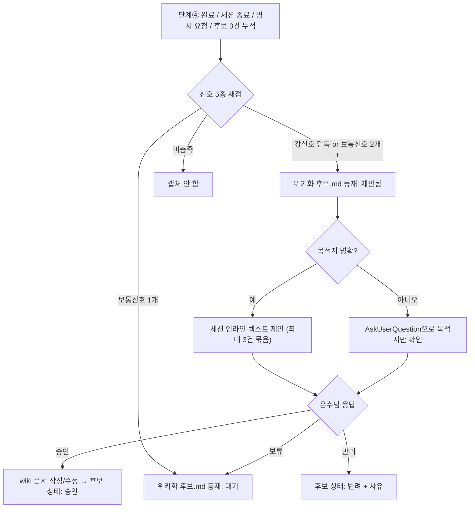

# 05_페르소나_운영거버넌스설계자 — 트리거 기반 위키 갱신 운영 모델

**TL;DR**: GTD(capture→clarify→organize→review)와 CODE(Capture-Organize-Distill-Express)를 결합해, "일정 주기 배치"를 "이미 강제되는 체크포인트(단계④ 완료·세션 종료)에 결합된 상시 캡처 + 문턱 기반 제안"으로 대체한다. 신호 5종 중 2종 동시 충족(또는 강신호 1종 단독)이면 후보 등재, 후보는 `projects/wiki/운영/위키화 후보.md`에 즉시 캡처(인터럽트 없음), 승인 요청은 체크포인트에서 세션 인라인 텍스트로 최대 3건 묶어 제시하고 AskUserQuestion은 목적지 모호 시로 한정한다. 이 결합이 기존 설계가 죽었던 근본 원인("pull을 실행할 주체 없음")을 "이미 존재하는 실행 지점에 갈고리를 건다"로 해소한다.

## 1. 방법론 리서치 근거

### GTD (Getting Things Done, David Allen)

5단계: **Capture → Clarify → Organize → Reflect(Review) → Engage**. 핵심 원리:
- 100% 캡처: 머릿속에 남겨두지 않고 외부 신뢰 시스템에 즉시 기록 — 판단은 나중에, 캡처는 지금.
- "2분 규칙": clarify 단계에서 2분 이내에 끝낼 수 있으면 그 자리에서 즉시 처리하고, 아니면 defer/delegate.
- 주간 리뷰: organize된 목록을 정기적으로 되돌아보며 정합성을 재점검.

(Sources: [Getting Things Done - Wikipedia](https://en.wikipedia.org/wiki/Getting_Things_Done), [Asana - GTD 5-Step Workflow](https://asana.com/resources/getting-things-done-gtd), [Asian Efficiency - GTD 101](https://www.asianefficiency.com/task-management/gtd-intro/))

### CODE (Building a Second Brain, Tiago Forte)

4단계: **Capture → Organize → Distill → Express**. 핵심 원리:
- "뇌는 아이디어를 저장하는 곳이 아니라 만들어내는 곳" — 저장은 외부 시스템에 위임.
- Organize는 "어떻게 쓸 것인가" 기준으로 묶는다 (주제 분류가 아니라 실행 가능성 기준) — PARA(Projects-Areas-Resources-Archives)로 구체화됨.
- Distill = progressive summarization, 즉 나중에 다시 읽을 내 미래의 나를 위해 지금 압축해두는 것.

(Sources: [Building a Second Brain - fortelabs.com](https://fortelabs.com/blog/basboverview/), [Reading Graphics - Book Summary](https://readingraphics.com/book-summary-building-a-second-brain/))

### 이 프로젝트에 대한 시사점

이 프로젝트가 겪은 실패(설계는 있으나 실행 주체가 없어 7주간 미갱신)는 GTD·CODE 어느 쪽 관점에서도 **"capture 단계가 아예 없었다"**는 문제로 읽힌다. `.wiki-sync/`는 organize~distill 단계의 상태 저장소로 설계됐지만, 애초에 capture를 트리거하는 행위자·시점이 명시되지 않아 파이프라인 첫 단추가 없었다. 따라서 새 모델의 첫째 원칙은 "언제 캡처할지"부터 확정하는 것이며, 이는 **이미 존재하는 의무 체크포인트(4단계 프로세스의 단계④, 세션 종료)에 캡처 행위를 강제로 결합**하는 것으로 해결한다 — 새로운 정기 실행 주체를 발명하지 않는다.

## 2. 신호 기준표 — "이건 wiki화 후보다"의 판단 기준

| 신호 | 설명 | 판단 질문 | 가중치 |
|---|---|---|---|
| 신호_1 재사용성 | 이 결정/패턴이 향후 다른 task·세션에서 참조될 가능성 | "미래의 다른 task에서 이 task 폴더를 다시 열어봐야만 알 수 있는 내용인가?" | 보통 |
| 신호_2 완결성 | 단계④(구현) 완료·`이력 및 결과.md` 작성 시점에 도달, 이후 뒤집힐 가능성 낮음 | "지금 wiki에 적으면 다음 주에 또 고쳐야 하는 유동적 내용인가?" | 보통 (미충족 시 오히려 억제 신호) |
| 신호_3 정정/신규성 | wiki 기존 문서와 모순되거나, wiki에 없는 새 결론 | "이 내용대로면 지금 wiki의 어떤 문서가 틀린 것이 되는가?" | 강 |
| 신호_4 반복 검증 | 동일 패턴이 ≥2개 task 또는 ≥2개 프로젝트에서 재현 | "이번이 처음 나온 얘기인가, 전에도 비슷한 결론을 냈는가?" | 보통 |
| 신호_5 사용자 명시 | 은수님이 대화 중 "기록해두자"·"나중에 참고하게"류 발언 | 발언 존재 자체가 신호 | 강 |

**문턱 규칙**:
- 강신호(신호_3 또는 신호_5) 단독 충족 → 즉시 후보 등재. (스테일 콘텐츠 방치가 이미 실증된 리스크이므로 정정 신호는 최우선. 사용자 명시는 항상 최우선.)
- 보통신호(신호_1·2·4) 중 **2개 이상 동시 충족** → 후보 등재.
- 보통신호 1개만 충족 → 후보 목록에 "낮은 우선순위"로만 기록, 즉시 제안하지 않고 다음 체크포인트에서 누적 재평가.
- 신호_2 미충족(아직 유동적)이면 다른 신호가 강해도 제안을 보류하고 후보 목록에 "대기(미확정)" 상태로만 남긴다 — GTD clarify 원칙("아직 확정 안 된 것은 organize하지 않는다")의 적용.

### "GTD 2분 규칙"의 적용 — 즉시 처리 vs 제안

- 기존 wiki 문서의 오탈자·1줄 보강처럼 **새 페이지 생성도, 목적지 판단도 필요 없는 사소한 편집**은 승인 없이 즉시 반영하고 세션 말미에 "~을 wiki에 반영했습니다" 한 줄로만 보고한다 (2분 규칙의 "그 자리에서 처리" 대응).
- 신규 페이지 생성, MOC 재구성, 카테고리 신설, 공개 등급 판단이 필요한 경우만 아래 §4 승인 절차를 거친다.

## 3. 청킹 규칙 — 한 번에 얼마나 쪼개서 제안할지

**기본 단위**: "1개 독자적으로 링크 가능한 지식 단위"(원자적 노트 단위 자체의 판단 기준은 01번 페르소나(Zettelkasten 전문가) 산출물 참조). 이 문서는 그 단위를 **얼마나 묶어서 승인받을지**만 다룬다.

| 규칙 | 내용 |
|---|---|
| 규칙_1 (task 내부) | 1개 task가 여러 성격의 지식 단위(예: 정책 변경 + 재사용 코드 패턴)를 포함하면, 하나의 제안 메시지 안에서 체크리스트 항목으로 나열한다 — 메시지는 1개, 항목은 여러 개 가능. 항목을 인위적으로 합치지 않는다 (합치면 은수님이 일부만 승인하고 싶을 때 전부 재작성해야 함). |
| 규칙_2 (task 간) | 서로 다른 task에서 유래한 제안을 한 메시지에 묶을 때는 **최대 3건**까지만. 그 이상 쌓이면 다음 체크포인트로 이월 — 승인 피로로 인한 rubber-stamp 방지(GTD 주간 리뷰가 무한정 쌓인 목록을 한 번에 넘기지 않는 것과 동일 원리). |
| 규칙_3 (누적 시) | 낮은 우선순위로 대기 중인 후보가 3건 이상 쌓이면, 다음 체크포인트에서 "밀린 후보 일괄 검토"를 별도로 제안한다 (GTD 주간 리뷰의 이벤트 트리거 버전). |
| 규칙_4 (분리 원칙) | 저술(위키 문서 초안 작성)과 승인(반영 여부 결정)은 분리한다 — 초안까지 다 써놓고 승인만 구두로 받는 방식이 아니라, 승인 시점에는 "제목 + 목적지 MOC + 2~3줄 요약"만 제시하고, 실제 전문 작성은 승인 후 수행한다. 미승인 초안을 미리 다 써두면 반려 시 낭비가 크다. |

## 4. 알림·승인 형식

| 상황 | 형식 |
|---|---|
| 기본 (대부분의 경우) | **세션 내 인라인 텍스트**. 체크박스형 나열 + task 경로 + 목적지 MOC 후보 + 1~2줄 요약. 은수님은 자유 응답(전체 승인/일부만/보류)으로 답한다. 기존 계획.md 승인 컨벤션과 동일한 방식이라 새 도구 학습 비용이 없다. |
| 목적지가 모호할 때만 | `AskUserQuestion` — 예: "이 내용은 참고/CFX/MOC.md 밑인가, 새 카테고리가 필요한가?" 같은 구조적 결정. 명령 해석 규칙의 "모호 시 질문(이분/다항)" 원칙과 합치. 일상적 승인 절차에 남용하지 않는다. |
| 사소한 즉시 반영 (§2 2분 규칙) | 승인 절차 생략, 세션 말미 한 줄 보고만. |
| 후보 캡처 (승인 이전 단계) | **인터럽트 없이 즉시** `projects/wiki/운영/위키화 후보.md`에 append. 이 파일이 GTD의 "inbox" 역할 — 판단은 나중에 하더라도 캡처 자체는 절대 놓치지 않는다. |

### 후보 로그 파일 제안: `projects/wiki/운영/위키화 후보.md`

기존 `.wiki-sync/` 설계(sources.yaml·state.json·mappings.yaml)는 "만들기로 했으나 실행 주체가 없어 방치"된 전례가 있다. 같은 실패를 반복하지 않기 위해, 숨김 폴더의 여러 YAML 대신 **기존 `운영/` 폴더 안의 평문 md 파일 1개**로 최소화해 제안한다 (하위 자동화가 필요해지면 이 파일을 파싱 소스로 승격 가능 — 처음부터 기계용 스키마를 만들지 않음).

```markdown
| 상태 | 신호 | 출처 task | 제목(안) | 목적지 MOC(안) | 등재일 |
|---|---|---|---|---|---|
| 대기 | 신호_3(정정) | docs/tasks/meta/.../오케스트레이션-트리거화 | 서브에이전트 위임을 트리거 기반으로 전환한 이유 | 참고/ 또는 신규 허브 | 2026-07-06 |
| 제안됨 | 신호_1+4 | ... | ... | ... | ... |
| 승인 | ... | ... | ... | ... | ... |
| 반려 | ... | ... | ... | ... | ... |
```

상태값: `대기`(캡처만 됨, 문턱 미달)·`제안됨`(체크포인트에서 은수님께 제시함)·`승인`(반영 완료, wiki 문서 링크 기입)·`반려`(안 하기로 결정, 사유 한 줄). "보류" 응답은 `대기`로 되돌리고 다음 체크포인트에서 재상정 — 캡처된 항목은 승인/반려가 명시되기 전까지 절대 삭제하지 않는다(유실 방지가 이 모델의 존재 이유).

## 5. 체크포인트 — 언제 이 판단을 실행하는가

새로운 정기 실행 주체를 만들지 않고, **이미 CLAUDE.md 4단계 프로세스가 강제하는 지점**에 결합한다:

| 체크포인트 | 트리거 시점 | 수행 내용 |
|---|---|---|
| 체크포인트_1 | 단계④ 구현 완료, `이력 및 결과.md` 작성 시 | 방금 끝난 task를 §2 신호표로 채점 → 후보 캡처(+ 문턱 충족 시 그 자리에서 바로 제안) |
| 체크포인트_2 | 세션 종료 직전(Stop hook 이전, 마무리 응답 작성 시) | 이번 세션에서 놓친 후보가 있는지 마지막 sweep, `위키화 후보.md` 누락 여부 확인 |
| 체크포인트_3 | 은수님 명시 요청("위키 반영해줘", "정리해줘") | 즉시 §4 절차 실행, 문턱 규칙 무시하고 전량 검토 |
| 체크포인트_4 | `위키화 후보.md`의 `대기` 항목이 3건 이상 누적 | 규칙_3에 따라 일괄 검토 제안 |

이 네 체크포인트는 모두 **이미 존재하거나(단계④, 세션 종료) 이미 은수님이 발화하는(명시 요청) 지점**이라, "일정 주기 배치"처럼 별도 cron·스케줄러·워치독이 필요 없다. 기존 설계의 근본 실패("누가 pull을 실행하는가")를 "실행 주체는 매번 이미 그 자리에 있는 Claude 세션 자신"으로 대체하는 것이 이 모델의 핵심이다.

## 6. 마스터 결정 흐름 (요약)



## 7. 이 프로젝트(개인 1인 Obsidian wiki)에 대한 구체적 적용 제안

1. `projects/wiki/운영/위키화 후보.md` 신규 생성 — §4 표 형식 그대로, frontmatter는 기존 `운영/` 문서 컨벤션(`Wiki 동기화 운영.md`) 준용.
2. 루트 `docs/지침/일반/작업 진행 규칙.md` 또는 `docs/지침/일반/작업/4단계-프로세스.md`의 단계④ 서술에 "완료 시 §2 신호표로 wiki화 후보 채점" 한 줄을 추가해 체크포인트_1을 프로세스 문서에 명문화 (이번 계획.md 승인 이후 반영 대상).
3. `.wiki-sync/`의 sources.yaml·state.json·mappings.yaml은 지금 단계에서는 만들지 말 것을 권고 — capture 주체가 확정된 뒤에도 여전히 그런 기계적 스키마가 필요한지는 실제로 후보 로그가 쌓여본 뒤(예: 1개월 운영 후) 재평가. 지금 만들면 이전과 같이 "만들었지만 아무도 안 쓰는 파일"이 될 위험이 크다.
4. 기존 8건의 미반영 meta task(2026-05-19~) 역시 §2 기준표로 소급 채점해 `위키화 후보.md`에 초기 시드 데이터로 등재하는 것을 계획.md 실행 항목으로 제안 — 새 모델이 실제로 작동하는지 첫 검증 사례가 된다.
5. 신호_3(정정) 케이스는 이 프로젝트에서 특히 중요하다 — 예컨대 "서브에이전트 오케스트레이션을 트리거 기반으로 전환"한 정책 변경은 기존 wiki에 구 정책이 남아있다면 그 자체로 즉시 등재 대상이다. 정정 신호는 신규 캡처보다 우선순위를 높게 둔다(스테일 콘텐츠가 신규 콘텐츠 부재보다 더 나쁨 — 틀린 정보가 wiki에 남는 것은 없는 것보다 위험).

## 8. 한계·검증 필요 사항

- 문턱 수치(2개 신호 동시 충족, 3건 묶음, 3건 누적)는 실측 데이터 없이 방법론 유추로 잡은 초기값 — 1개월 운영 후 실제 후보 발생 빈도로 재조정 필요.
- "신호_2 완결성"은 4단계 프로세스를 엄격히 따르는 코딩성 task에는 잘 맞으나, 순수 조사·문서 작업처럼 단계④가 모호한 task 유형에서는 대체 기준(예: `이력 및 결과.md`의 "완료" 마킹)이 필요 — 06번 페르소나(기존 wiki 정합성 검토자)의 task 유형 분류와 교차 확인 권장.
- 이 설계는 검증(21·22번 adversarial-verify 노드)에서 "1인 개인 프로젝트에 과설계 아닌가"를 반증받아야 한다 — 특히 §4의 상태 4종(대기/제안됨/승인/반려)이 실제로 필요한 최소치인지, 2종(대기/완료)으로 더 줄여도 되는지는 검증 대상으로 남긴다.
