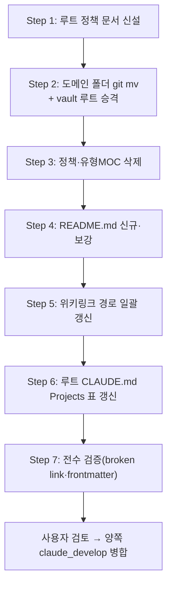

# 계획: 위키 정책 이관 및 도메인 재편

**TL;DR**: 7-Step — ① 루트에 정책 문서 신설 ② wiki 도메인 폴더로 파일 전량 `git mv`(vault 루트 승격 포함) ③ 정책·유형별 MOC 삭제 ④ README.md 신규·보강 ⑤ 위키링크 경로 일괄 갱신 ⑥ 루트 CLAUDE.md Projects 표 갱신 ⑦ 전수 검증. `git mv`로 이력 보존, 파일 이동은 세션이 직접 처리(대량이지만 매핑표가 이미 확정돼 있어 위임보다 직접 스크립트 실행이 정확·빠름).

## 1. 전체 시퀀스

## 2. 단계별 상세

### Step 1: 루트 정책 문서 신설

**작업**:
- `docs/지침/일반/위키 반영 절차.md` 신규 — `Wiki 동기화 운영.md`의 트리거 기준·신규/개정 분기·4단계 스코프·source 계약·문서화 판단 기준·재작성 템플릿 3종·공개 검수·`lifecycle` 포함 frontmatter 표준을 그대로 이관(재작성 아님 — 원본 정책 그대로). `위키 배경지식 조회.md`(회수 쪽)와 캡처/회수 짝 문서로 상호 링크
- `docs/지침/일반/문서/작성-스타일.md`에 "Obsidian/wiki 콘텐츠 작성" 절 추가 — 위키링크 우선·MOC(→README)·앵커 슬러그·첨부 폴더 컨벤션 이관. 기존 "wiki 컨벤션 우선 예외" 조항은 이제 규칙이 한 곳에만 있으므로 제거
- 루트 `CLAUDE.md` 지침 표에 `위키 반영 절차.md` 행 추가

**영향 파일**: `docs/지침/일반/위키 반영 절차.md`(신규) + `docs/지침/일반/문서/작성-스타일.md`(수정) + `CLAUDE.md`(수정)
**검증**: `위키 배경지식 조회.md`와 문구·역할 중복 없는지 대조
**commit 메시지**: `docs(meta): 위키 반영 절차 신설 — projects/wiki 정책 전면 이관`

### Step 2: 도메인 폴더 git mv + vault 루트 승격 (wiki repo)

**작업**: 분석.md §4.2 매핑표대로 `git mv` 실행. 순서:
1. `wiki vault/.obsidian` → `.obsidian`(vault 루트 승격)
2. `wiki vault/프로젝트/Sound1.md` → `Sound1/README.md`, `참고/LED` → `Sound1/LED`, `참고/터치` → `Sound1/터치`, `참고/칩` → `Sound1/칩`, `사용방법/UI 명령어 사용법.md` → `Sound1/UI 명령어 사용법.md`, `사용방법/Sound1 측 fw.txt 출력 명세.md` → `Sound1/fw.txt 출력 명세.md`, `html/NofM` → `Sound1/NofM`
3. `sound1-fw-extractor.md` → `sound1-fw-extractor/README.md`, `사용방법/fw.txt 형식.md` → `sound1-fw-extractor/fw.txt 형식.md`
4. `auto-rtt-viewer.md` → `auto-rtt-viewer/README.md`, `Auto RTT Viewer.md` → `auto-rtt-viewer/개요.md`, `참고/RTT` → `auto-rtt-viewer/RTT`, `사용방법/{사용법,디버깅 가이드,시험 절차}.md` → `auto-rtt-viewer/`, `html/auto-rtt-viewer` → `auto-rtt-viewer/html`, `_attachments/auto-rtt-viewer-flow.png` → `auto-rtt-viewer/_attachments/`
5. `ez8300-study.md` → `ez8300-study/README.md`, `참고/CFX` → `ez8300-study/CFX`
6. `프로젝트/메타.md` → `메타/README.md`, `학습/운영정책/AI 에이전트 오케스트레이션.md` → `메타/AI 에이전트 오케스트레이션.md`, `../운영/위키 반영 로그.md` → `메타/위키 반영 로그.md`
7. `사용방법/Slack 작업 완료 알림.md` → `도구/Slack 작업 완료 알림.md`, `사용방법/Claude Code 단축키 (Windows Terminal · PowerShell).md` → `도구/Claude Code 단축키.md`
8. `일상/MOC.md` → 삭제 예정(Step 3), `일상/` 폴더는 `.gitkeep`으로 유지
9. `wiki vault/홈.md` → `홈.md`(vault 루트)
10. 빈 `wiki vault/` 폴더 제거

**영향 파일**: 약 60개 파일 이동/재배치
**검증**: `git status`로 rename 인식 여부(유사도 기반 이력 보존) 확인
**commit 메시지**: `refactor(wiki): 도메인 7분류로 전면 재편 + vault 루트 승격`

### Step 3: 정책·유형별 MOC 삭제

**작업**: `CLAUDE.md`·`AGENTS.md`·`운영/Wiki 동기화 운영.md`·`운영/Wiki 탐색 구조 분석.md`(빈 `운영/` 폴더까지 제거) 및 `프로젝트/MOC.md`·`학습/MOC.md`·`참고/MOC.md`·`사용방법/MOC.md`·`학습/운영정책/MOC.md` 삭제

**영향 파일**: 9개 삭제
**검증**: 삭제 전 각 문서의 재사용 가치 있는 내용이 Step 1·4에 이미 반영됐는지 재확인
**commit 메시지**: `chore(wiki): 정책 문서·유형별 MOC 삭제(README.md 체계로 전환)`

### Step 4: README.md 신규·보강

**작업**:
- `projects/wiki/README.md` 신규 — wiki 프로젝트 소개, 도메인 7분류 구조 설명, 루트 지침(`위키 반영 절차.md`·`위키 배경지식 조회.md`) 링크. `CLAUDE.md` 없이 이 파일이 유일한 프로젝트 진입점
- 각 도메인 폴더의 구 `MOC.md`→`README.md`(Step 2에서 이미 rename됨)를 도메인 허브 내용으로 보강 — 하위 세부 폴더·문서 링크 재정리
- `메타/README.md`(구 프로젝트/메타.md) 내용에 `메타/위키 반영 로그.md` 링크 추가

**영향 파일**: `README.md`(신규) + 7개 도메인 README.md 보강
**검증**: 각 도메인 README가 그 도메인의 전체 파일을 최소 1개 이상 링크하는지 확인
**commit 메시지**: `docs(wiki): README.md 신규 + 도메인 허브 보강`

### Step 5: 위키링크 경로 일괄 갱신

**작업**: 분석.md §4.2 매핑표를 기준으로 옛 폴더 경로가 들어간 위키링크(`[[참고/LED/...]]`, `[[사용방법/...]]`, `[[프로젝트/...]]`, `[[학습/...]]` 등)를 새 경로로 일괄 치환. `grep -rl '\[\[참고\|\[\[사용방법\|\[\[프로젝트\|\[\[학습'`로 잔존 옛 경로 탐색 후 파일별 정정

**영향 파일**: 이동된 전 파일 대상 링크 정정(다수)
**검증**: 치환 후 잔존 옛 경로 문자열 0건
**commit 메시지**: `fix(wiki): 위키링크 경로를 도메인 재편 결과로 일괄 갱신`

### Step 6: 루트 CLAUDE.md Projects 표 갱신

**작업**: `projects/wiki/CLAUDE.md` 링크를 `projects/wiki/README.md`로 변경

**영향 파일**: 루트 `CLAUDE.md`
**검증**: 다른 프로젝트 행과 형식 일관
**commit 메시지**: `docs(meta): 루트 Projects 표 — wiki 항목이 README.md를 가리키도록 갱신`

### Step 7: 전수 검증

**작업**:
- broken wikilink 검사: 남은 모든 `[[...]]` 링크의 대상 파일이 실제로 존재하는지 전수 확인
- frontmatter `source_repo`/`source_path` 등 경로 표기가 새 구조와 맞는지 확인
- 析 금지 문자·frontmatter `---` 짝 확인(기존 관행)

**검증 실패 시**: 단계④ 구현으로 루프백해 수정, 재설계가 필요하면 계획 재승인

## 3. 검증 절차

### 3.1 단계별
- 각 commit 직전 `git status --short` + rename 인식 확인
- Step 2 완료 직후 파일 수 대조(이동 전 66개 vs 이동 후 총계, 삭제 예정분 제외하고 일치해야 함)

### 3.2 최종
- broken link 0건
- 요구사항.md §3 수용 기준 전 항목 재확인
- `projects/wiki`에 `CLAUDE.md`·`AGENTS.md`·`운영/` 폴더가 남아있지 않음을 `ls` 확인

## 4. 위험 관리

| 위험 | 가능성 | 영향 | 완화 |
|---|---|---|---|
| 대량 `git mv` 중 일부 파일 rename 인식 실패(git이 이력 연결 못 함) | 중 | 낮음 | 파일 내용이 그대로면 git이 자동 유사도 판단 — 커밋 후 `git log --follow`로 표본 확인 |
| 위키링크 치환 시 오탐(비슷한 문자열을 잘못 치환) | 중 | 중 | 파일별 정정 후 Step 7에서 전수 broken link 재확인 |
| `.obsidian/` 이동 후 은수님 Obsidian 앱이 기존 vault 인식 못 함 | 중 | 중 | 이력에 "Obsidian에서 vault 위치를 `projects/wiki/`로 재지정 필요" 명시 |
| 대량 변경으로 리뷰 부담 증가 | 높음 | 낮음 | Step별 atomic commit으로 분리, 각 커밋이 revert 가능하게 |

## 5. 작업 분담 (서브에이전트 활용)

파일 이동 매핑이 이미 분석.md에서 확정돼 있고 상호 의존(링크 갱신은 이동 완료 후에만 가능)이 강해 **오케스트레이터가 직접 순차 처리**한다(서브에이전트 활용.md §1.1). 대량이지만 매핑표가 명확해 위임 설계 비용이 직접 실행 비용보다 크다고 판단 — 과소 위임 안티패턴이 아니라 실익 판단의 결과(§5 안티패턴 표 참조).

- **메인(본 세션)**: Step 1~7 전체 순차 처리, `git mv`는 Bash로 스크립트화해 일괄 실행
- **병렬 호출**: 해당 없음

## 6. 진행 추적

- [ ] Step 1: 루트 정책 문서 신설
- [ ] Step 2: 도메인 폴더 git mv + vault 루트 승격
- [ ] Step 3: 정책·유형별 MOC 삭제
- [ ] Step 4: README.md 신규·보강
- [ ] Step 5: 위키링크 경로 일괄 갱신
- [ ] Step 6: 루트 CLAUDE.md Projects 표 갱신
- [ ] Step 7: 전수 검증

## 7. 관련 산출물

- [요구사항.md](요구사항.md)
- [분석.md](분석.md)
- [이력 및 결과.md](이력%20및%20결과.md)

## 자체 검토

### 지침 준수 여부
| 지침 | 준수 |
|---|---|
| [`작업 진행 규칙.md`](../../../지침/일반/작업%20진행%20규칙.md) | ✅ |
| [`서브에이전트 활용.md`](../../../지침/일반/서브에이전트%20활용.md) | ✅ — 직접 처리 사유 명시(§5) |
| [`Git/브랜치, 병합 규칙.md`](../../../지침/Git/브랜치,%20병합%20규칙.md) | ✅ — 양쪽 저장소 `claude_feature_wiki-도메인재편` 격리 |

### 논리적 정합성
| 점검 | 결과 |
|---|---|
| 분석.md 매핑표가 계획에 전량 반영 | ✅ |
| 단계 시퀀스 의존성 명확 | ✅ — 이동(2)→삭제(3)→README(4)→링크갱신(5) 순서 필수 |
| 위험·완화 식별 | ✅ |

### 미해결 이슈
| 이슈 | 처리 |
|---|---|
| Step 5 링크 치환의 정확한 sed 패턴은 실행 시점에 실제 파일 내용 보고 확정 | 구현 중 결정, 결과는 이력 및 결과.md에 기록 |
