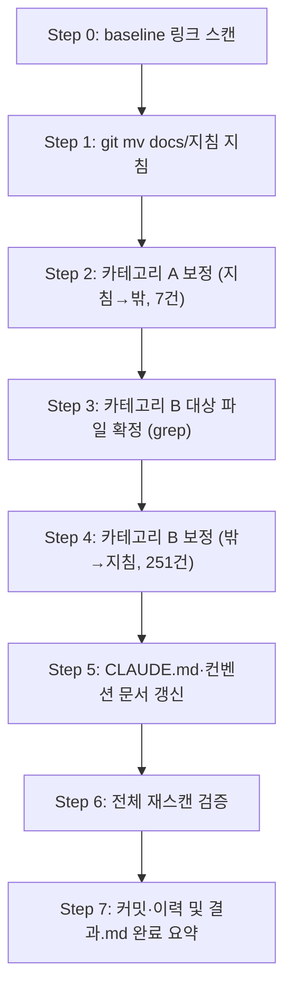

# 계획: 지침 폴더 루트 승격

**TL;DR**: (1) baseline 링크 스캔 → (2) `git mv docs/지침 지침` → (3) 카테고리 A(지침 내부→밖, 7건) 보정 → (4) 카테고리 B(밖→지침 안, 251건) 보정, 대상 목록 확정 후 스크립트 일괄 치환 → (5) 컨벤션 문서(문서 작성 규칙.md 등) 갱신 → (6) 전체 재스캔으로 신규 breakage 0건 검증. 5개 atomic commit.

## 1. 전체 시퀀스

## 2. 단계별 상세

### Step 0: baseline 링크 스캔

**작업**:
- 저장소 전체 .md 파일의 상대경로 markdown 링크를 파싱해 존재하지 않는 대상을 가리키는 것들을 목록화 (기존에 이미 깨져 있던 것 포함 — `컨텍스트 절약 규칙.md`의 `docs/회고/` 참조 등)
- 이 목록을 "본 작업 이전부터 깨져 있던 것"으로 저장해두고, 이후 단계와 비교 기준으로 사용

**영향 파일**: 없음(읽기 전용 조사)
**검증**: 스캔 결과에 분석.md에서 이미 발견한 1건(`컨텍스트 절약 규칙.md`)이 포함되는지 확인
**commit 메시지**: (커밋 없음, 조사 전용)

### Step 1: `git mv docs/지침 지침`

**작업**:
- `git mv docs/지침 지침` 단일 명령으로 서브트리 통째 이동 (히스토리 보존)
- 이 시점에는 링크를 건드리지 않음 — 순수 이동만

**영향 파일**: 이동 자체는 diff 없음(rename으로 기록), git status로 확인
**검증**: `git log --follow 지침/작업\ 규칙.md`로 이동 전 히스토리 연결 확인
**commit 메시지**: `chore(docs): docs/지침 → 지침 루트 승격 (파일 이동만, 링크 보정은 후속 커밋)`

### Step 2: 카테고리 A 보정 (지침 내부 → 트리 밖 참조, 7건)

**작업**: 분석.md §2에서 확정한 5개 파일 7건에서 `../` 1개씩 제거
- `지침/일반/문서/폴더-구조.md` (1건)
- `지침/일반/프로젝트 초기 세팅.md` (1건)
- `지침/일반/문서 테마 스타일.md` (1건)
- `지침/일반/문서/작성-스타일.md` (2건)
- (그 외 분석.md 표에 명시된 나머지)

**영향 파일**: 5개
**검증**: 각 링크의 실제 대상 파일이 존재하는지 수동 확인 (파일 수가 적어 Edit로 직접 처리)
**commit 메시지**: `fix(docs): 지침/ 내부→외부 참조 링크 보정 (../ 1개 제거, 7건)`

### Step 3: 카테고리 B 대상 파일 확정

**작업**:
- `grep -rln "docs/지침"` — 리터럴 스타일 파일 확정 (CLAUDE.md + 계획.md 1건, 분석.md §2 기준 2개 파일)
- `grep -rln "\.\./\.\./\.\./지침\|\.\./\.\./\.\./\.\./지침"` (범위: `docs/tasks/**`, 템플릿 3개 파일) — up-count 스타일 파일 확정, 파일별 현재 up-count 기록
- 두 grep 결과를 합쳐 최종 대상 파일 목록 확정 (예상 68개 파일)

**영향 파일**: 없음(조사)
**검증**: 대상 파일 수가 분석.md 추정치(68개 파일·251건)와 합치하는지 대조, 차이 있으면 원인 파악 후 재조사
**commit 메시지**: (커밋 없음)

### Step 4: 카테고리 B 보정 (밖 → 지침 안 참조, 251건)

**작업**:
- **리터럴 `docs/지침` 스타일** (CLAUDE.md 38건 + 계획.md 1건): `docs/지침` → `지침` 문자열 치환
- **up-count 스타일** (약 65개 완료 작업 파일, 202건 + 템플릿 3개 파일 10건): 파일별로 현재 up-count 확인 후 `../`를 정확히 1개 추가 (표준 3-up → 4-up, 단 Step 3에서 확인한 기존 4-up 파일은 5-up으로)
- 파일 수가 많으므로 대상 파일을 몇 개 배치로 나눠 스크립트(sed) 일괄 치환 — Step 3에서 확정한 목록에만 적용 (전체 저장소 무차별 sed 금지, 지침 서브트리 내부 상호참조 오염 방지)

**영향 파일**: 약 68개
**검증**: 치환 후 grep으로 옛 패턴(`docs/지침`, 3-up `지침` 등) 잔존 0건 확인
**commit 메시지**: `fix(docs): 밖→지침/ 참조 링크 보정 (CLAUDE.md 접두어 교체 + 251건 ../ 1개 추가)`

### Step 5: CLAUDE.md·컨벤션 문서 갱신

**작업**:
- `CLAUDE.md` Layout ASCII 다이어그램에 `지침/`을 `docs/` 밖 최상위 항목으로 반영
- [`문서 작성 규칙.md`](../../../../지침/일반/문서%20작성%20규칙.md)·[`폴더-구조.md`](../../../../지침/일반/문서/폴더-구조.md)에 "루트 저장소는 `지침/`이 루트 승격된 예외 — 하위 프로젝트는 `docs/지침/` 컨벤션 유지" 명시

**영향 파일**: 3개
**검증**: 신규 문단이 기존 frontmatter/TL;DR 규칙 준수하는지 셀프 체크
**commit 메시지**: `docs(meta): CLAUDE.md·문서 컨벤션에 지침/ 루트 승격 예외 반영`

### Step 6: 전체 재스캔 검증

**작업**: Step 0과 동일한 링크 스캔 재실행, 결과를 baseline과 비교

**영향 파일**: 없음
**검증**: "본 작업 이전부터 깨져 있던 것"(1건, 컨텍스트 절약 규칙.md) 외 신규 breakage 0건
**commit 메시지**: (커밋 없음, 검증 전용)

### Step 7: 완료 처리

**작업**: `이력 및 결과.md` 완료 요약 추가, `docs/tasks/meta/작업 목록.md`에 본 작업 등재

**commit 메시지**: `docs(meta): 지침 폴더 루트 승격 작업 완료 처리`

## 3. 검증 절차

### 3.1 단계별
- 각 commit 직전 `git status` + `git diff --stat`
- 영향 파일이 계획 범위 내인지 (오버런 방지) — 특히 Step 4는 사전 확정 목록 밖 파일을 건드리지 않도록 주의

### 3.2 최종
- broken link 스캔 0건 (기존 무관 이슈 1건 제외)
- 요구사항.md §3 수용 기준 전 항목 ✓
- `git log --follow`로 지침/ 서브트리 히스토리 보존 확인

## 4. 위험 관리

| 위험 | 가능성 | 영향 | 완화 |
|---|---|---|---|
| Step 4 스크립트가 지침 서브트리 내부 상호참조까지 오염 | 낮음 | 중 | Step 3 확정 목록에만 적용, 지침/ 서브트리 파일은 목록에서 명시적 제외 |
| 202건 규모 커밋을 사용자가 부담스러워함 | 중 | 낮음 | 계획 승인 요청 시 "기계적 일괄 처리"임을 강조, 선택지 B(과거 기록 제외)도 옵션으로 재확인 |
| up-count 불일치 파일(기존 4-up 6개) 누락 | 낮음 | 중 | Step 3에서 파일별 현재 up-count를 명시적으로 기록 후 Step 4에서 그 값 기준으로 +1 |

## 5. 작업 분담 (서브에이전트 활용)

- **메인 agent**: Step 0·1·2(소량 수동)·5·6·7 직접 처리
- **서브에이전트(Explore, 이미 완료)**: 영향 범위 조사 — 완료됨
- Step 3·4는 파일 수가 많지만 규칙이 완전 기계적이라 메인에서 스크립트로 직접 처리 (서브에이전트 위임보다 스크립트가 더 정확·빠름)

## 6. 진행 추적

- [x] Step 0: baseline 스캔 (범용 스크립트 폐기, Grep 기반으로 대체)
- [x] Step 1: git mv
- [x] Step 2: 카테고리 A 보정 (7건)
- [x] Step 3: 카테고리 B 대상 확정 (Grep으로 리터럴/up-count 스타일 분리)
- [x] Step 4: 카테고리 B 보정 (리터럴 7파일 + up-count 66파일)
- [x] Step 5: 컨벤션 문서 갱신
- [x] Step 6: 최종 검증 (리터럴 잔존 0건, 표본 경로 확인)
- [x] Step 7: 완료 처리

체크 진행 상황은 `이력 및 결과.md` 시계열 로그에 동시 기록.

## 7. 관련 산출물

- [요구사항.md](요구사항.md) — 무엇을·왜
- [분석.md](분석.md) — 현 상태·결정
- [이력 및 결과.md](이력%20및%20결과.md) — 시계열·완료

## 자체 검토

### 지침 준수 여부
| 지침 | 준수 |
|---|---|
| [`작업 진행 규칙.md`](../../../../지침/일반/작업%20진행%20규칙.md) | ✅ |
| [`서브에이전트 활용.md`](../../../../지침/일반/서브에이전트%20활용.md) | ✅ — 스크립트가 더 정확한 경우 서브에이전트 대신 직접 처리 근거 명시 |
| [`Git/브랜치, 병합 규칙.md`](../../../../지침/Git/브랜치,%20병합%20규칙.md) | ✅ — atomic commit 5~6개로 분할 |

### 논리적 정합성
| 점검 | 결과 |
|---|---|
| 분석.md 결정이 계획에 반영 | ✅ |
| 단계 시퀀스 의존성 명확 | ✅ |
| 위험·완화 식별 | ✅ |
| 서브에이전트 분담 명시 | ✅ |

### 미해결 이슈
| 이슈 | 처리 |
|---|---|
| 선택지 A(과거 기록 포함) 최종 확정 | 사용자 승인 요청 시점에 재확인 |
