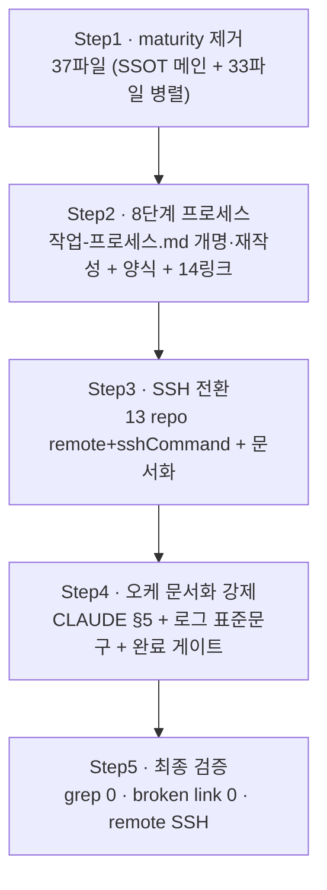

# 계획: 지침체계 개편

**TL;DR**: 4축을 4개 atomic commit으로 처리. Step1 maturity 제거(SSOT·인덱스·헌법 메인 직접 + 33파일 서브에이전트 병렬), Step2 8단계 프로세스(`작업-프로세스.md` 개명·재작성+양식+14링크), Step3 SSH 전환(13 repo+문서화), Step4 오케 문서화 강제(§5+표준문구+게이트), Step5 최종 검증. maturity 제거 fan-out에서 신규 오케 로그 규칙을 실제 시연(에이전트-로그 남김).

## 1. 전체 시퀀스

각 Step = 1 atomic commit. Step 간 순서 의존(2는 1의 파일 상태 위에서, 4는 2의 8단계 위에서).

## 2. 단계별 상세

### Step 1: maturity 전면 제거 (37파일)

**작업**:
- 1a (메인 직접): SSOT [`메타-frontmatter.md`](../../../../지침/문서/메타-frontmatter.md) — §1.2 라벨 정의 절 삭제(이후 절 재번호), 필드 표 maturity 행 삭제, §4 인라인 선정 기준을 **"위반 시 즉시 중단되는 절대 준수 규칙"**으로 대체 서술, §5 grep 추출 항목 삭제, frontmatter·TL;DR 필드 목록에서 maturity 제거
- 1b (메인 직접): 인덱스 3종 — `지침/README.md`(표 maturity 열 삭제+라벨 의미 블록 삭제), `문서/README.md`, `공통/README.md` 산문
- 1c (메인 직접): `CLAUDE.md` — §핵심지침 제목 `— maturity: core` 삭제, §6 frontmatter 필드 목록·셀프체크·§Memory·layout 주석의 maturity 언급 삭제
- 1d (서브에이전트 병렬 3노드): 나머지 33파일 — frontmatter `maturity:` 줄 삭제 + 인라인 마커 `*(maturity: X)*` 삭제(헤딩 텍스트 보존) + 산문 언급 정리. 각 노드가 처리 결과를 `에이전트-로그/`에 직접 Write

**영향 파일**: 37 (CLAUDE.md 1 + 지침 36)
**검증**: `grep -rn "maturity" 지침/ CLAUDE.md` = 0, frontmatter 정합(name/purpose/type/tags 유지)
**commit 메시지**: `refactor(docs): maturity 개념 전면 제거 (지침·헌법)`

### Step 2: 작업 프로세스 4→8단계

**작업**:
- 2a: `git mv 4단계-프로세스.md 작업-프로세스.md` + 내용 8단계 재작성 — 제목·frontmatter, Mermaid 플로우(요구사항→검증→분석→검증→계획→검증→[승인]→구현→검증), §1.1 단계표 8행, §3 자체검토를 독립 검증파일 규정으로 전환("별도 파일 분리 금지"→"독립 `<단계>-검증.md`"), §4 승인 게이트(계획검증 후 1회) 명확화
- 2b: 신규 [`검증.md`](../../../../지침/문서/양식) 양식 작성(검증 3축 표+판정), `이력 및 결과.md` 양식 진척표 8행, 요구사항/분석/계획 양식의 `## 자체 검토` 섹션 → `<단계>-검증.md` 참조로 전환
- 2c: `4단계-프로세스.md` 참조 14링크(9파일) → `작업-프로세스.md` 일괄 치환, "4단계"·"①~④" 표현 → "작업 프로세스"·"8단계"·"①~⑧" 갱신
- 2d: 관련 지침 단계 참조 갱신 — `작업 규칙.md`, `작업 진행 규칙.md`, `코딩/작업 규칙.md`, `활용.md`, `오케스트레이션.md`(결정_4 검증 용어 흡수)

**영향 파일**: ~15 + 양식 5 + 링크 9
**검증**: `grep -rn "4단계-프로세스" .` = 0, broken link 0, Mermaid 렌더
**commit 메시지**: `refactor(docs): 작업 프로세스 4→8단계 (단계별 검증 정식 산출물화)`

### Step 3: HTTPS→SSH 전환 (13 repo)

**작업**:
- 3a: 13 repo 각 `git remote set-url origin <ssh>` + `git config core.sshCommand 'ssh -i E:/workspace/rules/tools/credentials/github/ssh-key -o IdentitiesOnly=yes'` (일괄 스크립트, `$CLAUDE_JOB_DIR/tmp`에 작성)
- 3b: `ssh -T git@github.com` / `ssh -T git@gitlab.com` 연결 검증 (키 미등록이면 중단·사용자 보고)
- 3c: `tools/credentials/README.md` SSH 항목 갱신 + 설정 지침에 배선·재현 절차 문서화

**영향 파일**: 13 `.git/config`(커밋 대상 아님) + rules 문서 1~2
**검증**: 각 repo `git remote -v`가 `git@`, `git ls-remote` 성공
**commit 메시지**: `docs(tools): 전 repo SSH 배선 절차 문서화` (rules 문서만)

> [!NOTE]
> SSH 키가 GitHub/GitLab 계정에 미등록이면 `ssh -T` 실패 → 즉시 중단하고 은수님께 공개키(`ssh-key.pub`) 등록 요청(사용자 작업). remote URL 변경은 그 후 진행.

### Step 4: 오케스트레이션 문서화 강제

**작업**:
- 4a: `CLAUDE.md` §5에 "**2노드+ fan-out 시 `에이전트-로그/` 필수** — 4단계 산출물·각 검증·위임 프롬프트/입력 전량 기록" 한 줄 + [`로그 구조.md`](../../../../지침/서브에이전트/로그%20구조.md) 링크 추가(현재 미링크)
- 4b: `로그 구조.md`에 **위임 프롬프트 표준 문구** 신설 — "각 노드는 결과를 `에이전트-로그/NN_<역할>.md`에 직접 Write하라"를 fan-out 프롬프트에 박는 규약
- 4c: `완료처리.md`에 점검 게이트 — "이력에 'N노드 fan-out' 기술 시 형제 `에이전트-로그/` 폴더 존재 확인" 체크 항목

**영향 파일**: 3 (CLAUDE.md, 로그 구조.md, 완료처리.md)
**검증**: §5에서 로그 구조.md 링크 도달, 완료처리 체크 항목 존재
**commit 메시지**: `docs(meta): 오케스트레이션 산출물·프롬프트 문서화 강제화`

### Step 5: 최종 검증

**작업**: 수용 기준(요구사항.md §3) 전 항목 확인 — grep maturity 0, grep 4단계-프로세스 0, broken link 0, 13 repo remote SSH, CLAUDE.md 정합. `구현-검증.md` 작성(신규 8단계 ⑧ 시연).

## 3. 검증 절차

### 3.1 단계별
- 각 commit 직전 `git status` + `git diff --stat` — 영향 파일이 계획 범위 내인지(오버런 방지)
- Step1 후 `grep -rn "maturity"` 즉시 확인, Step2 후 `grep -rn "4단계-프로세스"` 확인

### 3.2 최종
- broken link 검사(`tools/` 링크 체커 또는 grep 잔존 확인)
- 수용 기준 §3 전 항목 체크
- Mermaid 문법 검증(mermaid MCP)

## 4. 위험 관리

| 위험 | 가능성 | 영향 | 완화 |
|---|---|---|---|
| SSH 공개키 계정 미등록 | 중 | 높음 | Step3b `ssh -T` 선검증, 실패 시 중단·사용자 요청 |
| 서브에이전트 병렬 파일 수정 실수 | 중 | 중 | 노드에 정확한 삭제 대상 라인·문자열 명시(조사 결과 활용), Step1 후 grep 검증 |
| 개명 링크 누락 | 중 | 중 | grep 전수 치환 + 최종 broken link 검사 |
| 8단계-오케스트레이션 단계번호 불일치 | 중 | 중 | 결정_4로 용어 통합, 2d에서 일괄 갱신 |
| 커밋에 AI 표시 혼입 | 낮음 | 높음 | identity `김은수` 확인, Co-Authored-By 금지 |

## 5. 작업 분담 (서브에이전트 활용)

- **메인 agent**: Step1 SSOT·인덱스·헌법 정밀 수정(1a~1c), Step2 전체(핵심 저술), Step3·4 저술·설정
- **서브에이전트 (general-purpose, sonnet, effort 미지정) 병렬 3노드**: Step1d — 33파일을 파일 그룹으로 분할, 각 노드가 frontmatter 줄+인라인 마커 기계 삭제 후 `에이전트-로그/NN_<그룹>.md`에 처리 결과 Write
- **오케 로그 시연**: Step1d fan-out은 신규 규칙대로 `에이전트-로그/00_오케스트레이터-입력.md`(위임 설계·프롬프트) + `NN_<그룹>.md`(노드 결과) + `인덱스.md` 남김 — 은수님 지적("실제로 안 남긴다")의 즉시 교정 시연
- **폭주 감시**: fan-out fire-and-forget 금지, 산출 없이 부푸는 노드 TaskStop→메인 폴백

## 6. 진행 추적

- [ ] Step 1: maturity 전면 제거
- [ ] Step 2: 작업 프로세스 4→8단계
- [ ] Step 3: HTTPS→SSH 전환
- [ ] Step 4: 오케스트레이션 문서화 강제
- [ ] Step 5: 최종 검증

체크 진행은 `이력 및 결과.md` 시계열 로그에 동시 기록.

## 7. 관련 산출물

- [요구사항.md](요구사항.md) — 무엇을·왜
- [분석.md](분석.md) — 현 상태·결정
- [이력 및 결과.md](이력%20및%20결과.md) — 시계열·완료

## 자체 검토

### 지침 준수 여부
| 지침 | 준수 |
|---|---|
| [`작업 진행 규칙.md`](../../../../지침/일반/작업%20진행%20규칙.md) | 준수 — ③ 계획, atomic commit 분해 |
| [`서브에이전트 활용.md`](../../../../지침/서브에이전트/활용.md) | 준수 — 병렬 분담·오케 로그 시연 |
| [`Git/브랜치, 병합 규칙.md`](../../../../지침/Git/브랜치,%20병합%20규칙.md) | 준수 — feature 브랜치·identity·no AI |

### 논리적 정합성
| 점검 | 결과 |
|---|---|
| 분석.md 6결정이 계획에 반영 | 결정1→S1, 2·3·4→S2, 5→S3, 6→S4 |
| 단계 시퀀스 의존성 명확 | S2⊃S1, S4⊃S2 |
| 위험·완화 식별 | SSH 미등록·병렬 실수·링크 누락 |
| 서브에이전트 분담 명시 | S1d 병렬 3노드 + 오케 로그 |

### 미해결 이슈
| 이슈 | 처리 |
|---|---|
| SSH 공개키 등록 여부 | Step3b 선검증에서 판명 |
| Step1d 파일 그룹 분할 세부 | 구현 착수 시 33파일 균등 3분할 |
