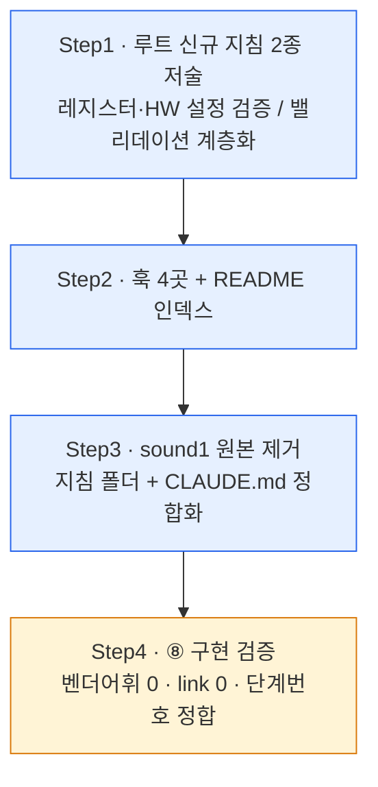

# 계획: sound1 지침 2종 루트 이전·범용화

**TL;DR**: 4 Step — ① 루트 신규 지침 2종 저술(레지스터·하드웨어 설정 검증 / 밸리데이션 계층화), ② 훅 4곳 + README 인덱스, ③ sound1 원본 제거(지침 폴더 + CLAUDE.md 정합화, `main.c` 미접촉), ④ 최종 검증. rules 3커밋 + sound1 1커밋. 확정 스펙 저술이라 fan-out 없이 메인 직접(폭주 방지 원칙).

## 1. 전체 시퀀스

Step1→2 의존(훅이 신규 파일 링크), Step2→3 독립이나 순서 유지(루트 확립 후 원본 제거).

## 2. 단계별 상세

### Step 1: 루트 신규 지침 2종 저술

**작업**:
- 1a `지침/코딩/레지스터·하드웨어 설정 검증.md` — 5게이트 보존(설정 대상 식별·근거 확인·전후 시뮬레이션·부작용·불확실성), 어휘 중립화(결정_2), 대상 확장: 외부 IC(I2C/SPI)·MCU peripheral(MMIO) 레지스터 + 클럭 트리·GPIO·전원 도메인·인터럽트 우선순위(결정_3). 근거원을 `데이터시트·레퍼런스 매뉴얼·SDK 헤더 주석`으로 확대. 범용 MCU 예시(타이머 prescaler 분주비 변경)로 교체(선택지_B). `분석·디버깅 규칙 §4`·`코딩 작업 규칙 §7.2` 상호 링크
- 1b `지침/코딩/밸리데이션 계층화.md` — §1~§3·§6~§8 승격, §4 도메인 중립 예시로 교체, §5 CFX 고유명 제거 후 일반화("테스트 코드 미삽입·구조만 준비·단순 유닛은 로직 설명 갈음"), §9 프로젝트 NOTE 배제, maturity 제거, 단계 표기 ②③→**③⑤** 재매핑(결정_4). **4방향 적용 절 신설**: 코딩 방법·리팩터링 방법·문서 작성·계획 단계

**영향 파일**: 신규 2
**검증**: `grep -iE "IQS323|Azoteq|Re-ATI|Reseed|LTA|CFX|DMIC|빔포밍"` = 0, frontmatter+TL;DR 셀프체크
**commit 메시지**: `docs(coding): 레지스터·하드웨어 설정 검증 + 밸리데이션 계층화 지침 신설 (sound1 승격·범용화)`

### Step 2: 훅 4곳 + README 인덱스

**작업** (결정_5 한 줄 원칙 — 본문 중복 금지):
- **`CLAUDE.md` §7(프로그래밍 작업)** — "HW 레지스터·설정 변경 전 5게이트 검증 / 리팩터링·모듈화는 유닛·모듈 계층 분해" 한 줄 + 링크 2건. **자동주입 보장용** — ⑥ 검증 시나리오_2에서 발견: 훅을 `지침/` 하위에만 걸면 2026-07-13 오케 로그 누락과 동일한 "상기 실패" 패턴 재발
- `코딩/구현 패턴.md` — 유닛 경계·HW 의존 격리·결정론적 입출력 1줄 + 계층화 링크 (FSM §예외의 과도추상화 회피와 정합 명시)
- `코딩/작업 규칙.md` — §4 코딩 특화 규약에 (a) HW 설정 변경 시 레지스터 지침 (b) 리팩터링·모듈화 시 계층화 지침 링크. §6 관련 지침에 2행
- `코딩/분석·디버깅 규칙.md` — §4 상태 추적과 레지스터 지침 상호 링크
- `문서/양식/계획.md` — 코딩 작업이면 유닛·모듈 분해 + 테스트 순서("A는 B 통과 전제") 명시 + 링크
- `지침/README.md` — 코딩 카테고리에 신규 2행
- (검토) `일반/작업/작업-프로세스.md` §1.1 ⑤·⑧ — §1.1이 이미 조밀하면 계획 양식으로 갈음(결정_5)

**영향 파일**: 6~7 (CLAUDE.md 포함)
**검증**: 각 훅에서 신규 지침으로 링크 도달, CLAUDE.md §7에서 2건 도달, `check-links.ps1` 0
**commit 메시지**: `docs(coding): 계층화·레지스터 지침 적용 훅 + 인덱스 반영`

### Step 3: sound1 원본 제거 (별도 repo)

**작업**:
- `docs/지침/` 2파일 삭제 → 폴더 소멸 (README는 기삭제 상태, 함께 스테이징)
- `CLAUDE.md` 정합화 4곳: L11 TL;DR 문장 끝 trailing space, L14 문장 끝 trailing space, L17-18 dangling `>`, L41-43 trailing 빈 줄. **삭제된 메타·Fork-and-PR 섹션은 복원 금지**(은수님 의도)
- **`main.c` 미접촉** — `git add`에 경로 명시만 사용, `-A`/`.` 금지

**영향 파일**: sound1 3 (지침 2 삭제 + README 삭제 + CLAUDE.md)
**검증**: `git diff --cached --name-only`에 `main.c` 부재 확인, `ls docs/지침` → 폴더 없음
**commit 메시지**(sound1): `Docs(meta): 프로젝트 지침 폴더 제거 — 루트 지침으로 승격 완료`

### Step 4: ⑧ 구현 검증

**작업**: 수용 기준(요구사항 §3) 전 항목 확인 + `구현-검증.md` 작성. 벤더 어휘 0, broken link 0, 단계 번호(③⑤) 정합, sound1 폴더 소멸·main.c 미접촉.

## 3. 검증 절차

### 3.1 단계별
- 각 commit 직전 `git status` + `git diff --cached --name-only` — 특히 sound1은 `main.c` 혼입 여부 필수 확인(위험 1순위)
- Step1 후 벤더 어휘 grep 즉시 확인

### 3.2 최종
- `tools/check-links.ps1` 깨진 링크 0
- `grep -rn "②분석\|③계획"` 신규 지침에 옛 단계 표기 잔존 0
- 수용 기준 §3 전 항목

## 4. 위험 관리

| 위험 | 가능성 | 영향 | 완화 |
|---|---|---|---|
| sound1 커밋에 `main.c` 혼입 | 중 | 높음 | 경로 명시 add만, 커밋 전 staged 목록 확인, `-A`/`.` 금지 |
| 훅이 본문 중복으로 비대 | 중 | 중 | 한 줄 + 링크 원칙, 본문은 SSOT 1곳 |
| 신규 지침 단계 번호가 8단계와 불일치 | 중 | 중 | ③⑤ 재매핑 + 최종 grep |
| sound1 CLAUDE.md 정리가 은수님 의도 침범 | 낮음 | 중 | 잘린 문장·dangling만, 섹션 복원 금지 |
| 범용화 과정에서 원본 핵심 상실 | 낮음 | 중 | 5게이트·계층 모델 골격 보존, ⑧ 검증에서 원본 대조 |

## 5. 작업 분담 (서브에이전트 활용)

- **메인 agent 직접 (fan-out 없음)**: Step1~4 전부. 근거 — 설계 결정(결정_1~6)이 ③분석에서 확정된 **확정 스펙 저술**이라 [`활용.md §3.1`](../../../../지침/서브에이전트/활용.md)·[`오케스트레이션.md §7`](../../../../지침/서브에이전트/오케스트레이션.md)의 "확정 스펙 대형 저술은 오케스트레이터 직접(폭주 방지)" 원칙 적용. 파일 2종·훅 5곳 규모로 병렬 실익도 낮음
- **에이전트-로그**: 2노드+ fan-out이 아니므로 [`로그 구조.md §1.2`](../../../../지침/서브에이전트/로그%20구조.md) 적용 대상 아님 — 미작성

## 6. 진행 추적

- [ ] Step 1: 루트 신규 지침 2종 저술
- [ ] Step 2: 훅 4곳 + README 인덱스
- [ ] Step 3: sound1 원본 제거
- [ ] Step 4: ⑧ 구현 검증

## 7. 자기 적용 검토 (정책 첫 사용 사례)

본 작업은 **8단계 프로세스의 첫 실적용**이다([`학습노트 5.10`](../../../../지침/일반/작업/작업-프로세스.md) 자기 참조 규칙).
- 신설 절차의 첫 사용 사례인가? → **예** (8단계 + 독립 검증 파일 4종)
- 자기 반영 대상: 본 작업 폴더가 `①~⑧` 산출물 8종 + 이력을 실제로 생성해 양식 실효성을 검증
- 반영 시점: 각 단계 진행 중 (②④ 완료, ⑥⑧ 예정) — ⑧에서 양식 미비점 발견 시 후속 개선 제안

## 8. 관련 산출물

- [요구사항.md](요구사항.md) — 무엇을·왜
- [분석.md](분석.md) — 현 상태·결정
- [계획-검증.md](계획-검증.md) — ⑥ 자체 검증
- [이력 및 결과.md](이력%20및%20결과.md) — 시계열·완료
