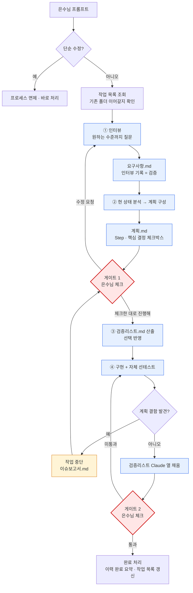

# 계획: 작업 프로세스 개편 (인터뷰 기반 · 체크박스 승인)

**TL;DR**: 8단계(산출 4 + 자체검증 4)를 **4단계 2게이트**로 재편한다 — ① 인터뷰·요구사항 → ② 분석·계획 → **[게이트 1] 계획서 체크박스** → ③ 검증리스트 산출 → ④ 구현·자체 선테스트 → **[게이트 2] 검증리스트 체크**. 폐지되는 자체검증 4종의 실질(근거 귀속·실패 시나리오·전수 조사)은 계획서 안으로 이전한다. 연동 지점 17개. **§4 실행 Step과 §5 핵심 결정에 체크해 주시면 그대로 진행합니다.**

## 1. 현 상태 분석

### 1.1 현행 8단계의 실제 모습

| 사실 | 근거 |
|---|---|
| 산출 4단계 각각 뒤에 자체검증 4단계가 붙어 총 8단계다 | `지침/일반/작업/작업-프로세스.md:11` (TL;DR), `:50~58` (§1.1 단계 정의 표) |
| 검증은 **Claude 자체 검증**이며 사용자 승인 게이트가 아니다 | `작업-프로세스.md:75` — *"검증은 자체 검증이다 — Claude가 산출물을 스스로 점검해 검증 파일로 남긴다"* |
| 사용자 승인은 ⑥ 이후 **1회뿐**이고 형식은 yes/no다 | `작업-프로세스.md:186~190` (§4) — *"승인 형식: 간결 보고 + yes/no 확인"* |
| 검증 4종은 공용 양식 하나를 복사해 쓴다 | `작업-프로세스.md:72` (§1.2 TIP), `지침/문서/양식/검증.md:11` |
| 8단계는 **2026-07-14에 4단계에서 늘린 것**이다 | `docs/tasks/meta/작업 목록.md` 2026-07-14 행 — *"작업 프로세스 4→8단계(각 산출 뒤 검증을 독립 `<단계>-검증.md`로 정식화)"* |

### 1.2 검증 4종이 실제로 한 일 (폐지 전에 확인해야 할 것)

바로 다음 작업에 **효익 기록이 남아 있다.**

> `docs/tasks/meta/작업 목록.md` 2026-07-15 행:
> *"**8단계 프로세스 첫 실적용** — ④ 재확인 패스로 활성 참조 0건 확인, ⑥ 계획 검증에서 «지침만 두면 상기 실패» 결함 포착·보완"*

즉 검증 단계가 **실제로 결함을 잡았다.** 잡아낸 장치는 셋이다.

| 무엇이 잡았나 | 정체 | 폐지 시 이전할 곳 |
|---|---|---|
| ④ 분석 검증의 **재확인 패스** | 인용한 근거를 다시 대조 (`작업-프로세스.md:180`) | 계획서 §1·§2의 **근거 열** — 사실 주장마다 `파일:라인` |
| ⑥ 계획 검증의 **실패 시나리오** | *"왜 이 계획이 틀릴 수 있는가"* ≥1 (`작업-프로세스.md:181`) | 계획서 **§6 실패 시나리오** (필수 절) |
| ⑧ 구현 검증의 **전수 Grep + 링크체커** | 구 경로 리터럴 0 확인 (`작업-프로세스.md:182`) | **검증리스트의 Claude 열** |

> [!IMPORTANT]
> **문서를 없애는 것과 규율을 없애는 것은 다르다.** 위 3개가 새 체계 어디에도 자리를 못 잡으면 이번 개편은 산출물만 줄이고 품질을 떨어뜨린다. §4 Step 1·2가 이 이전을 담당한다.

### 1.3 그런데도 개편하는 이유

| 문제 | 실측 |
|---|---|
| 검증 문서를 **은수님이 읽지 않는다** | 은수님 진술 — *"실제로 내가 검증 문서까지 보지 않아"* |
| 검증이 **자기 채점**이다 | Claude가 스스로 «통과»라고 적는다 (`작업-프로세스.md:75`). 읽는 사람이 없으면 게이트가 아니라 형식이다 |
| 승인 해상도가 **yes/no뿐**이다 | 부분 승인("이건 하고 저건 빼")을 표현할 수단이 없어 매번 대화로 되돌아간다 |
| 중단 시 **보고 형식이 없다** | `작업-프로세스.md:169~172` (§3.3)에 "이전 단계로 회귀" 판정만 있고 은수님께 무엇을 어떻게 내는지가 없다 |

## 2. 영향 범위 (전수 조사)

`grep -rn "8단계\|요구사항-검증\|분석-검증\|계획-검증\|구현-검증" CLAUDE.md AGENTS.md 지침/` 결과 기준.

| # | 파일 | 수정 지점 | 성격 |
|---|---|---|---|
| 1 | `지침/일반/작업/작업-프로세스.md` | 전문 308줄 (frontmatter·TL;DR·§1 mermaid·§1.1·§1.2·§2.3·§3 전체·§4) | **전면 재작성** |
| 2 | `지침/문서/양식/요구사항.md` | `:11` `:20` `:23` `:108` | 인터뷰 절 추가 · 검증 참조 제거 |
| 3 | `지침/문서/양식/계획.md` | `:11` `:21` `:24` `:129` | **분석 흡수 + 체크박스 절 신설** |
| 4 | `지침/문서/양식/분석.md` | 파일 전체 | 폐지 (결정_2) |
| 5 | `지침/문서/양식/검증.md` | 파일 전체 | 폐지 (결정_2) |
| 6 | `지침/문서/양식/이력 및 결과.md` | `:63~81` 단계 진척 표 8행 | 4단계 2게이트로 교체 |
| 7 | `지침/문서/양식/검증리스트.md` | — | **신설** |
| 8 | `지침/문서/양식/이슈보고서.md` | — | **신설** |
| 9 | `CLAUDE.md` | `:49~53` (§3) · `:70` (§5 "8단계 산출물") · `:151` (§Memory 예시) | 핵심 지침 교체 |
| 10 | `AGENTS.md` | `:49~53` · `:70` · `:88` | CLAUDE.md 미러 동기화 |
| 11 | `지침/작업 규칙.md` | `:11` (TL;DR) · `:42` (§3 헤더) · `:45` `:50` `:51` `:53` | 마스터 체크리스트 |
| 12 | `지침/일반/작업 진행 규칙.md` | `:3` (purpose) · `:11` (TL;DR) · **`:34` `:36` (양식 표 행)** · `:60` `:62` `:67` | 인덱스 |
| 13 | `지침/문서/폴더-구조.md` | `:11` (TL;DR "4파일") · `:36` (트리) · `:72` (필수 파일) · `:114` (4개 문서) | 산출물 목록 |
| 14 | `지침/서브에이전트/로그 구조.md` | `:44~48` 트리 | 산출물 목록 |
| 15 | `지침/코딩/작업 규칙.md` | `:3` `:11` `:15` | 상속 관계 서술 |
| 16 | `지침/일반/프로젝트 초기 세팅.md` | `:11` `:216` | "8단계 면제" 표현 |
| 17 | `지침/README.md` | `:9` (①~⑧ 서술) + 신설 양식 2종 등재 | 인덱스 |

> [!NOTE]
> **손대지 않는 것**: `docs/tasks/**` 과거 작업 기록 전부(질문_3 «소급 없음»).

> [!CAUTION]
> **정정 (게이트 1 직후)** — 처음 이 표를 쓸 때 *"과거 작업 문서 14건이 두 양식을 링크한다"*고 적었으나 **틀렸다.**
>
> | 항목 | 처음 기재 | 실측 |
> |---|---|---|
> | 깨지는 마크다운 링크 | 14건 | **1건** — `docs/tasks/meta/20260715_sound1-지침-이전/분석-검증.md`의 `[양식/분석.md](../../../../지침/문서/양식/분석.md)` |
> | 나머지 13건의 정체 | (링크로 간주) | JSON 첨부·표 셀 안의 **경로 문자열**. 마크다운 링크가 아니라 서술 텍스트다 |
> | 링크체커 검사 범위 | (전역으로 가정) | `tools/check-links.ps1:19` — `$Include = @('지침', 'CLAUDE.md', 'docs/tasks/README.md', 'docs/tasks/모듈 현황.md')`. **개별 작업 폴더는 애초에 검사 대상이 아니다** |
>
> 원인: `grep -c`의 **문자열 등장 횟수**를 링크 수로 셌다. 결론(결정_2 «삭제»)은 바뀌지 않으며 부작용은 처음 추정보다 작다 — 실패_5는 사실상 해소됐다.

## 3. 새 프로세스 설계안

### 3.1 흐름

### 3.2 단계 정의

| 단계 | 이름 | 산출물 | 핵심 질문 | 검증 방식 |
|---|---|---|---|---|
| ① | 인터뷰·요구사항 | `요구사항.md` | 은수님이 무엇을 원하는가? | **인터뷰 기록 자체** |
| ② | 분석·계획 | `계획.md` | 지금 어떤 상태이고 어떻게 바꿀 것인가? | 근거 열 + 실패 시나리오 |
| — | **게이트 1** | (체크된 계획서) | 이 계획대로 갈 것인가? | **은수님 체크박스** |
| ③ | 검증리스트 산출 | `검증리스트.md` | 무엇을 확인해야 끝난 것인가? | 선택된 Step에서 역산 |
| ④ | 구현·자체 선테스트 | 실제 변경 | 계획대로 되었는가? | Claude 자체 테스트 → 자가 수정 |
| — | **게이트 2** | (체크된 검증리스트) | 정말 끝났는가? | **은수님 체크박스** |
| 예외 | 중단 | `이슈보고서.md` | 계획의 어디가 틀렸는가? | 은수님 체크 후 재개·수정 |

### 3.3 산출물 (상시 4종 + 조건부 1종)

| 파일 | 시점 | 비고 |
|---|---|---|
| `요구사항.md` | ① | §인터뷰 기록 절 필수 |
| `계획.md` | ② | §현 상태 분석(근거 열)·§실행 계획(Step 체크)·§핵심 결정(선택 체크)·§실패 시나리오 필수 |
| `검증리스트.md` | ③ (게이트 1 통과 후) | Claude 열 / 은수님 열 2열 |
| `이력 및 결과.md` | ① 시작과 동시 | 현행 유지 |
| `이슈보고서.md` | 예외 발생 시만 | 체크 형식 |

### 3.4 폐지되는 것

`요구사항-검증.md` · `분석-검증.md` · `계획-검증.md` · `구현-검증.md` · `분석.md`(계획서로 흡수)

## 4. 실행 계획

> [!IMPORTANT]
> **여기에 체크해 주세요.** `[x]` = 이번에 실행, `[ ]` = 이번엔 안 함. `[필수]` Step은 기본 체크해 두었고, 해제하시면 §6에 적은 영향이 생기므로 그때 다시 보고드리겠습니다.

- [x] **Step 1** `지침/일반/작업/작업-프로세스.md` 전면 재작성 — 4단계 2게이트 흐름·단계 정의·게이트 규칙·중단 프로토콜, §1.2의 3개 규율 이전, 구 8단계는 §학습 노트에 이력 보존 `[필수]`
- [x] **Step 2** 양식 재편 5종 — `요구사항.md`(인터뷰 절)·`계획.md`(분석 흡수 + 체크박스 + 근거 열 + 실패 시나리오)·`검증리스트.md`(신설, 2열)·`이슈보고서.md`(신설)·`이력 및 결과.md`(단계 진척 표 교체) `[필수]`
- [x] **Step 3** `CLAUDE.md` §3 교체 + §5·§Memory 문구 정리, `AGENTS.md` 동일 미러 `[필수]`
- [x] **Step 4** `지침/작업 규칙.md` 마스터 체크리스트 §3 + TL;DR 교체 `[필수]`
- [x] **Step 5** `지침/일반/작업 진행 규칙.md` purpose·TL;DR·§5 검수 대비 문구 갱신 `[필수]`
- [x] **Step 6** `지침/문서/폴더-구조.md` TL;DR·트리·필수 파일·보존 문구 갱신 `[필수]`
- [x] **Step 7** `지침/서브에이전트/로그 구조.md` §2 트리 갱신 `[필수]`
- [x] **Step 8** `지침/코딩/작업 규칙.md`·`지침/일반/프로젝트 초기 세팅.md` 상속·면제 표현 갱신 `[필수]`
- [x] **Step 9** `지침/README.md` 행 갱신 + 신설 양식 2종 등재 `[필수]`
- [x] **Step 10** 작업 등재 — `docs/tasks/meta/작업 목록.md` 행 추가 + `모듈 현황.md` 갱신 `[필수]`
- [x] **Step 11** 구현 검증 — 잔존 표현 `grep` 0 확인 + `tools/check-links.ps1` 링크체크 `[필수]`
- [x] **Step 12** 구 양식 파일(`분석.md`·`검증.md`) 처리 — 결정_2 선택에 종속 `[선택]`
- [x] **Step 13** `.claude/settings.json` SessionStart 훅 문구의 `maturity:core` 잔재 정리 — 이번 개편과 무관한 별개 결함이나 어차피 훅을 손댄다면 함께 `[선택]`

### 4.1 커밋 단위

| 커밋 | 포함 Step | 이유 |
|---|---|---|
| 1 | Step 1, 2 | 새 체계 본체 (지침 + 양식) — 이것만으로 자족 |
| 2 | Step 3~9 | 연동 지점 전수 갱신 — 한 커밋이어야 정책 표현이 분기된 구간이 안 생긴다 |
| 3 | Step 10~13 | 등재·검증·정리 |

## 5. 핵심 결정

> [!IMPORTANT]
> **각 결정에서 하나만 체크해 주세요.** `←권장`은 제 의견이며 근거를 함께 적었습니다.

### 결정_1 · 프로세스 명칭

- [x] (가) **4단계 2게이트 프로세스** `←권장` — 산출·실행 4개와 게이트 2개를 나눠 부른다. 게이트가 이번 개편의 핵심이라 이름에 드러나는 편이 낫다
- [ ] (나) **6단계 프로세스** — 게이트도 단계로 세어 ①~⑥. 구 "8단계"와 형식이 같아 이행이 자연스럽다
- [ ] (다) **번호 없는 이름형** — "인터뷰 → 계획 → 검증리스트 → 구현". 숫자 혼동이 없다

> 참고: 2026-07-14 **이전 체계가 «4단계»였다.** (가)를 고르시면 옛 이름과 겹치므로 반드시 «2게이트»를 붙여 부르겠습니다.

### 결정_2 · 구 양식 파일(`분석.md`·`검증.md`) 처리

- [ ] (가) **deprecated 헤더 달고 보존** `←권장` — 과거 작업 문서 **14건이 이 두 양식을 링크**한다(`20260714_지침체계-개편/구현-검증.md`·`20260715_sound1-지침-이전/분석-검증.md` 등). 삭제하면 그 링크가 전부 깨진다
- [x] (나) **삭제** — 가장 깔끔하지만 위 14건이 broken link가 된다
- [ ] (다) **`양식/구/` 하위로 이동** — 현 위치에서 치우지만 링크는 마찬가지로 깨진다

### 결정_3 · 검증리스트 미통과 항목 처리

- [x] (가) **사유에 따라 분기** `←권장` — 구현 실수면 제가 고치고 그 항목만 재체크 요청, 계획 자체 결함이면 이슈보고서로 전환
- [ ] (나) **항상 제가 수정 후 재체크 요청** — 단순하지만 계획 결함일 때 같은 실패를 반복한다
- [ ] (다) **항상 이슈보고서** — 사소한 오타에도 보고서가 나와 무겁다

### 결정_4 · 이슈보고서 파일명

- [x] (가) **`이슈보고서_1_<주제>.md`** `←권장` — 한 작업에서 두 번 이상 막힐 수 있으니 번호로 누적. 한글 라벨 규칙 준수
- [ ] (나) **`이슈보고서.md` 단일 파일** — 여러 이슈를 섹션으로 누적. 파일 수는 적지만 이력이 섞인다

### 결정_5 · 인터뷰 종료 조건 (① 단계의 «원하는 수준» 판단 기준)

- [x] (가) **모호점 0 + 수용 기준 도출 가능** `←권장` — 제가 수용 기준을 쓸 수 있으면 충분히 물은 것으로 본다. 객관적이라 제가 스스로 판단할 수 있다
- [ ] (나) **은수님이 «이제 됐어»라고 하실 때까지** — 통제권이 확실하나 매번 종료 선언이 필요하다
- [ ] (다) **질문 라운드 상한 3회** — 피로가 예측 가능하나 복잡한 작업에서 덜 물은 채 넘어갈 수 있다

## 6. 실패 시나리오 (왜 이 계획이 틀릴 수 있는가)

| # | 시나리오 | 징후 | 대비 |
|---|---|---|---|
| 실패_1 | **규율이 문서와 함께 증발한다** — 검증 4종을 지우면서 근거 귀속·실패 시나리오·전수 조사도 같이 사라져, 산출물만 줄고 추측이 늘어난다 | 계획서에 `파일:라인` 없는 단정이 등장 | Step 1·2에서 §1.2 표의 3개 규율을 **양식의 필수 절**로 못박는다. 수용 기준에도 포함 |
| 실패_2 | **정책 표현이 분기된다** — 17개 지점 중 일부만 고쳐 «8단계»와 «4단계 2게이트»가 공존한다 | `grep -rn "8단계"`에 활성 지침이 남음 | Step 3~9를 **한 커밋**으로 묶고, Step 11에서 grep 0을 수용 기준으로 확인 |
| 실패_3 | **체크박스가 형식이 된다** — 전부 체크만 하고 넘기면 게이트가 다시 yes/no로 퇴화한다 | 미체크 Step이 한 번도 안 나옴 | 계획서에서 `[선택]` Step을 실제로 갈리게 설계한다. 필수/선택 구분이 없으면 체크할 이유가 없다 |
| 실패_4 | **인터뷰가 취조로 느껴진다** — 매 작업 5문항이면 피로가 쌓여 «알아서 해»로 회귀한다 | 은수님이 인터뷰를 건너뛰라고 하심 | 결정_5로 종료 조건을 명문화. 단순 수정 면제는 그대로 유지 |
| 실패_5 | ~~**양식 삭제로 과거 문서가 깨진다**~~ **해소됨** | ~~링크체커에 broken 14건~~ | **게이트 1 직후 실측으로 해소** — 실제 마크다운 링크 1건이고 그 파일은 링크체커 검사 범위 밖이다(§2 정정 박스). 은수님이 결정_2 «삭제»를 선택하셨고 부작용은 과거 작업 문서 1건의 죽은 링크뿐이며, 그 문서는 2026-07-15 시점 스냅샷이라 «소급 없음» 원칙상 그대로 둔다 |

## 7. 검증리스트 예고 (게이트 1 통과 후 확정)

체크하신 Step에서 역산해 산출합니다. 현재 예상 항목:

| 열 | 예상 항목 |
|---|---|
| **Claude** | `grep -rn "8단계"` 활성 지침 0건 · `tools/check-links.ps1` broken 0 · 신규 양식 frontmatter/TL;DR 셀프 체크 · `git diff --stat`에 `docs/tasks/**` 무변경 |
| **은수님** | 새 프로세스 흐름이 의도대로인지 · 계획서 체크박스 형식이 검토하기 편한지 · 인터뷰 분량이 적당한지 |

## 8. 관련 산출물

- [요구사항.md](요구사항.md) — 인터뷰 기록 · 수용 기준
- [이력 및 결과.md](이력%20및%20결과.md) — 시계열 로그
