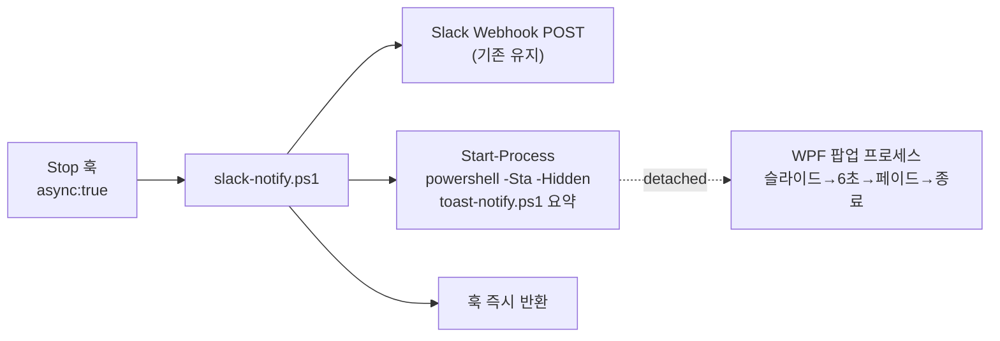

# 분석 — 커스텀 알림 팝업

**TL;DR**: 커스텀 배경색이 필수라 Windows Toast(BurntToast)는 탈락, **WPF**(PowerShell XAML)로 구현한다. 6초 팝업이 Stop 훅을 붙잡지 않도록 별도 스크립트 `toast-notify.ps1`을 만들고 `slack-notify.ps1`이 이를 **detached 백그라운드(`-Sta -WindowStyle Hidden`)** 로 띄운다. Claude sunburst는 폰트 의존을 피해 WPF `Path`로 그린다. 실패는 전부 silent.

## 1. 구현 기술 선택

| 후보 | 배경색 커스텀 | 라운드/그라디언트/그림자 | 외부 의존 | 판정 |
|---|---|---|---|---|
| Windows Toast (BurntToast) | ✗ (OS 테마 고정) | ✗ | 모듈 설치 | **탈락** — 요구사항_5 위배 |
| WinForms | ○ | △ (수작업 GDI+) | 없음 | 차선 |
| **WPF** | ○ | ○ (XAML 네이티브) | 없음(.NET 내장) | **채택** |

> WPF는 `PresentationFramework` 어셈블리(.NET 내장)만 있으면 되고, XAML로 라운드 코너·방사형 그라디언트 글로우·DropShadow·Storyboard 애니메이션을 선언적으로 표현한다. 요구사항_3(변형 B)의 글로우 아이콘·부드러운 그림자에 가장 적합.

## 2. 훅 연동·프로세스 생명주기 (제약_3 해법)

- `slack-notify.ps1`은 Slack POST 후, 팝업을 **자식 프로세스로 분리 실행**하고 바로 종료 → 훅이 6초 붙잡히지 않음(제약_3).
- WPF는 **STA 스레드** 필수 → 자식 `powershell.exe -Sta`로 기동. `-WindowStyle Hidden`으로 콘솔 미표시.
- 요약 문자열은 인자로 전달(UTF-8). 경로·인자에 공백/한글 → 안전 인용.

## 3. 팝업 동작 설계 (요구사항_2·4)

- 위치: `SystemParameters.WorkArea`(작업표시줄 제외 영역)의 **우하단**, 여백 16px. DPI 스케일은 WPF가 논리 단위로 처리.
- 애니메이션: 슬라이드-인(우→좌, 0.4s, ease-out) → **6초 유지** → 페이드아웃(0.5s) → `Close()` → 프로세스 exit.
- 속성: `Topmost=true`(최상위), `ShowInTaskbar=false`, `WindowStyle=None`(테두리 없음), `AllowsTransparency=true`(라운드 코너·그림자), `ShowActivated=false`(포커스 탈취 방지, 위험_4).
- 클릭: 팝업 클릭 또는 × 클릭 시 즉시 닫힘(선택 — 계획에서 확정).

## 4. Claude sunburst 심볼 렌더

- CSS `conic-gradient`(시안)는 WPF에 없음. 유니코드 심볼(✳/❋)은 폰트 의존이라 환경차 위험.
- **채택**: WPF `Path`/`Geometry`로 방사형 스파이크(약 12개) 별을 벡터로 그린다 — 폰트 무관, 선명, 크기 자유. 테라코타 원(`#C15F3C`) 위에 크림색(`#FBF7EE`) 스파이크.

## 5. 네이밍 (지침 논점)

- **파일명**: 기존 `tools/`는 `slack-notify.ps1`·`check-links.ps1`처럼 **케밥·`tdc_` 미사용** 관례 → 신규도 `toast-notify.ps1`로 일관.
- **내부 심볼**: CLAUDE.md 코딩 규칙의 `tdc_` 접두는 신규 함수/변수에 적용 대상. PowerShell 함수는 `Verb-Noun` 관례라, 핵심 함수는 `tdc_Show-CompletionToast` 형태로 접두를 살려 절충(파일 스코프라 함수 수는 최소).

## 6. 위험

| 위험 | 대응 |
|---|---|
| 위험_1 WPF 어셈블리 로드 실패 | `try/catch` → silent exit 0 (제약_2, 기존 원칙) |
| 위험_2 다중 세션 동시 완료 → 팝업 겹침 | 초기엔 겹침 허용(비목표_3). 후속 개선 여지 기록 |
| 위험_3 전체화면 앱 위 미표시 | `Topmost`로 최대한 처리, 게임/독점 전체화면은 허용 |
| 위험_4 포커스 탈취로 작업 방해 | `ShowActivated=false` + `Focusable=false` |
| 위험_5 detached 프로세스 잔존 | 타이머 만료 시 `Close()` 보장 → 프로세스 자연 종료. 안전장치로 하드 타임아웃 |

## 7. 테스트 전략

- 수동 트리거: `powershell -Sta -File toast-notify.ps1 "테스트 요약 문구"` → 팝업 시각 확인(회귀 감지 필수 — silent라 자동 감지 불가).
- 연동 확인: `slack-notify.ps1`을 stdin 없이/인자로 1회 실행 → Slack POST + 팝업 동시 확인.
- 표시시간·위치·색을 육안 검수.
