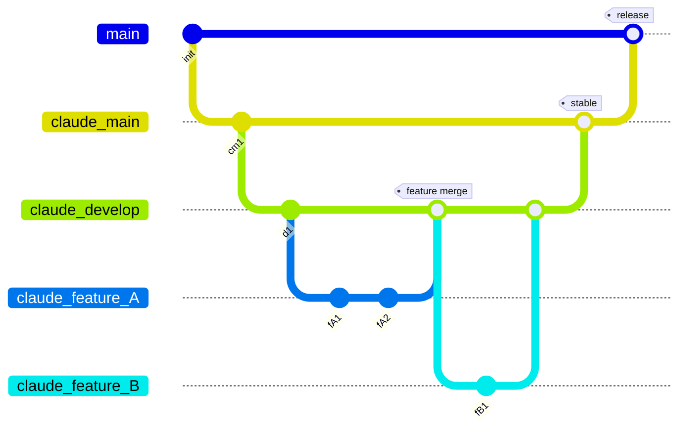
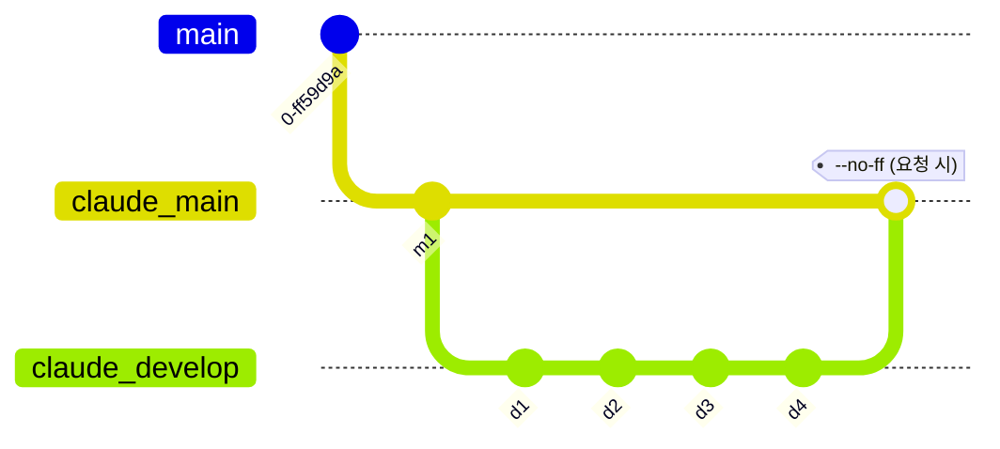
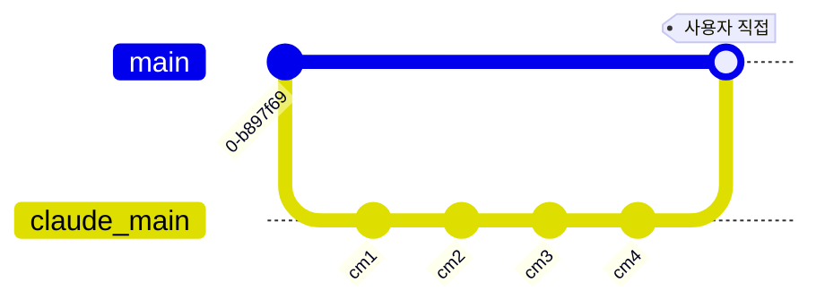
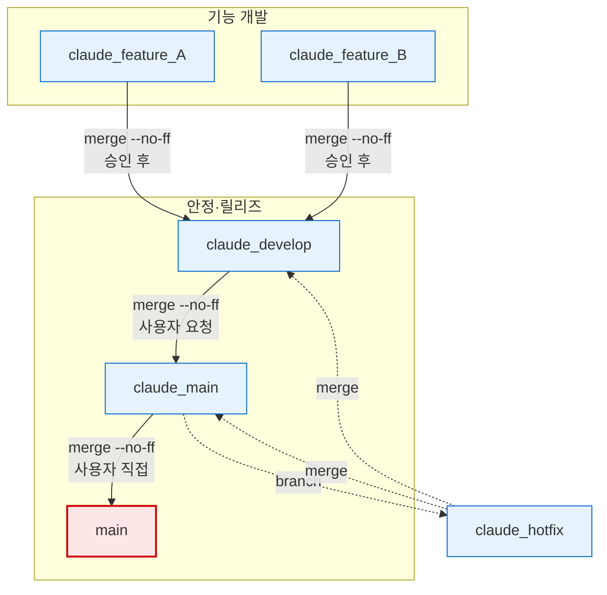

# Git Workflow

**TL;DR**: `main`은 사용자만 직접 관리. Claude는 `claude_develop`에서 `claude_feature_*` 임시 브랜치로 작업 → `--no-ff` 병합 (사용자 승인 후) → 기능 브랜치 삭제.

## 1. 브랜치 모델 개요



### 브랜치 역할

| 브랜치 | 용도 | 수명 |
|---|---|---|
| `main` | 릴리즈 전용. **사용자만** 직접 관리 | 영구 |
| `claude_main` | Claude 측 안정 브랜치 | 영구 |
| `claude_develop` | 지속적 개발 통합 | 영구 |
| `claude_feature_*` | 개별 기능 구현/수정 | 임시 (병합 후 삭제) |
| `claude_hotfix` | 긴급 수정 | 임시 (병합 후 삭제) |

---

## 2. 기능 개발 플로우

일반적인 기능 개발 시 따르는 절차입니다.


### 절차

1. **기능 브랜치 생성 & 체크아웃**
   ```bash
   git checkout -b claude_feature_<설명> claude_develop
   ```
2. **작업 & 커밋**
   ```bash
   git add <files>
   git commit -m "설명"
   ```
3. **사용자 확인 요청** — 커밋 내용을 보고하고 병합 진행 여부를 확인받는다.
4. **`claude_develop`에 병합** (승인 후)
   ```bash
   git checkout claude_develop
   git merge --no-ff claude_feature_<설명>
   ```
5. **정리**
   ```bash
   git branch -d claude_feature_<설명>
   ```

> [!IMPORTANT]
> 3번 **사용자 확인 요청**은 생략 불가. 커밋은 됐지만 병합 전에 반드시 승인받는다.

> [!NOTE]
> IDE(Eclipse 등)가 프로젝트 디렉토리를 직접 참조하므로, 브랜치 체크아웃 방식이 실시간 빌드·테스트에 유리합니다.
> 워크트리는 사용자가 명시적으로 요청한 경우에만 사용합니다.

---

## 3. 안정 병합 플로우

`claude_develop`의 변경사항을 `claude_main`으로 승격합니다.



### 절차

```bash
git checkout claude_main
git merge --no-ff claude_develop
git push origin claude_main
git checkout claude_develop
```

> [!NOTE]
> 이 플로우는 **사용자 요청 시**에만 수행. Claude가 임의로 안정 병합을 진행하지 않는다.

---

## 4. 긴급 수정 (Hotfix) 플로우

`claude_main`에서 직접 분기하여 긴급 수정 후, **양쪽 브랜치에 모두 병합**합니다.


### 절차

1. **핫픽스 브랜치 생성**
   ```bash
   git checkout -b claude_hotfix claude_main
   ```
2. **수정 & 커밋**
3. **사용자 확인 요청**
4. **`claude_main`에 병합** (승인 후)
   ```bash
   git checkout claude_main
   git merge --no-ff claude_hotfix
   ```
5. **`claude_develop`에도 병합**
   ```bash
   git checkout claude_develop
   git merge --no-ff claude_hotfix
   ```
6. **정리**
   ```bash
   git branch -d claude_hotfix
   ```

> [!WARNING]
> hotfix는 반드시 **양쪽 브랜치에 모두** 병합한다. 한쪽만 병합하면 다음 안정 병합 시 수정이 롤백될 수 있다.

---

## 5. 릴리즈 플로우

`claude_main` → `main` 병합은 **사용자가 직접** 수행합니다.



> [!CAUTION]
> Claude는 `main` 브랜치에 **절대** 직접 커밋하거나 푸시하지 않는다. 릴리즈 시점 결정은 사용자의 고유 권한.

---

## 6. 핵심 규칙 요약

| # | 규칙 | 비고 |
|---|---|---|
| 1 | `main` 직접 커밋/푸시 | **절대 금지** |
| 2 | 모든 병합 | `--no-ff` 필수 |
| 3 | 파일 수정 작업 | 브랜치 체크아웃 후 수행 |
| 4 | 병합 전 사용자 확인 | 커밋 후 반드시 승인 요청 |
| 5 | 워크트리 사용 | 사용자 명시 요청 시에만 |
| 6 | 커밋 정리(squash/rebase) | 사용자 요청 시에만 |
| 7 | Git Identity | `김은수 <eunsu.kim@to-doc.com>` — AI 표시 절대 금지 |

---

## 7. 전체 흐름도



> [!TIP]
> 붉은 박스(`main`)는 사용자 전용, 파란 박스는 Claude 작업 영역. 점선은 긴급 수정(hotfix) 경로.
