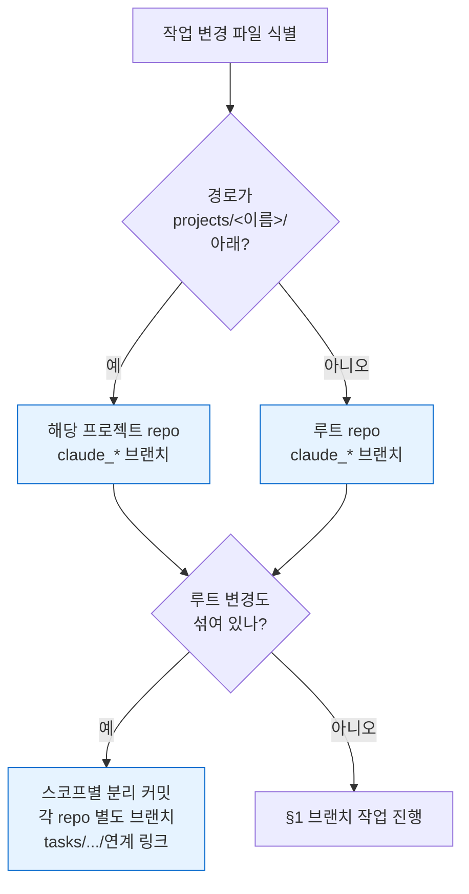
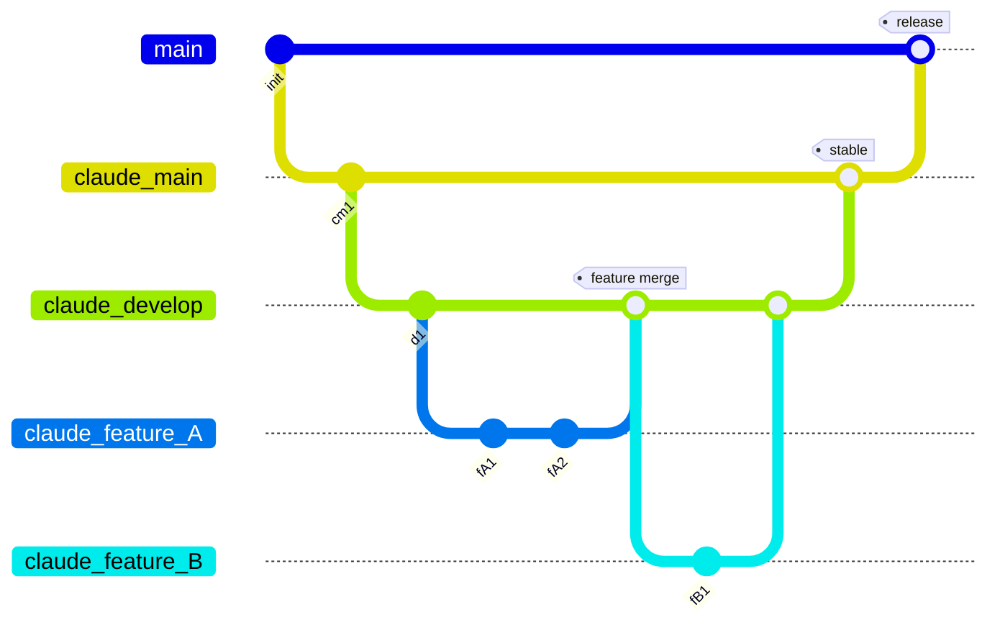
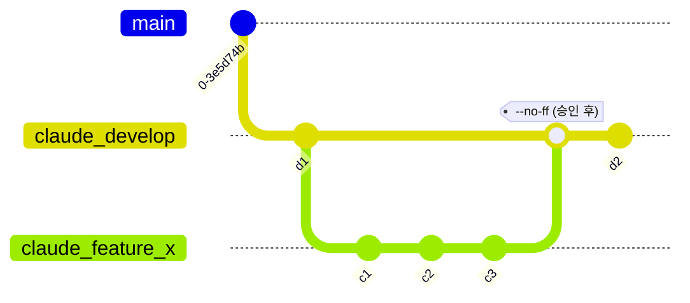
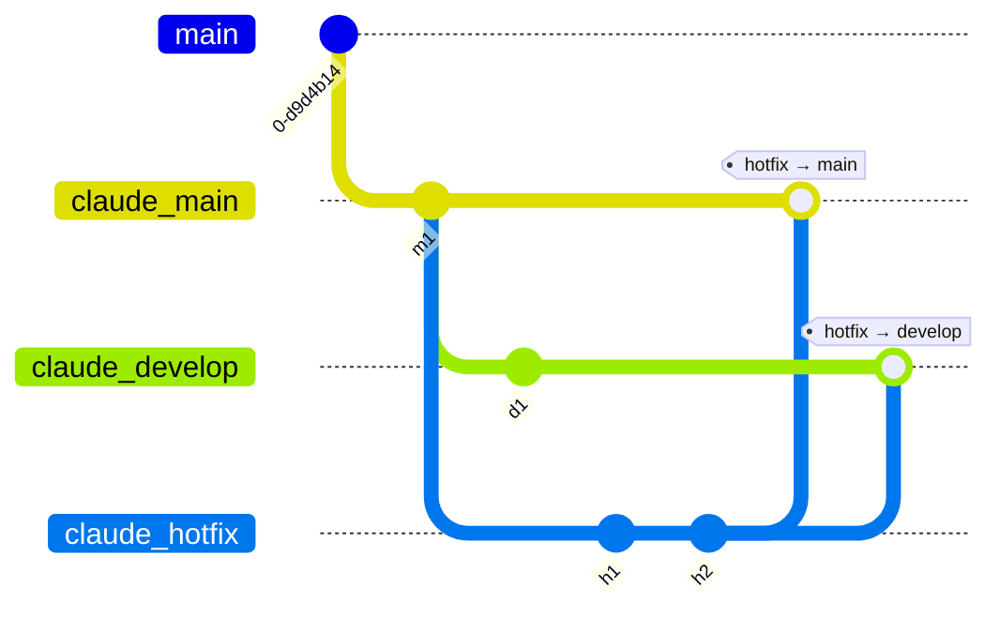
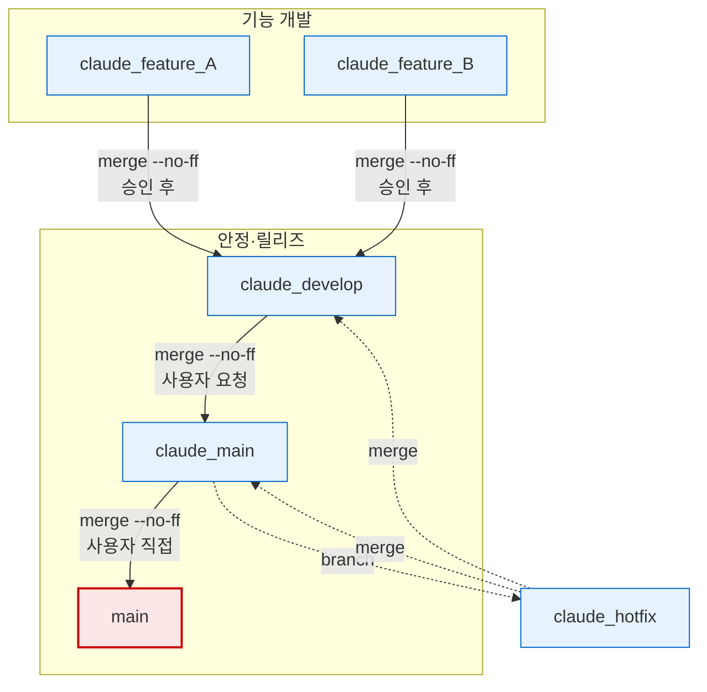

# Git Workflow

**TL;DR**: 작업 시작 시 **변경 파일 경로로 repo 스코프 판정 (§0)**. `main`은 사용자만 직접 관리. Claude는 `claude_develop`에서 `claude_feature_*` 임시 브랜치로 작업 → `--no-ff` 병합 (사용자 승인 후) → 기능 브랜치 삭제.

## 0. 작업 스코프 판단 (선행 단계)

브랜치 작업을 시작하기 전, **어느 repo에서 작업할지 먼저 결정**한다. 변경 파일 경로 기준이며, 루트 디렉토리에서 세션을 열고 프로젝트 내부를 작업해도 변경은 해당 프로젝트 repo에 커밋한다.



> [!IMPORTANT]
> 상세: [`브랜치, 병합 규칙.md` §작업 스코프](브랜치,%20병합%20규칙.md#작업-스코프-repo-분리)

---

## 1. 브랜치 모델 개요



### 브랜치 역할

| 브랜치 | 용도 | 수명 |
|---|---|---|
| `main` | 릴리즈 전용. **사용자만** 직접 관리 | 영구 |
| `claude_main` | Claude 측 안정 브랜치 | 영구 |
| `claude_develop` | 지속적 개발 통합 | 영구 |
| `claude_feature_*` | 개별 기능 구현/수정 | 임시 (병합 후 삭제) |
| `claude_hotfix` | 긴급 수정 | 임시 (병합 후 삭제) |

---

## 2. 기능 개발 플로우

일반적인 기능 개발 시 따르는 절차입니다.



### 절차

1. **기능 브랜치 생성 & 체크아웃**
   ```bash
   git checkout -b claude_feature_<설명> claude_develop
   ```
2. **작업 & 커밋**
   ```bash
   git add <files>
   git commit -m "설명"
   ```
3. **사용자 확인 요청** — 커밋 내용을 보고하고 병합 진행 여부를 확인받는다.
4. **`claude_develop`에 병합** (승인 후)
   ```bash
   git checkout claude_develop
   git merge --no-ff claude_feature_<설명>
   ```
5. **정리**
   ```bash
   git branch -d claude_feature_<설명>
   ```

> [!IMPORTANT]
> 3번 **사용자 확인 요청**은 생략 불가. 커밋은 됐지만 병합 전에 반드시 승인받는다.

> [!NOTE]
> IDE(Eclipse 등)가 프로젝트 디렉토리를 직접 참조하므로, 브랜치 체크아웃 방식이 실시간 빌드·테스트에 유리합니다.
> 워크트리는 사용자가 명시적으로 요청한 경우에만 사용합니다.

---

## 3. 안정 병합 플로우

`claude_develop`의 변경사항을 `claude_main`으로 승격합니다.


### 절차

```bash
git checkout claude_main
git merge --no-ff claude_develop
git push origin claude_main
git checkout claude_develop
```

> [!NOTE]
> 이 플로우는 **사용자 요청 시**에만 수행. Claude가 임의로 안정 병합을 진행하지 않는다.

---

## 4. 긴급 수정 (Hotfix) 플로우

`claude_main`에서 직접 분기하여 긴급 수정 후, **양쪽 브랜치에 모두 병합**합니다.



### 절차

1. **핫픽스 브랜치 생성**
   ```bash
   git checkout -b claude_hotfix claude_main
   ```
2. **수정 & 커밋**
3. **사용자 확인 요청**
4. **`claude_main`에 병합** (승인 후)
   ```bash
   git checkout claude_main
   git merge --no-ff claude_hotfix
   ```
5. **`claude_develop`에도 병합**
   ```bash
   git checkout claude_develop
   git merge --no-ff claude_hotfix
   ```
6. **정리**
   ```bash
   git branch -d claude_hotfix
   ```

> [!WARNING]
> hotfix는 반드시 **양쪽 브랜치에 모두** 병합한다. 한쪽만 병합하면 다음 안정 병합 시 수정이 롤백될 수 있다.

---

## 5. 릴리즈 플로우

`claude_main` → `main` 병합은 **사용자가 직접** 수행합니다.


> [!CAUTION]
> Claude는 `main` 브랜치에 **절대** 직접 커밋하거나 푸시하지 않는다. 릴리즈 시점 결정은 사용자의 고유 권한.

---

## 6. 핵심 규칙 요약

| # | 규칙 | 비고 |
|---|---|---|
| 1 | `main` 직접 커밋/푸시 | **절대 금지** |
| 2 | 모든 병합 | `--no-ff` 필수 |
| 3 | 파일 수정 작업 | 브랜치 체크아웃 후 수행 |
| 4 | 병합 전 사용자 확인 | 커밋 후 반드시 승인 요청 |
| 5 | 워크트리 사용 | 사용자 명시 요청 시에만 |
| 6 | 커밋 정리(squash/rebase) | 사용자 요청 시에만 |
| 7 | Git Identity | `김은수 <eunsu.kim@to-doc.com>` — AI 표시 절대 금지 |

---

## 7. 전체 흐름도



> [!TIP]
> 붉은 박스(`main`)는 사용자 전용, 파란 박스는 Claude 작업 영역. 점선은 긴급 수정(hotfix) 경로.

## 8. 학습 노트 (2026-05-18 회고 흡수)

> [!NOTE]
> 2026-05-18 Package C 이전에는 `docs/회고/Git 워크플로우.md`에 별도 누적. 이제는 본 파일에 흡수.

### 8.1 Git 브랜치 워크플로우 (2026-04-17) *(maturity: core)*

루트 repo(`E:\Claude`) 및 각 프로젝트 repo 공통 브랜치 모델(§1 참조). 작업 완료 흐름: 커밋 → 사용자 확인 → `--no-ff` 병합 → 브랜치 삭제. 단순 조회/질문은 브랜치 생성 없이 가능.

### 8.2 병합 전 사용자 승인 필수 (2026-04-17) *(maturity: core)*

작업 후 커밋까지 했으면, `claude_develop`에 병합하기 전에 반드시 사용자에게 확인을 받는다.

**Why:** 사용자가 커밋 내용을 검토하고 병합 여부를 직접 판단하고 싶어함. 자동으로 병합까지 진행하면 원치 않는 변경이 develop에 들어갈 수 있음.

**How to apply:** 커밋 완료 후 *"커밋 완료했습니다. claude_develop에 병합할까요?"*와 같이 확인을 요청하고, 승인 후에만 병합 진행.

### 8.3 `.gitignore` whitelisting + `git rm --cached` 머지 사이클 함정 (2026-05-08) *(maturity: experimental)*

폴더 구조는 git에 유지하면서 안의 운용 데이터는 추적 안 하고 싶을 때 다음 둘이 한 세트:

1. **`.gitignore` whitelisting 패턴**: 디렉토리 통째 ignore하면 `.gitkeep` 같은 자식을 negation으로 살릴 수 없다 — 반드시 `dir/*` (디렉토리 *내용*) + `!dir/.gitkeep` 형태.
2. **`git rm --cached`의 머지 시점 효과**: `--cached`는 그 commit *작성 시점*의 working tree만 보호한다. 다른 브랜치(예: `claude_develop`)에서 추적 중이던 파일이 untrack commit과 함께 머지되면, **머지 시점에 working tree에서도 삭제**된다.

**How to apply:**

- **whitelisting 패턴 작성 시**:
  - `dir/` ❌ (폴더 통째 — negation 무효)
  - `dir/*` ✅ (내용만 — `.gitkeep` 등 negation 가능)
  - 작성 후 즉시 검증: `git check-ignore -v <test_file>` `<keepfile>`로 두 케이스 모두 확인
- **`git rm --cached`로 untrack할 때 사용자에게 사전 고지 의무**: 머지 단계에서 다른 브랜치의 working tree에서도 파일이 사라짐. 운용 데이터 보존이 필요하면 머지 전에 별도 백업 또는 `git stash`로 격리.
- **데이터·코드 분리 설계**: 운용 데이터(매번 바뀜)와 코드(안정)는 폴더 자체를 분리.

### 8.4 클론 후 claude_develop 자동 전환 (2026-04-17) *(maturity: stable)*

새 repo를 클론하거나 기존 repo의 초기 셋업을 끝낸 직후, 사용자가 지시하지 않아도 **기본적으로 `claude_develop` 브랜치로 체크아웃**해둔다.

**Why:** Claude의 모든 작업은 `claude_` 접두사 브랜치에서 이루어지고, 실제 작업 시작점은 `claude_develop`이다. 클론 직후 `main`에 머물러 있으면 사용자가 매번 수동으로 전환 지시를 줘야 하므로 비효율적.

**How to apply:**
- `git clone` 직후 → 원격에 `claude_develop`이 있으면 바로 `git checkout claude_develop`
- 원격에 `claude_develop`이 없다면 사용자에게 생성 여부 확인 (`claude_main`에서 분기할지 등)
- 확인 질문(*"넘길까요?"*) 없이 수행하고, 결과만 보고

### 8.5 묵혀 둔 미머지 원격 브랜치 회수 — 사용자 회상 트리거 (2026-05-14) *(maturity: experimental)*

사용자가 *"전에 ~ 한 적 있지 않아? 다른 PC였는지 기억 안 난다"* 류 자연어 회상으로 잊혀진 작업물을 떠올리면, 활성 `tasks/list.md`에서 안 보일 가능성이 크다 — main 머지 안 된 채 `claude_*` 또는 `claude_docs_*` 브랜치로 origin 원격에만 남아 있을 수 있기 때문.

**표준 회수 절차:**
1. `git branch -a` 로 모든 로컬·원격 브랜치 점검
2. `git log --all --oneline --grep="<키워드>"` 로 commit 메시지 검색
3. 후보 브랜치의 `git log <브랜치> ^claude_main --oneline` 으로 main 대비 고유 commit 추출
4. `git show --stat <commit>` 로 정확한 파일명 확인

**How to apply:**
- 사용자 표현 트리거: *"전에 ~"*, *"~ 한 적 있지 않아?"*, *"기억 안 난다"*, *"다른 PC였는지"* 류 → 즉시 `git branch -a` 우선 점검
- 한글 파일명 함정: `git ls-tree -r <브랜치> --name-only` 출력은 한글을 8진 escape로 변환하므로 한글 키워드 `grep` 매칭이 안 됨. 우회 = `git show --stat <commit>` 또는 `git diff --stat <base>..<branch>`
- cherry-pick 회피 — `git show 'origin/<브랜치>:<원본경로>' > <신경로>` 방식으로 파일 단위 추출 → 신 컨벤션 위치 배치 → 새 commit
- 원본 브랜치는 보존 (force-push 회피)
- 정기 점검 (선택): `git branch -r` 점검 — `remotes/origin/claude_*` 중 `claude_main` 대비 고유 commit이 있는 브랜치 = 잠재 미머지 작업물 후보

### 8.6 Bash append+git rm 원자성 — 보이지 않는 누적 부작용 (2026-05-15) *(maturity: experimental)*

Bash one-liner에서 `cat $src >> $dest` append + 그 다음 `git rm $src` 처리 시, append는 항상 실행되지만 git rm은 환경 호환 이슈(한글 path·process substitution 등)로 실패할 수 있다. 외부 카운터(`count++`)가 git rm 성공 여부만 추적하면 *visible 결과는 0*인데 *파일 본문에는 누적 변경*이 침묵하게 일어난다. 재시도 시 또 append되어 N 중복.

**How to apply:**

- 외부 side-effect (append·copy 등) + git 동작을 함께 묶는 자동화는 **atomic** 처리:
  - 임시 파일에 append 결과 작성 후 git rm + mv를 한 트랜잭션처럼 묶기
  - 또는 git mv 같은 native 명령으로 통합 (append 없이)
- 외부 카운터는 *visible 결과*만 추적하지 말고 *실제 file 변경*도 확인:
  - 명령 종료 후 `diff` 또는 `grep -c <pattern>`으로 횟수 검증
- 반복 실행 안전성 (idempotent) 보장: append 전에 이미 적용된 marker 존재 여부 확인 후 skip
- **Bash + 한글 path + process substitution** 조합은 Windows 환경에서 *무음 실패* 위험 ↑ → PowerShell 우선 + `[System.IO.File]::ReadAllText`/`WriteAllText` 사용
- Anti-pattern: `find ... | while read p; do append "$p" >> dest; git rm "$p"; done` — git rm 실패 시 append만 누적, 검출 어려움
