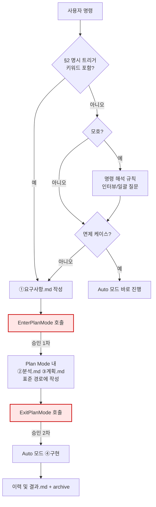

# 계획 모드 자동 진입 규칙

**TL;DR**: 사용자 명시 키워드(계획해줘·계획모드로 등) 또는 actionable task 시 Claude가 `EnterPlanMode`를 **자체 호출**해 Plan Mode 진입 → 표준 경로에 ②분석·③계획 산출물 정식 작성 → `ExitPlanMode`로 사용자 승인 게이트 통과 → Auto 모드로 ④구현. 표준 4단계 산출물은 100% 보존. 단순 수정·조회는 면제.

## 1. 핵심 원칙

Claude Code의 `EnterPlanMode`/`ExitPlanMode` 도구는 모델이 직접 호출 가능하다. 사용자가 매번 `Shift+Tab`을 누를 필요 없이, Claude가 **작업 시작 직후 자체적으로 Plan Mode를 발동**해 안전한 read-only 환경에서 분석·계획을 수행하고, 명시적 승인 게이트(ExitPlanMode)를 거친 뒤 Auto 모드로 실제 변경을 수행한다.

> [!IMPORTANT]
> Plan Mode는 [`작업 진행 규칙.md`](작업%20진행%20규칙.md)의 표준 4단계를 **대체하지 않는다.** ②분석·③계획 단계 위에 **도구 차단 + 강제 승인 게이트**를 덧씌우는 역할이며, 표준 산출물(`docs/tasks/<모듈>/<작업>/분석.md`·`계획.md`)은 그대로 보존된다.

## 2. 사용자 명시 트리거 (키워드 감지)

사용자 발화에 아래 패턴 중 하나라도 포함되면 **태스크 복잡도·면제 여부 판단 이전에** `EnterPlanMode`를 호출한다.

| 패턴 유형 | 예시 |
|---|---|
| `계획모드로` 시작·포함 | "계획모드로 해줘", "계획모드로 진행해" |
| `계획해줘` / `계획해봐` | "이 기능 계획해줘", "마이그레이션 계획해봐" |
| `~를/을 계획해야해` | "이 작업을 계획해야해", "리팩토링을 계획해야해" |
| `계획을 세워` / `계획 짜줘` | "전체 계획을 세워줘", "구현 계획 짜줘" |
| `계획부터` | "계획부터 잡아줘", "계획부터 해줘" |

> [!IMPORTANT]
> 명시 트리거가 감지됐을 때는 §3 면제 케이스 테이블을 적용하지 않는다. 사용자가 직접 계획을 요청한 것이므로 즉시 Plan Mode 진입.
>
> 단, 사용자가 *"바로 해"*, *"알아서 해"* 처럼 명시적 일괄 위임을 같이 붙인 경우는 §7 차단·면제 시그널 우선 적용.

## 3. 적용 범위

[`작업 진행 규칙.md §1`](작업%20진행%20규칙.md)과 동일한 기준을 따른다.

| 적용 | 면제 |
|---|---|
| 코드 작성·수정 | 단순 조회·질문 (코드 변경 없음) |
| 문서 작성·구조 변경 | 오타·1줄 자명 수정 |
| 지침·정책 변경 | 단일 설정값 변경 |
| 분석·조사 작업 (보고서 산출) | 사용자가 매우 구체적·디테일한 지시 (계획할 게 없음) |
| 도구·자동화 스크립트 | 순수 grep·log 조회 (Read·Grep·Glob 등) |
| 외부 시스템 연동·환경 설정 | 사용자 *"바로 해"*, *"알아서 해"* 류 일괄 위임 |

> [!IMPORTANT]
> 적용 여부 모호하면 **적용한다.** 면제는 명백한 단순 작업에 한정.

## 4. 발동 흐름



## 5. Plan Mode plan file vs 표준 산출물

| | Plan Mode plan file (시스템) | 표준 산출물 (영구) |
|---|---|---|
| 위치 | Claude Code 시스템 지정 임시 경로 | `docs/tasks/<모듈>/<작업>/분석.md`·`계획.md` |
| 용도 | ExitPlanMode 승인 게이트용 | 작업 이력·재현·검색 |
| Git 추적 | ❌ (세션 단위 임시) | ✅ (영구 보존) |
| 형식 | 자유 (요약 가능) | frontmatter + TL;DR + 정형 섹션 + 자체 검토 |

> [!CAUTION]
> Plan Mode plan file이 표준 산출물을 **대체하지 않는다.** Plan Mode 진입 후에도 분석·계획은 표준 경로에 정식 산출물로 작성하고, plan file에는 표준 산출물 경로 참조 + 3~5줄 핵심 요약만 작성한다.

### 5.1 plan file 저장 위치 (`plansDirectory`)

Claude Code의 디폴트 plan file 위치(`~/.claude/plans/`)는 워크스페이스와 분리돼 있어 git 추적·이력 보존에 불리. `plansDirectory` 키로 각 워크스페이스 내부로 redirect:

```json
{
  "plansDirectory": "./plans"
}
```

- **적용 위치**: 루트(`E:\Claude\.claude\settings.json`) + 각 프로젝트(`projects/<name>/.claude/settings.json`)
- **경로 해석**: 워크스페이스 root 기준 상대 경로. 폴더 없으면 자동 생성
- **Git 추적**: 저장 폴더는 `.gitignore`로 추적 차단 (`plans/*` + `!plans/.gitkeep`) — 폴더 구조만 유지, plan file 자체는 세션 임시

> [!NOTE]
> 본 설정은 **plan file 저장 위치만** 변경. 작업별 폴더(`docs/tasks/<모듈>/<작업>/`)로 plan file이 자동 분기되는 건 시스템 레벨에서 불가 — 표준 산출물(`요구사항.md`·`분석.md`·`계획.md`)이 작업 단위 영구 산출물 역할을 담당함.

## 6. 운용 규칙

### 6.1 EnterPlanMode 호출 시점

- §2 명시 트리거 감지 즉시, 또는 ①요구사항 명확화 완료 직후·②분석 시작 전
- [`명령 해석 규칙.md`](명령%20해석%20규칙.md)으로 모호함 해소 후 → 면제 케이스 아니면 즉시 호출

### 6.2 Plan Mode 내 작업

- 표준 경로 `docs/tasks/<모듈>/<작업슬러그>/`에 `요구사항.md`·`분석.md`·`계획.md` 정식 작성
- 각 산출물에 frontmatter + TL;DR + 자체 검토 ([`작업 진행 규칙.md §4`](작업%20진행%20규칙.md))
- Plan Mode plan file에는 표준 산출물 경로 + 핵심 요약(3~5줄)만
- 사용 가능 도구: Read·Grep·Glob·WebFetch·WebSearch·서브에이전트(read-only) 등 read-only
- 코드·문서 변경 도구(Edit·Write·Bash 변경 명령)는 Plan Mode 중 시스템이 차단

### 6.3 ExitPlanMode 호출 전 self-check

다음 4 항목 모두 충족 시에만 호출:

- [ ] `요구사항.md`·`분석.md`·`계획.md` 존재 + 완성 ([`문서 작성 규칙.md §3.3`](문서%20작성%20규칙.md))
- [ ] 각 산출물에 frontmatter + TL;DR 포함
- [ ] 각 산출물 말미에 자체 검토 섹션 (지침 준수 + 논리 정합성)
- [ ] Plan Mode plan file에 표준 산출물 경로 참조 + 핵심 요약 작성

미충족 항목 있으면 ExitPlanMode 호출 금지 — Plan Mode 유지하며 보완.

### 6.4 승인 후 ④구현

- ExitPlanMode 사용자 승인 → Auto 모드 진입
- 모든 기존 지침 준수 ([`문서 작성 규칙.md`](문서%20작성%20규칙.md)·[`코딩/작업 규칙.md`](../코딩/작업%20규칙.md)·[`Git/브랜치, 병합 규칙.md`](../Git/브랜치,%20병합%20규칙.md) 등)
- 구현 중 새로운 모호함·중대한 결정 사항이 드러나면: 즉시 멈추고 사용자 질문 ([`명령 해석 규칙.md §4`](명령%20해석%20규칙.md))

## 7. 차단·면제 시그널

> [!NOTE]
> 사용자가 *"Plan Mode 건너뛰고 바로 해"*, *"승인 게이트 없이 진행"*, *"바로 해"*, *"알아서 해"* 등 명시 차단·일괄 위임 시: **본 작업 단위 한정 면제.** 다음 명령부터 다시 적용.

> [!NOTE]
> 면제 케이스로 시작했더라도 작업 도중 새 결정 사항·영향 범위가 드러나면 즉시 Plan Mode로 전환 가능. 면제는 시작 시점 판단일 뿐 절대 면제 아님.

## 8. 작업 진행 규칙과의 매핑

| [`작업 진행 규칙.md`](작업%20진행%20규칙.md) 단계 | Plan Mode 매핑 |
|---|---|
| ① 요구사항 분석 | Plan Mode 진입 **전** (`요구사항.md` 우선 작성) |
| ② 현상태 분석 | Plan Mode **안에서** (`분석.md` 작성, read-only 도구만) |
| ③ 구현·처리 계획 | Plan Mode **안에서** (`계획.md` 작성) |
| 단계 3 → 4 사용자 승인 | **ExitPlanMode 호출이 승인 트리거** |
| ④ 구현·처리 | Plan Mode 종료 후 Auto 모드 |
| 완료 처리 (이력·archive) | Auto 모드 (변경 없음) |

> [!TIP]
> Plan Mode는 ②③ 단계의 **도구 차단**(실수로 코드 수정 방지)과 **강제 승인 게이트**(계획 미승인 상태 구현 시작 차단)를 시스템 레벨로 보장한다.

## 9. 적용 우선순위

1. §2 명시 트리거 > §3 적용 범위 면제 판단 — 키워드 감지 시 면제 테이블 무시
2. 본 규칙은 [`작업 진행 규칙.md`](작업%20진행%20규칙.md)의 4단계 위에서 작동 — 4단계 면제 케이스면 본 규칙도 면제 (단, §2 명시 트리거 감지 시 제외)
3. [`명령 해석 규칙.md`](명령%20해석%20규칙.md) < 본 규칙 (모호 해소 후 Plan Mode 진입)
4. [`컨텍스트 절약 규칙.md`](컨텍스트%20절약%20규칙.md) < 본 규칙 (승인 게이트가 잘못된 방향 구현보다 저렴)

## 10. 관련 지침

- [`작업 진행 규칙.md`](작업%20진행%20규칙.md) — 본 규칙의 기반 4단계 프로세스
- [`명령 해석 규칙.md`](명령%20해석%20규칙.md) — Plan Mode 진입 전 모호 해소
- [`문서 작성 규칙.md`](문서%20작성%20규칙.md) — 표준 산출물 형식·위치
- [`서브에이전트 활용.md`](서브에이전트%20활용.md) — Plan Mode 내 ②분석 가속 (read-only 서브에이전트 병렬)
