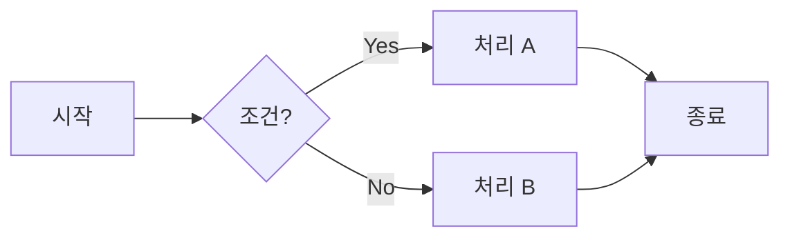
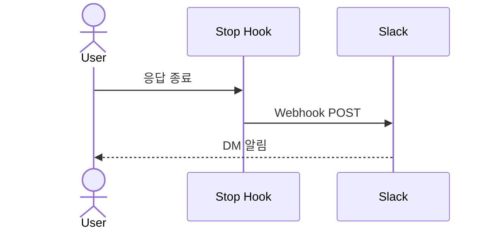
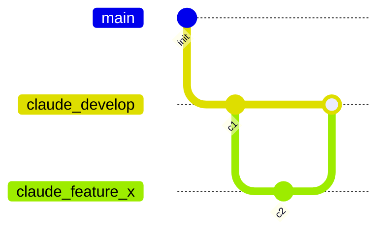

# 문서 작성 규칙

## 1. 기본 포멧

- 사용자가 명시적으로 다른 포멧(`.docx` / `.xlsx` / `.pdf` / `.pptx` / `.html`)을 지정하지 않는 한, **모든 문서는 GFM(GitHub Flavored Markdown, `.md`)으로 작성**한다.
- 예외 없음. 사용자가 특정 포멧을 요청한 경우에만 해당 포멧으로 작성.
- GitHub.com 또는 VSCode의 **GitHub Markdown Preview** 확장(`bierner.markdown-preview-github-styles`)에서 렌더링된 결과를 기준으로 삼는다.

## 2. 문서 위치

- 루트 작업 → `E:\Claude\docs/`
- 프로젝트 작업 → `projects/<이름>/docs/`
- 각 스코프는 **독립적인** 폴더 구조와 `tasks/list.md` 레지스트리를 유지한다. 크로스 스코프 참조는 절대 경로 링크로 표현.

## 3. 폴더 구조 (2026-04-24~ 신규 컨벤션)

### 3.1 전체 레이아웃

```
docs/
├── 지침/                           영속 — 작업 규칙·컨벤션·검증 체크리스트
│   ├── 작업 규칙.md                (마스터 체크리스트)
│   ├── 일반/
│   ├── Git/
│   ├── 코딩/
│   └── (프로젝트 특화 지침 — 예: `레지스터 변경 검증 체크리스트.md`)
├── 사용방법/                       영속 — CLI/도구 사용법
├── 참고/          (필요 시 추가)    영속 — 외부 스펙·도메인 지식
│   └── <모듈>/                     파일 누적 시 모듈 서브폴더 권장 (예: 칩/, LED/, 터치/)
├── 이력/          (필요 시 추가)    영속 — 완료 작업 요약 이전 (선택)
└── tasks/                          작업 스코프
    ├── list.md                     작업 레지스트리 (활성·완료)
    └── <모듈>/
        └── <작업슬러그>/
            ├── 요구사항.md
            ├── 분석.md
            ├── 구현계획.md
            ├── 진행상황.md         (선택, 세션 핸드오프)
            └── (첨부: 로그·이미지 등)
```

### 3.2 영속 문서 (persistent)

- 유형별 **폴더 이름 자체가 카테고리** 역할. 파일명에 프리픽스 `[지침]`, `[사용방법]` 등을 붙이지 않는다
- **지침/** 은 **각 스코프 독립** 영속 폴더:
  - 루트 `지침/` — 전역 공통 지침 (작업 규칙·Git·코딩·일반)
  - 프로젝트 `지침/` — 프로젝트 특화 지침 (예: Sound1 `지침/레지스터 변경 검증 체크리스트.md`)
- **체크리스트·검증 기준은 지침의 하위 유형**이므로 `지침/` 에 직접 배치 (`기준/` 폴더 사용 금지)
- 지침/ 하위는 2레벨까지 허용 (`일반/`, `Git/`, `코딩/`). 그 이상 깊이는 지양
- **참고/** 는 파일 누적 시 **도메인 모듈 서브폴더** 권장 — tasks/<모듈>/ 과 축 정렬 (예: Sound1 `참고/칩/`, `참고/LED/`, `참고/터치/`)
- 프로젝트에서 도메인 특수 카테고리가 필요하면 `참고/`, `이력/` 등 루트 레벨에 추가 허용
- 파일명은 **의미 있는 제목**으로 간결히 (예: `커뮤니케이션 규칙.md`, `Slack 작업 완료 알림.md`)

### 3.3 작업 문서 (task-scoped)

- 경로: `tasks/<모듈>/<작업슬러그>/`
- **2레벨 고정**: 모듈 아래 바로 작업 폴더. 서브토픽(brightness/dimming/pattern 등)은 폴더가 아닌 **list.md의 태그**로 표현
  - 이유: 3레벨은 경계 판단 애매(한 작업이 복수 서브토픽에 걸침)로 분류 경직화 위험
- 모듈 이름은 **도메인 용어** (루트: `meta`/`git`/`docs`/`tools` 등 / Sound1: `LED`/`touch`/`power` 등)
- 작업 슬러그는 **kebab-case 영문** 권장. 한글도 허용하되 의미 명확할 때만
- 필수 파일: `요구사항.md`, `분석.md`, `구현계획.md`
- 선택 파일: `진행상황.md` (세션 간 핸드오프용), `이력.md` (사후 요약), 첨부 로그·이미지 등

## 4. 작업 레지스트리 — `tasks/list.md`

### 4.1 목적

모든 작업의 **활성/완료 상태**, 모듈·태그, 요약, 연계 관계를 중앙 관리한다. 새 작업 시 기존 작업 맥락을 한눈에 확인.

### 4.2 파일 구조

```markdown
# 작업 목록 (tasks index)

## 활성

| 작업명 | 모듈 | 태그 | 폴더 | 상태 | 시작일 | 연계 | 요약 |
|---|---|---|---|---|---|---|---|
| ... | ... | ... | [...](...) | 진행 | YYYY-MM-DD | → [...](...) | ... |

## 완료

| 작업명 | 모듈 | 태그 | 폴더 | 상태 | 시작·완료 | 연계 | 요약 |
|---|---|---|---|---|---|---|---|
```

### 4.3 컬럼 정의

| 컬럼 | 내용 | 예 |
|---|---|---|
| 작업명 | 사람이 읽을 수 있는 작업 이름 | `docs 폴더 구조 세분화` |
| 모듈 | 도메인 구분 (폴더명과 일치) | `meta`, `LED`, `touch` |
| 태그 | 쉼표 구분 서브토픽·특성 키워드 | `docs, convention`, `brightness, dimming, feature:auto-dim` |
| 폴더 | 작업 폴더 상대 링크 | `[meta/docs-restructure](meta/docs-restructure/)` |
| 상태 | `진행` / `대기` / `차단` (활성) / `완료` / `취소` (완료) | `진행` |
| 시작일 · 완료일 | `YYYY-MM-DD`. 활성 섹션은 시작일만, 완료 섹션은 `시작~완료` | `2026-04-24` |
| 연계 | 다른 작업 peer 링크 (symmetric), 없으면 `-` | `→ [LED/pwm-tune](../LED/pwm-tune/)` |
| 요약 | 1줄 요약 (25자 이내 권장) | `계층·list·태그 도입` |

### 4.4 갱신 이벤트 (자동 동기화 대상)

| 이벤트 | 동작 |
|---|---|
| 작업 시작 (폴더 생성 시) | `list.md` 활성 섹션에 행 추가 |
| `진행상황.md` 갱신 | 해당 행의 `상태`·`요약` 업데이트 |
| 사용자 `작업 끝났어. 마무리해` 시그널 | 행을 활성 → 완료 섹션으로 이동, `완료일` 기록 |

### 4.5 새 작업 라우팅 절차

사용자가 새 작업을 지시하면 Claude는:

1. 해당 스코프의 `tasks/list.md` 조회
2. 같은 모듈·태그의 관련 작업이 있으면 사용자에게 확인:
   > **"기존 `<폴더>`에서 이어가시겠어요, 신규로 분리하시겠어요?"**
3. 확인 답변대로 기존 폴더 재사용 또는 신규 폴더 생성
4. 신규 생성 시 `list.md` 활성 섹션에 등재

## 5. Cross-module 연계 표현

### 5.1 peer-to-peer 링크

- 작업 A가 작업 B의 결과에 의존하거나 기능적으로 얽힐 때 사용
- 각 행의 `연계` 컬럼에 상대 작업 마크다운 링크 (양쪽 symmetric하게 서로 참조)
- 예:
  - A: `→ [LED/pwm-tune](../LED/pwm-tune/)`
  - B: `→ [debug/rtt-ext](../debug/rtt-ext/)`

### 5.2 feature 태그

- 3개 이상 작업이 하나의 상위 기능을 구성할 때 사용
- 공통 태그 `feature:<이름>` 을 모든 관련 작업에 부착
- 예: `feature:auto-dim` 태그로 LED·sensor·comms 작업 묶어 식별

### 5.3 두 방식은 병행 가능

| 상황 | 방식 |
|---|---|
| 2개 peer 관계 | 연계 링크 |
| 3개 이상 feature 그룹 | feature 태그 |
| 둘 다 | 연계 링크 + feature 태그 |

### 5.4 upgrade 경로 (현 단계 미도입)

feature 규모가 커져 공통 아키텍처·요구사항 문서가 필요해지면 `docs/features/<기능명>/` 폴더 도입 후 `list.md`에서 해당 feature 태그로 집계. 지금은 YAGNI로 미도입.

## 6. 작성 스타일

### 6.1 기본 GFM 문법 활용

- **표** (pipe table) — 구조화된 정보는 표로. 정렬 필요 시 `:---`, `:---:`, `---:`
- **체크리스트** — `- [ ]` / `- [x]` 형식. 절차·할 일 목록에 사용
- **코드 블록** — 언어 명시 필수 (` ```bash `, ` ```powershell `, ` ```c `, ` ```json ` 등)
- **취소선** — `~~deleted~~`로 변경 이력 표시
- **링크** — 파일 간 링크는 상대경로. 공백은 `%20`으로 인코딩. 한글은 raw 유지

### 6.2 GitHub Alert Blocks

강조·경고·주의사항은 **GitHub Alert 구문**을 사용한다. (일반 인용(`>`)보다 시각적으로 구분됨)

```markdown
> [!NOTE]
> 알아두면 좋은 일반 정보.

> [!TIP]
> 더 나은 방법에 대한 조언.

> [!IMPORTANT]
> 반드시 알아야 할 중요 정보.

> [!WARNING]
> 즉시 주의가 필요한 긴급 정보.

> [!CAUTION]
> 위험·부정적 결과에 대한 경고.
```

| 유형 | 용도 |
|---|---|
| `[!NOTE]` | 참고 정보, 부가 설명 |
| `[!TIP]` | 권장 방법, 팁 |
| `[!IMPORTANT]` | 반드시 인지할 핵심 사항 |
| `[!WARNING]` | 실행 전 주의할 점 (되돌리기 어려운 작업 등) |
| `[!CAUTION]` | 실수 시 데이터 손실·보안 위험 등 치명적 경고 |

### 6.3 다이어그램은 Mermaid

ASCII art 다이어그램 대신 **Mermaid**를 사용한다. GitHub과 GitHub Markdown Preview 모두 네이티브 렌더링 지원.

#### 자주 쓰는 Mermaid 유형

| 유형 | 용도 | 코드 블록 헤더 |
|---|---|---|
| `flowchart` | 절차·의사결정 흐름 | ```` ```mermaid ```` + `flowchart LR` (또는 TD) |
| `sequenceDiagram` | 시스템·서비스 간 상호작용 순서 | `sequenceDiagram` |
| `gitGraph` | Git 브랜치·병합 흐름 | `gitGraph` |
| `stateDiagram-v2` | 상태 머신 | `stateDiagram-v2` |
| `classDiagram` | 클래스·타입 구조 | `classDiagram` |
| `erDiagram` | 엔티티 관계 | `erDiagram` |
| `pie` | 비율 차트 | `pie` |
| `gantt` | 일정·타임라인 | `gantt` |

#### 기본 예시







> [!TIP]
> Mermaid 다이어그램은 화살표 방향(`LR`/`TD`)과 스타일 클래스를 활용하면 가독성이 더 올라간다. 불필요한 분기는 과감히 생략하고 핵심 흐름만 남길 것.

### 6.4 문서 구조

- 최상위 제목은 `#` 하나. 파일당 하나.
- 섹션 구분은 `##`, `###` 순서대로. 건너뛰지 말 것.
- 긴 문서는 맨 위에 간단한 목차 또는 개요 섹션을 둘 것.
- 긴 섹션 사이 구분이 필요하면 `---` 수평선 사용.

## 7. '정리해' 요청 시

- 사용자가 '~하고 정리해', '~하고 정리해봐' 등으로 정리를 요청하면, **작업이 수행된 위치의 `docs/` 폴더**에 `.md` 문서로 정리한다.
- 정리 내용의 성격에 따라 배치:
  - **영속적 규칙·가이드** → `지침/` 또는 `사용방법/` 아래
  - **작업 관련 산출물** → 해당 `tasks/<모듈>/<작업>/` 폴더 내부
- 다이어그램·절차 흐름이 포함되면 Mermaid로 작성한다.

## 8. 기존 prefix 컨벤션 (구 규칙, 참고용)

2026-04-24 이전에는 `[카테고리] 문서명.md` 프리픽스 컨벤션을 썼다. 구 프리픽스는 새 폴더에 대응:

| 구 프리픽스 | 신 위치 |
|---|---|
| `[지침]`, `[지침] [일반]`, `[지침] [Git]`, `[지침] [코딩]` | `지침/` 하위 2레벨 |
| `[사용방법]` | `사용방법/` |
| `[요구사항]` / `[분석]` · `[현상분석]` / `[구현계획]` / `[시험방법]` | `tasks/<모듈>/<작업>/요구사항.md` 등 고정 파일명 |
| `[참고]` | `참고/<모듈>/<파일>.md` (파일 누적 시 모듈 서브폴더 권장) |
| `[기준]` | `지침/<파일>.md` (체크리스트는 지침의 하위 유형, 전용 폴더 없음) |
| `[이력]` | `이력/` 또는 해당 작업 폴더 내부 `이력.md` |
| `[로그]` | 해당 작업 폴더 내부에 원 파일명 유지 (e.g., `터치 초기화 실패.txt`) |
| `[메모]` | `메모/` 또는 임시 `scratch/` 활용 |

기존 프로젝트(Sound1 등)의 migration은 후속 작업으로 진행한다 (`tasks/list.md` 참조).
