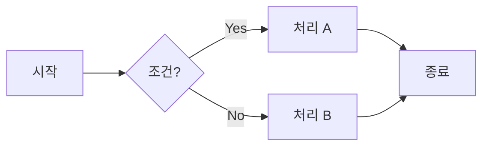
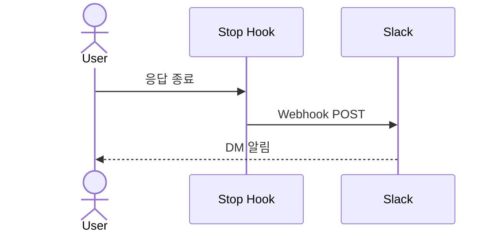
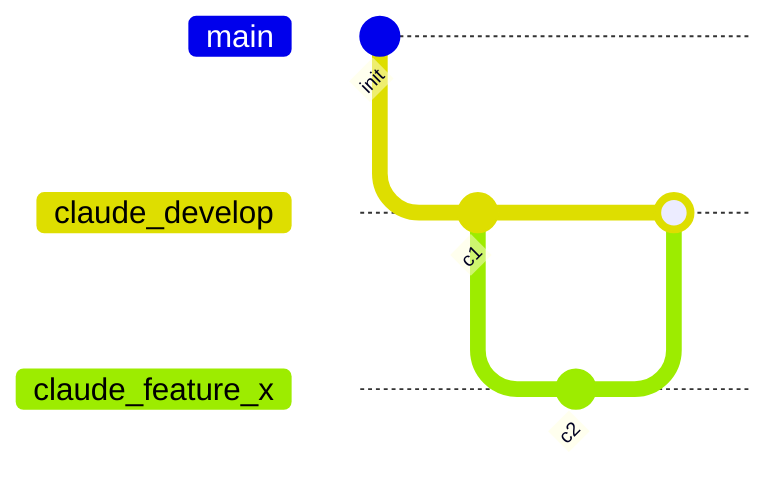

# 마크다운 작성 스타일

**TL;DR**: 모든 문서는 GFM(.md). 강조는 GitHub Alert(`[!NOTE]`·`[!IMPORTANT]` 등). 다이어그램은 ASCII 대신 Mermaid. 항목 식별자는 알파벳 약어(Q1·H1) 금지 — 의미 한글 라벨 + _번호(질문_1·가설_1) 형식. 외부 도메인 약어(HTTP·I2C 등)는 예외.

## 1. 기본 포멧

- 사용자가 명시적으로 다른 포멧(`.docx` / `.xlsx` / `.pdf` / `.pptx` / `.html`)을 지정하지 않는 한, **모든 문서는 GFM(GitHub Flavored Markdown, `.md`)으로 작성**한다.
- 예외 없음. 사용자가 특정 포멧을 요청한 경우에만 해당 포멧으로 작성.
- GitHub.com 또는 VSCode의 **GitHub Markdown Preview** 확장(`bierner.markdown-preview-github-styles`)에서 렌더링된 결과를 기준으로 삼는다.

## 2. 기본 GFM 문법 활용

- **표** (pipe table) — 구조화된 정보는 표로. 정렬 필요 시 `:---`, `:---:`, `---:`
- **체크리스트** — `- [ ]` / `- [x]` 형식. 절차·할 일 목록에 사용
- **코드 블록** — 언어 명시 필수 (` ```bash `, ` ```powershell `, ` ```c `, ` ```json ` 등)
- **취소선** — `~~deleted~~`로 변경 이력 표시
- **링크** — 파일 간 링크는 상대경로. 공백은 `%20`으로 인코딩. 한글은 raw 유지

## 3. GitHub Alert Blocks

강조·경고·주의사항은 **GitHub Alert 구문**을 사용한다. (일반 인용(`>`)보다 시각적으로 구분됨)

```markdown
> [!NOTE]
> 알아두면 좋은 일반 정보.

> [!TIP]
> 더 나은 방법에 대한 조언.

> [!IMPORTANT]
> 반드시 알아야 할 중요 정보.

> [!WARNING]
> 즉시 주의가 필요한 긴급 정보.

> [!CAUTION]
> 위험·부정적 결과에 대한 경고.
```

| 유형 | 용도 |
|---|---|
| `[!NOTE]` | 참고 정보, 부가 설명 |
| `[!TIP]` | 권장 방법, 팁 |
| `[!IMPORTANT]` | 반드시 인지할 핵심 사항 |
| `[!WARNING]` | 실행 전 주의할 점 (되돌리기 어려운 작업 등) |
| `[!CAUTION]` | 실수 시 데이터 손실·보안 위험 등 치명적 경고 |

## 4. 다이어그램은 Mermaid

ASCII art 다이어그램 대신 **Mermaid**를 사용한다. GitHub과 GitHub Markdown Preview 모두 네이티브 렌더링 지원.

### 4.1 자주 쓰는 Mermaid 유형

| 유형 | 용도 | 코드 블록 헤더 |
|---|---|---|
| `flowchart` | 절차·의사결정 흐름 | ```` ```mermaid ```` + `flowchart LR` (또는 TD) |
| `sequenceDiagram` | 시스템·서비스 간 상호작용 순서 | `sequenceDiagram` |
| `gitGraph` | Git 브랜치·병합 흐름 | `gitGraph` |
| `stateDiagram-v2` | 상태 머신 | `stateDiagram-v2` |
| `classDiagram` | 클래스·타입 구조 | `classDiagram` |
| `erDiagram` | 엔티티 관계 | `erDiagram` |
| `pie` | 비율 차트 | `pie` |
| `gantt` | 일정·타임라인 | `gantt` |

### 4.2 기본 예시







> [!TIP]
> Mermaid 다이어그램은 화살표 방향(`LR`/`TD`)과 스타일 클래스를 활용하면 가독성이 더 올라간다. 불필요한 분기는 과감히 생략하고 핵심 흐름만 남길 것.

## 5. 문서 구조

- 최상위 제목은 `#` 하나. 파일당 하나.
- 섹션 구분은 `##`, `###` 순서대로. 건너뛰지 말 것.
- 긴 문서는 맨 위에 간단한 목차 또는 개요 섹션을 둘 것.
- 긴 섹션 사이 구분이 필요하면 `---` 수평선 사용.

## 6. 라벨링 — 알파벳 약어 금지

문서 내 항목 식별자(질문·가설·위험 등) 는 알파벳 약어 (`Q1`, `H1`, `R1`, `P1`) 대신 **의미가 드러나는 한글 라벨 + `_<번호>`** 형식으로 표기한다.

> [!IMPORTANT]
> 약어는 본인조차 며칠 후 보면 "이게 뭐였지?" 가 된다. 이름 자체가 의미를 전달해야 한다.

### 6.1 형식

`<한글 라벨>_<번호>` (예: `질문_1`, `가설_2`, `위험_3`, `요구사항_1`)

### 6.2 권장 라벨 (참고용 — 작성자 재량 가능)

| 알파벳 약어 | 권장 한글 라벨 | 사용 맥락 |
|---|---|---|
| Q (Question) | 질문 | 사용자에게 묻거나 미해결 의문 |
| A (Analysis) | 분석 | 분석 항목·서브토픽 |
| H (Hypothesis) | 가설 | 디버깅·root cause 추정 |
| R (Risk) | 위험 | 회귀·부작용 위험 |
| R (Requirement) | 요구사항 | 기능·비기능 요구 |
| G (Goal) | 목적 / 목표 | 작업 목표 |
| P (Problem) | 문제 | 식별된 문제 |
| P (Plan) | 계획 | 구현 단계·작업 항목 |
| D (Decision) | 결정 | 설계 결정 |
| C (Constraint) | 제약 | 환경·시스템 제약 |
| O (Option) | 선택지 | 다중 옵션 비교 |
| T (Test) | 시험 | 시험 케이스·항목 |

표는 권장일 뿐. 새 카테고리가 필요하면 작성자가 의미 명확한 한글 라벨을 신규 도입할 수 있다 (단어 중복 회피, 같은 문서 내 일관성 유지).

### 6.3 적용 범위

- **모든 영속 `.md` 문서** 에 적용 (지침/사용방법/tasks 산출물 등 전부)
- **소급 처리**: 기존 문서 손댈 때 같이 변경 (점진적). 일괄 소급 변경은 사용자 명시 요청 시에만

### 6.4 예외

- 외부 표준·도메인 약어 (`HTTP/2`, `IEEE 802.11`, `I2C`, `SPI` 등) 은 그대로 유지 — 본 규칙 대상 아님
- 단순 번호 매기기 (`1.`, `2.`, `(a)`, `(b)`) 는 영향 없음 — 본 규칙은 *식별자 라벨* 에만 적용
- 표 컬럼 헤더 약어 (예: `ID`, `No.`) 는 자유
