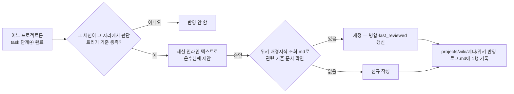

# 위키 반영 절차

**TL;DR**: 어느 프로젝트에서 작업하든, task가 단계④(구현)를 완료하는 시점에 그 세션이 그 자리에서 "이 지식을 `projects/wiki`에 반영할 만한가"를 판단해 은수님께 제안하고, 승인 즉시 반영한다. 별도 승인 큐나 정기 배치 프로세스는 두지 않는다. `projects/wiki`는 이 절차를 실행하는 콘텐츠 저장소일 뿐, 자체 운영 방침을 갖지 않는다(2026-07-08 전면 이관). 회수(찾아 쓰기) 쪽은 [`위키 배경지식 조회.md`](위키%20배경지식%20조회.md) 참조.

## 배경

2026-05-15에 설계한 "wiki가 독립적으로 pull한다"는 모델은 2026-05-19 이후 7주간 한 번도 실행되지 않았다. 원인은 "독립적으로 pull하는 액터"가 세션 단위로만 깨어나는 Claude Code 환경에 애초에 존재할 수 없었다는 구조적 문제였다. 그래서 실행 주체를 "언젠가 도는 배치"에서 "지금 작업 중인 세션"으로 바꿨다(`docs/tasks/meta/20260706_wiki-pkm-고도화/`). 이어서 2026-07-08, `projects/wiki`가 이 방침 자체를 자기 프로젝트 안에 갖는 구조 자체가 다른 프로젝트와의 비대칭을 만든다는 지적에 따라 본 문서로 전면 이관했다(`docs/tasks/meta/20260708_wiki-정책이관-도메인재편/`) — 이제 `projects/wiki`는 콘텐츠(도메인별 지식 문서)만 갖고, 운영 방침은 루트에만 존재한다.



> [!IMPORTANT]
> **별도 승인 큐(4상태 워크플로)는 두지 않는다.** "위키화 후보" 목록을 별도로 쌓아두는 방식은 쌓이기만 하고 아무도 처리하지 않는 옛 실패 패턴을 이름만 바꿔 재현할 위험이 크다고 검증됐다(2026-07-06). 그 자리에서 묻고, 그 자리에서 끝낸다.

## 트리거 판단 기준

task 단계④ 완료 시점(`이력 및 결과.md`가 '완료'로 바뀌는 시점)에 다음 중 **하나라도** 해당하면 세션이 즉시 은수님께 제안한다.

| 신호 | 예시 |
|---|---|
| ① 다른 프로젝트에도 재사용 가능한 설계 결정 | "이 오케스트레이션 정책은 Sound1 작업에도 적용될 수 있다" |
| ② 검증된 문제 해결 패턴 | "이 디버깅 방식은 비슷한 증상이 또 나오면 재사용 가치가 있다" |
| ③ 은수님이 명시적으로 wiki화를 요청 | "이거 뇌에 저장해둬" |

**청킹**: task 1건 = 최소 반영 단위. 여러 task가 같은 개념을 다루면 그때 통합 여부를 판단한다(미리 묶어두지 않음).

**알림 형식**: 세션 인라인 텍스트로 제안(체크박스·별도 파일 없음). wiki 반영 대상이 구조적으로 모호할 때만(예: 어느 도메인 폴더에 넣어야 할지 애매) `AskUserQuestion`을 쓴다.

**사소한 편집 예외**: 오탈자 수정·1줄 보강처럼 사소한 것은 승인 절차 없이 즉시 반영 후 한 줄만 보고한다.

## 신규 vs 개정 분기

트리거가 발동해 은수님이 승인하면, 반영 전에 먼저 [`위키 배경지식 조회.md`](위키%20배경지식%20조회.md) 절차로 관련 기존 문서 존재 여부를 확인한다.

- **있으면 개정** — 새 내용을 기존 문서에 병합, `last_reviewed` 필드 갱신, 상충하는 옛 내용은 교체하고 왜 바뀌었는지 한 줄만 남긴다. 별도 "개정 이력" 섹션은 만들지 않는다 — `projects/wiki`가 이미 git 저장소이므로 커밋 로그가 이력 메커니즘이다
- **없으면 신규 작성** — 아래 §재작성 템플릿을 따른다

모든 반영은 `projects/wiki/메타/위키 반영 로그.md`에 한 행씩 기록한다("신규"/"개정" 구분 포함).

## wiki 반영 스코프와 4단계 프로세스

이 절차가 규정하는 즉시 반영(문구 재작성·링크 추가 같은 경량 조치)은 **원 task의 4단계 프로세스에 부수되는 조치**이며, 별도로 4단계를 새로 밟지 않는다. 반면 `projects/wiki`의 **구조** 자체를 바꾸는 일(도메인 분류 변경, frontmatter 스키마 변경 등)은 여전히 루트 4단계 프로세스 대상이다.

## source 프로젝트 최소 계약

이 계약은 source 프로젝트에 새 wiki 메타를 만들라는 뜻이 아니다. wiki 반영 시 세션이 참고하는 원장이다(2026-07-03 `작업목록-모듈분산화` 정책의 3축 구조 반영).

| 읽는 대상 | 용도 |
|---|---|
| `docs/tasks/<모듈>/작업 목록.md` | 모듈별 작업 레지스트리 — 상태·경로·요약 |
| `docs/tasks/작업 목록.md` (루트 인덱스) | 전체 모듈 링크 |
| `docs/tasks/모듈 현황.md` | 모듈별 최신 상태 |
| task `이력 및 결과.md` | 완료 결과, 검증, 후속 영향 — 단계④ 완료 시점이 판단 트리거 |
| task `분석.md` | 설계 이유, 제약, 대안, 판단 근거 |
| task `요구사항.md` | 의도, 범위, 수용 기준 |
| task `계획.md` | 구현 범위와 결정 맥락 |

source 프로젝트에 넣지 않는 항목:

| 항목 | 이유 |
|---|---|
| `wiki_candidate` | wiki를 안 쓰면 죽은 메타가 됨 |
| `wiki_targets` | wiki 구조 변경이 source 프로젝트 수정으로 번짐 |
| `publish` | 공개 판단은 wiki 반영 시점의 세션 책임 |
| 공개 문체용 요약 | 작업 문서와 출판 문서의 독자가 다름 |

## wiki 문서화 판단 기준

모든 task를 wiki 문서로 만들 필요는 없다. source 작업은 내부 원장이고, wiki는 지식 베이스다.

| wiki화 적합 | wiki화 부적합 |
|---|---|
| 현재 동작을 설명할 수 있는 기능 | 단순 커밋·브랜치 정리 |
| 재사용 가능한 설계 결정 | 절차 위반 회고 |
| 검증된 문제 해결 패턴 | 개인 발화·작업 흐름 로그 |
| 공개 가능한 사용법·시험 절차 | 토큰·비공개 경로·민감 구현 |
| 모듈 구조·아키텍처 | 임시 테스트 코드 원문 |

## 재작성 템플릿

task 문서를 그대로 옮기지 않는다. 핵심 사실 추출 → 내부 작업 잡음 제거 → 독자용 구조로 재배열 → 출처·검증·제약 추가 순으로 재작성한다.

### 기술 설명 문서

```markdown
# <기능/개념명>

**TL;DR**: 현재 동작 한 문단.

## 언제 필요한가
## 시스템 구조
## 동작 시퀀스
## 주요 제약
## 검증된 사실
## 변경 이력 요약
## 출처
```

### 설계 결정 문서

```markdown
# <결정명>

**TL;DR**: 선택한 결론과 이유.

## 문제
## 선택지
## 채택한 결정
## 버린 대안
## 영향 범위
## 재검토 조건
## 출처
```

### 문제 해결 문서

```markdown
# <증상명>

**TL;DR**: 증상, 원인, 해결.

## 증상
## 원인
## 진단 절차
## 해결 방법
## 재발 방지
## 관련 기능
## 출처
```

## 공개 검수

전체 공개를 염두에 두고 다음을 점검한다.

| 항목 | 기준 |
|---|---|
| 민감정보 | 토큰, 개인 정보, 로컬 절대 경로, 내부 저장소 정보 제거 |
| 작업 잡음 | 브랜치, 커밋, push, 승인 게이트, 절차 회고 제거 또는 일반화 |
| 출처 | `source_repo`, `source_path`, `source_tasks` 또는 외부 URL 명시 |
| 링크 | 공개 본문에 `../tasks/...`, `docs/tasks/...`, `E:\Claude` 직접 링크 없음 |
| 주제 일치 | 파일명, H1, frontmatter `name`이 같은 주제를 가리킴 |
| 독자성 | 프로젝트를 모르는 독자도 목적·동작·제약을 이해 가능 |

## 권장 frontmatter

```yaml
---
name: <문서명>
purpose: <문서 목적>
type: <도메인 성격 — 예: 프로젝트 개요, 참고, 사용방법, 운영 지식>
applies_to: [wiki, <도메인>]
maturity: draft | stable | core
tags: [...]
lifecycle: project | area | resource | archived
publish: false
public_status: draft      # draft | review | public | internal
sensitivity: internal     # public | internal | confidential
source_repo: <선택>
source_path: <선택>
source_tasks: []
last_reviewed: YYYY-MM-DD
redaction_checked: false
---
```

`lifecycle`은 이 지식이 끝이 있는 task(`project`)에서 왔는지, 끝없이 이어지는 영역(`area`, 예: 지침 개정)에서 왔는지, 안정화된 참고자료(`resource`)인지, 더 이상 최신이 아닌지(`archived`)를 표시한다. `archived`는 폴더 이동 없이 이 필드만으로 표시한다(위키링크 보존). `public_status`(공개 검수 상태)와는 다른 축이므로 혼동하지 않는다.

`publish: true`는 공개 검수 완료 후에만 사용한다.

## 관련 지침

- [`위키 배경지식 조회.md`](위키%20배경지식%20조회.md) — 회수(검색) 쪽 절차, 신규/개정 분기의 전제
- [`문서/작성-스타일.md`](문서/작성-스타일.md) — Obsidian/wiki 콘텐츠 작성 컨벤션(위키링크·폴더 인덱스 등)
- `projects/wiki/메타/위키 반영 로그.md` — 실제 반영 이력
