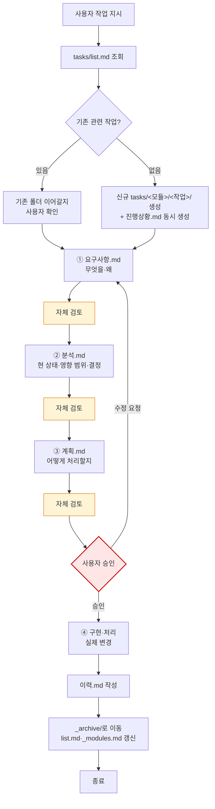

# 작업 진행 규칙

**TL;DR**: 사용자의 모든 작업 지시는 ① 요구사항 분석 → ② 현상태 분석 → ③ 구현·처리 계획 → ④ 구현·처리의 4단계로 진행한다. 각 단계는 `.md` 산출물을 남기고, 단계마다 자체 검토(지침 준수 + 논리 정합성)를 수행하며, `진행상황.md`로 상태를 갱신하고 완료 시 `이력.md`로 정리한다. 명백한 단순 수정(오타·설정값)은 면제.

## 1. 적용 범위

| 적용 | 비적용(면제) |
|---|---|
| 코드 작성·수정 | 명백한 오타 수정 |
| 문서 작성·구조 변경 | 단일 설정값 변경 |
| 지침·정책 변경 | 한 단어·한 줄의 자명한 교정 |
| 분석·조사 작업 (보고서가 산출물) | 사용자가 "바로 해" 류로 명시한 trivial 작업 |
| 도구·자동화 스크립트 추가·수정 | |
| 외부 시스템 연동·환경 설정 | |

> [!IMPORTANT]
> 적용 여부가 모호하면 **적용한다.** 4단계 면제는 명백한 단순 작업에 한정. 모호하면 [`명령 해석 규칙.md`](명령%20해석%20규칙.md)에 따라 사용자에게 질문.

## 2. 4단계 프로세스



### 2.1 단계별 정의

| 단계 | 산출물 | 핵심 질문 |
|---|---|---|
| ① 요구사항 분석 | `요구사항.md` | 사용자가 무엇을 원하는가? 왜? 검증 기준은? |
| ② 현상태 분석 | `분석.md` | 현재 어떻게 되어 있는가? 영향 범위·결정 사항은? |
| ③ 구현·처리 계획 | `계획.md` | 어떻게 바꿀 것인가? 적용 순서·디테일은? |
| ④ 구현·처리 | 실제 코드·문서·설정 변경 | 계획대로 실행 |

### 2.2 산출물 파일명

| 산출물 | 파일명 | 비고 |
|---|---|---|
| 요구사항 | `요구사항.md` | 의무 |
| 분석 | `분석.md` | 의무 |
| 계획 | `계획.md` | 의무. 코딩 작업의 `구현계획.md`는 alias로 호환 |
| 진행상황 | `진행상황.md` | 의무. 단계 1 시작과 동시에 생성 |
| 이력 | `이력.md` | 의무. 작업 완료 시 작성 |

### 2.3 위치

- 작업 폴더: `docs/tasks/<모듈>/<작업슬러그>/`
- 스코프(루트 vs 프로젝트)는 작업이 영향을 미치는 변경 파일의 경로로 결정 (Git 작업 스코프와 일치, [`Git/브랜치, 병합 규칙.md`](../Git/브랜치,%20병합%20규칙.md) 참조)

## 3. 진행상황 문서

### 3.1 의무·생성 시점

- 4단계 작업에 **의무**. 단계 1 작성과 **동시에** 생성한다
- 단순 수정 면제 작업은 자동 면제

### 3.2 갱신 시점

- 단계 진입·종료 (예: 단계 2 → 단계 3 전이)
- 결정 사항 추가
- 이슈·차단 발생·해소
- 다음 동작 변경
- 사용자 보고·승인 대기 시점

### 3.3 형식 (최소 골격)

```markdown
---
name: 진행상황 — <작업명>
purpose: 단계 진행·이슈·다음 동작 추적
type: tasks/진행상황
applies_to: [...]
tags: [...]
---

# 진행상황: <작업명>

**TL;DR**: 현재 단계와 다음 동작 한 줄.

## 단계 진척
| 단계 | 산출물 | 상태 | 일시 |
|---|---|---|---|

## 결정 누적
- 항목

## 이슈·차단
- 항목 또는 "없음"

## 다음 동작
1. ...
```

## 4. 자체 검토 (각 단계 산출 직후)

각 산출물의 말미에 **자체 검토 섹션**을 둔다(별도 파일로 분리하지 않는다).

### 4.1 형식

```markdown
## 자체 검토

### 지침 준수 여부
| 지침 | 준수 |
|---|---|
| `<지침 파일명·섹션>` | ✅ / ⚠️ / ❌ |

### 논리적 정합성
| 점검 | 결과 |
|---|---|
| <점검 항목> | ✅ / ⚠️ |

### 미해결 이슈 (있을 경우)
| 이슈 | 처리 |
|---|---|
| <이슈> | <다음 단계로 이전 / 사용자 질문 등> |
```

### 4.2 검토 2축

| 축 | 내용 |
|---|---|
| 지침 준수 | 본 규칙·`문서 작성 규칙`·`명령 해석 규칙` 등 관련 지침 통과 여부 |
| 논리적 정합성 | 산출물이 "말이 되는가" — 사용자 의도 매핑·내적 모순 없음·이전 단계와 정합 |

### 4.3 미해결 이슈 처리

- **이전 단계로 회귀** — 산출물 자체가 잘못되었거나 정보 부족
- **다음 단계로 이전** — 다음 단계에서 결정·처리할 항목
- **사용자 질문** — 본 단계에서 결정 불가 ([`명령 해석 규칙.md`](명령%20해석%20규칙.md))

## 5. 사용자 승인

- 단계 3 완료 후 단계 4(구현) 진입 전 사용자 승인 요청
- 승인 형식: 간결 보고 + yes/no 확인 ([`명령 해석 규칙.md`](명령%20해석%20규칙.md) §3.1)
- 사용자가 "바로 진행해", "알아서 해" 류로 일괄 승인 시: 본 작업 단위 한정 면제
- **Plan Mode 자동 진입 시**: 본 승인은 `ExitPlanMode` 호출이 자동 게이트가 됨 ([`계획 모드 자동 진입.md`](계획%20모드%20자동%20진입.md))

## 6. 완료 처리

### 6.1 절차

1. `이력.md` 작성 (1페이지 요약 — 형식은 [`문서 작성 규칙.md`](문서%20작성%20규칙.md) §3.4.2)
2. `진행상황.md` 마지막 갱신 (완료 표기) — 또는 `이력.md`로 흡수
3. `git mv tasks/<모듈>/<작업>/ tasks/_archive/<모듈>/<작업>/`
4. `tasks/list.md` 활성 → 완료 섹션 이동, 폴더 링크 `_archive/...`로 갱신
5. **`tasks/_archive/_modules.md` 갱신** — 해당 모듈 행의 `최종 업데이트`(완료일)·`최근 작업`(본 작업 폴더 링크)·`작업 수`(+1) 갱신. 신규 모듈이면 행 추가. 정렬 재조정(최종 업데이트 내림차순 → 작업 수 내림차순 → 모듈명 사전순). 본 파일이 없는 repo는 새로 생성. 본 인덱스는 Wiki 등 외부 sync 진입판단용
6. 커밋 → 사용자 승인 → `--no-ff` 병합

### 6.2 트리거

- 사용자 *"작업 끝났어. 마무리해"* 류 시그널
- 또는 사용자가 검수 후 명시 승인

## 7. 서브에이전트 활용 (병렬·효율)

각 단계 산출 시 **광범위 탐색·다중 가설 분석·독립 작업 동시 실행** 등 서브에이전트로 병렬·효율화 가능한 부분이 있으면 **적극 활용**한다. 단계별 활용 매핑·종류별 선택·병렬 호출 방법·안티패턴은 [`서브에이전트 활용.md`](서브에이전트%20활용.md) 참조.

> [!TIP]
> 단계 ②(현상태 분석)는 코드베이스 탐색·영향 범위 식별 같이 서브에이전트가 가장 큰 가치를 내는 단계다.

## 8. 단순 수정 예외

> [!NOTE]
> 다음에 해당하면 4단계 면제하고 바로 처리. 단 변경이 광범위하거나 부작용 가능성이 있으면 적용.
> - 오타 수정 (단어·문장 교정)
> - 단일 설정값 변경 (수치·플래그)
> - 한 줄·한 단어의 자명한 교정
> - 사용자가 "바로 해" 류 명시한 trivial 작업

## 9. 관련 지침

- [`작업 규칙.md`](../작업%20규칙.md) — 마스터 체크리스트
- [`문서 작성 규칙.md`](문서%20작성%20규칙.md) §3.3 — 작업 문서 위치·파일명
- [`문서 작성 규칙.md`](문서%20작성%20규칙.md) §3.4 — `이력.md` 형식·archive 절차
- [`명령 해석 규칙.md`](명령%20해석%20규칙.md) — 모호 시 질문, 사용자 승인 형식
- [`계획 모드 자동 진입.md`](계획%20모드%20자동%20진입.md) — ②③ 단계 위 Plan Mode 승인 게이트 (`EnterPlanMode`/`ExitPlanMode`)
- [`서브에이전트 활용.md`](서브에이전트%20활용.md) — 병렬·효율 활용 가이드
- [`코딩/작업 규칙.md`](../코딩/작업%20규칙.md) — 본 규칙의 코딩 작업 특화
- [`Git/브랜치, 병합 규칙.md`](../Git/브랜치,%20병합%20규칙.md) — 작업 스코프와 repo 매핑
