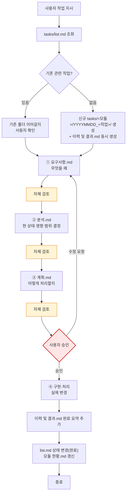

# 4단계 프로세스 및 이력 및 결과 문서

**TL;DR**: ① 요구사항.md → ② 분석.md → ③ 계획.md → 사용자 승인 → ④ 구현(코드/문서 변경). `이력 및 결과.md`는 단계 ① 시작과 동시에 생성, 시계열 로그 + 완료 요약. 각 산출물 말미에 자체 검토(지침 준수 + 논리 정합성). 산출물 4파일 의무.

## 1. 4단계 프로세스



### 1.1 단계별 정의

| 단계 | 산출물 | 핵심 질문 |
|---|---|---|
| ① 요구사항 분석 | `요구사항.md` | 사용자가 무엇을 원하는가? 왜? 검증 기준은? |
| ② 현상태 분석 | `분석.md` | 현재 어떻게 되어 있는가? 영향 범위·결정 사항은? |
| ③ 구현·처리 계획 | `계획.md` | 어떻게 바꿀 것인가? 적용 순서·디테일은? |
| ④ 구현·처리 | 실제 코드·문서·설정 변경 | 계획대로 실행 |

### 1.2 산출물 파일명

| 산출물 | 파일명 | 비고 |
|---|---|---|
| 요구사항 | `요구사항.md` | 의무 |
| 분석 | `분석.md` | 의무 |
| 계획 | `계획.md` | 의무. 코딩 작업의 `구현계획.md`는 alias로 호환 |
| 이력 및 결과 | `이력 및 결과.md` | 의무. **단계 ① 시작과 동시에 생성** — 시계열 로그(진행 중 누적) + 완료 요약(종료 시 추가). 구 `이력.md`·`진행상황.md` 흡수 |

### 1.3 위치

- 작업 폴더: `docs/tasks/<모듈>/YYYYMMDD_<작업슬러그>/`
- 스코프(루트 vs 프로젝트)는 작업이 영향을 미치는 변경 파일의 경로로 결정 (Git 작업 스코프와 일치, [`../../Git/브랜치, 병합 규칙.md`](../../Git/브랜치,%20병합%20규칙.md) 참조)

## 2. 이력 및 결과 문서 (시계열 로그 + 완료 요약)

> [!NOTE]
> 2026-05-15 Task α 이후 `이력 및 결과.md` 단일 파일로 통합, 2026-05-18 Package C에서 `이력 및 결과.md`로 명명 변경. 작업 시작 시점부터 진행 중 시계열로 누적하다가 완료 시 요약 섹션을 추가한다. 시계열 로그가 곧 진행상황, 완료 요약이 곧 결과 — 한 곳에서 작업의 전체 history를 추적.

### 2.1 의무·생성 시점

- 4단계 작업에 **의무**. 단계 ① 작성과 **동시에** 생성한다
- 단순 수정 면제 작업은 자동 면제

### 2.2 갱신 시점

- 단계 진입·종료 (예: 단계 ② → ③ 전이) — `## 단계 진척` 표 갱신
- 결정 사항·이슈·차단 발생·해소 — `## 시계열 로그` 표에 한 줄 추가
- 다음 동작 변경 — `## 시계열 로그`에 반영
- 작업 완료 시 — `## 완료 요약` 섹션 추가 (기간·병합 SHA·무엇을·왜·후속)

### 2.3 형식 (최소 골격)

```markdown
---
name: 이력 및 결과 — <작업명>
purpose: <작업 1줄 요약 (50자 이내)>
type: tasks/이력
applies_to: [...]
tags: [..., 상태:진행|완료]
---

# 이력 및 결과: <작업명>

**TL;DR**: 현재 단계 + 다음 동작 한 줄. (완료 후: 최종 결과 한 줄로 교체)

## 단계 진척

| 단계 | 산출물 | 상태 | 일시 |
|---|---|---|---|

## 시계열 로그

| 시각 | 이벤트 |
|---|---|

## 완료 요약 (작업 종료 시 추가)

**기간:** YYYY-MM-DD ~ YYYY-MM-DD
**병합:** `<대상 브랜치>` ← `<작업 브랜치>` (`<merge SHA>`)
**연계 작업:** → [...](...) (없으면 생략)

### 무엇을 했는가
한 단락 — 결과물 중심으로.

### 핵심 결정
- 왜 이렇게 했는지 — 대안 대비 선택 이유 (1~3개)

### 후속 영향
- 추가 작업 / 지침 갱신 등 (없으면 생략)
```

## 3. 자체 검토 (각 단계 산출 직후)

각 산출물의 말미에 **자체 검토 섹션**을 둔다(별도 파일로 분리하지 않는다).

### 3.1 형식

```markdown
## 자체 검토

### 지침 준수 여부
| 지침 | 준수 |
|---|---|
| `<지침 파일명·섹션>` | ✅ / ⚠️ / ❌ |

### 논리적 정합성
| 점검 | 결과 |
|---|---|
| <점검 항목> | ✅ / ⚠️ |

### 미해결 이슈 (있을 경우)
| 이슈 | 처리 |
|---|---|
| <이슈> | <다음 단계로 이전 / 사용자 질문 등> |
```

### 3.2 검토 2축

| 축 | 내용 |
|---|---|
| 지침 준수 | 본 규칙·`문서 작성 규칙`·`명령 해석 규칙` 등 관련 지침 통과 여부 |
| 논리적 정합성 | 산출물이 "말이 되는가" — 사용자 의도 매핑·내적 모순 없음·이전 단계와 정합 |

### 3.3 미해결 이슈 처리

- **이전 단계로 회귀** — 산출물 자체가 잘못되었거나 정보 부족
- **다음 단계로 이전** — 다음 단계에서 결정·처리할 항목
- **사용자 질문** — 본 단계에서 결정 불가 ([`../명령 해석 규칙.md`](../명령%20해석%20규칙.md))

## 4. 사용자 승인

- 단계 ③ 완료 후 단계 ④(구현) 진입 전 사용자 승인 요청
- 승인 형식: 간결 보고 + yes/no 확인 ([`../명령 해석 규칙.md`](../명령%20해석%20규칙.md) §3.1)
- 사용자가 "바로 진행해", "알아서 해" 류로 일괄 승인 시: 본 작업 단위 한정 면제
- **Plan Mode 자동 진입 시**: 본 승인은 `ExitPlanMode` 호출이 자동 게이트가 됨 ([`../계획 모드 자동 진입.md`](../계획%20모드%20자동%20진입.md))

## 5. 학습 노트 — 작업 진행 (2026-05-18 회고 흡수)

> [!NOTE]
> 2026-05-18 Package C 이전에는 `docs/회고/작업 진행.md`에 별도 누적. 이제는 본 파일에 흡수.

### 5.1 프로그래밍 전 문서 선행 작성 (2026-04-18) *(maturity: core)*

사용자가 프로그래밍 관련 작업을 지시하면, **코드를 바로 작성하지 않고** 먼저 `요구사항.md`·`분석.md`·`계획.md`를 해당 프로젝트의 `docs/tasks/<모듈>/YYYYMMDD_<작업>/` 폴더에 작성한다. 사용자가 문서를 먼저 확인하고, 구현 여부를 결정한다. 승인 없이 코드 작성을 시작하면 안 됨.

### 5.2 작업 위치 — 메인 디렉토리 기본, 워크트리는 명시 또는 병렬 이득 시 (2026-04-25) *(maturity: stable)*

사용자가 작업을 지시하면 원칙적으로 **메인 워킹 디렉토리(루트 repo 또는 해당 프로젝트 repo)에서 작업 브랜치 전환 방식**으로 진행한다. 사용자의 VSCode 등 IDE가 메인 디렉토리를 열어둔 상태이므로, 워크트리로 격리하면 변경사항을 IDE에서 실시간으로 볼 수 없어 단일 작업에선 비효율적.

**워크트리 사용 조건 (둘 중 하나)**:
1. **사용자 명시 트리거** — *"워크트리에서"*, *"병렬로"*, *"동시에 작업"*, *"백그라운드로"* 등 동의어 포함
2. **Claude 판단 — 진짜 병렬이 이득 명확할 때** — 여러 작업을 동시에 진행하고 완료되는 순서대로 메인 디렉토리에 순차 병합하는 편이 총 소요시간을 크게 줄일 때. 사용자에게 *"워크트리로 병렬 진행할까요?"* 제안 후 동의 얻고 실행

**작업 시작 시 고지**: *"메인 디렉토리에서 `<브랜치명>` 브랜치로 진행하겠습니다"* 또는 *"워크트리로 병렬 진행하겠습니다"*

### 5.3 작업 완료 시그널 및 워크트리 생명주기 (2026-04-24) *(maturity: stable)*

작업 중에는 워크트리와 작업 브랜치를 유지하고, 사용자가 명시적으로 **"작업 끝났어. 마무리해"** (또는 동등한 완료 시그널)를 보내기 전까지 자동으로 커밋·병합·워크트리 정리 단계로 넘어가지 않는다.

**How to apply:**
- 작업 단위가 끝난 듯 보여도, 명시적 완료 시그널이 없으면 **커밋하지 않음**
- 중간 저장이 필요하면 사용자에게 *"여기서 커밋할까요?"* 확인 후 진행
- 사용자 시그널 수신 시: 작업 브랜치 커밋 → 병합 전 승인 요청 → 병합 → 워크트리 정리
- 백그라운드 워크트리 에이전트가 작업 완료를 보고해도 동일 원칙

### 5.4 신규 도출물 작성 직후 frontmatter+TL;DR 셀프 체크 (2026-05-07) *(maturity: core)*

새로운 영속 .md 파일을 `Write`로 처음 작성할 때 **frontmatter와 TL;DR 둘 다 포함됐는지** 작성 직후 즉시 셀프 체크한다.

**체크리스트 (Write 직후):**
- [ ] frontmatter (`---` 블록, name·purpose·type·maturity 최소)
- [ ] 첫 `#` 헤더 직후 `**TL;DR**:` 1~3줄
- [ ] 의미 한글 라벨 (`Q1`/`H1` 같은 알파벳 약어 금지)

TL;DR은 `purpose`보다 더 구체적·실행 가능한 정보 — 단순 복붙 금지

### 5.5 점검 task의 빈틈은 사용자 명시 트리거로 일괄 소급 (2026-05-07) *(maturity: experimental)*

문서 정합성 일괄 점검 task가 *점검 기준 자체에 빈틈*이 있는 경우, 그 빈틈을 사용자가 지적했을 때 **재점검·재작업이 아니라 사용자 명시 요청을 트리거로 일괄 소급에 진입**한다. 점진적 소급이 디폴트이지만 사용자 명시 트리거가 있으면 그 즉시 일괄 처리 권한이 열린다.

**How to apply:**
- 점검 task에서 빈틈이 발견되면: (1) 빈틈을 인정 (2) 정책상의 디폴트 처리 방식 안내 (3) 사용자가 일괄 처리를 원할 옵션 제시
- 사용자가 일괄 옵션을 선택하면 "사용자 명시 요청" 트리거 충족 → 일괄 소급 task 신규 시작
- 일괄 소급 task는 **별도 task 폴더**로 분리. 빈틈 보완 task의 이력에 원 점검 task 링크 + 어떤 점검 기준이 누락됐는지 명시

### 5.6 메타 점검은 영역 분할 서브에이전트 병렬로 (2026-05-07) *(maturity: stable)*

문서 정합성·인덱스 동기화·링크 무결성 같은 **광범위 메타 점검**은 영역별로 `Explore` 서브에이전트를 분할해 한 응답에 병렬 호출하면 메인 컨텍스트 부담을 크게 낮춘다. 검증된 분할 축: (1) 루트 docs frontmatter·인덱스 / (2) 모든 .md 링크 무결성 / (3) 각 프로젝트 표준 준수.

**How to apply:**
- 점검 차원이 3개 이상이면 분할 후보
- 각 서브에이전트 프롬프트에 출력 형식을 체크리스트·표로 강제 (자유 서술 금지)
- 메인은 발견된 항목을 분석.md에 수합한 뒤 git 스코프 별로 처리 가능 여부 분리
- 단계 ② 분석에서 가장 효과 큼

### 5.7 같은 파일 다중 Edit은 순차 호출 (병렬 충돌) (2026-05-07) *(maturity: experimental)*

한 응답에서 **같은 파일에 대해 Edit 도구를 다중 호출하면 string 매치 실패** 위험이 있다. 첫 호출의 변경 결과가 다른 호출의 `old_string`에 반영되지 않아 매치 어긋남이 발생.

**How to apply:**
- 한 파일에 변경할 곳이 여러 개면 다음 중 택일:
  - **(a) 더 큰 영역을 한 번의 Edit으로** — 변경 영역들을 포함하는 큰 블록을 통째 교체
  - **(b) 응답 분리** — 한 응답에 한 파일 한 Edit, 다음 응답에 다음 Edit
  - **(c) 명시 순차** — 의존성이 있다면 한 Edit 결과 확인 후 다음 Edit
- 다른 파일들 사이에는 병렬 Edit 그대로 활용 (충돌 없음)
- Edit 매치 실패 시 즉시 `Read`로 현재 파일 상태 확인 후 정확한 문자열로 재시도

### 5.8 Plan Mode 자동 진입 도입 (2026-05-14) *(maturity: stable)*

actionable task 시작 시 Claude가 `EnterPlanMode` 도구를 **자체 호출**해 Plan Mode로 진입한 뒤 표준 ②분석·③계획 산출물을 작성하고 `ExitPlanMode`로 사용자 승인을 받은 후 Auto 모드로 ④구현하는 흐름을 의무화. 상세: [`../계획 모드 자동 진입.md`](../계획%20모드%20자동%20진입.md)

### 5.9 ExitPlanMode 승인 = plan file 승인 ≠ 정식 산출물 승인 (2026-05-14) *(maturity: stable)*

`ExitPlanMode` 호출에 대한 사용자 승인은 **plan file (Claude Code 시스템 임시 경로의 요약본)에 대한 게이트**일 뿐이며, 표준 경로 (`docs/tasks/<모듈>/<작업>/분석.md`·`계획.md`)에 정식 작성하는 산출물의 사용자 검토 게이트는 **별도**다.

**두 게이트 모두 통과 후에야 ④ 구현 시작:**
1. Plan Mode 1차 게이트: ExitPlanMode → plan file 승인
2. 표준 산출물 2차 게이트: `분석.md`·`계획.md` 정식 작성 → 사용자 검토 → 명시 OK
3. ④ 구현

"stop 없이 진행", "알아서 해" 류 사용자 지시는 **clarifying question 자율 판단** 면제이며, 사용자 승인 게이트 자체를 면제하지 않음. 게이트 면제는 사용자가 *"검토 게이트 건너뛰고 바로 구현해"* 같이 게이트를 직접 지목해 면제한 경우에 한정.

### 5.10 정책 신설 작업의 자기 참조 — 첫 사용 사례 자기 반영 (2026-05-15) *(maturity: experimental)*

정책·절차·인덱스를 새로 신설하는 작업이 그 신설된 절차·인덱스의 **첫 사용 사례**가 되는 경우, 계획 단계에서 *"자기 적용"* 단락을 의무 추가하고 종료 정리에서 실제 자기 반영을 수행한다. 빠뜨리면 새 절차가 *예외 1건*으로 시작되어 시간이 흐를수록 정합성 누적 손실.

**How to apply:**

- 작업이 **정책 신설·절차 확장·메타 인덱스 신설**에 해당하면 계획.md에 자기 적용 검토 섹션 의무 추가:
  - 본 작업 자체가 신설 절차의 첫 사용 사례인가?
  - 자기 반영해야 하는 산출물·인덱스·표는 무엇인가?
  - 종료 정리의 어느 단계에서 자기 반영하는가?
- 종료 정리 커밋에 자기 반영까지 포함 (또는 별도 커밋으로 분리)
- 같은 정책이 **여러 위치에 흩어진 표현**(마스터 체크리스트·흐름도·갱신 이벤트 표·요약 단락 등)으로 존재하는 경우, 한 곳만 갱신하면 정책 표현이 분기되어 정합성 깨짐. `Grep`으로 동일 정책의 분산 위치를 전수 점검 후 일관 갱신
- **자기 적용 면제 사례**: 정책 신설 시점과 정책 발효 시점이 *시간 순서상* 어긋나는 경우는 **자기 적용 면제**. 단 면제 사유를 분석.md에 명시 + 후속 task에 자기 적용 의무 명시
