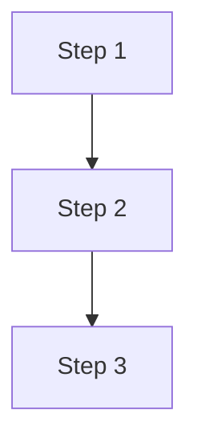

# 양식 — 계획.md

**TL;DR**: 4단계 ③ 계획 산출물 표준 양식. 전체 시퀀스·단계별 상세·검증·위험·서브에이전트 분담·진행 추적 7개 섹션. 다단계 atomic commit 단위로 분해 권장. 본 양식 본문을 작업 폴더의 `계획.md`로 복사한 뒤 채움.

## 사용법

1. 본 파일의 §양식 본문을 복사해서 작업 폴더의 `계획.md`로 저장
2. `<...>` placeholder 채움
3. 코딩 작업은 `구현계획.md` 명명도 alias로 호환
4. 단계별 commit 메시지·영향 파일·검증 기준 명시
5. 사용자 승인 게이트(단계 ③ → ④ 진입 전) 통과 후 구현

## 관련 양식

- [요구사항.md 양식](요구사항.md)
- [분석.md 양식](분석.md)
- [이력 및 결과.md 양식](이력%20및%20결과.md)

## 관련 지침

- [`../4단계-프로세스.md`](../4단계-프로세스.md) §1.1 ③ — "어떻게 바꿀 것인가? 적용 순서·디테일"
- [`../4단계-프로세스.md`](../4단계-프로세스.md) §4 — 사용자 승인 게이트
- [`../계획 모드 자동 진입.md`](../계획%20모드%20자동%20진입.md) — Plan Mode 자동 진입 (②③ 단계)
- [`../서브에이전트 활용.md`](../서브에이전트%20활용.md) — 작업 분담 최대 활용

---

## 양식 본문 (이 아래를 복사)

````markdown
---
name: 계획 — <작업명>
purpose: <실행 계획 1줄 요약 (50자 이내)>
type: tasks/계획
applies_to: [<scope>]
maturity: experimental
tags: [<모듈>, ...]
---

# 계획: <작업명>

**TL;DR**: <80~250자 — 어떻게 처리할지·단계·핵심 산출물>

## 1. 전체 시퀀스

```
[Step 1] <단계명>
   ↓
[Step 2] <단계명>
   ↓
...
```

(또는 Mermaid `flowchart`)



## 2. 단계별 상세

### Step 1: <단계명>

**작업**:
- <구체적 작업>

**영향 파일**: <목록 또는 추정 수>
**검증**: <자체검증 방법>
**commit 메시지**: `<commit msg>`

### Step 2: <단계명>

(동일 양식)

## 3. 검증 절차

### 3.1 단계별
- 각 commit 직전 `git status` + `git diff --stat`
- 영향 파일이 계획 범위 내인지 (오버런 방지)

### 3.2 최종
- broken link 검사: `grep -r "<옛 명명>"` 잔존 확인
- 수용 기준(요구사항.md §3) 전 항목 ✓
- 회귀 시뮬레이션 (관련 시)

## 4. 위험 관리

| 위험 | 가능성 | 영향 | 완화 |
|---|---|---|---|
| 위험_1 | 중 | 중 | <완화 방안> |
| 위험_2 | 낮음 | 높음 | <완화 방안> |

## 5. 작업 분담 (서브에이전트 활용)

서브에이전트 **되도록 가능한 최대로 활용** ([`서브에이전트 활용.md`](../../../지침/일반/서브에이전트%20활용.md)):

- **메인 agent**: <어떤 작업>
- **서브에이전트 A (`Explore`)**: <광범위 탐색>
- **서브에이전트 B (`general-purpose`)**: <반복 작업·실행>
- **병렬 호출**: 의존성 없는 서브에이전트는 한 응답에 묶음

## 6. 진행 추적

각 Step 완료 시 본 계획에 ✅ 추가:
- [ ] Step 1: <단계명>
- [ ] Step 2: <...>

체크 진행 상황은 `이력 및 결과.md` 시계열 로그에 동시 기록.

## 7. 관련 산출물

- [요구사항.md](요구사항.md) — 무엇을·왜
- [분석.md](분석.md) — 현 상태·결정
- [이력 및 결과.md](이력%20및%20결과.md) — 시계열·완료
- 첨부: `첨부_계획_<제목>.<ext>` (있다면)

## 자체 검토

### 지침 준수 여부
| 지침 | 준수 |
|---|---|
| [`작업 진행 규칙.md`](../../../지침/일반/작업%20진행%20규칙.md) | ✅ |
| [`서브에이전트 활용.md`](../../../지침/일반/서브에이전트%20활용.md) | ✅ |
| [`Git/브랜치, 병합 규칙.md`](../../../지침/Git/브랜치,%20병합%20규칙.md) | ✅ |

### 논리적 정합성
| 점검 | 결과 |
|---|---|
| 분석.md 결정이 계획에 반영 | ✅ |
| 단계 시퀀스 의존성 명확 | ✅ |
| 위험·완화 식별 | ✅ |
| 서브에이전트 분담 명시 | ✅ |

### 미해결 이슈
| 이슈 | 처리 |
|---|---|
| <이슈> | <구현 중 결정 / 사용자 질문> |
````
