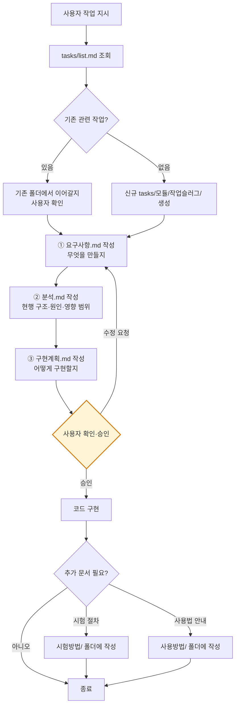

# 프로그래밍 작업 규칙

**TL;DR**: 코딩 지시받으면 코드 바로 안 씀. 요구사항.md → 분석.md → 구현계획.md 작성 → 사용자 승인 → 구현. 단순 수정(오타·설정값)은 예외.

## 핵심 원칙

프로그래밍 관련 작업 지시를 받으면, **코드를 바로 작성하지 않는다.** 먼저 문서를 작성하고 사용자 승인을 받은 후 구현한다.

## 작업 흐름

## 문서 작성 위치

- 해당 스코프(루트 or 프로젝트)의 `docs/tasks/<모듈>/<작업슬러그>/` 폴더 하위에 `.md`로 작성
- 고정 파일명: `요구사항.md`, `분석.md`, `구현계획.md`, (선택 `진행상황.md`)
- 영속 성격의 시험 절차·사용법은 `시험방법/` 또는 `사용방법/` 폴더에 배치
- 작업 시작 시 `docs/tasks/list.md` 활성 섹션에 등재
- 상세 컨벤션: [`../일반/문서 작성 규칙.md`](../일반/문서%20작성%20규칙.md)

## 선택적 문서

| 문서 | 조건 | 배치 |
|---|---|---|
| `시험방법/<...>.md` | 시험 절차·기준 정의 (영속) | `docs/시험방법/` |
| `사용방법/<...>.md` | 사용자 명령 입력 등 사용법 안내 (영속) | `docs/사용방법/` |
| `진행상황.md` | 세션 간 핸드오프가 필요한 장기 작업 | 해당 작업 폴더 내 |
| `이력.md` | 완료 작업의 사후 요약 | 해당 작업 폴더 내 또는 `docs/이력/`로 이전 |

## 예외

> [!NOTE]
> 단순 수정(오타, 설정값 변경 등)은 문서 없이 바로 진행 가능. 사용자 판단에 맡긴다.
