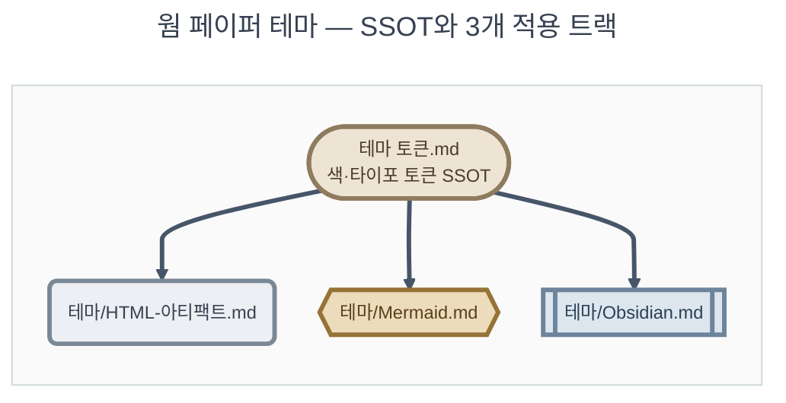

# 테마 토큰

**TL;DR**: 웜 페이퍼(크림 배경·다크 브라운 텍스트·테라코타/틸 액센트) 라이트 전용 테마의 색·타이포·컴포넌트 토큰 SSOT다. 액센트 8종만 역할명(`--accent-1`/`--accent-2`)으로 재명명하고 나머지 17종은 원본을 유지했다. HTML·Mermaid·Obsidian 3트랙(§4)이 이 토큰명을 참조하며, 문서 자신은 GitHub sanitizer로 스타일이 렌더되지 않는다(§5) — 값을 복사해 쓰는 원장으로 설계했다.

## 1. 개요·철학

"웜 페이퍼(warm paper)"는 크림빛 종이 질감 배경(`--page-plane`) 위에 다크 브라운 잉크색 텍스트(`--text-primary`)를 놓고, 따뜻한 뉴트럴 표면 2단(`--surface-1`/`--card-bg`)과 테라코타·틸 2개 액센트로 위계를 표현하는 **라이트 전용** 테마다.

원산지는 Sound1 프로젝트의 nofm 출력 패턴 뷰어(§8 각주)다. 그 문서는 액센트에 `--cis-accent`/`--nofm-accent`처럼 인공와우 도메인 약어(CIS·NofM)를 그대로 붙여 썼다. 본 지침은 그 팔레트에서 **색·형태 값만** 추출해 도메인 무관 이름(§2)으로 다시 포장한 것이다 — "인공와우 뷰어의 색"이 아니라 "따뜻한 데이터 문서용 색"으로 재정의한다.

목적은 재사용성이다. 신규 정적 HTML 페이지·Claude Artifact·Mermaid 다이어그램·Obsidian 노트 어디에 이 룩을 입히든, §2~§3의 토큰명 하나로 통일된 외형이 나오게 한다. 시각 원칙은 절제다 — 크기가 아니라 굵기·색으로 위계를 만들고(§3.3), 실선/점선 전환만으로 구조와 주석을 가른다(§3.5). 다크 모드는 지원하지 않는다(§6) — 이 테마는 처음부터 라이트 단일톤으로 커밋된 디자인이다.

## 2. 색 토큰 (SSOT)

본 절이 색의 단일 출처다. 원본 25종 hex를 전량 그대로 보존했고, **액센트 8종만 역할 기반으로 재명명**했다(사유는 §2.3). `hex` 컬럼은 백틱 인라인 코드로 적었다 — GitHub이 이 형태를 자동으로 색 스와치와 함께 렌더한다(§5 항목 2).

### 2.1 사용상태 정의

원본 뷰어 안에서 실제로 어떻게 소비되는지를 3가지로 분류했다.

| 사용상태 | 의미 |
|---|---|
| 활성 | CSS `var()`로 직접 소비된다 |
| 브릿지 | CSS에서는 미참조 — JS `cssVar()`(= `getComputedStyle` 브릿지 헬퍼)로만 소비된다. `<canvas>`는 `<style>`을 못 읽어 이 브릿지가 필요하다 |
| 미사용 | `:root`에 선언만 있고, 그 커스텀 프로퍼티 자체를 CSS·JS 어디서도 읽지 않는다 |

### 2.2 전량 표 (25종)

| 토큰명 | hex | 범주 | 역할 | 원본명 | 사용상태 |
|---|---|---|---|---|---|
| `--page-plane` | `#EFE7D6` | 배경 | 페이지 최하단 배경(웜 크림 기준색) | — | 활성 |
| `--surface-1` | `#FAF5EA` | 표면 | 1단 표면 — 헤더·입력·라벨열 배경 | — | 활성 |
| `--card-bg` | `#FBF7EE` | 표면 | 2단 표면 — 카드·패널·tooltip 배경(가장 밝음) | — | 활성 |
| `--card-border` | `#E2D5BC` | 표면 | 표면 공용 테두리(구조 경계, 원본 8곳) | — | 활성 |
| `--text-primary` | `#33291C` | 텍스트 | 최상위 본문 텍스트(잉크색) | — | 활성 |
| `--text-secondary` | `#6B5C46` | 텍스트 | 보조 텍스트(라벨·note) | — | 활성 |
| `--text-muted` | `#6E5F48` | 텍스트 | 3단 옅은 텍스트(부제·단위·눈금자) | — | 활성 |
| `--accent-1` | `#C15F3C` | 액센트 | 주 액센트(테라코타) — 강조·인터랙티브·링크 | `--cis-accent` | 활성 |
| `--accent-1-tint-1` | `#F5DECB` | 액센트 | accent-1 tint 1단(가장 옅음) | `--cis-tint-1` | 미사용 |
| `--accent-1-tint-2` | `#ECC7A6` | 액센트 | accent-1 tint 2단 | `--cis-tint-2` | 미사용 |
| `--accent-1-tint-3` | `#E2AE82` | 액센트 | accent-1 tint 3단(가장 짙음) | `--cis-tint-3` | 미사용 |
| `--accent-2` | `#3E6E64` | 액센트 | 보조 액센트(딥 틸) | `--nofm-accent` | 활성 |
| `--accent-2-tint-1` | `#D6E6DF` | 액센트 | accent-2 tint 1단(가장 옅음) | `--nofm-tint-1` | 미사용 |
| `--accent-2-tint-2` | `#C1D9CE` | 액센트 | accent-2 tint 2단 | `--nofm-tint-2` | 미사용 |
| `--accent-2-tint-3` | `#ACCCBD` | 액센트 | accent-2 tint 3단(가장 짙음) | `--nofm-tint-3` | 미사용 |
| `--warn-bg` | `#F7E7BE` | semantic | 경고 배지 배경(예약) | — | 미사용 |
| `--warn-fg` | `#7A5A0E` | semantic | 경고 강조 텍스트 | — | 활성 |
| `--danger-bg` | `#F4DCD0` | semantic | 위험 배지 배경(예약) | — | 미사용 |
| `--danger-fg` | `#A23B22` | semantic | 위험 강조 텍스트 | — | 활성 |
| `--info-bg` | `#DEE9E3` | semantic | 정보 배지 배경(예약) | — | 미사용 |
| `--info-fg` | `#2F5C50` | semantic | 정보 강조 텍스트(예약) | — | 미사용 |
| `--gridline` | `#E6DAC2` | 기타 | 옅은 내부 구분선 | — | 활성 |
| `--baseline` | `#CBB999` | 기타 | 기준선(0-레벨), 캔버스 전용 | — | 브릿지 |
| `--idle-fill` | `#C7C0B0` | 기타 | 유휴 슬롯 채우기, 캔버스 전용 | — | 브릿지 |
| `--idle-border` | `#AAA089` | 기타 | 유휴 슬롯 테두리, 캔버스 전용 | — | 브릿지 |

범주 합계: 배경 1 · 표면 3 · 텍스트 3 · 액센트 8 · semantic 6 · 기타 4 = **25**. 사용상태 합계: 활성 12 · 브릿지 3 · 미사용 10 = **25**.

### 2.3 참고 — 재명명·함정

> [!IMPORTANT]
> **액센트만 역할 기반으로 재명명했다.** 원본의 `--cis-accent`/`--nofm-accent`는 Sound1 프로젝트의 CIS(전극)·NofM(자극 채널 수) 도메인 약어라 "도메인 무관 전역 스타일"이라는 본 지침 목적과 배치된다. 나머지 17종은 이미 역할 기반 이름(`--page-plane`·`--text-primary` 등)이라 원본 그대로 유지했다. `--accent-1`(주 액센트: 강조·인터랙티브·링크)·`--accent-2`(보조 액센트) 두 역할로 고정하고, [`테마/Mermaid.md`](테마/Mermaid.md)·[`테마/Obsidian.md`](테마/Obsidian.md)는 이 역할 정의에 종속한다 — 트랙마다 액센트 의미를 다시 해석하지 않는다.

> [!NOTE]
> **tint 6종 "미사용"의 함정**: 위 표에서 tint 6종을 "미사용"으로 표기한 근거는 CSS `var()` 참조가 0건이라는 뜻이다. 다만 원본에서는 그 색값 자체가 JS `CIS_PALETTE`/`NOFM_PALETTE` 배열에 리터럴로 **별도 하드코딩 중복** 선언되어 화면에는 등장한다. 즉 "색이 안 쓰인다"가 아니라 "이 CSS 커스텀 프로퍼티를 아무도 읽지 않는다"는 뜻이다 — 이 토큰을 새 HTML로 이식할 때 `:root` 변수만 복사하면 캔버스 팔레트가 안 딸려오는 함정이 된다. 대응은 [`테마/HTML-아티팩트.md`](테마/HTML-아티팩트.md) 참조.

> [!NOTE]
> **semantic bg 4종은 예약 토큰**: `warn-bg`·`danger-bg`·`info-bg`·`info-fg`는 원본에서 선언만 되고 실사용처가 없다 — 배지·배너 UI 확장을 대비한 예약 토큰으로 추정된다. `warn-fg`·`danger-fg`만 실제 텍스트 강조(경고·클램프 각주)에 쓰인다.

## 3. 타이포·간격·컴포넌트 토큰

### 3.1 font-family

```css
font-family: system-ui, -apple-system, "Segoe UI", "Pretendard", "Noto Sans KR", sans-serif;
```

전역 단일 패밀리 — 컴포넌트별 override 없음. 모노스페이스는 쓰지 않는다. 숫자 정렬은 `font-variant-numeric: tabular-nums`로 해결한다(실시간으로 바뀌는 숫자 표시 요소에 적용 권장 — 원본은 입력·select에만 적용해 데이터 셀 등으로 확장 여지가 있었다).

### 3.2 font-size 스케일 (9~17px)

| 크기 | 실사용 맥락 |
|---|---|
| 9px | 초소형 데코 라벨(슬라이더 마커 캡션) |
| 11px | 보조 컨트롤 라벨 |
| 11.5px | 고정 라벨열(0.5px 미세조정) |
| 12px | 보조 텍스트 기준 — 가장 널리 재사용 |
| 12.5px | 각주형 note(0.5px 미세조정) |
| 13px | 본문·데이터 셀 기준 |
| 15px | 섹션 타이틀 |
| 17px | 페이지 타이틀(파일 내 최대) |

4px/8px 배수 같은 정형 스케일이 아니라 눈으로 맞춘 **비-모듈러 스케일**(데이터 밀도 높은 계기판형 UI 특징)이다. 다른 문서에 이식할 때는 `12px=보조 텍스트`·`13px=본문/데이터`·`15px=섹션 타이틀`·`17px=페이지 타이틀`의 **실사용 4단**으로 단순화해 적용 가능하다.

### 3.3 font-weight 계층

| weight | 의미 |
|---|---|
| 400(기본) | 본문 텍스트 |
| 500 | 보조·부차 라벨(가장 약한 강조) |
| 600 | 주 컨트롤 라벨(크기가 같아도 weight로 보조와 구분) |
| 700(bold) | 헤더·타이틀·경고성 강조 |

크기를 키우지 않고 **weight+색**만으로 위계를 만드는 원칙이다. `line-height`·`letter-spacing`·`text-transform`(대문자 캡션 등) 오버라이드는 쓰지 않는다 — 위계는 크기·굵기·색 세 축으로만 만드는 "조용한" 타이포 원칙.

### 3.4 border-radius 4단

| radius | 티어 | 사용처 |
|---|---|---|
| 6px | 컨트롤/칩 | input·select·tooltip |
| 10px | 점선 주석 박스 | note·disabled-msg |
| 12px | 카드/컨테이너 | controls·stats·scrollwrap |
| 50% | 원형 | 슬라이더 thumb·dot 뱃지 |

작을수록 작은 UI 부품, 클수록 구조적 컨테이너.

### 3.5 border 의미 + gridline

| 스타일 | 토큰 | 의미 |
|---|---|---|
| `1px solid var(--card-border)` | card-border | **구조적** 컨테이너 경계 |
| `1px dashed var(--card-border)` | card-border(색 동일, 스타일만 전환) | **보조·주석성** 신호 — solid와 색은 같지만 실선→점선 전환만으로 "덜 구조적"임을 표시 |
| `1px solid var(--gridline)` | gridline(더 옅은 전용 토큰) | 내부 **반복 구분선** — 외곽 경계보다 약한 톤 |

같은 색 토큰이라도 solid/dashed 전환만으로 "구조 vs 주석" 의미를 나누는 것이 재사용 가치가 큰 패턴이다. `gridline`은 항상 옅은 내부 구분선 전용 — 외곽 테두리(`card-border`)와 역할을 섞지 않는다.

### 3.6 그 외 재사용 패턴 (참고)

| 패턴 | 내용 |
|---|---|
| elevation 네이밍 | `--page-plane`(배경) → `--surface-1`(1단 표면) → `--card-bg`(2단 표면) — 이름 자체가 3단 고도를 서술 |
| z-index 3단 | `2`(고정 열) < `20`(고정 헤더) < `50`(플로팅 tooltip) — 임의의 큰 수(999 등) 대신 실제 필요한 최소 계층만 사용 |
| `tabular-nums` 확장 여지 | 동적으로 바뀌는 숫자를 보여주는 모든 요소로 확장 적용 권장(§3.1) |

전체 컴포넌트 CSS 레시피(헤더·컨트롤·stats grid·panel-title+dot·note/disabled-msg·타임라인 행·tooltip 7종)는 [`테마/HTML-아티팩트.md`](테마/HTML-아티팩트.md)에 수록한다.

## 4. 적용 트랙

§2·§3의 토큰명을 실제 매체에 입히는 3개 트랙 문서다. 전부 이 인덱스의 토큰명을 그대로 참조한다 — 트랙 문서 안에서 액센트 역할을 다시 정의하지 않는다.

| 매체 | 파일 | 무엇 |
|---|---|---|
| HTML(정적 페이지·Claude Artifact) | [`테마/HTML-아티팩트.md`](테마/HTML-아티팩트.md) | 복붙용 `:root{}` CSS 변수 블록 + 컴포넌트 스니펫(카드·컨트롤·stats grid·badge·note·tooltip 등 7종), tint JS 중복 함정 대응 |
| Mermaid 다이어그램 | [`테마/Mermaid.md`](테마/Mermaid.md) | `themeVariables`+`classDef` 웜 팔레트, 선택 기준(frontmatter `theme: warm-paper`), stroke=잉크·액센트 대비 안전 규칙 |
| Obsidian(옵시디언 Vault) | [`테마/Obsidian.md`](테마/Obsidian.md) | `.theme-light` CSS 스니펫(표준+콜아웃+Things 테마 보강 3계층) + 활성화 안내 |

아래는 참조 방향을 보여준다 — 항상 SSOT(본 문서)에서 트랙으로 흐른다(역방향 아님, §7 유지보수 절차와 정합).



## 5. GitHub 렌더 현실

이 문서를 GitHub에서 열면 §2 표의 배경이 크림색으로 안 보이고, §4 링크 대상 HTML을 열어도 웜 페이퍼 룩이 안 보일 수 있다. 4가지 이유를 알아두면 "왜 여기선 안 예쁘게 나오지?"라는 오인을 막는다.

1. **`.md` 문서 자신은 스타일을 못 입는다** — GitHub의 마크다운 sanitizer가 렌더링 시 `<style>` 블록과 인라인 `style` 속성을 통째로 제거한다(XSS 방지가 목적인 의도된 동작, 버그 아님). 이 지침 문서 자체에 `<style>`을 심어 실제 웜 페이퍼처럼 보이게 만들 방법은 없다.
2. **예외 — 백틱 hex는 색 스와치가 뜬다**: `` `#FBF7EE` ``처럼 hex를 인라인 코드로 감싸면 GitHub이 자동으로 작은 색상 사각형을 붙여준다. §2 표의 `hex` 컬럼이 백틱인 이유다.
3. **Mermaid는 GitHub이 네이티브 렌더한다** — [`테마/Mermaid.md`](테마/Mermaid.md)의 `themeVariables` 웜 팔레트는 GitHub.com에서도 실제로 그 색으로 그려진다. 3트랙 중 유일하게 "GitHub에서 바로 웜 페이퍼로 보이는" 트랙이다.
4. **`.html`·`.css`는 소스 코드로만 보인다** — GitHub은 리포에 커밋된 HTML을 실행하지 않고 문법 강조된 텍스트로만 표시한다. [`테마/HTML-아티팩트.md`](테마/HTML-아티팩트.md)의 스니펫이나 원본 뷰어를 실제로 보려면 로컬에 저장해 브라우저로 열거나(정적 HTML), Claude `Artifact`로 렌더해야 한다.

> [!NOTE]
> "GitHub에서 이 문서 안 예쁘게 보이는데?"는 결함 리포트 대상이 아니다. §2·§3은 애초에 GitHub 렌더 대상이 아니라 **값을 복사해 다른 매체(§4)에 붙여넣는 원장(SSOT)** 이다.

## 6. 라이트 전용 정책

웜 페이퍼는 **라이트 전용**이다(사용자 결정). 다크 모드 지원 여부는 트랙마다 처리 방식이 다르다.

| 트랙 | 라이트 전용 처리 |
|---|---|
| Mermaid | `themeVariables.darkMode: false` 고정 + `background:"#fafafa"` 지정. 뷰어(GitHub·Obsidian 등)의 다크/라이트 설정과 무관하게 항상 라이트 팔레트로 렌더된다 — [`작성-스타일.md`](작성-스타일.md) §4.3.1 요소⑤("배경 환경 무관 고정")와 정합. 상세: [`테마/Mermaid.md`](테마/Mermaid.md) |
| Artifact HTML | 다크 모드 자동 스위치를 만들지 않고 **"의도적 단일톤 committing"** — Artifact 스킬은 통상 `prefers-color-scheme`/`data-theme` 양쪽 다 스타일링하라 요구하지만, 웜 페이퍼 테마를 쓰는 Artifact는 이 요구를 의도적으로 예외 처리하고 항상 같은 라이트 외형을 고수한다(도구 계약 위의 의식적 디자인 선택, 결함 아님) |
| 정적 HTML(비Artifact) | 다크 모드 없음 — 처음부터 라이트 고정 |
| Obsidian | 스니펫 자체는 라이트 전용 색만 정의한다 — **적용 전에 Vault의 Base color scheme을 Light로 전환**해야 의도대로 보인다(현재 wiki Vault는 기본 dark). 전환 없이 스니펫만 넣으면 "안 바뀐다"는 오인으로 이어진다. 상세: [`테마/Obsidian.md`](테마/Obsidian.md) |

## 7. 유지보수·드리프트

**이 문서는 문서 SSOT이지 코드 SSOT가 아니다.** 진짜 코드 SSOT라면 3트랙이 이 파일을 `import`하거나 빌드 시점에 값을 주입받아야 하지만, 실제로는 [`테마/HTML-아티팩트.md`](테마/HTML-아티팩트.md)·[`테마/Mermaid.md`](테마/Mermaid.md)·[`테마/Obsidian.md`](테마/Obsidian.md)(+ 원본 nofm HTML, §8) 네 곳 모두가 자기 파일 안에 **hex 리터럴을 직접 들고 있다.** §2는 "지금 정답이 뭔지" 알려주는 참조 원장일 뿐, 값을 자동으로 퍼뜨려주지 않는다.

### 7.1 팔레트 값 변경 절차

1. **본 §2 표를 먼저 수정**한다 — 새 hex·범주·역할·사용상태를 여기에 먼저 반영한다. 여기가 항상 정본이다.
2. `grep`으로 옛 값을 3트랙 파일에서 찾는다 (토큰명이 바뀐 경우는 토큰명으로 grep):
   ```bash
   grep -rni "c15f3c" "지침/문서/테마/" "E:/workspace/projects/wiki/"
   ```
3. 검색된 각 파일에서 리터럴 hex(또는 토큰명)를 치환한다.
4. [`테마/Mermaid.md`](테마/Mermaid.md)의 예시 다이어그램은 [`작성-스타일.md`](작성-스타일.md) §4.5.2에 따라 검증기로 `valid` 재확인한다.
5. 변경분을 커밋한다.

> [!WARNING]
> 4곳(SSOT + 3트랙) 중 하나만 고치고 나머지를 잊으면 "같은 토큰명인데 문서마다 색이 다른" 드리프트가 생긴다. §2와 실제 트랙 파일 값이 어긋나면 **§2가 이긴다** — 트랙 파일 쪽을 §2에 맞춰 고친다.

## 8. 출처·관련

- 원본 뷰어[^1] — CIS·NofM 도메인 특화 이름이 그대로 남아 있는 소스. **§2 색 토큰 표는 이 문서 자체로 완결**되므로(hex 전량 인라인) 원본 파일에 접근하지 못해도 본 지침은 그대로 쓸 수 있다.
- [`작성-스타일.md`](작성-스타일.md) §4.3.2 — 기존 Mermaid flowchart 5색 muted 팔레트(별개 SSOT). 웜 페이퍼 팔레트는 이를 대체하지 않고 **frontmatter `theme: warm-paper`가 있을 때만** 선택되는 대안 팔레트다 — 선택 기준 전문은 [`테마/Mermaid.md`](테마/Mermaid.md) 참조.

[^1]: 원본은 형제 repo `E:\workspace\projects\sound1-fw-e8300`의 `docs/참고/nofm/정리/nofm-output-pattern-viewer.html`. 형제 독립 repo(gitignored)라 rules 단독 클론 환경에서는 접근 불가 — 경로는 예시이며 프로젝트별로 확인한다.
