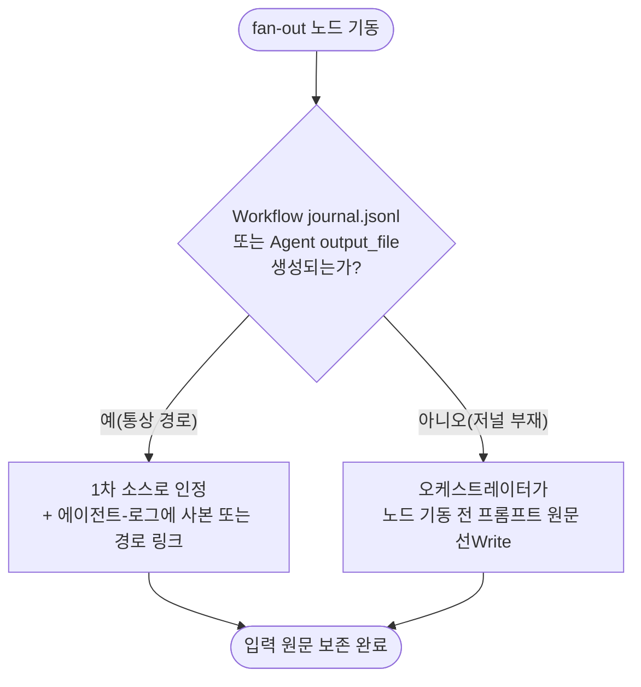

# 에이전트 로그 구조

**TL;DR**: 비단순 처리 fan-out 시 오케스트레이터 사고과정·노드 입출력 원문·위임 설계 근거를 작업 폴더 `에이전트-로그/`에 git-tracked로 보존하는 규약. 핵심 3파일은 `00_오케스트레이터-입력.md`(원본 입력+요구 해석+위임 근거)·`NN_<역할>.md`(노드 결과 전문)·`인덱스.md`이며, 노드 입력 원문은 `Workflow`/`Agent` 자동 저널을 1차 소스로 재사용해 저비용 구조를 유지한다.

## 1. 목적·범위

비단순 처리 fan-out(다중 서브에이전트 위임)이 발생하면, `에이전트-로그/`는 그 오케스트레이션의 **git-tracked 감사 기록(audit trail)**이 된다. 다음 세 가지를 영구 보존하는 것이 목적이다.

- **요구_1 사고과정** — 오케스트레이터가 무엇을 왜 이렇게 분해·위임했는가
- **요구_2 입출력 원문** — 각 노드가 실제로 무엇을 받고 무엇을 반환했는가
- **요구_3 위임 설계 근거** — 왜 이 노드 수·이 패턴·이 모델/effort인가

세 요구는 각각 §3(`00` 파일)·§4~§5(`NN` 파일 + 자동 저널)로 구현된다. 요구_1과 요구_3은 "왜 이렇게 분해했는가"라는 같은 질문의 두 표현이라 §3에서 **하나의 서술로 통합**한다.

### 1.1 하네스 자동 저널과의 역할 분리

`Workflow`·`Agent` 도구로 노드를 기동하면 하네스가 노드 입출력 원문을 **이미 자동으로** 보존한다. 그런데도 본 규약이 별도로 필요한 이유는 아래 표의 차이 때문이다.

| 축 | 하네스 자동 저널 | `에이전트-로그/` (본 규약) |
|---|---|---|
| 위치 | `.claude/projects/` 아래(세션 스코프) | 작업 폴더 하위, git-tracked |
| 보존 범위 | 노드 입출력 원문(자동·verbatim) | 사고과정 + 노드 결과 전문 + 위임 설계 근거 |
| 영속성 | 로컬 세션 종료 후 큐레이션 없음, 클론 시 소실 | 커밋되어 영구 보존, 클론·공유 시 함께 이동 |
| 오케스트레이터 사고과정 | 자동 포착 불가 — 응답 텍스트에 일시 존재하다 세션 종료와 함께 휘발 | **본 규약의 고유 가치** — git-tracked 로그가 유일한 보존처 |

> [!NOTE]
> 요구_2(입출력 원문)는 `Workflow`/`Agent` 도구를 쓰는 것만으로 하네스가 상당 부분 자동 충족한다(§5). 반면 요구_1(사고과정)은 하네스가 원천적으로 포착할 수 없는 정보라, 본 규약에서 **가장 대체 불가능한 부분**이다.

### 1.2 적용 범위

본 규약은 [`오케스트레이션.md §2`](오케스트레이션.md)의 4대 패턴(parallel·pipeline·loop-until-dry·adversarial-verify) 중 하나가 성립하는, 즉 **2개 이상 노드가 얽히는 fan-out**에 의무 적용한다. 단일 노드 1회 위임(전면 위임 정책상 단순 lookup도 서브에이전트로 가지만, 그 자체는 오케스트레이션 구조가 아니다)은 본 규약 대상이 아니다.

## 2. 폴더·파일 구조

```
tasks/<모듈>/YYYYMMDD_HHmm_<작업슬러그>/
├── 요구사항.md
├── 분석.md
├── 계획.md
├── 이력 및 결과.md
└── 에이전트-로그/                  (본 규약)
    ├── 00_오케스트레이터-입력.md    원본 입력 + 요구 해석 + 위임 설계 근거 (§3)
    ├── NN_<역할·페르소나>.md       노드별 결과 전문 — 노드가 직접 Write (§4)
    ├── 인덱스.md                   노드 목록·모델·effort·수렴 포인터 (§7)
    └── (선택) 저널 사본/링크        Workflow journal.jsonl · Agent output_file (§5)
```

- **99 수렴 파일은 두지 않는다** — fan-in 종합 결론을 별도 파일로 만들지 않고, 작업 폴더의 `분석.md`/`계획.md`가 그 역할을 흡수한다(Sound1 관행 계승). `인덱스.md`의 수렴 포인터(§7)가 그 절로 링크한다.
- `에이전트-로그/`는 작업 폴더 평탄 유지 원칙([`문서/폴더-구조.md §3`](../문서/폴더-구조.md))의 명시적 예외다 — fan-out 노드 수가 가변적이라 첨부파일 prefix 관행(`첨부_<단계>_<제목>`)만으로는 담을 수 없어 전용 서브폴더를 둔다.

## 3. `00_오케스트레이터-입력.md` 양식

fan-out 전 오케스트레이터가 직접 Write한다(서브에이전트 활용.md §1.1의 "위임 설계용" 산출물). 요구_1과 요구_3을 하나로 통합한 서술이 이 파일의 핵심이다.

````markdown
---
name: 오케스트레이터 입력 — <작업 슬러그>
purpose: <이번 fan-out 노드들의 공통 컨텍스트 + 위임 설계 근거>
type: tasks/에이전트-로그
applies_to: [<모듈 스코프>]
tags: [<모듈>, orchestration]
---

# 오케스트레이터 입력

**TL;DR**: <N개 노드 fan-out — 무엇을 위해·어떤 패턴으로>

## 원본 입력

> <은수님 원문 verbatim — 그대로 인용>

## 요구 해석

<오케스트레이터 1인칭 서술: 무엇을 원하는가, 모호점은 어떻게 해소했는가>

## 위임 설계 근거

- [ ] 왜 이 분해(N개 노드)인가 — <근거 1문장 이상>
- [ ] 어떤 패턴(`워크플로우 오케스트레이션.md §2` 4대 중 택1)·왜 — <parallel/pipeline/loop-until-dry/adversarial-verify 중 선택 + 근거>
- [ ] 모델·effort 배분·왜 — <통상 Sonnet · max, 예외 시 근거>

## 역할 배분표

| 노드 | 역할·페르소나 | 담당 관점 | 모델 · Effort |
|---|---|---|---|
| 01 | <역할명> | <관점> | Sonnet · max |
| 02 | <역할명> | <관점> | Sonnet · max |
````

> [!IMPORTANT]
> 위임 설계 근거 체크박스는 표시만으로 끝내지 않는다 — 각 항목 뒤에 **최소 1문장 근거**를 채워야 유효하다(빈 체크는 미완료로 간주). 형식적 빈 껍데기로 전락하는 것을 막기 위함이다.

`## 역할 배분표`는 fan-out **전** 계획(의도)이고, `인덱스.md`(§7)의 노드 목록은 fan-out **후** 실적이다 — 둘이 다르면(노드 실패·병합 등) 그 차이 자체가 기록 가치가 있다.

## 4. 노드 로그 `NN_<역할>.md`

각 노드가 자기 결과 전문을 **자기 파일에 직접 Write**한다(현행 관행 추인). 오케스트레이터가 사후에 옮겨 적지 않는다.

> [!IMPORTANT]
> **위임 프롬프트 표준 문구 (누락 재발 방지)**: 노드가 자기 파일에 Write하려면 오케스트레이터가 **위임 프롬프트에 그 지시를 반드시 명시**해야 한다. 지침에만 있고 프롬프트에 반영하지 않으면 노드는 로그를 남기지 않는다 — 2026-07-13 헌법·지침 구조개편 fan-out에서 37노드 로그가 누락되고 첨부 JSON으로 우회된 실사례가 있다. fan-out 위임 프롬프트에 아래를 **표준 문구로 박는다**:
> > "완료 후 처리 결과를 `docs/tasks/<모듈>/<작업>/에이전트-로그/NN_<역할>.md`에 직접 Write하라 — frontmatter(name·`type: tasks/에이전트-로그`·tags) + TL;DR + 결과 전문."

- **번호**: 2자리 zero-pad(`01`~`98`). 단일 단계 fan-out은 01부터 순차 부여한다. 조사·계획·검증처럼 **복수 단계가 섞인 fan-out**은 십의 자리로 단계를 구분한다 — `0X`=조사·분석, `1X`=계획·설계, `2X`=검증(예: `01_분석_변수구조.md`~`05_분석_진입시퀀스.md`, `11_계획_통합설계.md`, `21_검증_동작보존.md`~`22_검증_스타일정합.md`).
- **역할명**: 언더스코어로 세분 가능(예: `01_분석_변수구조.md` = 역할 `분석` + 세부주제 `변수구조`).
- **입력 프롬프트 원문은 여기 담지 않는다** — §5의 자동 저널이 대체한다.
- **모델·effort는 여기 반복 기재하지 않는다** — `인덱스.md`(§7)가 유일한 기록처다(중복 드리프트 방지).

````markdown
---
name: <역할명> — <이번 노드 임무 한 줄>
purpose: <이 노드가 조사·판단·산출한 것>
type: tasks/에이전트-로그
applies_to: [<모듈 스코프>]
tags: [<모듈>, <역할 성격>]
---

# NN_<역할> — <제목>

**TL;DR**: <노드 결론 1~2줄>

<결과 전문 — 표·목록·코드 인용 등 내용에 맞는 형식으로 직접 구성한다>

```c
/* 코드 인용이 필요하면 이렇게 일반 triple-backtick fenced block을 그대로 사용한다 */
```
````

## 5. 입출력 원문 보존

**출력**(노드 결과 전문)은 §4의 `NN` 파일이 이미 그 자체로 원문이다. 본 절은 **입력**(위임 프롬프트 원문) 보존을 규정한다.

1. **저널 우선(기본)** — `Workflow` 또는 `Agent` 도구로 노드를 기동하면 프롬프트·반환 전문이 하네스에 자동·verbatim 보존된다(§1.1). 이를 **입력 원문의 1차 소스로 인정**하고, `NN` 파일에 프롬프트를 다시 옮겨 적지 않는다.
2. **큐레이션(사본 또는 링크)** — 저널은 git 미추적 위치라 클론·공유 시 소실된다. 작업 완료 시 저널 파일을 `에이전트-로그/`에 **사본으로 복사**하거나, 용량이 크면 원본 절대경로를 1줄 텍스트로 남긴 링크 파일을 둔다.
3. **선Write(저널 부재 시만)** — 저널이 생성되지 않는 경로로 노드를 기동했다면, 오케스트레이터가 **노드 기동 직전** 위임 프롬프트 원문을 `00_오케스트레이터-입력.md` 또는 해당 `NN_<역할>.md`에 먼저 Write한다.



> [!NOTE]
> 노드 라벨 안전 규칙(따옴표 감쌈·`<br/>` 줄바꿈)은 [`문서/작성-스타일.md §4.5`](../문서/작성-스타일.md)를 따른다.

## 6. fan-in 이원화 원칙

"로그 파일에는 원문을 남기면서, 메인 컨텍스트로는 3줄만 반환한다"는 서로 다른 두 층위라 fan-in 컨텍스트 예산과 **충돌하지 않는다**.

| 층위 | 무엇 | 예산 | 근거 |
|---|---|---|---|
| 메인 컨텍스트 반환(fan-in) | 노드 → 오케스트레이터로 돌아오는 대화 반환값 | 최대 3줄(200자) | fan-in 컨텍스트 폭발 방지 |
| 디스크 로그(본 규약) | 노드 → 자신의 `NN_<역할>.md` 파일 Write | 결과 전문, 상한 없음 | 사후 감사·재현 |

> [!IMPORTANT]
> 노드가 `NN_<역할>.md`에 결과 전문을 Write하는 행위는 **메인 세션의 대화 토큰을 소비하지 않는다** — 서브에이전트 자신의 도구 호출이라 오케스트레이터의 컨텍스트 윈도우에는 "Write 완료" 같은 짧은 도구 결과만 노출된다. 메인으로 돌아오는 반환값만 3줄로 제한하면 예산은 그대로 지켜진다.

이 원칙은 [`활용.md §2.3`](활용.md)·[`오케스트레이션.md §4`](오케스트레이션.md)에도 한 문장씩 명문화된다(§9).

## 7. `인덱스.md` 양식

fan-out 완료 후 오케스트레이터가 작성한다. `00`의 역할 배분표(§3)가 **계획**이라면, 이 표는 **실적**이다.

````markdown
---
name: 에이전트 로그 인덱스 — <작업 슬러그>
purpose: <N>노드 fan-out 산출물 인덱스
type: tasks/에이전트-로그
applies_to: [<모듈 스코프>]
tags: [<모듈>, orchestration, index]
---

# 에이전트 로그 인덱스

<1줄 요약 — 예: Workflow `<run 이름>`(N노드·약 XXXK 토큰·약 M분, sonnet·effort max)>

| 노드 | 역할 | 모델 · Effort | 결과 요지 |
|---|---|---|---|
| [00](00_오케스트레이터-입력.md) | 오케스트레이터 입력 | — | <공통 컨텍스트 1줄> |
| [01](01_<역할>.md) | <역할명> | Sonnet · max | <결론 1~2줄> |

## 수렴 포인터

<이번 fan-out 결론이 반영된 작업의 `분석.md` 또는 `계획.md` 절 링크>
````

- **토큰**은 노드별이 아니라 표 상단 1줄 요약에 합계로 기재한다(Workflow가 노드 단위 세분 토큰을 항상 제공하지는 않는다).
- **모델·Effort** 열은 [`활용.md §3.1`](활용.md)의 표기(`Sonnet · max` / `Sonnet · Agent-폴백(effort 미지원)`)를 그대로 쓴다.
- **수렴 포인터**는 필수 섹션이다 — 반드시 작업의 `분석.md`/`계획.md` 중 이번 fan-out 결론이 반영된 절로 링크한다. 섹션 제목은 `## 수렴 포인터`를 기본으로 하되, 내용을 구체화한 제목(예: `## 최종 계획 반영 사항`)으로 대체할 수 있다.

## 8. rules 하네스 §2와의 관계

본 규약의 폴더·파일 구조는 개인 rules 하네스(이 저장소 밖 별도 시스템, `AI운영/에이전트-로그-구조.md §2`)의 선례를 기반으로 본 워크스페이스의 작업 프로세스에 맞게 조정한 것이다. rules 하네스는 `process-guard.py`/`tasks-guard.py`가 강제하는 **별도의 독립 헌법 체계**이며, 본 지침은 그것을 대체하지 않는다.

| 항목 | rules 하네스 §2 (참조 선례) | 본 규약 |
|---|---|---|
| 실행 단위 폴더 | `단계_N-YYMMDD-HHMM-<목적>/` 타임스탬프 서브폴더 | flat — 작업 폴더 자체가 이미 시간적으로 고유(§2) |
| 수렴 파일 | `99_오케스트레이터-수렴.md` 별도 파일 | 미사용 — `분석.md`/`계획.md`가 흡수, `인덱스.md` 수렴 포인터로 연결(§2·§7) |
| 노드 입력 원문 | `NN-<페르소나>.md` 내 `<details>` 임베드 | 미기재 — `Workflow`/`Agent` 자동 저널을 1차 소스로 재사용(§5) |
| 강제 메커니즘 | 도구(`process-guard.py` 등) 강제 | 본 문서 — 도구 강제 없음, 자체 규율 |

> [!NOTE]
> rules 하네스 §3.2도 `<details>` 원문 보존을 규정하지만, 실사례에서 프롬프트 절이 생략되고 반환이 "요지"로 축약된 전례가 있다. 본 규약은 손으로 옮겨 적을 원문 자체를 줄여(저널 재사용) 같은 축약을 구조적으로 방지하려는 설계다.

## 9. 관련 지침

| 지침 | 관련 절 | 관계 |
|---|---|---|
| [`활용.md`](활용.md) | §1.1 오케스트레이터가 직접 하는 일 | "오케스트레이터 사고과정"(요구_1)의 근거 조항 — `00_오케스트레이터-입력.md`가 그 산출물 |
| [`활용.md`](활용.md) | §2.3 fan-in 컨텍스트 예산 | §6 이원화 원칙의 한 축(메인 반환 3줄) |
| [`오케스트레이션.md`](오케스트레이션.md) | §2 4대 오케스트레이션 패턴 | `00_오케스트레이터-입력.md` 위임 설계 근거 체크리스트의 "어떤 패턴" 항목이 참조(§3) |
| [`오케스트레이션.md`](오케스트레이션.md) | §4 fan-in 컨텍스트 예산 | §6 이원화 원칙의 다른 한 축(오케스트레이션 맥락 요약) |
