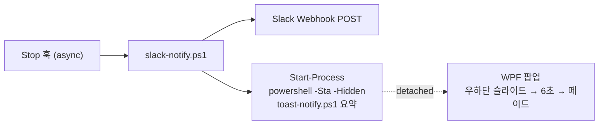

# 완료 알림 팝업 (우하단 커스텀 토스트)

**TL;DR**: 작업 완료(Stop 훅) 시 `slack-notify.ps1`이 Slack DM을 보내는 동시에 `toast-notify.ps1`을 detached로 띄워 **화면 우하단에 웜 페이퍼(크림 베이지+테라코타) WPF 팝업**을 6초간 표시한다. Slack 앱 기본 토스트는 색 커스텀이 불가해 별도 커스텀 창(WPF)을 쓴다. 색은 `지침/문서/테마 토큰.md` SSOT. 모든 실패는 silent.

## 왜 커스텀 팝업인가

Slack 데스크톱 앱이 띄우는 OS 토스트는 **배경색·모양을 앱과 Windows가 통제**해 크림 베이지로 바꿀 수 없다. 그래서 Slack DM(폰·기록용)은 유지하면서, PC에는 별도로 색을 완전 제어할 수 있는 **WPF 커스텀 창**을 띄운다.

## 구성 요소 (Project scope, git 추적)

| 요소 | 위치 | 역할 |
|---|---|---|
| 팝업 스크립트 | [`../../tools/toast-notify.ps1`](../../tools/toast-notify.ps1) | WPF 우하단 토스트(슬라이드→6초→페이드) |
| 연동 | [`../../tools/slack-notify.ps1`](../../tools/slack-notify.ps1) | Slack POST + 팝업 detached 기동 |
| 훅 배선 | `.claude/settings.json` → `Stop` 훅 | 응답 종료 시 `slack-notify.ps1` 호출(`async:true`) |

## 동작

- `slack-notify.ps1`이 추출한 요약을 인자로 `toast-notify.ps1`에 전달 → 팝업 타이틀 "작업 완료" + 요약 표시.
- 팝업은 **자식 프로세스로 분리**되어 훅을 붙잡지 않는다(6초 표시는 팝업 프로세스가 독립 수행).
- WPF는 **STA 필수** → `powershell.exe -Sta`로 기동. 콘솔은 `-WindowStyle Hidden`으로 숨김.

## 디자인 (시안 변형 B)

- 크림 베이지 카드(`#FBF7EE`), 테두리 `#E2D5BC`, 잉크 텍스트 `#33291C`.
- 테라코타 글로우 아이콘 원(`#C15F3C` 방사 그라디언트) + **Claude sunburst**(폰트 무관 벡터 `Path`, 12-포인트 별).
- "Claude Code" 라벨·시각·타이틀·요약 2줄·하단 진행 바(남은 시간 카운트다운).
- 폰트 `Segoe UI, Malgun Gothic`. 라이트 단일톤(웜 페이퍼 정책 [`../문서/테마 토큰.md §6`](../문서/테마%20토큰.md)).

## 커스터마이징

- **표시 시간**: `toast-notify.ps1` 호출 시 `-Seconds N`(기본 6, 허용 2~30). 상시 변경은 `slack-notify.ps1`의 Start-Process 인자에 `'-Seconds','N'` 추가.
- **색·레이아웃**: `toast-notify.ps1` 내 XAML의 hex를 수정(테마 토큰 SSOT와 동기 권장).
- **문구**: 타이틀 기본 "작업 완료", 요약은 transcript 추출값.

## 트러블슈팅

- **파일 인코딩(중요)**: PowerShell 5.1은 **BOM 없는 UTF-8 스크립트의 한글을 시스템 코드페이지로 오독**해 구문/표시가 깨진다. `toast-notify.ps1`은 반드시 **UTF-8 BOM**으로 저장한다(편집 후 BOM 유지 확인).
- **팝업이 안 뜬다**: ① 수동 트리거로 격리 확인 — `powershell -Sta -NoProfile -File tools/toast-notify.ps1 "테스트" -Seconds 6`. ② 모든 실패는 silent(exit 0)이므로, 에러는 `TOAST_LOG` 환경변수로 로그를 남겨 진단할 수 있게 코드가 설계됨(임시 진단용, 평상시 미설정).
- **스크린샷에 안 잡힌다**: `AllowsTransparency=True` 투명 WPF 창은 **GDI 화면 캡처(BitBlt)에 누락**된다 — 창이 안 뜬 게 아니다. 실제 렌더 확인은 창 자체 `RenderTargetBitmap`으로 한다.
- **다른 알림과 겹침**: 우하단 고정이라 Slack/카카오톡 등 OS 토스트와 위치가 겹쳐 보일 수 있다(초기 버전은 스택 관리 없음).
- **stdin hang**: `slack-notify.ps1`은 `[Console]::In.ReadToEnd()`로 훅 JSON을 읽으므로, 대화형에서 `&`로 직접 부르면 EOF 대기로 멈춘다 — 테스트는 **자식 프로세스(Start-Process)로 실행**한다.

## 관련

- [`Slack 알림.md`](Slack%20알림.md) — Slack DM 알림(팝업과 같은 훅에서 병행)
- [`../문서/테마 토큰.md`](../문서/테마%20토큰.md) — 색·타이포 SSOT
- 작업 기록: `docs/tasks/설정/20260714_커스텀-알림-팝업/`
