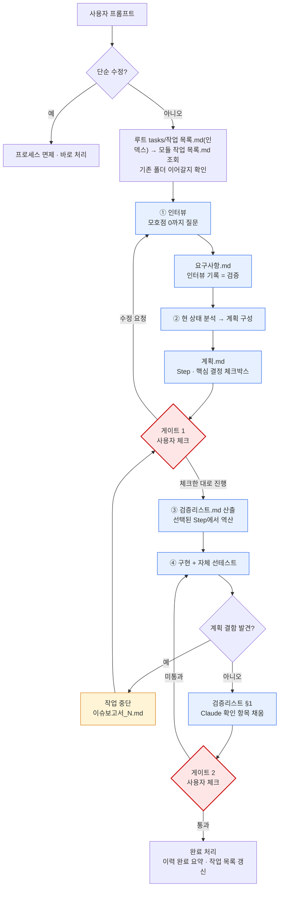

# 작업 프로세스 (4단계 2게이트) 및 이력 및 결과 문서

**TL;DR**: ① 인터뷰·요구사항 → ② 분석·계획 → **[게이트 1] 계획서 체크박스** → ③ 검증리스트 산출 → ④ 구현·자체 선테스트 → **[게이트 2] 검증리스트 체크**. 검증은 Claude가 스스로 «통과»라고 적는 문서가 아니라 **은수님이 체크하는 자리**다. 상시 산출물은 `요구사항.md`·`계획.md`·`검증리스트.md`·`이력 및 결과.md` **4종**이며, 계획 결함이 드러나면 중단하고 `이슈보고서_N_<주제>.md`를 낸다. 검증 문서를 없애도 **§3 규율 4가지는 남는다** — 근거 귀속·실패 시나리오·전수 영향 조사·자체 선테스트.

## 1. 4단계 2게이트 프로세스

산출은 넷, 사용자 확인은 둘이다. **게이트는 은수님이 체크박스로 통과시킨다** — Claude의 자체 점검 문서가 게이트를 대신하지 않는다.

### 1.1 흐름



### 1.2 단계 정의

| 단계 | 이름 | 산출물 | 핵심 질문 | 검증 방식 |
|---|---|---|---|---|
| ① | 인터뷰·요구사항 | `요구사항.md` | 사용자가 무엇을 원하는가? 왜? | **인터뷰 기록 자체** (§1.5) |
| ② | 분석·계획 | `계획.md` | 지금 어떤 상태이고 어떻게 바꿀 것인가? | 근거 열 + 실패 시나리오 (§3) |
| — | **게이트 1** | (체크된 계획서) | 이 계획대로 갈 것인가? | **사용자 체크박스** (§4.1) |
| ③ | 검증리스트 산출 | `검증리스트.md` | 무엇을 확인해야 끝난 것인가? | 선택된 Step에서 역산 |
| ④ | 구현·자체 선테스트 | 실제 코드·문서·설정 변경 | 계획대로 되었는가? | Claude 자체 테스트 → 자가 수정 (§3.4) |
| — | **게이트 2** | (체크된 검증리스트) | 정말 끝났는가? | **사용자 체크박스** (§4.2) |
| 예외 | 중단 | `이슈보고서_N_<주제>.md` | 계획의 어디가 틀렸는가? | 사용자 체크 후 재개 (§5) |

### 1.3 산출물 파일명

| 산출물 | 파일명 | 표준 양식 | 비고 |
|---|---|---|---|
| 요구사항 | `요구사항.md` | [양식/요구사항.md](../../문서/양식/요구사항.md) | 의무. **§인터뷰 기록 절 필수** |
| 계획 | `계획.md` | [양식/계획.md](../../문서/양식/계획.md) | 의무. 분석을 흡수한다(별도 `분석.md` 없음). 코딩 작업의 `구현계획.md`는 alias로 호환 |
| 검증리스트 | `검증리스트.md` | [양식/검증리스트.md](../../문서/양식/검증리스트.md) | 의무. **게이트 1 통과 직후** 산출 |
| 이력 및 결과 | `이력 및 결과.md` | [양식/이력 및 결과.md](../../문서/양식/이력%20및%20결과.md) | 의무. **단계 ① 시작과 동시에 생성** |
| 이슈보고서 | `이슈보고서_N_<주제>.md` | [양식/이슈보고서.md](../../문서/양식/이슈보고서.md) | 조건부. 계획 결함 발견 시만 (§5) |

> [!TIP]
> 신규 작업 시작 시 [`양식/`](../../문서/양식/) 폴더의 양식을 작업 폴더에 복사해 사용한다. 각 양식은 `<...>` placeholder + frontmatter를 갖춘 풀 템플릿이다.

### 1.4 위치

- 작업 폴더: `docs/tasks/<모듈>/YYYYMMDD_HHmm_<작업슬러그>/` (`HHmm` = 24시간제 00~23시·분, 작업 시작 시각. 2026-08-05~)
- 스코프(루트 vs 프로젝트)는 작업이 영향을 미치는 변경 파일의 경로로 결정 (Git 작업 스코프와 일치, [`../../Git/브랜치, 병합 규칙.md`](../../Git/브랜치,%20병합%20규칙.md) 참조)

### 1.5 ① 인터뷰가 곧 요구사항 검증이다

프롬프트를 받으면 **바로 요구사항 문서를 쓰지 않는다.** 먼저 무엇을 요구하는지 판단하고, **모호점이 없어질 때까지 질문**한 뒤 그 문답을 요구사항 문서로 정리한다.

- **종료 조건**: **모호점 0 + 수용 기준을 쓸 수 있는 상태.** 수용 기준(§요구사항 §4)을 스스로 작성할 수 있으면 충분히 물은 것이다
- **형식**: 이분 선택이면 yes/no, 다항이면 선택지 제시. 답에 따라 후속 질문이 갈리면 **1~2문씩 라운드로 좁힌다** ([`../명령 해석 규칙.md`](../명령%20해석%20규칙.md))
- **기록**: 질문·답변·확정 사항을 `요구사항.md` §인터뷰 기록에 표로 남긴다. **이 절이 요구사항 검증을 대신한다** — 사용자 답변이 곧 근거이므로 Claude가 스스로 «통과»라고 적는 문서보다 정직하다
- **면제**: 사용자가 *"바로 해"*·*"알아서 해"*라고 명시하면 본 작업 한정으로 인터뷰를 생략한다. 단 그 사실을 요구사항 문서에 적는다

## 2. 이력 및 결과 문서 (시계열 로그 + 완료 요약)

> [!NOTE]
> 2026-05-15 Task α 이후 `이력 및 결과.md` 단일 파일로 통합, 2026-05-18 Package C에서 명명 변경. 작업 시작 시점부터 진행 중 시계열로 누적하다가 완료 시 요약 섹션을 추가한다. 시계열 로그가 곧 진행상황, 완료 요약이 곧 결과다.

### 2.1 의무·생성 시점

- 프로세스 적용 작업에 **의무**. 단계 ① 작성과 **동시에** 생성한다
- 단순 수정 면제 작업은 자동 면제

### 2.2 갱신 시점

- 단계 진입·종료, **게이트 통과·반려** — `## 단계 진척` 표 갱신
- 결정 사항·이슈·차단 발생·해소, **정정** — `## 시계열 로그`에 한 줄 추가
- 작업 완료 시 — `## 완료 요약` 섹션 추가 (기간·병합 SHA·무엇을·왜·후속)

> [!IMPORTANT]
> **정정은 지우지 않고 남긴다.** 앞 단계에 적은 사실이 틀렸다면 그 줄을 고치는 데서 끝내지 말고 시계열 로그에 «무엇이 어떻게 틀렸고 왜 그랬는지»를 적는다. 같은 실수의 재발을 막는 것은 정정 자체가 아니라 그 기록이다.

### 2.3 형식 (최소 골격)

```markdown
---
name: 이력 및 결과 — <작업명>
purpose: <작업 1줄 요약 (50자 이내)>
type: tasks/이력
applies_to: [...]
tags: [..., 상태:진행|완료]
---

# 이력 및 결과: <작업명>

**TL;DR**: 현재 단계 + 다음 동작 한 줄. (완료 후: 최종 결과 한 줄로 교체)

## 단계 진척

| 단계 | 산출물 | 상태 | 일시 |
|---|---|---|---|
(①②·게이트 1·③④·게이트 2 — 6행)

## 시계열 로그

| 시각 | 이벤트 |
|---|---|

## 완료 요약 (작업 종료 시 추가)

**기간:** YYYY-MM-DD ~ YYYY-MM-DD
**병합:** `<대상 브랜치>` ← `<작업 브랜치>` (`<merge SHA>`)
**연계 작업:** → [...](...) (없으면 생략)

### 무엇을 했는가
한 단락 — 결과물 중심으로.

### 핵심 결정
- 왜 이렇게 했는지 — 대안 대비 선택 이유 (1~3개)

### 후속 영향
- 추가 작업 / 지침 갱신 등 (없으면 생략)
```

## 3. 규율 — 검증 문서를 폐지해도 남는 것

> [!CAUTION]
> **문서를 없애는 것과 규율을 없애는 것은 다르다.** 구 체계의 자체검증 4종은 폐지됐지만, 그것이 실제로 잡아내던 장치는 아래 넷으로 이전됐다. **이 넷이 빠지면 산출물만 줄고 추측이 늘어난다.**

### 3.1 근거 귀속 — 사실 주장에는 `파일:라인`

`계획.md` §현 상태 분석·§영향 범위의 **모든 사실 주장에 근거를 동반**한다.

- 근거는 `파일:라인` 또는 명령 출력이다. **Read/Grep으로 실제 확인하지 않고 인용하지 않는다**
- 확인하지 못한 것은 `(미확인)` 마커를 달고 그대로 둔다. 추측을 사실처럼 적지 않는다
- 인용한 근거를 **한 번 더 대조하는 재확인 패스**를 돌린다 — 라인 번호는 편집으로 쉽게 어긋난다
- root cause·설계 결정은 **가설 최소 3개 cross-check**

### 3.2 실패 시나리오 — "왜 이 계획이 틀릴 수 있는가"

`계획.md`에 **§실패 시나리오 절을 반드시 둔다.** 최소 1건, 각 항목은 «시나리오 · 징후 · 대비» 세 축으로 적는다.

징후를 적는 이유는 구현 중에 그 징후가 보이면 **§5 중단 프로토콜로 넘어가기 위해서**다.

### 3.3 전수 영향 조사 — 패턴을 좁게 잡지 않는다

경로·파일명·용어를 바꾸는 계획은 **영향받는 참조를 Grep으로 전수 첨부**한다. 이동으로 상대링크 깊이가 바뀌면 이동 전/후 hop 수를 나란히 적는다.

> [!IMPORTANT]
> **조사 패턴에 다음을 모두 포함한다.**
>
> | 축 | 예 |
> |---|---|
> | 명칭 | `8단계`, `4단계 2게이트` |
> | 산출물 파일명 | `분석.md`, `구현-검증.md` |
> | **단계 번호 기호** | `단계 ⑦`, `①~⑧` |
> | **양식·문서 링크** | `양식/검증.md`, `작업-프로세스.md §4` |
>
> 한 패턴으로 부족하면 **축을 나눠 두 번 돌린다.** 실측 사례 — 명칭·파일명만으로 조사했다가 프로세스를 **번호로만** 참조하던 `서브에이전트/오케스트레이션.md` 12곳을 통째로 놓쳤다 (§7.1).

### 3.4 자체 선테스트 — 구현 후 스스로 먼저 돌린다

④ 구현 직후, **검증리스트 §1의 Claude 확인 항목을 스스로 채운다.** 기계적으로 확인 가능한 것은 전부 여기에 속한다.

- 빌드·테스트 통과, 잔존 표현 `grep` 0, 결정론적 링크체커 [`tools/check-links.ps1`](../../../tools/check-links.ps1), 신규 문서 frontmatter·TL;DR
- 이동·개명 직후엔 **구 경로 리터럴 전역 Grep 0** 확인 (과거 `docs/tasks/**` 스냅샷 제외)
- **문제를 찾으면 사용자에게 넘기기 전에 스스로 고친다.** 고친 사실은 이력에 남긴다
- 대규모 변경은 저술↔검증 노드를 분리해 adversarial-verify로 강화한다 (§6, [서브에이전트 오케스트레이션](../../서브에이전트/오케스트레이션.md))

## 4. 게이트 — 사용자 체크박스

게이트는 **둘뿐**이고, 둘 다 사용자가 체크박스로 통과시킨다. 그 사이 단계는 Claude가 책임진다.

> [!CAUTION]
> **체크 항목은 표가 아니라 리스트(`- [ ]`)로 쓴다.** GFM은 리스트 항목의 `- [ ]`만 체크박스로 렌더링한다 — 표 셀에 넣은 `[ ]`는 그냥 글자라서 **사용자가 클릭할 수 없다.** 근거·방법은 항목 뒤에 `—`로 이어 붙이고, 서술이 길면 별도 절에 표로 정리한다. 게이트가 걸리는 곳(`계획.md` §실행 계획·§핵심 결정, `검증리스트.md`, `이슈보고서.md` §선택지)은 **전부 리스트여야 한다.**

### 4.1 게이트 1 — 계획서 체크

`계획.md`를 산출한 뒤 사용자 검토를 요청한다. 체크 대상은 **둘**이다.

| 절 | 체크 형식 | 의미 |
|---|---|---|
| **§실행 계획** | Step 단위 `- [ ]` | `[x]` = 이번에 실행, `[ ]` = 이번엔 안 함 |
| **§핵심 결정** | 선택지 중 하나 | 갈리는 지점에서 방향을 고른다 |

- 선택 여지가 없는 Step은 **`[필수]` 표기 + 기본 체크**해 둔다. 사용자가 해제하면 **영향을 다시 보고**한 뒤 판단을 받는다
- 선택 여지가 있는 Step은 `[선택]`으로 표기한다. **`[선택]`이 하나도 없는 계획서는 체크할 이유가 없는 계획서다** — 갈릴 수 있는 지점을 성실히 찾아 제시한다
- 핵심 결정에는 **권장안과 그 근거**를 함께 적는다. 근거 없는 선택지 나열은 판단을 사용자에게 떠넘기는 것이다
- 통과 신호는 *"체크한 대로 진행해"* 또는 동등한 지시다. 체크가 권장안과 다르면 **그대로 따른다** — 사용자가 근거를 보고 내린 결정이다

### 4.2 게이트 2 — 검증리스트 체크

④ 구현과 자체 선테스트를 마치고 §1을 채운 뒤 사용자에게 §2 체크를 요청한다.

| 절 | 채우는 사람 | 내용 |
|---|---|---|
| **§1 Claude 확인** | Claude (구현 직후) | 기계적으로 확인 가능한 것 — 빌드·테스트·grep·링크체크·메타 |
| **§2 사용자 확인** | 사용자 (게이트 2) | **실제로 써 보거나 읽어 봐야 아는 것** — 실기 동작·체감·의도 부합 |

- §2에는 **Claude가 확인할 수 없는 것만** 남긴다. 제가 돌릴 수 있는 검사를 사용자에게 넘기지 않는다
- 미통과 항목이 나오면 **사유에 따라 나눈다**

| 사유 | 처리 |
|---|---|
| **구현 실수** (오타·누락·링크 오류) | Claude가 고치고 **해당 항목만** 재체크 요청 |
| **계획 자체 결함** (설계가 틀림) | §5 중단 프로토콜 — 이슈보고서 |

### 4.3 면제

- **단순 수정**(오타·설정값·자명한 한 줄)은 프로세스 전체 면제
- 사용자가 *"검토 게이트 건너뛰고 바로 구현해"*처럼 **게이트를 직접 지목해** 면제한 경우에 한해 게이트를 생략한다. *"알아서 해"*·*"stop 없이 진행"*은 **인터뷰(질문) 면제일 뿐 게이트 면제가 아니다**
- [`프로젝트 초기 세팅`](../프로젝트%20초기%20세팅.md) 같은 정형 반복 절차는 별도 면제 사례다

## 5. 중단 프로토콜 — 이슈보고서

구현 도중 **계획 자체가 틀렸음이 드러나면 계속 진행하지 않는다.** 작업을 멈추고 `이슈보고서_N_<주제>.md`를 낸다.

### 5.1 언제 내는가

| 상황 | 이슈보고서 |
|---|---|
| 계획의 전제가 사실과 다름 | **예** |
| 영향 범위가 계획서보다 넓음 | **예** |
| 계획대로 하면 수용 기준을 못 맞춤 | **예** |
| 오타·링크 오류·단순 누락 | 아니오 — 고치고 진행, 이력에 기록 |

### 5.2 무엇을 담는가

- **무엇이 문제인가** — 구체적 파일·라인과 함께
- **왜 놓쳤는가** — 원인. 같은 실패를 막으려면 이 절이 있어야 한다
- **계획대로 진행하면 생기는 일** — 어느 수용 기준이 깨지는지
- **선택지** — 체크 형식. 각각 권장 여부와 근거
- **진행 상태** — 어디까지 했고 파일을 건드렸는지

### 5.3 처리

사용자가 선택지를 체크하면 그 결정대로 재개한다. 범위만 넓어지고 계획 방향이 그대로면 **게이트 1을 다시 받지 않아도 된다** — 다만 그 판단 근거를 이슈보고서에 적는다.

## 6. 서브에이전트 fan-out의 배치

fan-out은 게이트를 **대체하지 않는다.** 게이트를 기준으로 허용 범위가 갈린다.

| 시점 | 허용 | 용도 |
|---|---|---|
| ①② (게이트 1 **전**) | **read-only fan-out만** | 현 상태 조사·영향 범위 전수 탐색·가설 병렬 검증·설계안 비교. 결과를 수렴해 `계획.md`를 쓴다 |
| ④ (게이트 1 **통과 후**) | **쓰기 fan-out 허용** | 구현 분담. 직후 **자체 검증**(저술↔검증 노드 분리)을 거쳐 검증리스트 Claude 열에 반영한다 |

- 파일을 **수정·생성하는 노드의 병렬 기동은 게이트 1 통과 이후**에만 허용한다. 승인 전에 쓰기가 튀어나가면 게이트가 무의미해진다
- fan-out 결과는 **그대로 산출물이 되지 않는다** — 수렴·검증을 거쳐 계획서나 검증리스트에 반영한다
- 2노드 이상 fan-out 시 `에이전트-로그/` 기록이 의무다 ([`../../서브에이전트/로그 구조.md`](../../서브에이전트/로그%20구조.md))
- 상세: [`../../서브에이전트/오케스트레이션.md`](../../서브에이전트/오케스트레이션.md)

## 7. 학습 노트

> [!NOTE]
> 2026-05-18 Package C 이전에는 `docs/회고/작업 진행.md`에 별도 누적. 이제는 본 파일에 흡수.

### 7.1 구 8단계 프로세스 (2026-07-14 ~ 2026-09-02) — 이력

본 프로세스 이전 체계는 **8단계**였다. 산출 4단계 각각 뒤에 자체검증 4단계를 두었다.

```
① 요구사항.md → ② 요구사항-검증.md → ③ 분석.md → ④ 분석-검증.md
→ ⑤ 계획.md → ⑥ 계획-검증.md → 사용자 승인 → ⑦ 구현 → ⑧ 구현-검증.md
```

- **도입** (2026-07-14): 그 이전 4단계에서, 각 산출 뒤 검증을 독립 `<단계>-검증.md`로 정식화. 할루시네이션 억제가 목적이었다
- **효익은 실재했다**: 첫 실적용(2026-07-15 `sound1-지침-이전`)에서 ④ 재확인 패스가 활성 참조 0건을 확인했고, ⑥ 계획 검증이 *"지침만 두면 상기 실패"* 결함을 포착했다
- **그럼에도 폐지한 이유**: 검증이 **Claude 자기 채점**이었고 사용자가 그 문서를 읽지 않았다. 읽는 사람이 없는 게이트는 게이트가 아니라 형식이다. 승인 해상도도 yes/no뿐이라 부분 승인을 표현할 수 없었다
- **효익은 버리지 않았다**: 재확인 패스 → §3.1, 실패 시나리오 → §3.2, 전수 Grep·링크체커 → §3.3·§3.4로 이전

> [!IMPORTANT]
> **이 개편 작업 자체가 새 규율의 필요를 실증했다.** 개편을 계획하면서 영향 범위를 `"8단계\|...-검증"` 패턴으로만 조사해, 프로세스를 **단계 번호로만** 참조하던 `서브에이전트/오케스트레이션.md` 12곳을 통째로 놓쳤다. ④ 구현 진입 직후에야 발견해 중단하고 이슈보고서를 냈다(`docs/tasks/meta/20260902_0912_작업-프로세스-개편/이슈보고서_1_영향범위-누락.md`). §3.3의 «축을 나눠 두 번 돌린다»는 여기서 나왔다.

### 7.2 프로그래밍 전 문서 선행 작성 (2026-04-18)

사용자가 프로그래밍 관련 작업을 지시하면, **코드를 바로 작성하지 않고** 먼저 `요구사항.md`·`계획.md`를 해당 프로젝트의 `docs/tasks/<모듈>/YYYYMMDD_HHmm_<작업>/` 폴더에 작성한다. 사용자가 계획서를 체크해 구현 여부와 범위를 결정한다. **게이트 1 통과 없이 코드 작성을 시작하면 안 된다.**

### 7.3 작업 위치 — 메인 디렉토리 기본, 워크트리는 명시 또는 병렬 이득 시 (2026-04-25)

사용자가 작업을 지시하면 원칙적으로 **메인 워킹 디렉토리(루트 repo 또는 해당 프로젝트 repo)에서 작업 브랜치 전환 방식**으로 진행한다. 사용자의 VSCode 등 IDE가 메인 디렉토리를 열어둔 상태이므로, 워크트리로 격리하면 변경사항을 IDE에서 실시간으로 볼 수 없어 단일 작업에선 비효율적.

**워크트리 사용 조건 (둘 중 하나)**:
1. **사용자 명시 트리거** — *"워크트리에서"*, *"병렬로"*, *"동시에 작업"*, *"백그라운드로"* 등 동의어 포함
2. **Claude 판단 — 진짜 병렬이 이득 명확할 때** — 여러 작업을 동시에 진행하고 완료되는 순서대로 메인 디렉토리에 순차 병합하는 편이 총 소요시간을 크게 줄일 때. 사용자에게 *"워크트리로 병렬 진행할까요?"* 제안 후 동의 얻고 실행

**작업 시작 시 고지**: *"메인 디렉토리에서 `<브랜치명>` 브랜치로 진행하겠습니다"* 또는 *"워크트리로 병렬 진행하겠습니다"*

### 7.4 작업 완료 시그널 및 워크트리 생명주기 (2026-04-24)

작업 중에는 워크트리와 작업 브랜치를 유지하고, 사용자가 명시적으로 **"작업 끝났어. 마무리해"** (또는 동등한 완료 시그널)를 보내기 전까지 자동으로 커밋·병합·워크트리 정리 단계로 넘어가지 않는다.

**How to apply:**
- 작업 단위가 끝난 듯 보여도, 명시적 완료 시그널이 없으면 **커밋하지 않음**
- 중간 저장이 필요하면 사용자에게 *"여기서 커밋할까요?"* 확인 후 진행
- 사용자 시그널 수신 시: 작업 브랜치 커밋 → 병합 전 승인 요청 → 병합 → 워크트리 정리
- 백그라운드 워크트리 에이전트가 작업 완료를 보고해도 동일 원칙

### 7.5 신규 도출물 작성 직후 frontmatter+TL;DR 셀프 체크 (2026-05-07)

새로운 영속 .md 파일을 `Write`로 처음 작성할 때 **frontmatter와 TL;DR 둘 다 포함됐는지** 작성 직후 즉시 셀프 체크한다.

**체크리스트 (Write 직후):**
- [ ] frontmatter (`---` 블록, name·purpose·type 최소)
- [ ] 첫 `#` 헤더 직후 `**TL;DR**:` 1~3줄
- [ ] 의미 한글 라벨 (`Q1`/`H1` 같은 알파벳 약어 금지)

TL;DR은 `purpose`보다 더 구체적·실행 가능한 정보 — 단순 복붙 금지

### 7.6 점검 task의 빈틈은 사용자 명시 트리거로 일괄 소급 (2026-05-07)

문서 정합성 일괄 점검 task가 *점검 기준 자체에 빈틈*이 있는 경우, 그 빈틈을 사용자가 지적했을 때 **재점검·재작업이 아니라 사용자 명시 요청을 트리거로 일괄 소급에 진입**한다. 점진적 소급이 디폴트이지만 사용자 명시 트리거가 있으면 그 즉시 일괄 처리 권한이 열린다.

**How to apply:**
- 점검 task에서 빈틈이 발견되면: (1) 빈틈을 인정 (2) 정책상의 디폴트 처리 방식 안내 (3) 사용자가 일괄 처리를 원할 옵션 제시
- 사용자가 일괄 옵션을 선택하면 "사용자 명시 요청" 트리거 충족 → 일괄 소급 task 신규 시작
- 일괄 소급 task는 **별도 task 폴더**로 분리. 빈틈 보완 task의 이력에 원 점검 task 링크 + 어떤 점검 기준이 누락됐는지 명시

### 7.7 메타 점검은 영역 분할 서브에이전트 병렬로 (2026-05-07)

문서 정합성·인덱스 동기화·링크 무결성 같은 **광범위 메타 점검**은 영역별로 `Explore` 서브에이전트를 분할해 한 응답에 병렬 호출하면 메인 컨텍스트 부담을 크게 낮춘다. 검증된 분할 축: (1) 루트 docs frontmatter·인덱스 / (2) 모든 .md 링크 무결성 / (3) 각 프로젝트 표준 준수.

**How to apply:**
- 점검 차원이 3개 이상이면 분할 후보
- 각 서브에이전트 프롬프트에 출력 형식을 체크리스트·표로 강제 (자유 서술 금지)
- 메인은 발견된 항목을 `계획.md` §현 상태 분석에 수합한 뒤 git 스코프 별로 처리 가능 여부 분리
- **단계 ② 분석에서 가장 효과 큼** (게이트 1 전이므로 read-only fan-out — §6)

### 7.8 같은 파일 다중 Edit은 순차 호출 (병렬 충돌) (2026-05-07)

한 응답에서 **같은 파일에 대해 Edit 도구를 다중 호출하면 string 매치 실패** 위험이 있다. 첫 호출의 변경 결과가 다른 호출의 `old_string`에 반영되지 않아 매치 어긋남이 발생.

**How to apply:**
- 한 파일에 변경할 곳이 여러 개면 다음 중 택일:
  - **(a) 더 큰 영역을 한 번의 Edit으로** — 변경 영역들을 포함하는 큰 블록을 통째 교체
  - **(b) 응답 분리** — 한 응답에 한 파일 한 Edit, 다음 응답에 다음 Edit
  - **(c) 명시 순차** — 의존성이 있다면 한 Edit 결과 확인 후 다음 Edit
- 다른 파일들 사이에는 병렬 Edit 그대로 활용 (충돌 없음)
- Edit 매치 실패 시 즉시 `Read`로 현재 파일 상태 확인 후 정확한 문자열로 재시도

### 7.9 Plan Mode 자동 진입 도입·폐지 (2026-05-14 / 2026-06-17)

actionable task 시작 시 Claude가 `EnterPlanMode`를 **자체 호출**해 Plan Mode로 진입한 뒤 표준 산출물을 작성하고 `ExitPlanMode`로 승인을 받는 흐름을 의무화했으나 **2026-06-17 비활성화**(계획 모드 자동 진입.md 폐지, 2026-07-13 파일 삭제). 현재는 §4 게이트가 승인 장치다.

### 7.10 ExitPlanMode 승인 = plan file 승인 ≠ 정식 산출물 승인 (2026-05-14)

`ExitPlanMode` 호출에 대한 사용자 승인은 **plan file (Claude Code 시스템 임시 경로의 요약본)에 대한 게이트**일 뿐이며, 표준 경로 (`docs/tasks/<모듈>/<작업>/계획.md`)에 정식 작성하는 산출물의 검토 게이트는 **별도**다.

"stop 없이 진행", "알아서 해" 류 지시는 **인터뷰(질문) 면제**이며 **게이트 자체를 면제하지 않는다**(§4.3).

### 7.11 정책 신설 작업의 자기 참조 — 첫 사용 사례 자기 반영 (2026-05-15)

정책·절차·인덱스를 새로 신설하는 작업이 그 신설된 절차·인덱스의 **첫 사용 사례**가 되는 경우, 계획 단계에서 *"자기 적용"* 단락을 의무 추가하고 종료 정리에서 실제 자기 반영을 수행한다. 빠뜨리면 새 절차가 *예외 1건*으로 시작되어 시간이 흐를수록 정합성 누적 손실.

**How to apply:**

- 작업이 **정책 신설·절차 확장·메타 인덱스 신설**에 해당하면 `계획.md`에 자기 적용 검토 섹션 의무 추가:
  - 본 작업 자체가 신설 절차의 첫 사용 사례인가?
  - 자기 반영해야 하는 산출물·인덱스·표는 무엇인가?
  - 종료 정리의 어느 단계에서 자기 반영하는가?
- 종료 정리 커밋에 자기 반영까지 포함 (또는 별도 커밋으로 분리)
- 같은 정책이 **여러 위치에 흩어진 표현**(마스터 체크리스트·흐름도·갱신 이벤트 표·요약 단락 등)으로 존재하는 경우, 한 곳만 갱신하면 정책 표현이 분기되어 정합성 깨짐. `Grep`으로 동일 정책의 분산 위치를 전수 점검 후 일관 갱신 (§3.3)
- **자기 적용 면제 사례**: 정책 신설 시점과 정책 발효 시점이 *시간 순서상* 어긋나는 경우는 **자기 적용 면제**. 단 면제 사유를 `계획.md`에 명시 + 후속 task에 자기 적용 의무 명시
