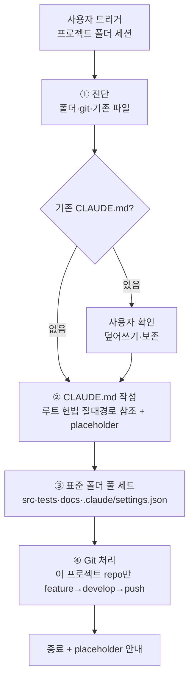

# 프로젝트 초기 세팅

**TL;DR**: 사용자가 엄브렐러(`E:\workspace\`) 아래 `projects/<이름>/`으로 프로젝트를 git clone한 뒤 **그 프로젝트 폴더에서 세션을 열고** 자유 표현 트리거("새 프로젝트 생성", "기본 세팅" 등)를 쓰면 ① 진단 → ② CLAUDE.md(루트 헌법을 절대경로로 참조하는 슬림 패턴) → ③ 표준 폴더 풀 세트 → ④ Git 처리(그 프로젝트 repo만)의 4단계로 처리한다. **rules 저장소는 관여하지 않는다**(중앙 레지스트리 폐지, 2026-07-13~). **본 절차 적용은 작업 프로세스(4단계 2게이트) 면제**(정형 반복).

## 1. 트리거 (자유 표현)

사용자가 clone한 프로젝트 폴더를 **cwd로 하는 세션**을 열고 다음 키워드를 쓰면 본 절차 적용:

| 키워드 패턴 | 예 |
|---|---|
| "새 프로젝트 생성" / "신규 프로젝트" | "새 프로젝트 clone 했어, 기본 세팅 해줘" |
| "초기 세팅" / "기본 세팅" / "초기화" | "이 프로젝트 초기 세팅 부탁" |
| "표준 구조 적용" | "지금 클론한 프로젝트에 표준 구조 적용" |

> [!IMPORTANT]
> 세팅 대상은 **현재 세션이 열린 저장소(cwd)**다. rules 저장소에서 다른 프로젝트를 스캐폴딩하지 않는다 — 각 프로젝트는 엄브렐러(`E:\workspace\projects\<이름>\`) 아래 형제 독립 repo이며, 자기 폴더에서 세션을 열어 in-place 세팅한다.

> [!NOTE]
> 모호하면 [`명령 해석 규칙.md`](명령%20해석%20규칙.md)에 따라 CLAUDE.md를 덮어쓸지 등을 사용자에게 묻는다.

## 2. 4단계 절차



### 2.1 단계 ① 진단

확인 항목:

- [ ] cwd가 세팅 대상 프로젝트 폴더인지 확인 (엄브렐러 `E:\workspace\projects\<이름>\` 하위, in-place 세팅)
- [ ] `.git/` 존재 (git repo 여부) — 없으면 사용자 확인
- [ ] `git remote -v`로 origin URL 추출 (없으면 placeholder)
- [ ] 현재 브랜치 (`git branch --show-current`)
- [ ] `CLAUDE.md` 존재 여부 — 있으면 사용자 확인 (덮어쓰기 / 보존 / 일부만)
- [ ] `src/`·`tests/`·`docs/` 존재 여부 — 있는 폴더는 보존, 없는 폴더만 추가

### 2.2 단계 ② CLAUDE.md 작성

§3 템플릿 그대로 적용. 자동 추출 항목은 채우고, 나머지는 `_(TBD)_` placeholder.

| 자동 추출 | placeholder |
|---|---|
| 프로젝트명 (폴더명) | TL;DR |
| `origin` URL (`git remote -v`) | 한 단락 소개 |
| 메인 브랜치 (`git branch --show-current`) | 담당 범위 |

### 2.3 단계 ③ 표준 폴더 풀 세트

> [!NOTE]
> `모듈 현황.md`(작업 모듈 인덱스)는 본 절차에서 미리 만들지 않는다. 첫 작업 종료 시점에 [`완료처리.md §1`](작업/완료처리.md) 절차 3번 단계가 자동 생성한다.

다음 폴더를 생성. 이미 있으면 보존:

```
<프로젝트명>/
├── CLAUDE.md           단계 ②에서 생성
├── .claude/
│   └── settings.json   {"worktree":{"bgIsolation":"none"}} — 아래 참조
├── src/                빈 폴더 — `.gitkeep` 추가
├── tests/              빈 폴더 — `.gitkeep` 추가
└── docs/
    ├── 지침/           빈 폴더 — `.gitkeep` (프로젝트 특화 지침 시)
    └── tasks/
        └── 작업 목록.md     §4 표준 본문
```

> [!TIP]
> 빈 폴더는 git이 추적하지 않으므로 `.gitkeep` 빈 파일을 둔다.

> [!IMPORTANT]
> `.claude/settings.json`에 `{"worktree":{"bgIsolation":"none"}}`를 둔다. 백그라운드(claude agents) 세션이 각 프로젝트의 메인 체크아웃을 워크트리 격리 없이 **직접 편집**할 수 있게 하는 설정이다. (설정 파일이 이미 있으면 `worktree` 키만 병합.)
>
> **전역 기본값과의 관계 (2026-07-14~)**: 이 값은 이제 **User scope 전역**(`~/.claude/settings.json`)에도 `bgIsolation:"none"`으로 설정되어 모든 프로젝트가 기본 OFF를 상속한다 → 원칙적으로 repo별 반복은 불필요. 다만 전역 미설정 환경(새 PC 등)이나 **이 프로젝트만 다른 정책**을 원할 때를 대비해 Project scope에도 두는 것을 표준 세팅으로 유지한다(명시·이식성 안전망). 전역 설정·동작 원리·"원할 때만 워크트리" 켜는 법은 [`../설정/워크트리 설정.md`](../설정/워크트리%20설정.md) 참조.

> [!NOTE]
> `사용방법/`·`참고/` 폴더는 표준에서 **제외**. 도구·CLI 매뉴얼·외부 스펙·도메인 지식 같은 영속 참고성 지식은 별도 wiki repo(`E:\workspace\projects\wiki`)에 둔다 — 반영은 은수님이 수동으로 판단하며, rules/프로젝트는 wiki 운영에 관여하지 않는다.

### 2.4 단계 ④ Git 처리 (이 프로젝트 repo만, 자동 push)

세팅 대상은 현재 세션이 열린 프로젝트 repo **하나뿐**이다. rules 저장소에는 아무 커밋도 하지 않는다(중앙 레지스트리 폐지 — 옛 "루트 Projects 표 갱신·루트 repo push" 단계는 삭제됨).

```bash
# (작업 디렉토리: 이 프로젝트 폴더 = E:\workspace\projects\<이름>\)
git checkout -b claude_feature_init   # 또는 동등
git add CLAUDE.md .claude/settings.json src/.gitkeep tests/.gitkeep docs/
git commit -m "chore(init): <프로젝트명> 표준 세팅 (CLAUDE.md + 표준 폴더)"

# develop 있으면
git checkout claude_develop
git merge --no-ff claude_feature_init -m "..."
git branch -d claude_feature_init
git push origin claude_develop

# develop 없으면 (claude_main 베이스로 신설)
git checkout -b claude_develop claude_main
git merge --no-ff claude_feature_init -m "..."
git branch -d claude_feature_init
git push -u origin claude_develop
```

#### default branch 보호 차단 시

push가 차단되면(예: sullivan 사례) 사용자에게 옵션 제시:

| 옵션 | 절차 |
|---|---|
| A. PR 흐름 | feature 브랜치 origin push + GitHub PR 생성 |
| B. claude_develop 신설 후 push | claude_main 베이스로 develop 만들고 그쪽으로 push |
| C. settings.json 권한 추가 | 사용자가 직접 권한 정책 변경 |

## 3. CLAUDE.md 템플릿 (단계 ②)

````markdown
---
name: <프로젝트명>
purpose: <자동 또는 _(TBD)_>
type: 메타
applies_to: [<프로젝트명>]
tags: [project, claude-md]
---

# <프로젝트명>

**TL;DR**: _(TBD: 프로젝트 1줄 설명 — 사용자가 채움)_

> [!IMPORTANT]
> **<프로젝트명>은 루트 헌법 `E:\workspace\rules\CLAUDE.md`와 그 지침 체계를 절대 우선으로 따른다.** 본 파일은 프로젝트 고유 정보(repo·메타·폴더 구조·작업 라우팅)만 담고, 일반 규칙은 모두 루트에서 상속한다. (이 프로젝트는 rules와 형제 독립 repo이므로 상대경로가 아닌 **절대경로**로 참조한다.)
>
> **세션 시작 시**: ① 루트 헌법 `E:\workspace\rules\CLAUDE.md`를 명시 Read → "루트 지침 확인 완료: <한 줄 요약>" 보고, ② 루트 `E:\workspace\rules\지침\작업 규칙.md` 확인.
>
> **충돌 정책**:
> - 본 CLAUDE.md ↔ 루트 CLAUDE.md 충돌 시 → **루트 우선**. 본 파일이 잘못된 것으로 간주, 사용자에게 즉시 보고.
> - 본 프로젝트 `docs/지침/` ↔ 루트 `지침/` 충돌 시 → 루트 `E:\workspace\rules\지침\일반\문서 작성 규칙.md §1.1`에 따라 **프로젝트 우선** (의도적 도메인 특화 예외).

_(TBD: 프로젝트 한 단락 소개)_

## 메타

- Repository (`origin`): `<자동 또는 _(TBD)_>`
- Main branch: `<자동 또는 claude_main>`
- 담당 범위: _(TBD)_

## Layout

```
<프로젝트명>/
├── CLAUDE.md       이 파일 (프로젝트 진입점)
├── src/            구현 소스 (초기: 빈 폴더)
├── tests/          단위·통합 테스트 (초기: 빈 폴더)
└── docs/           SW 문서 — 루트 컨벤션 적용 (지침/·tasks/<모듈>/<작업>/)
```

## 작업 라우팅

작업 목록은 [`docs/tasks/작업 목록.md`](docs/tasks/작업 목록.md)(모듈 인덱스)에서 시작 — 관련 모듈의 `tasks/<모듈>/작업 목록.md`를 조회해 기존 폴더 이어가기 또는 신규 분리 결정.
````

## 4. `docs/tasks/작업 목록.md` 템플릿 (단계 ③)

````markdown
# 작업 목록 (<프로젝트명> tasks index)

<프로젝트명> 프로젝트의 모듈별 작업 목록 라우터. 각 모듈의 상세 작업 레지스트리는 `tasks/<모듈>/작업 목록.md`에 있다 — 모듈의 첫 작업 시작 시 자동 생성되며, 그 전까지는 아래 표가 비어 있다.

- 신규 작업 시 먼저 관련 모듈이 아래 표에 있는지 확인 → 있으면 해당 모듈 작업 목록.md 조회 → 기존 폴더 이어가기 또는 신규 분리 확인
- 컨벤션 상세: 루트 헌법 repo `E:\workspace\rules\지침\일반\문서\폴더-구조.md` §5

---

## 모듈

| 모듈 | 목록 |
|---|---|
| _(아직 없음 — 첫 작업 시작 시 자동 등재)_ | |

---

## 상태 정의

| 상태 | 의미 |
|---|---|
| `진행` | 작업 진행 중 |
| `대기` | 선행 조건 충족 대기 |
| `차단` | 외부 요인으로 진행 불가 |
| `완료` | 병합·릴리즈 완료 |
| `취소` | 작업 취소 |

## 갱신 이력

| 날짜 | 이벤트 |
|---|---|
| YYYY-MM-DD | 레지스트리 생성 (`프로젝트 초기 세팅.md` 절차로). |
````

## 5. 작업 프로세스 면제 근거

> [!IMPORTANT]
> 본 절차 적용은 [`작업 진행 규칙.md`](작업%20진행%20규칙.md)의 작업 프로세스(4단계 2게이트) **면제** 사례다.
> - 사유: 정형 반복 작업이라 매번 요구사항·분석·계획 산출이 비효율
> - 단순 수정 예외(작업 진행 규칙.md §4)와 동급 — 명확한 표준 절차에 따라 정해진 변경만 수행
> - 단, 본 절차 자체를 *변경*할 때는 작업 프로세스 적용 (정책 변경)

## 6. 자동화 한계 (사용자 후속 입력)

세팅 완료 후 사용자가 채워야 하는 placeholder를 마지막 보고에 명시한다:

- 프로젝트 CLAUDE.md TL;DR
- 프로젝트 CLAUDE.md 한 단락 소개
- 프로젝트 CLAUDE.md 메타 §담당 범위

## 7. 기존 충돌 처리

| 시나리오 | 처리 |
|---|---|
| CLAUDE.md 없음 + 표준 폴더 없음 | 모두 신규 생성 (정상 케이스) |
| CLAUDE.md 있음 | 사용자에게 yes/no 확인 — *덮어쓸까요? / 보존하고 일부만 추가할까요?* |
| 표준 폴더 일부 있음 | 없는 폴더만 추가, 기존 비파괴 |
| `docs/tasks/작업 목록.md` 있음 | 보존, 헤더 정합성만 점검 |
| `.git/` 없음 (clone 안 됨) | 사용자에게 알림 — git 초기화부터 안내 |

## 8. 관련 지침

- [`작업 진행 규칙.md`](작업%20진행%20규칙.md) — 작업 프로세스 (본 절차는 면제)
- [`문서 작성 규칙.md`](../문서/작성%20규칙.md) — 폴더 구조·frontmatter (하위 [`문서/폴더-구조.md`](../문서/폴더-구조.md)·[`문서/메타-frontmatter.md`](../문서/메타-frontmatter.md))
- [`명령 해석 규칙.md`](명령%20해석%20규칙.md) — 트리거 모호 시 질문
- [`../Git/브랜치, 병합 규칙.md`](../Git/브랜치,%20병합%20규칙.md) — 작업 스코프·브랜치 모델
- [`../작업 규칙.md`](../작업%20규칙.md) — 마스터 체크리스트 §3 작업 진행

## 9. 학습 노트 — 환경 (2026-05-18 회고 흡수)

> [!NOTE]
> 2026-05-18 Package C 이전에는 `docs/회고/환경.md`에 별도 누적. 이제는 본 파일에 흡수.

### 9.1 환경 이식성 우선 (2026-04-21)

작업 산출물(설정 파일, 스크립트, 훅 등)은 어느 환경에서든 동일한 작업 상태를 유지할 수 있도록 설계.

**Why:** 사용자가 여러 PC/환경을 오가며 작업함. 새 구조(2026-07-13~)에서는 `E:\workspace\` 엄브렐러 폴더 통째 복제 대신, **rules repo를 clone하고 필요한 프로젝트를 각각 `workspace/projects/<이름>/`으로 개별 clone**해 동일 컨텍스트를 재구성한다(형제 독립 repo 모델). rules의 `CLAUDE.md`가 헌법 단일 출처이므로 rules만 있으면 지침 체계는 어느 환경에서든 동일.

**How to apply:**
- Claude Code 설정은 User scope(`~/.claude/settings.json`)가 아니라 각 repo의 Project scope(`<repo>/.claude/settings.json`)에 둬서 git 추적 대상으로 만든다
- 공용 스크립트는 rules repo의 `tools/`(`E:\workspace\rules\tools\`)에 둔다
- 경로는 하드코딩하지 말고 `$CLAUDE_PROJECT_DIR` 환경변수를 사용한다
- 자격증명·로컬 전용 값만 `.claude/settings.local.json`이나 `tools/credentials/`에 둔다
- 플랫폼 종속 스크립트(PowerShell 등)라도 경로만 이식 가능하면 일단 Project scope에 두고, 이식성 한계는 주석이나 docs에 명시

### 9.2 글로벌 강제 vs 이식성 trade-off — 다층 안전망 (2026-05-06)

"모든 cwd에서 강제"가 필요한 행동(예: 새 세션 시작 시 cwd `CLAUDE.md` 명시 재확인)은 Project scope만으론 불가. User scope를 함께 써야 하므로 이식성 원칙을 부분 양보. 단 단일 layer가 아닌 **다층 안전망**으로 구성한다:

1. Project scope: 루트 `CLAUDE.md` 텍스트 지침 (git tracked, 본 프로젝트 cwd 한정)
2. User scope text: 글로벌 `~/.claude/CLAUDE.md` (모든 cwd에 적용, git outside)
3. User scope hook: 글로벌 `~/.claude/settings.json`의 `SessionStart` 훅 (시스템 차원 강제, git outside)

**How to apply:**
- 행동 적용 범위가 "모든 Claude Code 세션"이면 User scope 불가피 — 단 Project scope에도 같은 규칙 텍스트로 남겨 의도가 git history에 추적되게 한다
- 새 PC 세팅 시 User scope 동기화는 수동(또는 별도 setup 스크립트). 이식성 양보를 보완하려면 `tools/`에 setup 스크립트 + 사용방법 docs 추가
- 행동 적용 범위가 "이 프로젝트만"이면 기존 원칙대로 `.claude/settings.json` (Project scope) 사용 — User scope 금지

### 9.3 자기설정 수정 가드 — `/update-config` 위임 (2026-05-06)

Claude가 자기 `~/.claude/settings.json`을 `Edit` 도구로 직접 수정하려 하면 보안 정책("Self-Modification of agent configuration")으로 자동 차단된다. 우회 시도 금지 — 사용자가 `/update-config` 슬래시 커맨드를 명시 호출해야 권한이 부여되고 그 후에만 Edit 가능.

**Why:** Claude가 자율적으로 자기 hook이나 권한 규칙을 추가하면 사용자가 모르는 사이 시스템 동작이 바뀔 수 있음. 명시적 슬래시 커맨드 호출이 사용자 의도 확인의 anchor.

**How to apply:**
- settings.json 변경이 필요하면 사용자에게 `/update-config` 호출을 요청하거나 패치 내용을 보여주고 직접 수정을 요청한다
- 차단된 Edit을 우회하려고 PowerShell·python·sed 등 다른 도구로 settings.json을 쓰는 건 가드의 의도를 깨는 우회 — 금지
- Project scope `.claude/settings.json` (cwd repo 내) 수정은 자기설정이 아니라 일반 파일 수정이므로 가드 대상 아님
